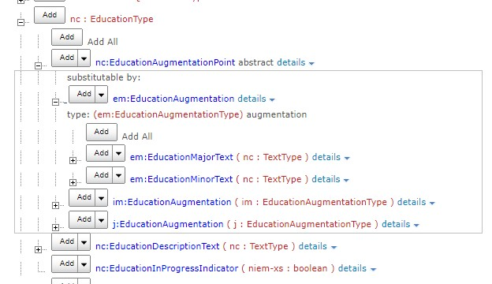

# Wildcard Augmentations in NIEM 6

The data components in a NIEM message model come from different namespaces, authored independently.  Sometimes one author wants to add properties to a class defined by another author.  NIEM has two mechanisms for doing that in XSD:  augmentations and metadata.  Those mechanisms are complex, hard to explain and hard to implement.  We can greatly simplify NIEM 6 by 

* replacing the metadata mechanism with augmentation
* implementing augmentation in XSD using wildcards instead of substitution groups

The basic idea is to implement augmentation with wildcards in reference schemas, then replace wildcards with specific element references in message schemas.  This paper illustrates this idea through examples of augmentation and metadata in NIEM 5 and the proposed NIEM 6.

### Terminology

Different developer communities use different terms for the same concept, which can be confusing. Here is a mapping.

| CMF             | XML/XSD                                               | RDF+OWL         |
| :-------------- | :---------------------------------------------------- | :-------------- |
| Class           | Type definition with attributes or child elements     | Class           |
| Datatype        | Type definition with simple content and no attributes | Datatype        |
| Object property | Element declaration                                   | Object property |
| Data property   | Element or attribute declaration                      | Data property   |
| Object          | Element with children or attributes                   | Resource        |
| Value           | Element with simple content and no attributes         | Literal         |

This paper is using terms from a proposed NIEM 6.  In a few places they are different from existing NIEM 5.  For example, In NIEM 5, every complex type definition is a class, and every element is an object; simple type definitions are the only datatypes, and attributes are the only data properties,

There are two kinds of NIEM data models:  *reference models* and *message models*.  A reference model provides concept defintions in some domain of discourse, without constraints on property cardinality or constraints on datatype length, range, etc.  A message model includes such constraints in order to precisely define the mandatory and optional content of a message as well as the meaning of that content.  

The *NIEM model* is a reference model comprised of the *core model* and a number of *domain models*, each of which is also a reference model.  A reference model is represented in XSD by a *reference schema*, which is formed by assembling a set of *reference schema documents* (each of which defines the data components in a *namespace*) plus a set of *utility schema documents* (which contribute mechanics but no semantics; e.g. *structures.xsd*).

Each *message type* defined in a *message specification* has a message model, which is comprised of a *NIEM model subset* plus data components in an *extension model*.  The NIEM model subset is represented in XSD by a *subset schema*, which is formed by assembling a set of *subset schema documents*.  Consistency between the reference model and the model subset is assured through the *subset rule*, which says that any XML valid against the subset schema must also be valid against the reference schema.

An extension model is represented in XSD by an *extension schema*, which is formed by assembling a set of *extension schema documents*.  Subset schema documents and extension schema documents are both a kind of *message schema document*.  Subset, extension, and utility schema documents are assembled into a *message schema*, which is the XSD representation of the message model.

### Element augmentations in NIEM 5

Let's start with an illustration of a NIEM 5 message specification using augmentations.  For this illustration we will use the NIEM model representation of the educational status of a person.  The model components in NIEM Core are:

`nc:PersonEducation              --` A person's educational background. 
`nc:EducationType                --` A data type for a person's educational background.  
`nc:EducationDescriptionText     --` A description of a person's educational background.  
`nc:EducationInProgressIndicator --` True if a person's formal education is still in progress; false otherwise.
`nc:EducationLevel               --` A highest level of education reached by a person. 
`nc:EducationQualification       --` A degree, certificate, credit, or other educational qualification obtained by a person.  
`nc:EducationStatus              --` A status of a person's education.  

The reference schema – that is, the XSD representation of the NIEM core reference model – has content like this.  (In all examples, some elements, attributes, and closing tags may be omitted or truncated for clarity, or just because I get tired of typing.)

```
<xs:element name="PersonEducation" type="nc:EducationType"/>
<xs:complexType name="EducationType">
 <xs:complexContent>
  <xs:extension base="structures:ObjectType">
   <xs:sequence>
    <xs:element ref="nc:EducationDescriptionText" minOccurs="0" maxOccurs="unbounded"/>
    <xs:element ref="nc:EducationInProgressIndicator" minOccurs="0" maxOccurs="unbounded"/>
    <xs:element ref="nc:EducationLevel" minOccurs="0" maxOccurs="unbounded"/>
    <xs:element ref="nc:EducationQualification" minOccurs="0" maxOccurs="unbounded"/>
    <xs:element ref="nc:EducationStatus" minOccurs="0" maxOccurs="unbounded"/>
    <xs:element ref="nc:EducationAugmentationPoint" minOccurs="0" maxOccurs="unbounded"/>
   </xs:sequence>
  </xs:extension>
 </xs:complexContent>
</xs:complexType>
<xs:element name="EducationDescriptionText" type="nc:TextType/>
<xs:element name="EducationInProgressIndicator" type="niem-xs:boolean/>
<xs:element name="EducationLevel" type="nc:EducationLevelType/>
<xs:element name="EducationQualification" type="nc:EducationQualificationType/>
<xs:element name="EducationStatus" type="nc:StatusType/>
<xs:element name="EducationAugmentationPoint" abstract="true"/>
```

The NIEM Justice domain created three additional properties for `nc:EducationType`as follows:

`j:EducationalActivity     --`   An event or activity in the process of an education course and programs.  
`j:EducationCourse         --`   A specific subject course offered thru and educational program or institution.  
`j:EducationTotalYearsText --`  A total number of years a person has been involved in attaining their education.

If the Justice domain needed a new *kind* of Education, with these three additional properties that other kinds of Education do not have, then they could have used schema inheritance to create a new subclass.  But that's not what they needed.  Instead they needed three new properties for the Education type in the NIEM core model – three new properties which (so far!) have not been worth defining in the core model, but which are important for the Justice domain.  So the Justice domain used augmentation instead of inheritance.  The reference schema for this part of the Justice domain model has content like:

```
<xs:element name="EducationAugmentation" type="j:EducationAugmentationType" 
    substitutionGroup="nc:EducationAugmentationPoint"/>
<xs:complexType name="EducationAugmentationType">
 <xs:complexContent>
  <xs:extension base="structures:AugmentationType">
   <xs:sequence>
    <xs:element ref="j:EducationalActivity" minOccurs="0" maxOccurs="unbounded"/>
    <xs:element ref="j:EducationCourse" minOccurs="0" maxOccurs="unbounded"/>
    <xs:element ref="j:EducationTotalYearsText" minOccurs="0" maxOccurs="unbounded"/>
   </xs:sequence>
  </xs:extension>
 </xs:complexContent>
</xs:complexType>
<xs:element name="EducationalActivity" type="nc:ActivityType"/>
<xs:element name="EducationCourse" type="nc:EducationCourseType"/>
<xs:element name="EducationalTotalYearsText" type="nc:TextType"/>
```

The NIEM Emergency Management domain also created augmentation properties for `nc:EducationType`.  The reference schema for that domain looks much like the above.  The properties are:

`em:EducationMajorText    --` A textual representation of the Educational Degree Major (i.e. Business Administration)
`em:EducationMinorText    --` A textual representation of the Educational Degree Minor (i.e. Art History)

Now let's consider the message model for a message type in a message specification.  A message designer creates a message model by selecting a subset of the NIEM model and adding data components in a message-specific extension model.  For this example, assume the message designer selects three properties from the NIEM model and makes them mandatory:  `nc:EducationDescriptionText`, `j:EducationTotalYearsText`, and `em:EducationMajorText`.  Also assume the designer augments Education with a message-specific property:

`nc:CommentText           --` A comment, note, or remark providing additional information

The message specification would have a schema document for the Justice domain namespace that is a subset of its reference schema; it would omit unneeded optional components and specify element cardinality, with content like this:

```
<xs:element name="EducationAugmentation" type="j:EducationAugmentationType" 
    substitutionGroup="nc:EducationAugmentationPoint"/>
<xs:complexType name="EducationAugmentationType">
 <xs:complexContent>
  <xs:extension base="structures:AugmentationType">
   <xs:sequence>
    <xs:element ref="j:EducationTotalYearsText" minOccurs="1" maxOccurs="1"/>
   </xs:sequence>
  </xs:extension>
 </xs:complexContent>
</xs:complexType>
<xs:element name="EducationalTotalYearsText" type="nc:TextType"/>
```

The message specification would also have at least one extension schema document, with content like this:

```
<xs:schema 
  xmlns:my="http://example.com/MyMessage/1.0/"
  targetNamespace="http://example.com/MyMessage/1.0/">
  <xs:element name="EducationAugmentation type="my:EducationAugmentationType
      substitutionGroup="nc:EducationAugmentationPoint"/>
  <xs:complexType name="EducationAugmentationType">
   <xs:extension base="structures:AugmentationType">
    <xs:sequence>
     <xs:element ref="nc:CommentText" minOccurs="1" maxOccurs="1"/>
    </xs:sequence>
   </xs:extension>
  </xs:complexContent>  
 </xs:complexType>
</xs:schema>
```

Finally, the message data at runtime might look like this:

```
<nc:PersonEducation>
 <nc:EducationDescriptionText>PhD</nc:EducationDescriptionText>
 <j:EducationAugmentation>
  <j:EducationTotalYearsText>9</j:EducationTotalYearsText>
 </j:EducationAugmentation>
 <em:EducationAugmentation>
  <em:EducationMajorText>Computer Science</em:EducationMajorText>
 </em:EducationAugmentation>
 <my:EducationAugmentation>
  <nc:CommentText>Boy that is a long time!</nc:CommentText>
 </my:EducationAugmentation> 
</nc:PersonEducation>
```

Augmentation elements are merely containers, not object properties in their own right.  They don't appear in the RDF equivalent, which would be

```
_:n0 nc:PersonEducation _:n1 .
_:n1 a nc:EducationType .
_:n1 nc:EducationDescriptionText "PhD" .
_:n1 j:EducationTotalYearsText "9" .
_:n1 em:EducationMajorText "Computer Science" .
_:n1 nc:CommentText "Boy that is a long time!" .
```

And that is how a message specification with augmentations works in NIEM 5 – all based on element substitution.  It would be a lot simpler to let people create new elements for `nc:EducationType` in the core namespace. But NIEM's change management principles require that (1) a schema document, once published, cannot be changed, and (2) the message schema for a namespace in the NIEM model must be a subset of the reference schema.

It would also be a lot simpler if the rules of XML Schema did not state that a sequence is "closed", meaning that child elements appended to those declared in the schema are invalid.  XML Schema would be more useful if a sequence was "open" by default.  But we lost that fight at the W3C about twenty years ago.

It would also be simpler if we could just put `<xs:any minOccurs=0 maxOccurs="unbounded" processContents="strict"/>` at the end of the element list in every NIEM type definition.  But then we would fail the "unique particle attribution" rule, and nothing would work.

So NIEM 5 uses element substitution for augmentations as shown above.  There are a few ugly aspects of the NIEM 5 approach:

1. Many developers complain that the JAXB and .NET XML data binding frameworks don't work well with element substitution.  There is a workaround:  creating a separate schema for the binding tools, replacing substitution group heads with `xs:choice`.  But it's more work, and not always understood.

2. In general, it is not possible to enforce augmentation element cardinality with XML schema validation.  The designer of the above example wants `j:EducationTotalYearsText` to appear exactly once; however, since the augmentation point must be repeatable, the following XML is also schema valid:

   ```
   <nc:PersonEducation>
    <nc:EducationDescriptionText>PhD</nc:EducationDescriptionText>
    <j:EducationAugmentation>
     <j:EducationTotalYearsText>9</j:EducationTotalYearsText>
    </j:EducationAugmentation>
    <j:EducationAugmentation>
     <j:EducationTotalYearsText>14</j:EducationTotalYearsText>
    </j:EducationAugmentation>
   </nc:PersonEducation>
   ```

3. Seperate augmentation elements are inelegant.  It's just ugly XML compared to the NIEM 6 proposal.

   


### Element augmentations in NIEM 6

Things can be a lot simpler in NIEM 6 if we use wildcards instead of substitution.  Our examples begin with the message and work back to the message and reference models.  In RDF, the message is exactly the same.  In XML, the message would look like this:

```
<nc:PersonEducation>
 <nc:EducationDescriptionText>PhD</nc:EducationDescriptionText>
 <nc:EducationAugmentation>
  <j:EducationTotalYearsText>9</j:EducationTotalYearsText>
  <em:EducationMajorText>Computer Science</em:EducationMajorText>
  <nc:CommentText>Boy that is a long time!</nc:CommentText>
 </nc:EducationAugmentation> 
</nc:PersonEducation>
```

Observe that now there is a single augmentation element.  The subset schema document for the core namespace would contain:

```
<xs:element name="PersonEducation" type="nc:EducationType"/>
<xs:complexType name="EducationType">
 <xs:complexContent>
  <xs:extension base="structures:ObjectType">
   <xs:sequence>
    <xs:element ref="nc:EducationDescriptionText" minOccurs="1" maxOccurs="1"/>
    <xs:element ref="nc:EducationAugmentation" minOccurs="1" maxOccurs="1"/>
   </xs:sequence>
  </xs:extension>
 </xs:complexContent>
</xs:complexType>
<xs:element name="EducationAugmentation">
  <xs:complexType>
    <xs:sequence>
      <xs:element ref="j:EducationTotalYearsText"/>
      <xs:element ref="em:EducationMajorText"/>
      <xs:element ref="nc:CommentText"/>
    </xs:sequence>
  </xs:complexType>
</xs:element>
```

The augmenting properties now appear directly in the schema document for the augmented type.  The subset schema for the core namespace still passes the subset rule, because the reference schema document now looks like this:

```
<xs:complexType name="EducationType">
  <xs:complexContent>
    <xs:extension base="structures:ObjectType">
      <xs:sequence>
        <xs:element ref="nc:EducationDescriptionText" minOccurs="1" maxOccurs="1"/>
        <xs:element ref="nc:EducationAugmentation" minOccurs="0" maxOccurs="1"/>
      </xs:sequence>
    </xs:extension>
  </xs:complexContent>
</xs:complexType>
<xs:element name="EducationAugmentation" type="structures:AugmentationType"/>
```

We don't need an `nc:EducationAugmentationType` definition, because the augmentation element isn't an object in the model, and so it doesn't have or need a class definition.  We would have a type definition in the utility schema document for the structures namespace, but only for convenience; it contains:

```
<xs:complexType name="AugmentationType">
  <xs:sequence>
    <xs:any minOccurs="1" maxOccurs="unbounded" namespace="##other" processContents="strict"/>
  </xs:sequence>
</xs:complexType>
```

In effect, the reference schema is saying "here are some possible properties for `nc:EducationType`; when you create a message schema, you can choose any of these, and/or augment with others."  Then when we create a subset of the reference schema for the message model, the designer completely specifies the mandatory and optional properties that can appear in the message, and the wildcard goes away.

The reference schema documents for NIEM Justice and NIEM Emergency Management are much simpler.  There is no need to define augmentation types or elements.  The domain authors simply create element declarations, and then use appinfo to say "we think this property could be a useful augmentation for type XYZ".  For the Justice domain, the reference schema might look like this:

```
<xs:element name="EducationalTotalYearsText" type="nc:TextType" appinfo:augments="nc:EducationType"/>
```

We need that appinfo so that NIEM tools can show the proposed augmentation properties to developers.  We have this capability inthe existing tools, and we will want it for NIEM 6.  For example, SSGT currently allows the user to select augmentation properties in a schema subset



And the model viewer also displays augmentations in the NIEM model


Wildcard augmentations would work.  They don't seem to break any NIEM principle or assumption.  We would have to rewrite parts of the NDR and change the structures namespace, but so what?  Developers will be happy because their binding tools work better with less effort.  We can enforce augmentation cardinality in XSD.  And we don't have multiple (ugly) augmentation elements within an object.  It's simpler and it works better.  What's not to like?


### Metadata mechanism in NIEM 5

NIEM has a metadata mechanism, offering message designers another way to attach a property to a class they reuse.  For example, we might wish to specify the source that provided the information in the `nc:PersonEducation` object.  Using the metadata mechanism in NIEM 5, the message would look like this;

```
<nc:PersonEducation s:metadata="md01">
 <nc:EducationDescriptionText>PhD</nc:EducationDescriptionText>
 <nc:EducationAugmentation>
  <j:EducationTotalYearsText>9</j:EducationTotalYearsText>
  <em:EducationMajorText>Computer Science</em:EducationMajorText>
  <nc:CommentText>Boy that is a long time!</nc:CommentText>
 </nc:EducationAugmentation> 
</nc:PersonEducation>
<nc:Metadata s:id="md01">
 <nc:SourceText>Official records</nc:SourceText>
</nc:Metadata>
```

The `s:metadata` attribute is a reference to an element that becomes another property of the object.  There is some special NDR magic for metadata attributes, so that the RDF equivalent for this XML message is:

```
_:n0 nc:PersonEducation _:n1 .
_:n1 a nc:EducationType .
_:n1 nc:EducationDescriptionText "PhD" .
_:n1 j:EducationTotalYearsText "9" .
_:n1 em:EducationMajorText "Computer Science" .
_:n1 nc:CommentText "Boy that is a long time!" .
_:n1 nc:Metadata _:n2 .
_:n2 a nc:MetadataType .
_:n2 nc:SourceText "Official Records" .
```

Part of that magic is that metadata elements do not modify their parent element.  Last year we invented some complicated rules so that in NIEM 6, message designers could also insert metadata elements as an ordinary child in a complex type, like this

```
<my:Message>
 <nc:Metadata>
  <nc:SourceText>Official records</nc:SourceText>
 </nc:Metadata>
 <my:Whatever>
 ...
```

With those rules, sometimes a metadata element is a property of its parent, and sometimes it isn't.  Blech.

### Metadata augmentations in NIEM 6

Why not get rid of the metadata mechanism entirely, and just use augmentation instead?  The message would then be:

```
<nc:PersonEducation>
 <nc:EducationDescriptionText>PhD</nc:EducationDescriptionText>
 <nc:EducationAugmentation>
  <j:EducationTotalYearsText>9</j:EducationTotalYearsText>
  <em:EducationMajorText>Computer Science</em:EducationMajorText>
  <nc:CommentText>Boy that is a long time!</nc:CommentText>
  <nc:Metadata s:id="md01">
   <nc:SourceText>Official records</nc:SourceText>
  </nc:Metadata>
 </nc:EducationAugmentation> 
</nc:PersonEducation>
```

And the message schema would be:

```
<xs:element name="EducationAugmentation">
  <xs:complexType>
    <xs:sequence>
      <xs:element ref="j:EducationTotalYearsText"/>
      <xs:element ref="em:EducationMajorText"/>
      <xs:element ref="nc:CommentText"/>
      <xs:element ref="nc:Metadata" minOccurs="0"/>
    </xs:sequence>
  </xs:complexType>
</xs:element>
```

In fact, we might not even need the `nc:Metadata` element.  In the above example, why augment with `nc:Metadata`?  Why not augment with `nc:SourceText` instead, like this:

```
<nc:PersonEducation>
 <nc:EducationDescriptionText>PhD</nc:EducationDescriptionText>
 <nc:EducationAugmentation>
  <j:EducationTotalYearsText>9</j:EducationTotalYearsText>
  <em:EducationMajorText>Computer Science</em:EducationMajorText>
  <nc:CommentText>Boy that is a long time!</nc:CommentText>
  <nc:SourceText>Official records</nc:SourceText>
 </nc:EducationAugmentation> 
</nc:PersonEducation>
```

We still have to deal with "relationship metadata".  I think perhaps we do that with appinfo on attribute and element declarations.  That's a discussion for another time.

With this approach, metadata is just another property.  The message designer can put it directly into the types he defines.  He can put it as an augmentation to the types he reuses.  No fooling around with references, no special rules to decide if a child element does or does not modify its parent.  A lot of complexity goes away.  What's not to like?


### Augmentations for simple content

Elements with simple content and attributes, that's what to not like.  In this section I am going to use the phrase *simple content* for complex type definitions with simple content and no attributes, for element declarations with such a type definition, and sometimes for element information items (an element in a message) valid against such a declaration.

An element with simple content and no attributes is a data property; its value is a literal that has a datatype.  For example, we might have NIEM data in XML and RDF like:

```
<my:Element>ABC</my:Element>                  | _:n1 my:Element "ABC" .                 
```

And a corresponding model in XSD and CMF like:

```
<xs:element name="Element" type="xs:string"/> | <Property>                    
                                              |  <Name>Element</Name>         
                                              |  <Namespace s:ref="my"/>      
                                              |  <Datatype s:ref="xs.string"/>
                                              | </Property>                   
```

However, an element with simple content and attributes is an object property – for example, XML and RDF data like:

```
<my:Element my:att="123">ABC</my:Element>     | _:n1 my:Element _:n2 .
                                              | _:n2 a my:ElementType .       
                                              | _:n2 my:ElementLiteral "ABC" .
                                              | _:n2 my:att "123" .           
```

With corresponding XSD and CMF models:

```
<xs:complexType name="Element">               | <Property>                             
 <xs:simpleContent>                           |  <Name>Element</Name>                  
  <xs:extension base="xs:string">             |  <Namespace s:ref="my"/>               
   <xs:attribute ref="my:att"/>               |  <Class s:ref="my.ElementType"/>       
  </xs:extension>                             | </Property>                            
 </xs:simpleContent>                          | <Class s:id="my.ElementType">          
</xs:complexType>                             |  <Name>ElementType</Name>              
                                              |  <Namespace s:ref="my"/>               
                                              |  <HasProperty>                         
                                              |   <Property s:ref="my:ElementLiteral"/>
                                              |   <MinOccursQuantity>1                 
                                              |   <MaxOccursQuantity>1                 
                                              |  </HasProperty>                        
                                              |  <HasProperty>                         
                                              |   <Property s:ref="my:att"/>           
                                              |   <MinOccursQuantity>0                 
                                              |   <MaxOccursQuantity>1                 
                                              |  </HasProperty>                        
                                              | </Class>                               
```

Life would be so very much easier if everyone would just use child elements instead of attributes.

```
<my:Element>
  <my:ElementLiteral>ABC</my:Element>
  <my:att>123</my:att>
</my:Element>
```

Or if they absolutely must have attributes, to use complex content instead of simple content.

```
<my:Element my:att="123">
  <my:ElementLiteral>ABC</my:ElementLiteral>
</my:Element>
```

But that isn't going to happen.  People will want to define simple content with attributes.  They will want to augment simple content with attributes.  They will even want to apply metadata to simple content.  All we can do is advise a different style, work to keep the common  case simple, and make the complexity land only on the people who insist on having it. My plan for augmenting simple content in NIEM 6 goes like this:

1. The NIEM model presently defines 35 types with simple content and semantic attributes.  For NIEM 6, let's gently encourage CBRN, MilOps, and Core to redesign those types.  When unsuccessful, those types remain as CSC types in the reference model XSD, and as Class objects in CMF.  (Observe the XSD includes an attribute wildcard, to permit attribute augmentation) 

   ```
   <xs:complexType name="LongitudeDegreeType">       | <Class>
     <xs:simpleContent>                              |  <Name>LongitudeDegreeType
       <xs:extension base="nc:LongitudeDegreeSimpleT |  <Namespace s:ref="nc"/>
         <xs:attribute ref="my:augmentAttribute"/>   |  <HasProperty>
       </xs:extension>                               |   <Property s:ref="nc:LongitudeDegreeLiter
     </xs:simpleContent>                             |   <MinOccurs>1
   </xs:complexType>                                 |   <MaxOccurs 1
   <xs:simpleType name="LongitudeDegreeSimpleType">  |  </HasProperty>
    <xs:restriction base="xs:decimal">               |  <HasProperty>
     <xs:minInclusive value="-180"/>                 |   <Property s:ref="my.augmentAttribute"/>
     <xs:maxInclusive value="180"/>                  |   <MinOccurs>0
    </xs:restriction>                                |   <MaxOccurs 1
   </xs:simpleType>                                  |  </HasProperty>
                                                     | </Class>
                                                     | <Property>
                                                     |  <Name>LongitudeDegreeLiteral
                                                     |  <Namespace s:ref="nc"/>
                                                     |  <Datatype s:ref="nc.LongitudeDegreeDataty
                                                     | </Property>
                                                     | <Property>
                                                     |  <Name>augmentAttribute
                                                     |  <Namespace s:ref="my"/>
                                                     |  <Datatype s.ref="xs.string"/>
                                                     |  <AttributeIndicator>true
                                                     | </Property>
                                                     | <Datatype>
                                                     |  <Name>LongitudeDegreeDatatype
                                                     |  <Namespace s:ref="nc"/>
                                                     |  <RestrictionOf>
                                                     |   <Datatype s:ref="xs:decimal"/>
                                                     |   <MaxExclusive>
                                                     |    <StringValue>180
                                                     |   </MaxExclusive>
                                                     |   <MinExclusive>
                                                     |    <StringValue>-180
                                                     |   </MinExclusive
                                                     |  </RestrictionOf>
                                                     | </Datatype>
   ```

2. The NIEM model presently defines more than 700 types with simple content and no attributes.  These will be Datatype objects in CMF.  In XSD, define them in the reference schema with an attribute wildcard (not `structures:SimpleObjectAttributeGroup`), like this:

   ```
   <xs:complexType name="LongitudeDegreeType">                | <Datatype>
     <xs:simpleContent>                                       |  <Name>LongitudeDegreeType</Name>
       <xs:extension base="nc:LongitudeDegreeSimpleType">     |  <Namespace s:ref="nc"/>
         <xs:anyAttribute processContents="strict"/>          |  <RestrictionOf>
       </xs:extension>                                        |   <Datatype s:ref="xs:decimal"/>
     </xs:simpleContent>                                      |   <MaxExclusive>
   </xs:complexType>                                          |    <StringValue>180
   <xs:simpleType name="LongitudeDegreeSimpleType">           |   </MaxExclusive>
    <xs:restriction base="xs:decimal">                        |   <MinExclusive>
     <xs:minInclusive value="-180"/>                          |    <StringValue>-180
     <xs:maxInclusive value="180"/>                           |   </MinExclusive
    </xs:restriction>                                         |  </RestrictionOf>
   </xs:simpleType>                                           | </Datatype>
   ```

   The NIEM model also defines more than 1500 properties with simple content and no attributes by means of proxy types.  These will be Property objects in the CMF reference model, and defined with a attribute wildcard in the XSD reference schema, like this:

   ```
   <!-- NIEM core namespace -->                                 | <Property>
   <xs:element name="AddressGridID" type="niem-xs:string"/>     |  <Name>AddressGridID
   <!-- proxy namespace -->                                     |  <Namespace s:ref="nc"/>
   <xs:complexType name="string">                               |  <Datatype s:ref="xs:string"/>
    <xs:simpleContent>                                          | </Property>
     <xs:extension base="xs:string">                            | 
      <xs:anyAttribute processContents="strict"/>               | 
     </xs:extension>                                            | 
    </xs:simpleContent>                                         | 
   </xs:complexType>                                            | 
   ```

   The reference schema thus says that simple content *can be* augmented with any attribute, including a metadata attribute (see #5 below).  The message designer decides *whether* to augment when he creates a model subset for the message model. 

3. The common case is the simple case, in which the message designer does not augment the simple content in the reference model.  When we construct the subset schema document for the message schema, we remove the wildcard and simplify the result.  For example, the type definition in the message schema would become 

   ```
   <xs:simpleType name="LongitudeDegreeType">
    <xs:restriction base="xs:decimal">
     <xs:minInclusive value="-180"/>
     <xs:maxInclusive value="180"/>
    </xs:restriction>
   </xs:simpleType>
   ```

   Since in this message specification the `nc:LongitudeDegreeType` element cannot have attributes, we no longer need the separate "SimpleType" definition in the message schema.  (BTW, this change alone will make a lot of developers very happy.)  The schema declarations for data properties are similarly simplified in the message schema; for example:

   ```
   <xs:element name="AddressGridID" type="xs:string"/>
   ```

   Since in this message specification the `nc:AddressGridID` element cannot have attributes, we no longer need the proxy type.  (Developers again rejoice!)  Observe that the message schema has no wildcard, so it precisely defines what can and cannot appear in the message; also, everything valid against the message schema is also valid against the reference schema.  So we pass GO and collect $200.

4. All of the complexity lands in the special case, where the message designer decides that by golly! he just *has* to augment simple content with an attribute.  Augmenting a Datatype object turns it into a Class object in CMF. and into a CSC type definition in XSD.  For example, augmenting `nc:LongitudeDegreeType` with `my:augmentAttribute` results in the following XSD and CMF for the message model.  Note that we had to create a new `nc:LongitudeDegreeDatatype` for the created literal property.

   ```
   <xs:complexType name="LongitudeDegreeType">       | <Class>
     <xs:simpleContent>                              |  <Name>LongitudeDegreeType
       <xs:extension base="nc:LongitudeDegreeSimpleT |  <Namespace s:ref="nc"/>
         <xs:attribute ref="my:augmentAttribute"/>   |  <HasProperty>
       </xs:extension>                               |   <Property s:ref="nc:LongitudeDegreeLiter
     </xs:simpleContent>                             |   <MinOccurs>1
   </xs:complexType>                                 |   <MaxOccurs 1
   <xs:simpleType name="LongitudeDegreeSimpleType">  |  </HasProperty>
    <xs:restriction base="xs:decimal">               |  <HasProperty>
     <xs:minInclusive value="-180"/>                 |   <Property s:ref="my.augmentAttribute"/>
     <xs:maxInclusive value="180"/>                  |   <MinOccurs>0
    </xs:restriction>                                |   <MaxOccurs 1
   </xs:simpleType>                                  |  </HasProperty>
                                                     | </Class>
                                                     | <Property>
                                                     |  <Name>LongitudeDegreeLiteral
                                                     |  <Namespace s:ref="nc"/>
                                                     |  <Datatype s:ref="nc.LongitudeDegreeDataty
                                                     | </Property>
                                                     | <Property>
                                                     |  <Name>augmentAttribute
                                                     |  <Namespace s:ref="my"/>
                                                     |  <Datatype s.ref="xs.string"/>
                                                     |  <AttributeIndicator>true
                                                     | </Property>
                                                     | <Datatype>
                                                     |  <Name>LongitudeDegreeDatatype
                                                     |  <Namespace s:ref="nc"/>
                                                     |  <RestrictionOf>
                                                     |   <Datatype s:ref="xs:decimal"/>
                                                     |   <MaxExclusive>
                                                     |    <StringValue>180
                                                     |   </MaxExclusive>
                                                     |   <MinExclusive>
                                                     |    <StringValue>-180
                                                     |   </MinExclusive
                                                     |  </RestrictionOf>
                                                     | </Datatype>
   ```

   Augmenting `nc:AddressGridID` with `my:augmentAttribute` produces the following XSD and CMF for the message model.

   ```
   <xs:element name="AddressGridID"                  | <Property>
       type="nc:AddressGridIDDatatype"/>             |  <Name>AddressGridID
   <xs:complexType name="AddressGridIDDatatype">     |  <Namespace s:ref="nc"/>
    <xs:simpleContent>                               |  <Class s:ref="nc.AddressGridIDType"/>
     <xs:extension base="xs:string">                 | </Property>
      <xs:attribute ref="my:augmentAttribute"/>      | <Class>
     </xs:extension>                                 |  <Name>AdddressGridIDType
    <xs:simpleContent>                               |  <Namespace s:ref="nc"/>
   </xs:complexType>                                 |  <HasProperty>
                                                     |   <Property s:ref="nc:AddressGridIDLiteral"
                                                     |   <MinOccurs>1
                                                     |   <MaxOccurs 1
                                                     |  </HasProperty>
                                                     |  <HasProperty>
                                                     |   <Property s:ref="my.augmentAttribute"/>
                                                     |   <MinOccurs>0
                                                     |   <MaxOccurs 1
                                                     |  </HasProperty>
                                                     | </Class>
                                                     | <Property>
                                                     |  <Name>AddressGridIDLiteral
                                                     |  <Namespace s:ref="nc"/>
                                                     |  <Datatype s:ref="xs:string"/>
                                                     | </Property>
                                                     | <Property>
                                                     |  <Name>augmentAttribute
                                                     |  <Namespace s:ref="my"/>
                                                     |  <Datatype s.ref="xs.string"/>
                                                     |  <AttributeIndicator>true
                                                     | </Property>
   ```

   That's a lot of complexity.  I hope message designers will avoid it.  I think we could provide tool support for the ones who won't or can't.

5. Could we get away with not supporting metadata on datatype or data properties"?  Life would be simpler if we just told message designers to create a class and an object property if they really, really need to do this.  Would it be so terribly bad if instead of

   ```
   <nc:AddressGridID s:metadata="md01">FOO</nc:AddressGridID>
   <nc:Metadata s:id="md01">
    <nc:SourceText>Official sources
   </nc:Metadata>
   ```

   they had to do this:

   ```
   <nc:AddressGridID>
    <nc:AddressGridIDLiteral>FOO
    <nc:Metadata>
     <nc:SourceText>Official sources
    </nc:Metadata> 
   </nc:AddressGridID>
   ```

   Wouldn't it be nice if we could just excise all that metadata stuff from the NDR?  But if we absolutely have to support the first form, then OK, let message designers augment simple content with `structures:metadata`.  That will work just as it does in NIEM 5.  We could make `structures:metadata` *only* useable on simple content, if we don't want two ways to apply metadata to complex content.

6. You know what?  I spent about a day puzzling out this section, and just now remembered that NIEM 5 doesn't allow augmentations on simple content.  If you want something like

   ```
   <nc:AddressGridID my:augmentAttribute="essential">FOO</nc:AddressGridID>
   ```

   in NIEM 5, well, too damn bad, you can't have that.  So we could replace most of this section with "Augmenting Simple Content in NIEM 6: You Can't".  For metadata, we could keep the proposal from last year, requiring appinfo to indicate the simple content that can have metadata.

   But if we don't allow augmentations on simple content, then we're stuck with the ISM hack.

### Augmentations on everything

NIEM 5 declares two elements to support augmentations on everything: `structures:ObjectAugmentationPoint` and `structures:AssociationAugmentationPoint`.  This works because every type is derived from the structures namespace.

Right now the classes in CMF are *not* derived from the structures namespace.  Everything in the structures namespace, said I, is related to XML plumbing.  It shouldn't appear in a technology-independent CMF model.

If we want the same augmentation-on-everything in NIEM 6, I see three choices:

1. Make all CMF classes inherit from structures:ObjectType or structures:AssociationType
2. Make all CMF classes inherit from a new nc:ObjectType class
3. Let the tools handle it.  You want every class augmented with this property?  Boom, done.

I'm leaning toward #2 or #3.

### Summary

Things to decide:

1. The idea of wildcard augmentation depends on the distinction between reference schema and message schema.  They have different purposes.  A reference schema is open, defining concepts that could be part of a message model.  A message schema is closed, specifying the exact components that must and may be part of a message.  The two kinds of schema probably have different NDRs.  Is that workable?
2. If you accept wildcard augmentations, can we use that to replace the metadata mechanism for complex content?
3. A component that is a Class object in a reference model could become a Datatype object in a message model.  Or a Datatype object could become a Class object.  Can we live with that?
4. Do we have to support metadata on simple content, or can we tell message designers they must have a class and objects if they want object properties?
5. Do we want to support attribute augmentations on simple content, or (like NIEM 5) Just Say No?
6. Do we still want the augmentation-on-everything capability?  How to implement?


Author:  Scott Renner
Date: 3 February 2023