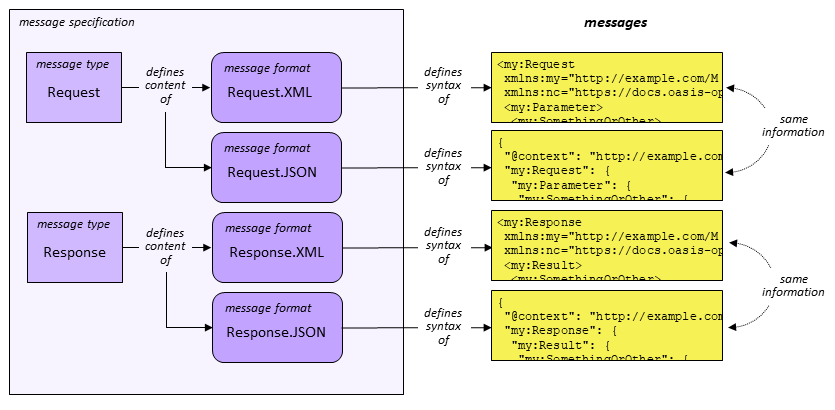

## Simple example of a complex message specification

Most message specifications are going to be simple, defining one message type with one message format. But not all of them. This directory contains a complex message specification, with two message types and six message formats. That said, it is as simple as I can make it, to clearly show the complex relationships in the figure below.



Here are the two message types and the six message formats:

* Request
  * Request.XML
  * Request.JSON
* Response
  * Response.XML
  * Response.JSON
  * Resopnse.simpleXML
  * Response.simpleJSON

There are a lot of ways you could name and organize the files in this specification.  I chose  this directory structure:

```
ComplexMSpec
├───type.request                    # directory specifying the Request message type
│   ├───format.json
│   ├───format.xml
└───type.response                   # directory with files for the Response message type
    ├───format.json                 # directory with files for Request.JSON format
│   ├───format.simpleJSON           # directory with files for Request.simpleJSON format
│   ├───format.simpleXML            # and so forth...
    ├───format.xml
```

And here's an advance peek at some sample messages from the Request.XML and Response.XML formats.

```
<req:Request
 xmlns:nc="https://docs.oasis-open.org/niemopen/ns/model/niem-core/6.0/"
 xmlns:req="http://example.com/ReqRes/1.0/">
  <req:RequestID>RQ001</req:RequestID>
  <req:RequestedItem>
    <nc:ItemName>Socks</nc:ItemName>
    <nc:ItemQuantity>10</nc:ItemQuantity>
  </req:RequestedItem>
</req:Request>

<req:Response
 xmlns:nc="https://docs.oasis-open.org/niemopen/ns/model/niem-core/6.0/"
 xmlns:req="http://example.com/ReqRes/1.0/">
  <req:RequestID>RQ001</req:RequestID>
  <req:RequestedItem>
    <nc:ItemName>Socks</nc:ItemName>
  </req:RequestedItem>
  <req:SuppliedQuantity>5</req:SuppliedQuantity>
</req:Response>
```

Observe that while both message types make use of `nc:ItemType`, they impose different cardinalities on the properties of that type. (The response message does not include `nc:ItemQuantity` and uses `req:SuppliedQuantity` instead.)

### Message specification top-level

Now let's look at the contents of each directory, beginning with the top level.

```
ComplexMSpec
├───reuseModel.cmf
├───reuseSchema.xsd
├───type.request                    # directory specifying the Request message type
└───type.response                   # directory with files for the Response message type
```

The *reuseModel.cmf* CMF model file defines all of the components for the entire message specification. It has one extension namespace defining all of the message-unique components, plus a subset of the NIEM core namespace. The *reuseSchema.xsd* directory contains a schema document pile representing the equivalent model. 

This model defines component semantics; cardinalities and datatypes are constrained later on; for example, `nc:ItemType` looks like this:

```
  <xs:complexType name="ItemType">
    <xs:annotation>
      <xs:documentation>A data type for an article or thing.</xs:documentation>
    </xs:annotation>
    <xs:complexContent>
      <xs:extension base="structures:ObjectType">
        <xs:sequence>
          <xs:element ref="nc:ItemName" minOccurs="0" maxOccurs="unbounded"/>
          <xs:element ref="nc:ItemQuantity" minOccurs="0" maxOccurs="unbounded"/>
        </xs:sequence>
      </xs:extension>
    </xs:complexContent>
```

The message specification really only needs one of these model representations, CMF or XSD, but you can have both if you like, so I did.

### Message type subdirectory

I created one subdirectory per message type. Let's look at the directory for the Response message type.

```
type.response
├───messageType.cmf
├───messageType.xsd
├───format.JSON
├───format.simpleJSON
├───format.simpleXML
└───format.XML
```

The *messageType.cmf* CMF model file precisely defines the information content of a Response message. The *messageType.xsd* directory is a schema document pile representing the same model.

This message model is a subset of *reuseModel.cmf*, in which cardinalities and datatypes are fully constrained.  For example, it does not contain `req:RequestType`, and `nc:ItemType` looks like this:

```
<xs:complexType name="ItemType" appinfo:referenceCode="NONE">
  <xs:annotation>
    <xs:documentation>A data type for an article or thing.</xs:documentation>
  </xs:annotation>
  <xs:complexContent>
    <xs:extension base="structures:ObjectType">
      <xs:sequence>
        <xs:element ref="nc:ItemName"/>
      </xs:sequence>
    </xs:extension>
  </xs:complexContent>
</xs:complexType>
```

The `referenceCode` appinfo constrains elements of `nc:ItemType` to appear inline.

### XML format subdirectory

I created one subdirectory per message format. Let's look athe the directory for the Response.XML format.

```
format.XML
├───validate.xsd
└───example.xml
```

Yuu have already seen the content of *example.xml*. The *validate.xsd* directory is a schema document pile that validates instance messages, and can be used for Java binding, and nothing else. It is not NIEM-conforming and does not capture model semantics. All of the developer-friendly simplifications have been made: abstract elements and substitution groups are replaced with choice, useless inheritance chains for simple content are removed, and inheritance from structures is replaced with the attributes required for element references. For example, since `nc:ItemType` does not permit references in this message type, it looks like this:

```
<xs:complexType name="ItemType">
  <xs:annotation>
    <xs:documentation>A data type for an article or thing.</xs:documentation>
  </xs:annotation>
  <xs:sequence>
    <xs:element ref="nc:ItemName"/>
  </xs:sequence>  
</xs:complexType>
```

### JSON format subdirectory

The directory for the Response.JSON format looks like this:

```
format.JSON
├───context.json
├───validate.json
└───example.json
```

The *context.json* file contains the JSON-LD context object for the message format. It is pretty simple.

```
{
  "@context": {
    "nc":  "https://docs.oasis-open.org/niemopen/ns/model/niem-core/6.0/",
    "req": "http://example.com/ReqRes/1.0/"
  }
}
```

*validate.json* is a JSON Schema document that validates instance messages. I don't have the code to generate those, so you will just have to imagine it. *example.json* looks like this:

```
{
  "@context": {
    "nc":  "https://docs.oasis-open.org/niemopen/ns/model/niem-core/6.0/",
    "req": "http://example.com/ReqRes/1.0/"    
  },
  "req:Response": {
    "req:RequestID" : "RQ001",
    "req:RequestedItem": {
      "nc:ItemName": Socks"
    },
    "req"SuppliedQuantityNumeric:", 10
  }
}
```

### simpleJSON format subdirectory

The directory for the Response.JSON format looks like this:

```
format.simpleJSON
├───context.json
├───example.json
├───map.ttl
└───validate.json
```

The point of a "simpleJSON" message format is to use simple, developer friendly key strings instead of canonical NIEM component QNames.  So *example.json* looks like this:

```
{
  "@context": "http://example.com/ReqRes/Response/simpleJSON/1.0/",
  "request": {
  "id" : "RQ001",
  "item": {
    "name": Socks"
  },
  "supplied": 5
}
```

The *context.json* file (which we assume somehow has the URI given above) looks like:

```
{
  "@context": {
    "nc":  "https://docs.oasis-open.org/niemopen/ns/model/niem-core/6.0/",
    "req": "http://example.com/ReqRes/1.0/",
    "response": "req;Response",
    "id": "req:RequestID",
    "item": "req:RequestedItem",
    "name": "nc:ItemName",
    "supplied": "req:SuppliedQuantity"
  }
}
```

I want to generate that context file, and translate between format.JSON and format.simpleJSON, which means we need some way to specify the mapping between simple and canonical names. For now I'm using OWL, but if I find out that Altova MapForce can write its mappings in an open standard, I'll use that instead.

```
@prefix owl <http://www.w3.org/2002/07/owl#> .
@prefix req <http://example.com/ReqRes/1.0/> .
@prefix nc  <https://docs.oasis-open.org/niemopen/ns/model/niem-core/6.0/> .
@prefix r   <http://example.com/ReqRes/Request/SimpleXML/1.0/> .
r:response owl:sameAs req:Response .
r:id      owl:sameAs req:RequestID .
r:item    owl:sameAs req:RequestedItem .
r:name    owl:sameAs nc:ItemName .
r:supplied   owl:sameAs req:SuppliedQuantity 
```

### simpleXML subdirectory

The directory for the Response.JSON format looks like this:

```
format.simpleXML
├───example.xml
├───map.ttl
└───validate.xsd
```

The point of a "simpleJSON" message format is to use simple, developer friendly element and attribute names instead of canonical NIEM component QNames, and also to collapse all the namespaces into one.  So 
*example.xml* looks like this:

```
<response xmlns="http://example.com/ReqRes/Response/simpleXML/1.0/">
  <id>RQ001</id>
  <item>
    <name>Socks</name>
  </item>
  <supplied>5</supplied>
</response>
```

This time, *validate.xsd* is a schema document, not a schema pile directory.  It looks like this:

```
<xs:schema
  targetNamespace="http://example.com/ReqRes/Response/simpleXML/1.0/"
  xmlns="http://example.com/ReqRes/Response/simpleXML/1.0/"
  xmlns:xs="http://www.w3.org/2001/XMLSchema">
  <xs:annotation>
    <xs:documentation>
      Simple XSD for the Response.SimpleXML format.
    </xs:documentation>
  </xs:annotation>
  <xs:complexType name="ResponseType">
    <xs:sequence>
      <xs:element ref="id"/>
      <xs:element ref="item"/>
      <xs:element ref="supplied"/>
    </xs:sequence>
  </xs:complexType>
  <xs:complexType name="ItemType">
    <xs:annotation>
      <xs:documentation>A data type for an article or thing.</xs:documentation>
    </xs:annotation>
    <xs:sequence>
      <xs:element ref="name"/>
    </xs:sequence>
  </xs:complexType>
  <xs:element name="response" type="ResponseType"/>
  <xs:element name="item" type="ItemType"/>
  <xs:element name="id" type="xs:token"/>
  <xs:element name="name" type="xs:string">
    <xs:annotation>
      <xs:documentation>A name of an item.</xs:documentation>
    </xs:annotation>
  </xs:element>
  <xs:element name="supplied" type="xs:decimal"/>
</xs:schema>
```

I want to generate that XSD, and also translate between canonical and simple XML messages, and so we need the *map.ttl* file again. It's the same.

### Summary

* A *message specification* MAY have a *reuse model* that defines all of the components used in all of the message types. That reuse model SHOULD NOT constrain cardinalities or datatypes. It may be represented in CMF, XSD, or both. Those representations must conform. 

* A *message type* MUST have a *message model* that precisely defines the information content of a message of that type. That message model MUST appropriately constrain cardinalities and datatypes. It may be represented in CMF, XSD, or both. Those representations must conform.

* A *message format* MUST have a schema capable of validating a message in that format -- JSON Schema for JSON formats, XSD for XML formats.  Those schemas can be generated from the message model, or hand-jammed (by masochists). The schema for XML formats MAY be the message model in XSD. There are no conformance targets for these schemas, and so they do not have to conform.

\
Author: Scott Renner\
Last modified: 2024-10-07

<style>
    pre { 
      background-color:#f0f0f0;
      padding: 6px;
      font-size: smaller; }
    code { background-color: #f0f0f0; }
</style>