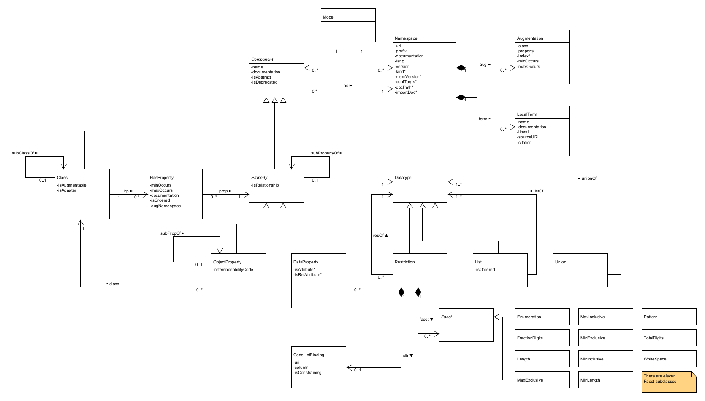
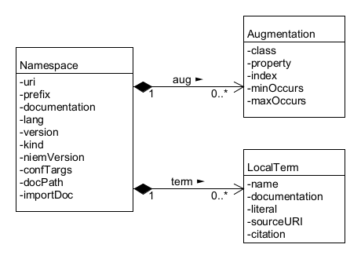
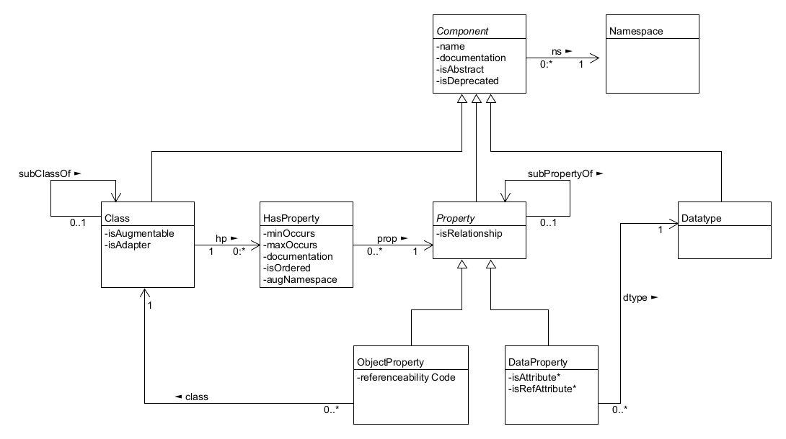

> 2024-01-19 draft

# 1. Data modeling in NIEM

NIEM is a framework for developer-level specifications of data.  This specified data is called a *message* in NIEM.  A message is usually  something passed between applications; however, NIEM works equally well to specify an information resource published on the web, an input or output for a web service or remote procedure, and so forth – basically, any chunk of data that crosses a system or organization boundary.  Data models in NIEM are used to specify *message formats*; these define the mandatory and optional content of messages and the meaning of that content.  Data models in NIEM are also used to capture community agreement on data definitions that are thought to be useful in many data specifications.

A NIEM data model is divided into one or more *namespaces*.  A namespace is a collection of names, definitions, class and data types, and properties for the concepts that are of interest to the namespace author.  The authoritative definition of namespace content, once published, cannot be changed; incompatible revisions require a new namespace.  This content stability encourages authors to reuse components from other namespaces.

NIEM models fall into one of three categories:

* A *source model* is the authoritative specification of the components in a namespace. These models are characterized by "optionality and over-inclusiveness". That is, they define more concepts than needed for any particular data specification, typically without cardinality constraints, making it easy to select the concepts that are needed and omit the others. Source models also typically omit unnecessary range or length constraints on property datatypes.  Source models are a form of ontology; they define terms in a domain of discourse.
* A *subset model* selects some components from one or more source models whle omitting others. This is usually for convenience of reuse. Developers usually create a subset model when creating a data specification; they sometimes also create a subset as a starting point for several data pecifications in their organization. Every instance of a subset model is also an instance of the corresponding source model. A subset model is usually created through a series of subset-preserving model transformations on the source model. It typically captures semantics but not cardinality or datatype constraints, and is intended for extension and reuse.
* A *message model* is a subset with cardinality and datatype constraints intended to precisely define the content of a particular message format; that is, a data specification. It is not intended for extension or reuse.

A data model in NIEM is itself data that has a NIEM specification.  The mandatory and optional content of a data model and the meaning of that content is defined by the *NIEM metamodel* – that is, the NIEM data model for data models.  The metamodel is an abstract model.  It has two concrete, developer-level representations:  XML Schema (XSD) and the *Common Model Format (CMF)*.

NIEM's original model representation is XSD.  The NIEM *Naming and Design Rules (NDR)*  defines a profile of XML Schema and assigns semantics to various XSD constructs; for example, `xs:extension` defines a subclass, and element substitution defines a subproperty.  An XML schema conforming to the NDR is a model representation.  Source, subset, and message models in XSD each conform to a different set of rules; these are described in section FIXME.  The XML schema for a message model specifies the content and meaning of a set of messages, and can also be used to validate messages that are serialized in XML.  

CMF is the result of applying the NIEM framework to the specification of NIEM data models.  The CMF specification is a NIEM-based message specification like any other.  A CMF model file is a NIEM message like any other NIEM-conforming message.  It is also a model representation, specifying content and meaning of a set of messages.  CMF does not directly support message validation, but it may be converted into artifacts that do (XSD for XML, JSON Schema for JSON, etc.)

# 2. The NIEM Metamodel

The NIEM metamodel is an abstract model defining the information content of a NIEM data model.  It is described by the following UML class diagram and property tables:

The table format used to document the classes and properties in the metamodel has the following columns:

* Name
* Definition
* Card – cardinality of the property
* O – true when the order of a repeatable property is significant
* Range – class or datatype of thie property

## 2.1  Model class

A model object represents a complete NIEM model.  It is comprised of a set of namespace and component objects.

## 2.2 Namespace class diagram

### 2.2.1 Namespace class

A namespace object represents a namespace in a model.  Properties marked with a star are significant only in the XSD representation of a model.

| Name          | Definition                                                   | Card | O    | Range          |
| ------------- | ------------------------------------------------------------ | ---- | ---- | -------------- |
| aug           | An augmentation made by this namespace                       | 0..* |      | Augmentation   |
| term          | A local term defined in this namespace                       | 0..* |      | LocalTerm      |
| uri           | The URI of this namespace                                    | 1    |      | xs:anyURI      |
| prefix        | The prefix assigned to this namespace in the model.  For any model there is a one-to-one mapping between namespace prefix and namespace URI. | 1    |      | xs:NCName      |
| documentation | A description of this namespace                              | 0..* | Y    | TextType       |
| lang          | The default language of text strings in the model            | 1    |      | xs:language    |
| version       | The version of this namespace (and the components it comprises) | 0..1 |      | xs:string      |
| kind*         | The kind of namespace in a model (**EXTENSION, DOMAIN, CORE, OTHERNIEM, BUILTIN, XSD, XML, EXTERNAL, UNKNOWN**.) | 0..1 |      | NSKindCodeType |
| niemVersion*  | The version of NIEM builtin schema documents referenced in the XML schema document for this namespace (4.0, 5.0, etc.) | 0..1 |      | xs:token       |
| confTargs*    | A URI of a conformance target assertion for the XML schema document for this namespace | 0..* |      | xs:anyURI      |
| docPath*      | The relative path of the XML schema document for this namespace within the directory of the model's schema document pile | 0..1 |      | xs:string      |
| importDoc*    | Documentation used for an`xs:import` element used in the schema document of any other namespace to import this namespace | 0..1 |      | TextType       |

### 2.2.2  Augmentation class

When the author of one namespace adds a property to a class in another namespace, that is an augmentation.  An augmentation object is the record associated with the augmenting namespace.  (The augmentation is also recorded in the augmented namespace; see the HasProperty metamodel class.)  Relationships between the Augmentation, ClassType, and Property classes in the metamodel exist, but are not shown on the UML diagram. 

| Name      | Definition                                                   | Card | Range         |
| --------- | ------------------------------------------------------------ | ---- | ------------- |
| class     | The model class that is augmented by this namespace          | 1    | Class         |
| property  | The property added to the augmented class                    | 1    | Property      |
| index*    | The position of the property in the XSD augmentation type for this class, if one exists | 0..1 | xs:integer    |
| minOccurs | The minimum number of times this property may appear in an object of the augmented class | 1    | xs:integer    |
| maxOccurs | The maximum number of times this property may appear in an object of the augmetned class | 1    | MaxOccursType |

### 2.2.3 LocalTerm class

Components in a namespace may have names that are composed of terms not in the Oxford English Dictionary.  A LocalTerm object records the definition of such a term.

| Name          | Definition                                                   | Card | O    | Range     |
| ------------- | ------------------------------------------------------------ | ---- | ---- | --------- |
| ns            | The namespace object for this component                      | 1    |      | Namespace |
| name          | A name for a local term                                      | 1    |      | xs:token  |
| documentation | A definition of a local term.                                | 0..* | Y    | TextType  |
| literal       | A meaning of a local term provided as a full, plain-text form | 0..* | Y    | TextType  |
| sourceURI     | An identifier or locator for an originating or authoritative document defining a local term | 0..* |      | xs:anyURI |
| citation      | A plain text citation of, reference to, or bibliographic entry for an originating or authoritative document defining a local term | 0..* | Y    | TextType  |

## 2.3 Component class diagram

### 2.3.1 Component class (abstract)

| Name          | Definition                                                   | Card | O    | Range      |
| ------------- | ------------------------------------------------------------ | ---- | ---- | ---------- |
| ns            | The namespace in which this component is defined.            | 1    |      | Namespace  |
| name          | A name for a component                                       | 1    |      | xs:token   |
| documentation | A definition of a component                                  | 0..* | Y    | TextType   |
| isAbstract    | True if a component is a base for extension, and must be specialized to be used directly; false if a component may be used directly. | 1    |      | xs:boolean |
| isDeprecated  | The deprecated attribute provides a method for identifying schema components as being deprecated. A deprecated component is one that is provided, but the use of which is not recommended. | 1    |      | xs:boolean |

### 2.3.2 Class class

A Class object represents a class of objects in the model.  For example, `nc:PersonType` is a class object in the NIEM Core model.  [Comment: this was "ClassType", but that name is needed only in the CMFTool Java code – can't have a class named "Class" in Java.]

| Name          | Definition                                                   | Card | **O** | Range       |
| ------------- | ------------------------------------------------------------ | ---- | ----- | ----------- |
| hp            | An association between this class and a property of this class. | 0..* | Y     | HasProperty |
| subClassOf    | A class that is extended by this class; all instances of this class are also an instance of the extended class; for example, *Vessel* is a subclass of *Conveyance*. | 0..1 |       | Class       |
| isAugmentable | True if a different namespace may augment this class with one or more properties. | 1    |       | xs:boolean  |
| isAdapter     | True if this class is an adapter for an external property; that is, a property not defined in a NIEM-conforming namespace. | 1    |       | xs:boolean  |

### 2.3.3 Property class (abstract)

A Property object represents a property of zero or more classes in the model.  For example, `nc:PersonName` is a property of the `nc:PersonType` class object.

| Name           | Definition                                                   | Card | Range      |
| -------------- | ------------------------------------------------------------ | ---- | ---------- |
| isRelationship | True if this property applies to the relationship between its grandparent and parent objects.  [Comment: Add a link to description of relationship properties] | 1    | xs:boolean |
| subPropertyOf  | When defined, all objects related by the property are also related by this property.  For example, `nc:Date` is a subproperty of `nc:DateRepresentation`, and so any value related to an object by `nc:Date` is also related by `nc:DateRepresentation`. | 0..1 | Property   |

### 2.3.4 Datatype class

A Datatype object represents a range of literal values for zero or more data properties in the model.  For example, a model may contain a datatype object for the XSD built-in datatype `xs:token`.  (That object is not a Restriction, List, or Union, which is why Datatype is not an abstract class)

### 2.3.5 HasProperty class

A HasProperty object represents the association between a class object and a property object.

| Name          | Definition                                                   | Card | O    | Range      |
| ------------- | ------------------------------------------------------------ | ---- | ---- | ---------- |
| prop          | The property object associated with the class object         | 1    |      | Property   |
| minOccurs     | The minimum number of times this property may appear in an object of the class. | 1    |      | xs:integer |
| maxOccurs     | The maximum number of times this property may appear in an object of the class. | 1    |      |            |
| documentation | A definition of a property in a class.                       | 0..* | Y    | TextType   |
| isOrdered     | True if the order of a repeatable property in an object is significant. | 1    |      | xs:boolean |
| augNamespace  | A namespace responsible for augmenting this class with this property. | 0..* |      | Namespace  |

### 2.3.6 ObjectProperty class

An ObjectProperty object is a property with a value that is an object.  For example, `nc:Person` is an ObjectProperty whose value range is `nc:PersonType`.

| Name                 | Definition                                                   | Card | O    | Range       |
| -------------------- | ------------------------------------------------------------ | ---- | ---- | ----------- |
| class                | The class that is the range of values for the property.      | 1    |      | Class       |
| referenceabilityCode | A code for the kind of identifier allowable for values of the property. (**NONE, ID, URI, ANY**) | 1    |      | RefCodeType |

### 2.3.7 DataProperty class

A DataProperty object is a property with a value that is a literal.

| Name            | Definition                                                   | Card | O    | Range      |
| --------------- | ------------------------------------------------------------ | ---- | ---- | ---------- |
| dtype           | The datatype of the property.                                | 1    |      | Datatype   |
| isAttribute*    | True if the property is represented in XML as an attribute.  | 1    |      | xs:boolean |
| isRefAttribute* | True if the property is a reference attribute. [Comment: add link to ref atts.] | 1    |      | xs:boolean |

## 2.4 Datatype class diagram

### 2.4.1 Restriction class

A Restriction object is a datatype specified by zero or more Facet constraints upon another datatype.

| Name  | Definition                                                   | Card | Range           |
| ----- | ------------------------------------------------------------ | ---- | --------------- |
| resOf | The restricted datatype .                                    | 1    | Datatype        |
| facet | A constraint upon the restricted datatype.  There are eleven Facet subclasses, corresponding to the eleven constraining facets in XML Schema. | 0..* | Facet           |
| clb   | A constraint upon the restricted datatype expressed in terms of the [NIEM Code Lists Specification](). | 0..1 | CodeListBinding |

### 2.4.2 CodeListBinding class

| Name           | Definition                                                   | Card | Range      |
| -------------- | ------------------------------------------------------------ | ---- | ---------- |
| uri            | A URI for a code list specification.                         | 1    | xs:anyURI  |
| columnName     | A name for a column in a code list specification.            | 0..1 | xs:string  |
| isConstraining | True if a value of the datatype is valid only when part of the code list. | 1    | xs:boolean |

### 2.4.3 List class

A List object is a datatype specified as a space-separated sequence of literal values from another datatype.

| Name      | Definition                                              | Card | Range      |
| --------- | ------------------------------------------------------- | ---- | ---------- |
| listOf    | The atomic or union datatype of the values of the list. | 1    | Datatype   |
| isOrdered | True if the order of the literal values is significant. | 1    | xs:boolean |

### 2.4.4 Union class

A Union object is a datatype specified by the union of one or more other datatypes.

| Name    | Definition                     | Card | **O** | Range    |
| ------- | ------------------------------ | ---- | ----- | -------- |
| unionOf | A member datatype of the union | 1..* | Y     | Datatype |

## 2.5 Other metamodel classes and datatypes

* MaxOccursType – a union of xs:integer and a code list with the single code "unbounded".
* NSKindCodeType – a code list
  * EXTENSION – a NIEM-conforming namespace that is not part of the NIEM model
  * DOMAIN – a namespace that is authored by a NIEM domain
  * CORE – the NIEM Core namespace
  * OTHERNIEM – a NIEM model namespace that is not a domain or the core
  * BUILTIN – a namespace in the NIEM XSD technical architecture (e.g. structures, appinfo)
  * XSD – the XML Schema namespace, http://www.w3.org/2001/XMLSchema
  * XML – the XML namespace, http://www.w3.org/XML/1998/namespace
  * EXTERNAL – a non-conforming namespace that is not a builtin namespace
  * UNKNOWN – it is not known which of the other codes applies to this namespace

* TextType – a class with two properties

| Name        | Definition                  | Card | Range       |
| ----------- | --------------------------- | ---- | ----------- |
| TextLiteral | A string value.             | 1    | xs:string   |
| language    | The language of the string. | 0..1 | xs:language |
