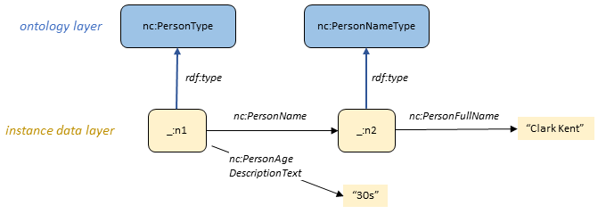
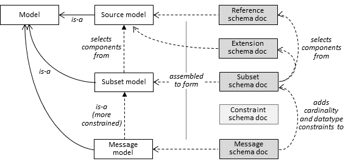
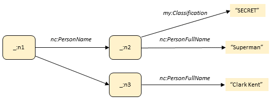
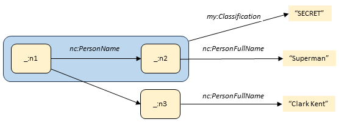
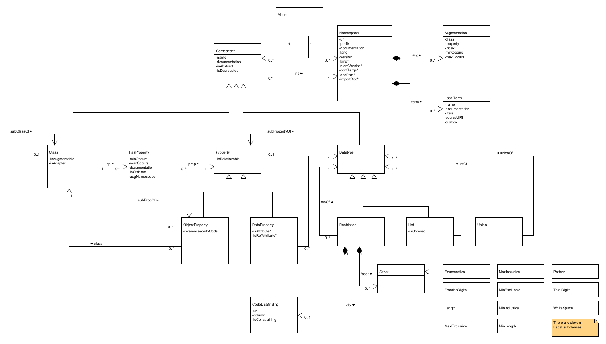
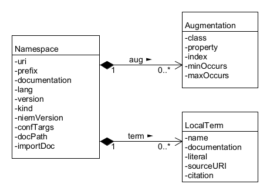
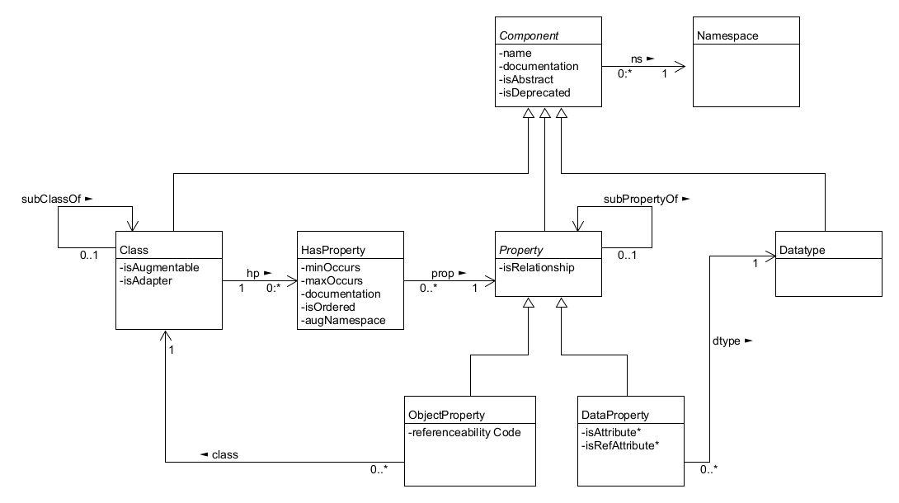
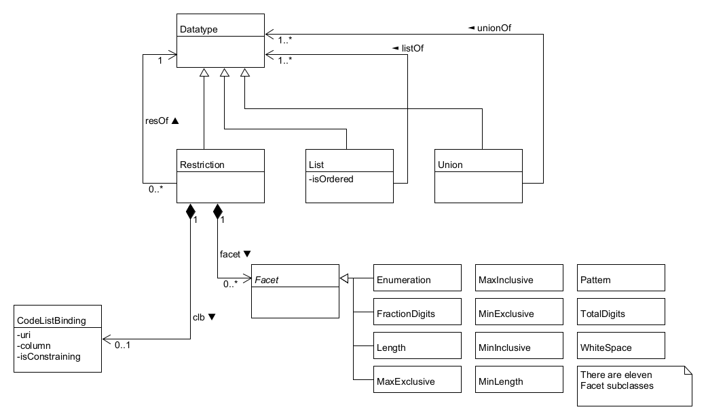

> 2024-02-02 draft

# 1. Data modeling in NIEM

NIEM is a framework for developer-level specifications of data. These specifications – which are built *using* NIEM and in *conformance* to NIEM, but are not themselves a *part* of NIEM – describe data for users, and form a contract between software developers. The specified data is called a *message* in NIEM. While a message is usually something passed between applications, NIEM works equally well to specify an information resource published on the web, an input or output for a web service or remote procedure, and so forth – basically, any chunk of data that crosses a system or organization boundary. 

Data models in NIEM are used to capture community agreement on data definitions, and to specify *message formats* using those definitions. A message format defines the syntax and semantics of messages; that is, the mandatory and optional content plus the meaning of that content. A message format provides an abstract definition of a message's information content, plus at least one concrete serialization of that information. NIEM supports serialization in XML and JSON-LD; support for others (YAML, Protobuf, etc.) may be added. NIEM messages are convertable across serializations; NIEM XML can be converted to NIEM JSON, and vice versa, with no bespoke programming needed.

NIEM provides two data modeling formalisms:  XML Schema (XSD), and the NIEM-defined, technology-neutral *Common Model Format (CMF)*. NIEM models may be converted from XSD to CMF, and vice versa, with no bespoke programming. Both formalisms rely on the Resource Description Framework (RDF) specifications for semantics. RDF is the foundation for convertability of NIEM messages and models.

## 1.1 NIEM and XSD

NIEM uses XSD as one of its two modeling formalisms. Community agreement models are expressed as a schema document set. For example, the NIEM Core model defines several properties of human persons through the schema components in figure 1-1 below. (In all examples, elements and closing tags may be truncated or omitted for simplicity. Namespace declarations are provided in [Appendix XX]() )

```
<xs:complexType name="PersonType">
  <xs:annotation>
    <xs:documentation>A data type for a human being.</xs:documentation>
  </xs:annotation>
  <xs:complexContent>
    <xs:extension base="structures:ObjectType">
      <xs:sequence>
        <xs:element ref="nc:PersonAccentText" minOccurs="0" maxOccurs="unbounded"/>
        <xs:element ref="nc:PersonAgeDescriptionText" minOccurs="0" maxOccurs="unbounded"/>
        <xs:element ref="nc:PersonAgeMeasure" minOccurs="0" maxOccurs="unbounded"/>
        <xs:element ref="nc:PersonBirthDate" minOccurs="0" maxOccurs="unbounded"/>
        <!-- 78 properties omitted -- explore them at https://niem.github.io/model/5.0/nc/PersonType/ -->
        <xs:element ref="nc:PersonHomeContactInformation" minOccurs="0" maxOccurs="unbounded"/>

<xs:element name="PersonAgeDescriptionText" type="nc:TextType" nillable="true">
  <xs:annotation>
    <xs:documentation>A general description of the age of a person.</xs:documentation>
  </xs:annotation>
</xs:element>
```

​								*Figure 1-1: NIEM XSD components from a community agreement model*

Community agreement models tend to omit cardinality constraints (as in the example above) and datatype constraints. Message format models include both. (See [1.5: Kinds of NIEM models]().) Message format models are expressed as a schema document set plus the name of the message root element. For example, a message designer might select two of the community-defined person properties, and require each appear once in each person object, resulting in the schema components below:

```
<xs:complexType name="PersonType">
  <xs:annotation>
    <xs:documentation>A data type for a human being.</xs:documentation>
  </xs:annotation>
  <xs:complexContent>
    <xs:extension base="structures:ObjectType">
      <xs:sequence>
        <xs:element ref="nc:PersonAgeDescriptionText" minOccurs="1" maxOccurs="1"/>
        <xs:element ref="nc:PersonName" minOccurs="1" maxOccurs="1"/>
```

​								*Figure 1-2:  NIEM XSD components from a message format model*

A message format schema can be directly used to validate conformance of a NIEM XML message. The schema can also be converted for validation of NIEM messages in other serializations; for example, converted to JSON Schema to validate a NIEM JSON message. <!--ref to tool section?-->

The XML Schema definition language describes the structure and constrains the contents of XML documents, but does not address the meaning of those documents. NIEM defines the meaning of XSD and XML in terms of RDF. This is the subject of the next section.

## 1.2 NIEM and RDF

NIEM expresses semantics in terms of RDF plus well-known RDF vocabularies – primarily RDF Schema (RDFS) and the Web Ontology Language (OWL). NIEM expresses semantics for XSD and XML by specifying the RDF triples that are entailed by XSD and XML components; the meaning of the component is the meaning of the RDF triples. (Those RDF entailments are defined in [XX:SectionTitle]().)  For example, the XSD in figure 1-1 entails the following RDF:

```
nc:PersonType
  a owl:Class ;
  rdfs:comment "A data type for a human being." .
nc:PersonAgeDescriptionText
  a owl:DataProperty ;
  rdfs:range xsd:string ;
  rdfs:comment "A general description of the age of a person." .
```

Figure 1-3 shows part of an XML message conforming to the message format partially defined in figure 1-2, and figure 1-4 shows the RDF triples entailed by that XML.

```
<nc:Person>
 <nc:PersonAgeDescriptionText>30s</nc:PersonAgeDescriptionText>
 <nc:PersonName>
  <nc:PersonFullName>Clark Kent</nc:PersonFullName>
 </nc:PersonName>
</nc:Person>
```

​								*Figure 1-3: Portion of a NIEM XML message*

```
 _:n1 a nc:PersonType .
 _:n1 nc:PersonAgeDescriptionText "30s" .
 _:n1 nc:PersonName _:n2 .
 _:n2 a nc:PersonNameType .
 _:n2 nc:PersonFullName "Clark Kent" .
```

​								*Figure 1-4: RDF entailed by NIEM XML (Turtle syntax)*

The RDF for the model plus the RDF for the message form the *knowledge graph representation* of NIEM data, depicted in figure 1-5 below.



​								*Figure 1-5: Knowledge graph diagram from a NIEM message*

## 1.3 NIEM and CMF

XSD as a modeling formalism supports conformance testing of NIEM XML messages through schema validation. But this is of no use to JSON developers working with JSON messages, who have no interest in reading XSD to understand a NIEM message format, nor to developers working with any other serialization. In addition, software to read model information from a set of XML schema documents or infer model smenatics from RDF is hard to write, so working with NIEM XSD is a serious obstacle to NIEM tool developers. CMF is NIEM's answer to those difficulties – an alternative modeling formalism to support non-XML message developers and NIEM tool developers.

The information requirement for a NIEM model is defined in the *NIEM metamodel*, the abstract model for NIEM models. The metamodel is specified in [Section 2]() by a UML class diagram and property tables. CMF is a NIEM message format for the information in the metamodel. NIEM XSD is another way to represent that information.

A CMF model is a NIEM message, and like any NIEM message, can be converted between XML, JSON, and any other supported serialization. It can also be converted to and from a NIEM schema document set. For example, the NIEM XSD in figure 1-2 is equivalent to the following CMF message fragment:

```
<cmf:Class>
 <cmf:Name>PersonType</cmf:Name>
 <cmf:Namespace structures:ref="nc"/>
 <cmf:Definition>A data type for a human being.</cmf:Definition>
 <cmf:HasProperty>
  <cmf:Property structures:ref="nc.PersonAgeDescriptionText"/>
  <cmf:MinOccursQuantity>1</cmf:MinOccursQuantity>
  <cmf:MaxOccursQuantity>1</cmf:MaxOccursQuantity>
 </cmf:HasProperty>
 <cmf:HasProperty>
  <cmf:Property structures:ref="nc.PersonName"/>
  <cmf:MinOccursQuantity>1</cmf:MinOccursQuantity>
  <cmf:MaxOccursQuantity>1</cmf:MaxOccursQuantity>
 </cmf:HasProperty>
</cmf:Class> 
```

​								*Figure 1-6: CMF from a message format model*

Because CMF is a NIEM message format, there is a CMF model for the CMF model! This is part of the [CMF message specification](https://github.com/niemopen/common-model-format).

## 1.4 Namespaces

The components of a NIEM model are partitioned into *namespaces.* Each namespace has an author, a person or organization that is the authoritative source for the namespace definitions. A namespace is a collection of names, definitions, class and data types, and properties for the concepts that are of interest to the namespace author. In NIEM XSD, a namespace is defined by a single XML schema document.  In NIEM CMF, a single file can define any number of namespaces.

Each namespace has a URI. By convention, the major version number of the namespace is the last term in the namespace URI. For example, the URI for the NIEM Core namespace is `https://docs.oasis-open.org/niemopen/ns/model/niem-core/6.0/`.   Each component in a namespace also has a URI, based on the namespace URI. For example, the URI for the PersonType class in that namespace is `https://docs.oasis-open.org/niemopen/ns/model/niem-core/6.0/PersonType`.

The authoritative definition of namespace content, once published, cannot be changed; incompatible revisions require a new namespace with a different URI.  This content stability encourages authors to reuse components from other namespaces, as a change by one author can never force a change to another author's model.

## 1.5 Kinds of NIEM models

NIEM models fall into one of three categories:

* A *community agreement model* is the authoritative specification of the components in a set of namespaces *that are intended for reuse*.  A community agreement model is a form of ontology, in that it defines terms and relationships in a domain of discourse. These models are characterized by "optionality and over-inclusiveness". That is, they define more concepts than needed for any particular data specification.  Thede models typically:
  * Lack cardinality constraints, making it easy to select the concepts that are needed and omit the others.
  * Omit range or length constraints on property datatypes.
  * Are *incomplete* for any particular message format; it must usually be extended through namespaces defined in the message specification.
* A *subset model* selects some components from one or more *community agreement models* whle omitting others. Every instance of a subset model is also an instance of the corresponding source model. These models typically:
  * Are intended for extension and reuse.
  * Capture semantics but not cardinality or datatype constraints.
  * Are created by a developer when creating a data specification; sometimes, they are created as a starting point for several data specifications in an organization.
  * Are created through a series of subset-preserving model transformations on the source model.
* A *message model* is a subset with cardinality and datatype constraints intended to precisely define the content of a particular message format; that is, a data specification. These models are not typically intended for extension or reuse.

## 1.6 Kinds of NIEM XSD documents

Source, subset, and message models are all the same in CMF, but not in XSD. The schema documents in a NIEM XSD model fall into xx categories:

* A *reference schema document* provides definitions from a *community agreement model* that are intended for the widest possible reuse. The rules for a reference schema document (in [section XX]()) forbid schema constructs that limit reuse, and include all of the schema constructs that, together with RDF entailments, capture the semantic meaning of the schema components. Every namespace in the NIEM model is authoritatively defined by a reference schema document; that is, there is only one reference schema document for a namespace.
* An *extension schema document* provides definitions that are intended for reuse within a narrower scope than those defined by a reference schema document. Typically, the intended scope is a particular message specification. An extension schema document expresses the additional vocabulary required for information exchange, above and beyond the vocabulary available from the *community agreement model*. The rules for an extension schema document (in [section XX]()) permit some constructs that limit reuse, but include all constructs related to semantics. There is only one extension schema document for a namespace.
* A *subset schema document* provides a selection of components defined in a reference or extension schema document. Everything valid against the subset schema document must also be valid against the reference or extension schema for that namespace. The documentation rules for a subset schema document (in [section XX]()) are more relaxed that those for an extension schema document. There can be any number of subset schema documents for a namespace.
* A *message schema document* also provides a selection of components from a reference or extension schema document, and everything valid against the subset schema document must also be valid against the reference or extension schema for that namespace. However, a message schema document is not intended for extension or reuse, or to provide semantics (these are provided by the corresponding reference or extension schema). A message schema document instead provides cardinality and datatype constraints intended to precisely define the content of a particular message format. The rules for a message schema document (in [section XX]()) are more relaxed than those for the other three kinds of schema documents. There can be any number of message schema documents for a namespace.
* A *constraint schema document* is a schema document that is unrelated to the specification of a message format. Constraint schema documents are typically used to provide additional implementation-specific constraints that are not specified in the message format. There are no rules for a constraint schema document, and there can be any number of constraint schema documents for a namespace.

Figure 1-7 shows the relationships between kinds of NIEM models and kinds of NIEM schema documents.



​								*Figure 1-7: Kinds of NIEM models and NIEM schema documents*

## 1.7 Augmentation

The components in a *community agreement model* are those that the community identified as worthy of an agreed definition. For example, the NIEM Business Architecture Committee (NBAC) is the author of the NIEM Core model. The PersonType class in the NIEM Core model (depicted in figure 1-2) has 83 properties. These, of course, are not the only possible properties of a person. As an example, the members of the NIEM Justice domain may agree that the PersonType class could usefully include the property of whether a person has a college degree. However, the Justice domain is not permitted to simply add that property to the NIEM Core namespace as they aren't the namespace author. Instead, the Justice domain may identify additional properties of PersonType by using an augmentation.

Augmentation is the mechanism through which the author of one namespace adds properties to a class defined in another namespace. That mechanism is different in CMF and XSD. Augmentation in CMF is described in [section XX](); in XSD in [section XX](), and in the metamodel in [section 2.2.2]().

## 1.8 Relationship properties

Sometimes the property of an object properly applies to the *relationship* between that object and another. For example, let's add another name to the message fragment from figure 1-2.

```
<nc:Person>
 <nc:PersonAgeDescriptionText>30s</nc:PersonAgeDescriptionText>
 <nc:PersonName>
  <nc:PersonFullName>Clark Kent</nc:PersonFullName>
 </nc:PersonName>
 <nc:PersonName>
  <nc:PersonFullName>Superman</nc:PersonFullName>
  <my:Classification>SECRET</my:classification>
</nc:Person>
```

The data says that the guy named Clark Kent, in his thirties, working at the Daily Planet, etc. – is also named Superman. We don't want everybody to know that, so we want to mark it SECRET. Alas, as an ordinary property, `my:Classification` doesn't do what we want. The RDF diagram of that data looks like this:



​								*Figure 1-8: Classification as an ordinary property*

Which says that the *name* "Superman" is secret. But that's not what we want - everybody knows that name! Instead, we want to classify the relationship between the person object and the name object. We want to make a statement about a statement. As a diagram, we want:



​								*Figure 1-9: Classification as a relationship property*

NIEM models may designate any property as a relationship property. This is described in the metamodel in [section 2.3.3](); in CMF in [section XX](), and in XSD in [section XX](). NIEM uses the RDF-star specification to make statements about statements. When `my:Classification` is marked as a relationship property in the model, the RDF entailed by the above XML looks like this:

```
 _:n1 a nc:PersonType .
 _:n1 nc:PersonAgeDescriptionText "30s" .
 _:n1 nc:PersonName _:n2 {| my:Classification "SECRET" |} .
 _:n2 a nc:PersonNameType .
 _:n2 nc:PersonFullName "Superman" .
 _:n1 nc:PersonNAme _:n3 .
 _:n3 a nc:PersonNameType .
 _:n3 nc:PersonFullName "Clark Kent" .
```

​								*Figure 1-10: A relationship property in RDF-star*


# 2. The NIEM Metamodel

The NIEM metamodel is an abstract model defining the information content of a NIEM data model.  It is defined by the following UML class diagram and property tables:



The table format used to document the classes and properties in the metamodel has the following columns:

* Name
* Definition
* Card – cardinality of the property
* O – true when the order of a repeatable property is significant
* Range – class or datatype of thie property

## 2.1  Model class

A model object represents a complete NIEM model.  It is comprised of a set of namespace and component objects.

## 2.2 Namespace class diagram



### 2.2.1 Namespace class

A namespace object represents a namespace in a model.  Properties marked with a star are significant only in the XSD representation of a model.

| Name          | Definition                                                   | Card | O    | Range          |
| ------------- | ------------------------------------------------------------ | ---- | ---- | -------------- |
| aug           | An augmentation made by this namespace                       | 0..* |      | Augmentation   |
| term          | A local term defined in this namespace                       | 0..* |      | LocalTerm      |
| uri           | The URI of this namespace                                    | 1    |      | xs:anyURI      |
| prefix        | The prefix assigned to this namespace in the model.  For any model there is a one-to-one mapping between namespace prefix and namespace URI. | 1    |      | xs:NCName      |
| documentation | A description of this namespace                              | 0..* | Y    | TextType       |
| lang          | The default language of text strings in the model            | 1    |      | xs:language    |
| version       | The version of this namespace (and the components it comprises) | 0..1 |      | xs:string      |
| kind*         | The kind of namespace in a model (**EXTENSION, DOMAIN, CORE, OTHERNIEM, BUILTIN, XSD, XML, EXTERNAL, UNKNOWN**) | 0..1 |      | NSKindCodeType |
| niemVersion*  | The version of NIEM builtin schema documents referenced in the XML schema document for this namespace (4.0, 5.0, etc.) | 0..1 |      | xs:token       |
| confTargs*    | A URI of a conformance target assertion for the XML schema document for this namespace | 0..* |      | xs:anyURI      |
| docPath*      | The relative path of the XML schema document for this namespace within the directory of the model's schema document pile | 0..1 |      | xs:string      |
| importDoc*    | Documentation used for an`xs:import` element used in the schema document of any other namespace to import this namespace | 0..1 |      | TextType       |

### 2.2.2  Augmentation class

When the author of one namespace adds a property to a class in another namespace, that is an augmentation.  An augmentation object is the record associated with the augmenting namespace.  (The augmentation is also recorded in the augmented namespace; see the HasProperty metamodel class.)  Relationships between the Augmentation, ClassType, and Property classes in the metamodel exist, but are not shown on the UML diagram. 

| Name      | Definition                                                   | Card | Range         |
| --------- | ------------------------------------------------------------ | ---- | ------------- |
| class     | The model class that is augmented by this namespace          | 1    | Class         |
| property  | The property added to the augmented class                    | 1    | Property      |
| index*    | The position of the property in the XSD augmentation type for this class, if one exists | 0..1 | xs:integer    |
| minOccurs | The minimum number of times this property may appear in an object of the augmented class | 1    | xs:integer    |
| maxOccurs | The maximum number of times this property may appear in an object of the augmetned class | 1    | MaxOccursType |

### 2.2.3 LocalTerm class

Components in a namespace may have names that are composed of terms not in the Oxford English Dictionary.  A LocalTerm object records the definition of such a term.

| Name          | Definition                                                   | Card | O    | Range     |
| ------------- | ------------------------------------------------------------ | ---- | ---- | --------- |
| ns            | The namespace object for this component                      | 1    |      | Namespace |
| name          | A name for a local term                                      | 1    |      | xs:token  |
| documentation | A definition of a local term.                                | 0..* | Y    | TextType  |
| literal       | A meaning of a local term provided as a full, plain-text form | 0..* | Y    | TextType  |
| sourceURI     | An identifier or locator for an originating or authoritative document defining a local term | 0..* |      | xs:anyURI |
| citation      | A plain text citation of, reference to, or bibliographic entry for an originating or authoritative document defining a local term | 0..* | Y    | TextType  |

## 2.3 Component class diagram



### 2.3.1 Component class (abstract)

| Name          | Definition                                                   | Card | O    | Range      |
| ------------- | ------------------------------------------------------------ | ---- | ---- | ---------- |
| ns            | The namespace in which this component is defined.            | 1    |      | Namespace  |
| name          | A name for a component                                       | 1    |      | xs:token   |
| documentation | A definition of a component                                  | 0..* | Y    | TextType   |
| isAbstract    | True if a component is a base for extension, and must be specialized to be used directly; false if a component may be used directly. | 1    |      | xs:boolean |
| isDeprecated  | The deprecated attribute provides a method for identifying schema components as being deprecated. A deprecated component is one that is provided, but the use of which is not recommended. | 1    |      | xs:boolean |

### 2.3.2 Class class

A Class object represents a class of objects in the model.  For example, `nc:PersonType` is a class object in the NIEM Core model.  [Comment: this was "ClassType", but that name is needed only in the CMFTool Java code – can't have a class named "Class" in Java.]

| Name          | Definition                                                   | Card | **O** | Range       |
| ------------- | ------------------------------------------------------------ | ---- | ----- | ----------- |
| hp            | An association between this class and a property of this class. | 0..* | Y     | HasProperty |
| subClassOf    | A class that is extended by this class; all instances of this class are also an instance of the extended class; for example, *Vessel* is a subclass of *Conveyance*. | 0..1 |       | Class       |
| isAugmentable | True if a different namespace may augment this class with one or more properties. | 1    |       | xs:boolean  |
| isAdapter     | True if this class is an adapter for an external property; that is, a property not defined in a NIEM-conforming namespace. | 1    |       | xs:boolean  |

### 2.3.3 Property class (abstract)

A Property object represents a property of zero or more classes in the model.  For example, `nc:PersonName` is a property of the `nc:PersonType` class object.

| Name           | Definition                                                   | Card | Range      |
| -------------- | ------------------------------------------------------------ | ---- | ---------- |
| isRelationship | True if this property applies to the relationship between its grandparent and parent objects.  [Comment: Add a link to description of relationship properties] | 1    | xs:boolean |
| subPropertyOf  | When defined, all objects related by the property are also related by this property.  For example, `nc:Date` is a subproperty of `nc:DateRepresentation`, and so any value related to an object by `nc:Date` is also related by `nc:DateRepresentation`. | 0..1 | Property   |

### 2.3.4 Datatype class

A Datatype object represents a range of literal values for zero or more data properties in the model.  For example, a model may contain a datatype object for the XSD built-in datatype `xs:token`.  (That object is not a Restriction, List, or Union, which is why Datatype is not an abstract class)

### 2.3.5 HasProperty class

A HasProperty object represents the association between a class object and a property object.

| Name          | Definition                                                   | Card | O    | Range      |
| ------------- | ------------------------------------------------------------ | ---- | ---- | ---------- |
| prop          | The property object associated with the class object         | 1    |      | Property   |
| minOccurs     | The minimum number of times this property may appear in an object of the class. | 1    |      | xs:integer |
| maxOccurs     | The maximum number of times this property may appear in an object of the class. | 1    |      |            |
| documentation | A definition of a property in a class.                       | 0..* | Y    | TextType   |
| isOrdered     | True if the order of a repeatable property in an object is significant. | 1    |      | xs:boolean |
| augNamespace  | A namespace responsible for augmenting this class with this property. | 0..* |      | Namespace  |

### 2.3.6 ObjectProperty class

An ObjectProperty object is a property with a value that is an object.  For example, `nc:Person` is an ObjectProperty whose value range is `nc:PersonType`.

| Name                 | Definition                                                   | Card | O    | Range       |
| -------------------- | ------------------------------------------------------------ | ---- | ---- | ----------- |
| class                | The class that is the range of values for the property.      | 1    |      | Class       |
| referenceabilityCode | A code for the kind of identifier allowable for values of the property. (**NONE, ID, URI, ANY**) | 1    |      | RefCodeType |

### 2.3.7 DataProperty class

A DataProperty object is a property with a value that is a literal.

| Name            | Definition                                                   | Card | O    | Range      |
| --------------- | ------------------------------------------------------------ | ---- | ---- | ---------- |
| dtype           | The datatype of the property.                                | 1    |      | Datatype   |
| isAttribute*    | True if the property is represented in XML as an attribute.  | 1    |      | xs:boolean |
| isRefAttribute* | True if the property is a reference attribute. [Comment: add link to ref atts.] | 1    |      | xs:boolean |

## 2.4 Datatype class diagram



### 2.4.1 Restriction class

A Restriction object is a datatype specified by zero or more Facet constraints upon another datatype.

| Name  | Definition                                                   | Card | Range           |
| ----- | ------------------------------------------------------------ | ---- | --------------- |
| resOf | The restricted datatype .                                    | 1    | Datatype        |
| facet | A constraint upon the restricted datatype.  There are eleven Facet subclasses, corresponding to the eleven constraining facets in XML Schema. | 0..* | Facet           |
| clb   | A constraint upon the restricted datatype expressed in terms of the [NIEM Code Lists Specification](). | 0..1 | CodeListBinding |

### 2.4.2 CodeListBinding class

| Name           | Definition                                                   | Card | Range      |
| -------------- | ------------------------------------------------------------ | ---- | ---------- |
| uri            | A URI for a code list specification.                         | 1    | xs:anyURI  |
| columnName     | A name for a column in a code list specification.            | 0..1 | xs:string  |
| isConstraining | True if a value of the datatype is valid only when part of the code list. | 1    | xs:boolean |

### 2.4.3 List class

A List object is a datatype specified as a space-separated sequence of literal values from another datatype.

| Name      | Definition                                              | Card | Range      |
| --------- | ------------------------------------------------------- | ---- | ---------- |
| listOf    | The atomic or union datatype of the values of the list. | 1    | Datatype   |
| isOrdered | True if the order of the literal values is significant. | 1    | xs:boolean |

### 2.4.4 Union class

A Union object is a datatype specified by the union of one or more other datatypes.

| Name    | Definition                     | Card | **O** | Range    |
| ------- | ------------------------------ | ---- | ----- | -------- |
| unionOf | A member datatype of the union | 1..* | Y     | Datatype |

## 2.5 Other metamodel classes and datatypes

* MaxOccursType – a union of xs:integer and a code list with the single code "unbounded".
* NSKindCodeType – a code list
  * EXTENSION – a NIEM-conforming namespace that is not part of the NIEM model
  * DOMAIN – a namespace that is authored by a NIEM domain
  * CORE – the NIEM Core namespace
  * OTHERNIEM – a NIEM model namespace that is not a domain or the core
  * BUILTIN – a namespace in the NIEM XSD technical architecture (e.g. structures, appinfo)
  * XSD – the XML Schema namespace, http://www.w3.org/2001/XMLSchema
  * XML – the XML namespace, http://www.w3.org/XML/1998/namespace
  * EXTERNAL – a non-conforming namespace that is not a builtin namespace
  * UNKNOWN – it is not known which of the other codes applies to this namespace

* TextType – a class with two properties


| Name        | Definition                  | Card | Range       |
| ----------- | --------------------------- | ---- | ----------- |
| TextLiteral | A string value.             | 1    | xs:string   |
| language    | The language of the string. | 0..1 | xs:language |

