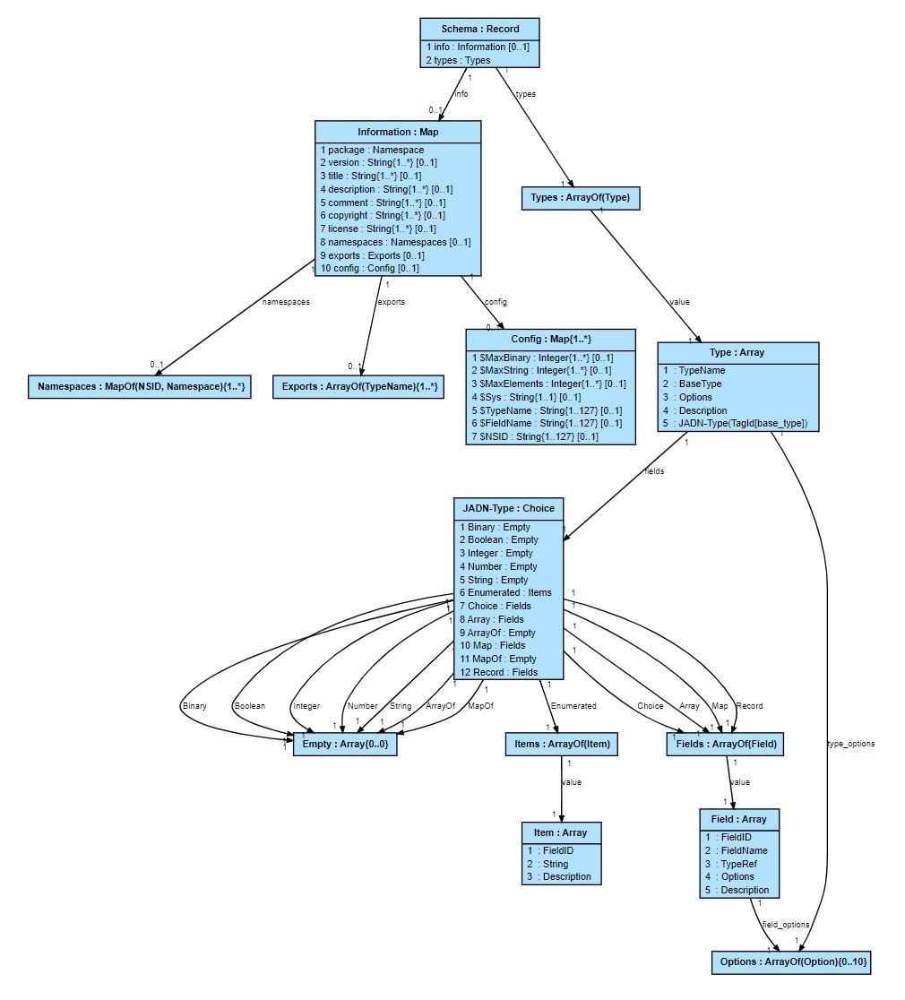

### OASIS Project Note
-------

# Understanding the NIEM Information Model

## Project Note 01

## 30 May 2023

&nbsp;

#### This stage:

[links]()

#### Previous stage:
N/A

#### Latest stage:
[links]()

#### Open Project:
[NIEM Technical Architecture Committee (NTAC) of the OASIS NIEMOpen OP](http://www.niemopen.org/)

#### Project Chair:
Katherine Escobar (katherine.b.escobar.civ@mail.mil), [Joint Staff J6](https://www.jcs.mil/Directorates/J6-C4-Cyber/)

#### NTAC Committee Chairs:
Jim Cabral (jim.cabral@infotrack.com), [InfoTrack US](https://www.infotrack.com/) 
Scott Renner (sar@mitre.org), [MITRE](https://www.mitre.org/)

#### Editors:
David Kemp (d.kemp@cyber.nsa.gov), [NSA-CCC](https://www.nsa.gov/About/Cybersecurity-Collaboration-Center/)

#### Related work:

*Is there any??*

#### Abstract:
This document extends ["Understanding the NIEM Technical Architecture"](../tech-arch-v1.0-pn02/tech-arch-v1.0-pn02.md)
by describing information modeling, comparing it with the objectives and assumptions of the 
technical architecture in NIEM 5 and proposing it to supplement the NTAC's future direction.
An information model defines the state used by NIEM applications accompanied by a set of
business-domain-independent mechanisms for communicating state between applications.

#### Status:
This is a Non-Standards Track Work Product. The patent provisions of the OASIS IPR Policy do not apply.

This document is a working draft.  It has not been approved by the Project Governing Board of the OASIS NIEMOpen OP.

Comments on this work can be provided by opening issues in the project repository or by sending email
to the project's public comment list: niemopen@lists.oasis-open-projects.org.
List information is available at https://lists.oasis-open-projects.org/g/niemopen.

#### Citation format:
When referencing this document the following citation format should be used:

**[Understanding-NIEM-Information-Model-v1.0]**

_Understanding the NIEM Information Model_.  Edited by David Kemp, 30 May 2023.
OASIS Project Note 01. [links]()

#### Notices
Copyright &copy; OASIS Open 2023. All Rights Reserved.

Distributed under the terms of the OASIS [IPR Policy](https://www.oasis-open.org/policies-guidelines/ipr/).

For complete copyright information please see the full Notices section in an Appendix below.

-------

# Table of Contents
[[TOC will be inserted here]]

-------

# 1 Introduction


## 1.1 Glossary

### 1.1.1 Definitions of terms

- **NIEMOpen** (or **NIEM**) refers to the NIEM Open Project
- **NIEM** followed by a version number (e.g., NIEM 6.0) refers tp a reference data model and related specifications.
- The NIEM **Core** refers to the content of the reference data model that is not associated with a specific Domain.
- A NIEM **Domain** refers to content of the reference data model that is associated with a specific segment of government or industry.

### 1.2.2 Acronyms and abbreviations

- **CMF**: Common Model Format
- **[CTAS](#ctas)**: Conformance Target Attribute Specification
- **[JADN](#jadn)**: JSON Abstract Data Notation
- **NMO**: NIEM Management Office TSC
- **NBAC**: NIEM Business Architecture Committee TSC
- **NTAC**: NIEM Technical Architecture Committee TSC
- **[NTA](#nta)**: NIEM Technical Architecture Project Note
- **PGB**: Project Governing Board
- **TSC**: Technical Steering Committee

Note: NIEM is not an acronym

## 1.2 Information Modeling

The NIEM interoperability diagram provides the context for distinguishing
between data and information modeling:


Users accomplish their mission by interacting with applications through user interfaces,
while applications communicate among themselves by exchanging messages.
Data models define message content directly, while information models define the
application state (information) needed to support application operations.
Thus the focus of an information model is to support business logic and user
needs; messages are a means to that end. Once serialization rules are defined,
message coding becomes a domain-independent commodity service like compression, encryption,
or session management, allowing model developers to focus on information requirements.

The RDF approach assumes that NIEM developers' primary motivation is to create an ontology and define
NIEM messages to be an [ontology serialization (OWL)](#owl) using XML/RDF, JSON-LD, or Turtle.
Information modeling assumes that applications can satisfy all requirements without needing
an ontology but can reference one if it exists.
Application developers can use an RDF graph for enrichment of message data defined by an IM,
but NIEM IM designers and developers are not required to create or understand ontologies.
This separation of responsibilities simplifies the creation of new domain content; design simplicity
is the primary motivation for using an information model rather than an ontology.


-----

# 2 NIEM technical architecture

These are the assumptions and goals of the NIEM technical architecture ([NTA](#nta)) through NIEM 5.0,
along with the differences that arise when using an information model:

1. **Contract-based machine-to-machine data interoperability**: as described in the NTA.
2. **Reuse of definitions from community-agreed data models**: as described in the NTA,
substituting *information models* for *data models*.
3. **XSD as a data model formalism**: the JSON Abstract Data Notation[JADN](#jadn) information model formalism
captures the XSD constraints needed for applications to satisfy their requirements but does not necessarily
replicate the data objects defined by XSD.
JADN can support both multiple styles of XML and type-specific serialization options, but the latter
is generally contrary to the goals of abstraction. Where byte-for-byte backward compatibility
with NIEM 5.0 XML data is a requirement, an XSD data model will likely be needed in addition to a
format-agnostic information model.
4. **One modeling formalism, two kinds of data model**: as described in the NTA. Both permissive (reference)
and restrictive (message) information models can be defined, and an information model can be defined as the
intersection of two sub-models to assist developers in ensuring a strict subset relationship between them.
5. **Automated validation of NIEM XSD and XML**: the JADN language natively supports validation of type and 
property names. Naming and Design Rules (NDR) requirements beyond that may require additional constraint
definition and tool development. 
6. **NIEM data is self-describing**: An information model formally defines equivalence between multiple data models,
some of which may be self-describing. This allows information to be optimized for machine-to-machine performance
while also being represented in a readable format for human consumption. The information model can include links
to XSD component definition URIs in type definitions without transmitting those URIs in message data.
7. **Developers have the data exchange specification**: as described in the NTA.
8. **Compact serialization is supported**: The purpose of information modeling is to support equivalence between
multiple data representations. Both uncompressed XML and Efficient Extensible Interchange (EXI) representations
are possible, as are purpose-built machine-optimized formats which are designed to be both efficiently processed
and concise.
JADN currently defines both verbose and concise JSON formats, though the latter due to its textual nature
may be applied more as an illustration of machine optimization principles than as a production message format.
9. **Version architecture supports independent change**: as described in the NTA.
10. **NIEM XSD and XML has an RDF expression**: as in bullet 6, information type definitions can include URI links
to [ontology nodes](https://www.w3.org/TR/2012/REC-owl2-overview-20121211/), whether the triples are represented
in XML/RDF, JSON-LD, Turtle, or another ontology syntax.
11. **NIEM JSON also has an RDF expression**: the information modeling approach explicitly isolates message data
from ontology by keeping the linkage in the reference model.
This automatically applies to all data formats, not just those with a specific "linked data" dialect with its
accompanying processing requirements.
A JSON-LD message format can be defined along with simple JSON and machine-optimized JSON if desired.

**Status:**

This section describes the characteristics and goals of the information modeling approach,
not a mature solution. Significant development will be needed to demonstrate how information
models can satisfy all NIEM messaging requirements. That effort should proceed in parallel with the
existing development roadmap.

-----

# 3 NIEM and Information Metamodels

## 3.1 Metamodels

### 3.1.1 NIEM Metamodel and Common Model Format (CMF)

The existing NIEM community is accustomed to working with NIEM models in XSD.
They will need XSD modeling in NIEM 6.  However, XSD is not a natural modeling
formalism for developers who are not working in XML.  To support those developers,
the NTAC set out to design an additional, technology-neutral modeling formalism
equivalent to NIEM XSD.  

The first step was to create an abstract model of the information captured in NIEM XSD.
This model of NIEM models is the *NIEM metamodel*, depicted below as a Unified Modeling Language
[UML](#uml) diagram:


### 3.1.2 Information Metamodel

The JADN metamodel is contained in [Appendix A](#appendix-a-jadn-metamodel), but it can be expressed in
a form similar to the NIEM metamodel to facilitate comparison:


The organizing construct of an information model is the Type. While models for realistic
applications are composed of multiple type definitions organized into one or more packages,
a minimal functioning (but not re-usable) IM consists of one or more type definitions with no
package. The JADN language has several built-in default constraints that apply to all
type definitions if not overridden by a namespace or an individual type definition.

Each package defines its own URI and optionally any URI prefixes used to shorten
references to other namespaces. References within a package have no prefix. A package
can specify constraints for the format of type and property names, and default size constraints
that can be overridden by type definitions. A package has optional descriptive information
such as title, description, license, a one-up version number, etc.

All type definitions have the same structure, inherited from the abstract ***Type***.
All properties exist only within types, unlike the NIEM metamodel where properties are
components with an independent existence. All property definitions have the same structure,
with both an integer identifier and name allowing one or the other to be used in message
data depending on the design goals of the data format

Items exist only within the Enumerated type. Like properties, items have both integer
identifier and string value, allowing either to be used in messages.

**ListType** is a collection of values of the same type.
**MapType** is a collection of key:value pairs where both key and value
can be any type but all pairs have the same key and value types.
ListType and MapType have the UML multiplicity constraints:
isOrdered, isUnique, lower (minOccurs) and upper (maxOccurs).

**DataType** is either a primitive type (Binary, Boolean, Integer, Number, String)
with no properties or a compound type (Array, Map, Record) with properties.
**UnionType** is a compound DataType with exactly one property.
**ClassType** is a compound DataType with at least one key property and
at least one non-key property. DataType instances are identified by their full
values while ClassType instances are identified by their keys, which must be
a proper subset of their full values.

The correspondence between JADN types and the metamodel types shown in the diagram is:

| Metamodel Type      | JADN Type                                | 
|---------------------|------------------------------------------|
| ListType            | ArrayOf                                  | 
| MapType             | MapOf                                    |
| DataType            | Binary, Boolean, Integer, Number, String |
| DataType, ClassType | Array, Map, Record                       |
| UnionType           | Choice                                   |
| EnumerationType     | Enumerated                               |

The primary differences between the NIEM and JADN metamodels are:
1. All properties are local to the type in which they are defined
2. All properties have both numeric and string identifiers, allowing flexible message formats
3. Some constraints such as multiplicity notation, anonymous property types and type inheritance
are syntactic sugar "extensions" that are pre-processed into core definitions.  This both
simplifies the message processing needed at runtime and clearly distinguishes the
information model itself from functions used to ease its integration with other design
methodologies.

## 3.2 Information Model

As discussed in the introduction, application information is independent of the data formats
used to communicate it.
Within an application information instances are the values of variables with the required
structure and behavior. Those values are serialized into message data, and message
data is parsed into information instances. Data that does not represent information
(e.g., whitespace) is considered insignificant and is ignored when parsing. For example a
Boolean information instance has only two values: true and false.
The serialized representation of a Boolean (e.g., Strings "true" and "false",
"True" and "False", or Integers 1 and 0) is not preserved when parsing, and only one
representation is used when serializing into messages using a specific data format.

This allows messages to be losslessly converted among all supported
data formats, which means information can be displayed in a verbose data format such as
XML or JSON that is meaningful to developers and also communicated among applications
using using a performance-oriented format such as CBOR, Avro, Protobuf or Thrift.
Applications that receive a message in optimized format can display it in a verbose
format without loss.


## 3.3 Information Examples

XSD and CMF definitions in this section are from the NIEM Technical Architecture Project Note, shown
here for ease of comparison with the corresponding Information Model definitions.

### 3.3.1 XSD and JADN Types
**PersonType XSD Reference Model**:
```xml
<xs:complexType name="PersonType">
  <xs:annotation>
    <xs:documentation>A data type for a human being.</xs:documentation>
  </xs:annotation>
  <xs:complexContent>
    <xs:extension base="structures:ObjectType">
      <xs:sequence>
        <xs:element ref="nc:PersonAccentText" minOccurs="0" maxOccurs="unbounded"/>
        <xs:element ref="nc:PersonAgeDescriptionText" minOccurs="0" maxOccurs="unbounded"/>
        <xs:element ref="nc:PersonAgeMeasure" minOccurs="0" maxOccurs="unbounded"/>
        <xs:element ref="nc:PersonBirthDate" minOccurs="0" maxOccurs="unbounded"/>
        <!-- 78 properties omitted - explore them at https://niem.github.io/model/5.0/nc/PersonType/ -->
        <xs:element ref="nc:PersonHomeContactInformation" minOccurs="0" maxOccurs="unbounded"/>
```
**PersonType JADN Reference Model**:
```
Person = Record                                     // A data type for a human being
  1 accent      PersonAccentText [0..*]
  2 ageText     PersonAgeDescriptionText [0..*]
  3 age         PersonAgeMeasure [0..*]
  4 dob         Date [0..1]                         // A person can't have more than one birth date
    ...                                             // 78 properties omitted (this line is not valid JADN syntax)
 83 home        PersonHomeContactInformation [0..1]
```
Notes:
1. XSD says <name="PersonType">. Every component in an IM is a Type, so the name can be simply "Person"
2. If both the Person type and and the referenced property types are in the nc: namespace, the prefix is
omitted. Prefixes are needed only when referencing types defined in other namespaces.
The nc: prefix is permitted in type references from the nc: namespace for stylistic reasons,
but type definitions cannot have prefixes.
3. Properties are enclosed in <xs:sequence> indicating that they are an ordered list. The IM "Record" type
is a list where properties have fixed ordinal positions. This is a reminder that inserting items anywhere
other than at the end is a breaking change requiring a new model version. If the items are a set rather
than a list, the IM type would be "Map", existing items can be reordered, and new items can be inserted
anywhere without breaking backwards compatibility as long as existing ID:name pairings are not modified.
4. Property maxOccurs="unbounded" - is this really intended, even in a reference schema?  A person might have
multiple accents, but can have only a single birthdate. The IM shows both unbounded lists [0..*] and optional
singletons [0..1] for illustration, but which is correct needs to be decided for each property.
5. In an IM all properties are local to the type in which they are defined, so short/friendly names are
always valid. An organization may impose additional naming guidelines if desired.
6. Assume that there is nothing unusual about a PersonBirthDate, it is the same type as a Date used for
other purposes. If it does have some unique properties, a PersonBirthDate type can be defined.
7. The JADN IM language is opinionated - it has built-in fixed type and property documentation fields. This is
both simpler and less flexible than allowing multiple \<documentation> elements enclosed in \<annotation>
elements enclosed anywhere in an outer element.

**PersonType XSD Message Model**:

By creating this subset of the reference schema, the designer of the message model omitted 81 of the 83
properties for PersonType, and specified that the two selected properties must each appear exactly once.
```xml
<xs:complexType name="PersonType">
  <xs:annotation>
    <xs:documentation>A data type for a human being.</xs:documentation>
  </xs:annotation>
  <xs:complexContent>
    <xs:extension base="structures:ObjectType">
      <xs:sequence>
        <xs:element ref="nc:PersonAgeMeasure" minOccurs="1" maxOccurs="1"/>
        <xs:element ref="nc:PersonName" minOccurs="1" maxOccurs="1"/>
```
**PersonType JADN Message Model**:
```
Person = Record                             // A data type for a human being.
   1 name         PersonName
   2 age          PersonAgeMeasure
```
Notes:
1. It goes without saying that the reference model and message model must be in different namespaces
since they use the same type names.

### 3.3.2 CMF and JADN Model Messages

**CMF Model data:**

The second step was to design a NIEM data exchange specification for the metamodel.
The result is the *Common Model Format*, a NIEM message specification for NIEM models.
A model in CMF is a NIEM message.  It has an exact equivalent in NIEM XSD,
and can be serialized as NIEM XML or NIEM JSON.
For example, the XSD schema fragment for `nc:PersonName` above looks like this in CMF XML

```
<Property s:id="nc.PersonNamee">
  <Name>PersonNamee</Name>
  <Namespace s:ref="nc" xsi:nil="true"/>
  <DefinitionText>A combination of names and/or titles by which a person is known.</DefinitionText>
  <Class s:ref="nc.PersonNameType" xsi:nil="true"/>
</Property>
```

**JADN Model data:**

In an Information Model properties are not Components, they are included within Types.
So a "PersonName" property does not exist within an IM even though the "PersonName" type does exist,
containing all the information (name, namespace, description) shown in the CMF property example.

An information model in JADN format is also a NIEM message that can be serialized as XML, JSON, or any
other format. The Person reference and message examples shown above are serialized as IDL (text) data.
The JSON equivalent is:

**Person message information model serialized as JSON data:**

```json
{
  "info": {
    "package": "http:docs.oasis-open.org/niemopen/ns/niem-core/v6.0/messages"
  },
  "types": [
    ["Person", "Record", [], "A data type for a human being.", [
      [1, "name", "PersonName", [], ""],
      [2, "age", "PersonAgeMeasure", [], ""]
    ]]
  ]
}
```
Notes:
1. JADN information models consist of "packages" where each package consists of namespace information
and all types in that namespace. This example includes the NIEM core v6 message model namespace to
illustrate the package syntax but only one of the hundreds of types in that namespace.
A standalone information model could also contain one or more types but no namespace.
Both PersonName and PersonAgeMeasure would need to be defined along with Person in order for the model
to be complete.
2. The empty constraints list ("[]") in the name and age fields default to "required" (minOccurs=1, maxOccurs=1).

### 3.3.3 RDF-star for relationship metadata

NIEM supports metadata in messages, both as ordinary properties and through a special metadata mechanism.
This metadata sometimes applies not to an object, but rather to the relationship between objects.

An information model defines types with properties. It is possible to define a "Relationship" type
with properties that include references (foreign keys) to ClassType instances identified by primary keys,
but that Relationship type would need to be defined within the core (or a domain) reference model.

# 4 Discussion

## 4.1 Properties

*"A property represents a concept, idea, or thing. It defines specific semantics and appears
in exchanges as the tag or label for a field.
Properties may be more commonly known as as elements, attributes, fields, tags, keys, or keywords.*

*One of the properties defined in Core is PersonBirthDate. It represents a person’s birthday
and will carry that value in an exchange.*

- *The type of the property will define the value’s structure (e.g., free text or a specific date format).*
- *The property itself is what gives this date value its meaning and distinguishes it from other
kinds of dates that might appear, such as a driver license expiration date.*

*All properties must be declared globally as top-level elements in a schema. 
One of the key principles of NIEM is to maximize reuse.
A local property cannot be reused outside of the one type in which it is defined."* ---
[NIEM Reference](https://niem.github.io/reference/concepts/property/#naming)

This principle is stated as self-evident, but it does not follow that defining properties globally
maximizes reuse. Type also represents a concept, idea, or thing.
If the type is "Person", one of its properties will be birth date and the type including local property
name is what gives this date its meaning and distinguishes it from other kinds of dates.

A "DriversLicense" type will have an expiration date property. And if an agriculture domain includes
livestock it would, following this principle, need an AnimalBirthDate global property rather
than simply defining a birth date property within the Animal type.

It is not clear that defining global properties for:
- PersonBirthDate
- PersonDeathDate
- AnimalBirthDate
- AnimalDeathDate
- DriversLicenseExpirationDate
- HuntingLicenseExpirationDate
- BuildingPermitExpirationDate

promotes any kind of reuse. On the other hand, re-using the same name for the same concept, idea, or thing
is desirable. Because Type represents a concept, idea, or thing, the alternate approach is to define Types
for properties that are actually being re-used:
- BirthDate
- DeathDate
- ExpirationDate

and use birthDate, deathDate and expirationDate property names in the Person, Animal, License and Permit
types that use them. Type definitions may include suggested aliases, such as dob for BirthDate, where
appropriate.

## 4.2 Class Extension and Augmentation

## 4.3 Composition

*(biometric domain example)*

## 4.4 Data Formats and Serialization Styles

# Appendix A. JADN Metamodel

## A.1 JADN Metamodel Definition
```
       title: "JADN Metaschema"
     package: "http://docs.oasis-open.org/openc2/ns/jadn/v1.0/"
 description: "Syntax of a JSON Abstract Data Notation (JADN) package."
     license: "CC0-1.0"
     exports: ["Schema"]
      config: {"$FieldName": "^[$A-Za-z][_A-Za-z0-9]{0,63}$"}

Schema = Record                                   // Definition of a JADN package
   1 info             Information optional        // Information about this package
   2 types            Types                       // Types defined in this package

Information = Map                                 // Information about this package
   1 package          Namespace                   // Unique name/version of this package
   2 version          String{1..*} optional       // Incrementing version within package
   3 title            String{1..*} optional       // Title
   4 description      String{1..*} optional       // Description
   5 comment          String{1..*} optional       // Comment
   6 copyright        String{1..*} optional       // Copyright notice
   7 license          String{1..*} optional       // SPDX licenseId (e.g., 'CC0-1.0')
   8 namespaces       Namespaces optional         // Referenced packages
   9 exports          Exports optional            // Type defs exported by this package
  10 config           Config optional             // Configuration variables

Namespaces = MapOf(NSID, Namespace){1..*}         // Packages with referenced type defs

Exports = ArrayOf(TypeName){1..*}                 // Type defs intended to be referenced

Config = Map{1..*}                                // Config vars override JADN defaults
   1 $MaxBinary       Integer{1..*} optional      // Schema default max octets
   2 $MaxString       Integer{1..*} optional      // Schema default max characters
   3 $MaxElements     Integer{1..*} optional      // Schema default max items/properties
   4 $Sys             String{1..1} optional       // System character for TypeName
   5 $TypeName        String{1..127} optional     // TypeName regex
   6 $FieldName       String{1..127} optional     // FieldName regex
   7 $NSID            String{1..127} optional     // Namespace Identifier regex

Types = ArrayOf(Type)

Type = Array
   1  TypeName                                    // type_name::
   2  BaseType                                    // base_type::
   3  Options                                     // type_options::
   4  Description                                 // type_description::
   5  JADN-Type(TagId[base_type])                 // fields::

BaseType = Enumerated
   1 Binary
   2 Boolean
   3 Integer
   4 Number
   5 String
   6 Enumerated
   7 Choice
   8 Array
   9 ArrayOf
  10 Map
  11 MapOf
  12 Record

JADN-Type = Choice
   1 Binary           Empty
   2 Boolean          Empty
   3 Integer          Empty
   4 Number           Empty
   5 String           Empty
   6 Enumerated       Items
   7 Choice           Fields
   8 Array            Fields
   9 ArrayOf          Empty
  10 Map              Fields
  11 MapOf            Empty
  12 Record           Fields

Empty = Array{0..0}

Items = ArrayOf(Item)

Item = Array
   1  FieldID                                     // item_id::
   2  String                                      // item_value::
   3  Description                                 // item_description::

Fields = ArrayOf(Field)

Field = Array
   1  FieldID                                     // field_id::
   2  FieldName                                   // field_name::
   3  TypeRef                                     // field_type::
   4  Options                                     // field_options::
   5  Description                                 // field_description::

FieldID = Integer{0..*}

Options = ArrayOf(Option){0..10}

Option = String{1..*}

Description = String{0..2048}

Namespace = String /uri                           // Unique name of a package

NSID = String{pattern="$NSID"}                    // Default = ^[A-Za-z][A-Za-z0-9]{0,7}$

TypeName = String{pattern="$TypeName"}            // Default = ^[A-Z][-$A-Za-z0-9]{0,63}$

FieldName = String{pattern="$FieldName"}          // Default = ^[a-z][_A-Za-z0-9]{0,63}$

TypeRef = String                                  // Autogenerated pattern ($NSID ':')? $TypeName
```

## A.2 JADN Metamodel Diagram



-------

# Appendix B. Informative References

###### [CTAS]
"Conformance Target Attributes Specification", Version 3.0, 23 February 2023
Project Specification 01
https://docs.oasis-open.org/niemopen/ctas/v3.0/ps01/ctas-v3.0-ps01.html

###### [JADN]
"JSON Abstract Data Notation", Version 1.0, 17 August 2021  
OASIS Committee Specification 01.
https://docs.oasis-open.org/openc2/jadn/v1.0/cs01/jadn-v1.0-cs01.html.  
Latest stage:
https://docs.oasis-open.org/openc2/jadn/v1.0/jadn-v1.0.html.

###### [JADN-IM]
"Information Modeling with JADN", Version 1.0, 19 April 2023  
OASIS Committee Note 01.  
https://docs.oasis-open.org/openc2/imjadn/v1.0/imjadn-v1.0.md

###### [NTA]
"Understanding the NIEM Technical Architecture", Version 1.0, 20 February 2023.  
OASIS Project Note 02.
https://github.com/niemopen/ntac-admin/blob/main/project-notes/docs/tech-arch-v1.0-pn02/tech-arch-v1.0-pn02.md

###### [OWL]
"OWL 2 Web Ontology Language", Second Edition
W3C Recommendation, 11 December 2012
https://www.w3.org/TR/2012/REC-owl2-overview-20121211

###### [UML]
"Unified Modeling Language", Version 2.5.1, December 2017.  
https://www.omg.org/spec/UML/2.5.1/About-UML/

-------

# Appendix C. Acknowledgments

(Note: A Work Product approved by the TSC must include a list of people who participated in the development of the Work Product. This is generally done by collecting the list of names in this appendix. This list shall be initially compiled by the Chair, and any Member of the TC may add or remove their names from the list by request.  
Remove this note before submitting for publication.)

## C.1 Special Thanks

<!-- This is an optional subsection to call out contributions from TSC members. If a TSC wants to thank non-TSC members then they should avoid using the term "contribution" and instead thank them for their "expertise" or "assistance". -->

Substantial contributions to this document from the following individuals are gratefully acknowledged:

Participant Name, Affiliation or "Individual Member"

## C.2 Participants

<!-- A TSC can determine who they list here, however, TSC Observers must not be listed. It is common practice for TCs to list everyone that was part of the TC during the creation of the document, but this is ultimately a TC decision on who they want to list and not list, and in what order. -->

The following individuals have participated in the creation of this document and are gratefully acknowledged:

**NIEM Technical Architecture Committee (NTAC) TSC Members:**

| First Name | Last Name | Company               |
|:-----------|:----------|:----------------------|
| Aubrey     | Beach     | Joint Staff J6        |
| Jim        | Cabral    | InfoTrack US          |
| Tom        | Carlson   | GTRI                  |
| Mike       | Douklias  | Joint Saff J6         |
| Katherine  | Escobar   | Joint Staff J6        |
| Mike       | Hulme     | Unisys                |
| Eric       | Jahn      | Alexandria Consulting |
| Ptere      | Madruga   | GTRI                  |
| Christina  | Medlin    | GTRI                  |
| Scott      | Renner    | MITRE                 |
| Duncan     | Sparrell  | sFractal Consulting   |
| Jennifer   | Stathakis | FBI                   |
| Stephen    | Sullivan  | BAH                   |

Update with the full TSC roster before publishing

-------

# Appendix D. Revision History
| Revision                    | Date       | Editor     | Changes Made          |
|:----------------------------|:-----------|:-----------|:----------------------|
| information-model-v1.0-pn01 | 2023-05-20 | David Kemp | Initial working draft |

------

# Appendix E. Notices

Copyright &copy; OASIS Open 2023. All Rights Reserved.

All capitalized terms in the following text have the meanings assigned to them in the OASIS
Intellectual Property Rights Policy (the "OASIS IPR Policy").
The full [Policy](https://www.oasis-open.org/policies-guidelines/ipr/) may be found at the OASIS website.

This document and translations of it may be copied and furnished to others, and derivative works
that comment on or otherwise explain it or assist in its implementation may be prepared, copied,
published, and distributed, in whole or in part, without restriction of any kind, provided that
the above copyright notice and this section are included on all such copies and derivative works.
However, this document itself may not be modified in any way, including by removing the copyright
notice or references to OASIS, except as needed for the purpose of developing any document or
deliverable produced by an OASIS Technical Committee (in which case the rules applicable to copyrights,
as set forth in the OASIS IPR Policy, must be followed) or as required to translate it into languages
other than English.

The limited permissions granted above are perpetual and will not be revoked by OASIS or its successors or assigns.

This document and the information contained herein is provided on an "AS IS" basis and OASIS DISCLAIMS
ALL WARRANTIES, EXPRESS OR IMPLIED, INCLUDING BUT NOT LIMITED TO ANY WARRANTY THAT THE USE OF THE
INFORMATION HEREIN WILL NOT INFRINGE ANY OWNERSHIP RIGHTS OR ANY IMPLIED WARRANTIES OF MERCHANTABILITY
OR FITNESS FOR A PARTICULAR PURPOSE.

The name "OASIS" is a trademark of [OASIS](https://www.oasis-open.org/), the owner and developer
of this specification, and should be used only to refer to the organization and its official outputs.
OASIS welcomes reference to, and implementation and use of, specifications, while reserving the right
to enforce its marks against misleading uses.
Please see https://www.oasis-open.org/policies-guidelines/trademark/ for above guidance.

-----------

