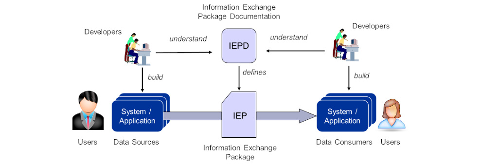
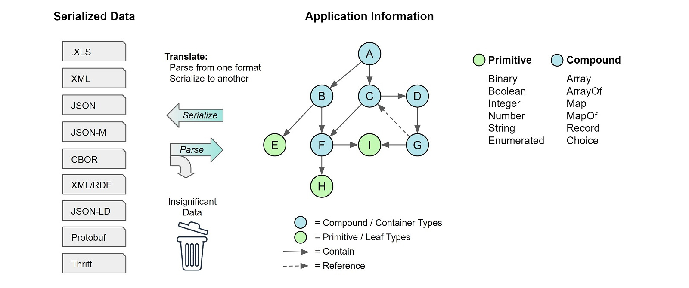
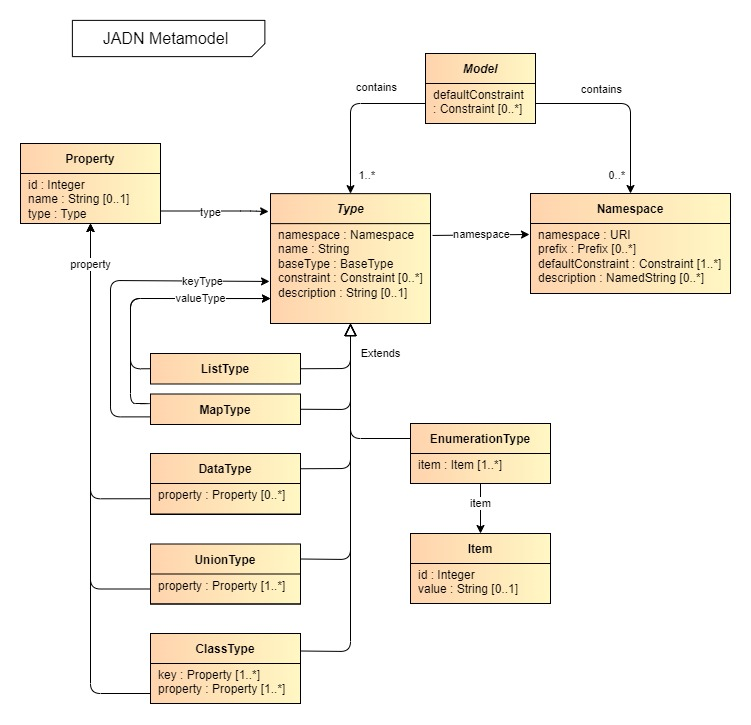

### OASIS Project Note
-------

# Understanding the NIEM Information Model

## Project Note 01

## 30 May 2023

&nbsp;

#### This stage:

[links]()

#### Previous stage:
N/A

#### Latest stage:
[links]()

#### Open Project:
[NIEM Technical Architecture Committee (NTAC) of the OASIS NIEMOpen OP](http://www.niemopen.org/)

#### Project Chair:
Katherine Escobar (katherine.b.escobar.civ@mail.mil), [Joint Staff J6](https://www.jcs.mil/Directorates/J6-C4-Cyber/)

#### NTAC Committee Chairs:
Jim Cabral (jim.cabral@infotrack.com), [InfoTrack US](https://www.infotrack.com/) 
Scott Renner (sar@mitre.org), [MITRE](https://www.mitre.org/)

#### Editors:
David Kemp (d.kemp@cyber.nsa.gov), [NSA-CCC](https://www.nsa.gov/About/Cybersecurity-Collaboration-Center/)

#### Related work:

*Is there any??*

#### Abstract:
This document extends ["Understanding the NIEM Technical Architecture"](../tech-arch-v1.0-pn02/tech-arch-v1.0-pn02.md)
by describing information modeling, comparing it with the objectives and assumptions of the 
technical architecture in NIEM 5 and proposing it to supplement the NTAC's future direction.
An information model defines the state used by NIEM applications accompanied by a set of
business-domain-independent mechanisms for communicating state between applications.

#### Status:
This is a Non-Standards Track Work Product. The patent provisions of the OASIS IPR Policy do not apply.

This document is a working draft.  It has not been approved by the Project Governing Board of the OASIS NIEMOpen OP.

Comments on this work can be provided by opening issues in the project repository or by sending email
to the project's public comment list: niemopen@lists.oasis-open-projects.org.
List information is available at https://lists.oasis-open-projects.org/g/niemopen.

#### Citation format:
When referencing this document the following citation format should be used:

**[Understanding-NIEM-Information-Model-v1.0]**

_Understanding the NIEM Information Model_.  Edited by David Kemp, 30 May 2023.
OASIS Project Note 01. [links]()

#### Notices
Copyright &copy; OASIS Open 2023. All Rights Reserved.

Distributed under the terms of the OASIS [IPR Policy](https://www.oasis-open.org/policies-guidelines/ipr/).

For complete copyright information please see the full Notices section in an Appendix below.

-------

# Table of Contents
[[TOC will be inserted here]]

-------

# 1 Introduction


## 1.1 Glossary

### 1.1.1 Definitions of terms

- **NIEMOpen** (or **NIEM**) refers to the NIEM Open Project
- **NIEM** followed by a version number (e.g., NIEM 6.0) refers tp a reference data model and related specifications.
- The NIEM **Core** refers to the content of the reference data model that is not associated with a specific Domain.
- A NIEM **Domain** refers to content of the reference data model that is associated with a specific segment of government or industry.

### 1.2.2 Acronyms and abbreviations

- **CMF**: Common Model Format
- **CTAS**: Conformance Target Attribute Specification
- **JADN**: JSON Abstract Data Notation
- **NMO**: NIEM Management Office TSC
- **NBAC**: NIEM Business Architecture Committee TSC
- **NTAC**: NIEM Technical Architecture Committee TSC
- **NTA**: NIEM Technical Architecture Project Note
- **PGB**: Project Governing Board
- **TSC**: Technical Steering Committee

Note: NIEM is not an acronym

## 1.2 Information Modeling

The NIEM interoperability diagram provides the context for distinguishing
between data and information modeling:



As the diagram shows, users accomplish their mission by interacting with applications
through user interfaces, while applications communicate with other applications
by exchanging messages. Data models define the content of messages while information
models define the application state (information) needed to support user interface
requirements.


Application information is independent of the data formats used to communicate it;
messages are serialized representations of that information. This is equivalent
to saying that messages can be losslessly converted among all supported
data formats, which allows a message to be displayed in a verbose format such as
XML or JSON that is meaningful to developers but communicated among applications
using using a performance-optimized format such as CBOR, Avro, Protobuf or Thrift.

-----

# 2 NIEM technical architecture

These are the assumptions and goals of the NIEM technical architecture through NIEM 5.0,
along with the differences that arise when using an information model:

1. **Contract-based machine-to-machine data interoperability**: as described in the NTA.
2. **Reuse of definitions from community-agreed data models**: as described in the NTA,
substituting *information models* for *data models*.
3. **XSD as a data model formalism**: the JADN information model formalism captures all the XSD
constraints necessary for applications achieve their goals and requirements but does not necessarily replicate the
exact data objects defined by XSD. JADN can support both multiple "styles" of XML and type-specific serialization
options, but the latter is in general contrary to the goal of abstraction. Where byte-for-byte backward compatibility
with NIEM 5.0 XML data is a requirement, an XSD data model may be needed in addition to a format-agnostic information model.
4. **One modeling formalism, two kinds of data model**: as described in the NTA. Both permissive (reference)
and restrictive (message) information models can be defined, and an information model can be defined as the
intersection of two sub-models to assist developers in ensuring a strict subset relationship between them.
5. **Automated validation of NIEM XSD and XML**: the JADN language natively supports validation of type and 
property names. NDR requirements beyond that may require additional tool development. 
6. **NIEM data is self-describing**: An information model formally defines equivalence between multiple data models,
some of which may be self-describing. This allows information to be optimized for machine-to-machine performance
while also being represented in a readable format for human consumption. The information model can include links
to XSD component definition URIs in type definitions without including those URIs in message data.
7. **Developers have the data exchange specification**: as described in the NTA.
8. **Compact serialization is supported**: The purpose of information modeling is to support equivalence between
multiple data representations. Both uncompressed XML and EXI representations are possible, as are purpose-built
machine-optimized formats which are intended to be more efficiently processed as well as more compact.
JADN currently defines both verbose and concise JSON formats, though the latter may be applied more
as an illustration of machine optimization principles than as a production message format.
9. **Version architecture supports independent change**: as described in the NTA.
10. **NIEM XSD and XML has an RDF expression**: as in bullet 6, information type definitions can include URI links
to [ontology nodes](https://www.w3.org/TR/2012/REC-owl2-overview-20121211/), whether the triples are represented
in XML/RDF, JSON-LD, Turtle, or another ontology syntax.
11. **NIEM JSON also has an RDF expression**: the information modeling approach explicitly isolates message data
from ontology by keeping the linkage in the reference model.
In this way it applies to all data formats, not just those with a specific "linked data" dialect.
But a JSON-LD message format can be defined along with simple JSON and machine-optimized JSON if desired.

-----

# 3 **NTAC progress after NIEM 5**



The next section describes the work of the NTAC after the publication of NIEM 5 and before the formation of the OASIS NIEMOpen project.

## 3.1 Metamodel and Common Model Format (CMF)

The existing NIEM community is accustomed to working with NIEM models in XSD.
They will need XSD modeling in NIEM 6.  However, XSD is not a natural modeling
formalism for developers who are not working in XML.  To support those developers,
the NTAC set out to design an additional, technology-neutral modeling formalism
equivalent to NIEM XSD.  

The first step was to create an abstract model of the information captured in NIEM XSD.
This model of NIEM models is the *NIEM metamodel*, depicted below as a UML diagram:


## 3.2 Information Model

Another technology-neutral modeling approach is to model the information used
by applications rather than generalizing NIEM XSD to additional data formats.


## 3.3 Information Metamodel



| JADN Type          | Metamodel Type      |
|--------------------|---------------------|
| ArrayOf            | ListType            |
| MapOf              | MapType             |
| Array, Map, Choice | DataType, ClassType |
| Choice             | UnionType           |


To illustrate the difference, consider a data sample from the (non-NIEM)
[GPS Exchange Format](https://en.wikipedia.org/wiki/GPS_Exchange_Format):
```xml
  <trk>
    <name>Example GPX Document</name>
    <trkseg>
      <trkpt lat="47.644548" lon="-122.326897">
        <ele>4.46</ele>
        <time>2009-10-17T18:37:26Z</time>
      </trkpt>
      <trkpt lat="47.644548" lon="-122.326897">
        <ele>4.94</ele>
        <time>2009-10-17T18:37:31Z</time>
      </trkpt>
    </trkseg>
  </trk>
```
While XSD specifies the structure of a GPS track in terms of XML track point elements with
lat/long attributes and enclosed elevation and time elements, an information model defines
the minimum *information* necessary for applications to understand and display tracks:

* a track is a named list of track segments
* a track segment is a list of track points
* a track point is a set of latitude, longitude, elevation and time
(assume for illustration that elevation is not always available)


```
Trk = Record                        // GPS Track
  1 name      String
  2 trkseg    ArrayOf(Trkseg)

TrkSeg = ArrayOf(TrkPt)             // Track Segment

TrkPt = Record                      // Track Point
  1 time      Time
  2 lat       Latitude
  3 lon       Longitude
  4 ele       Number optional       // Elevation in meters

Latitude = Number{-90..90}
Longitude = Number{-180..180}
Time = Integer /time                // Seconds since midnight before Jan 1, 1970
```


The second step was to design a NIEM data exchange specification for the metamodel.  The result is the *Common Model Format*, a NIEM message specification for NIEM models.  A model in CMF is a NIEM message.  It has an exact equivalent in NIEM XSD, and can be serialized as NIEM XML or NIEM JSON.  For example, the XSD schema fragment for `nc:PersonName` above looks like this in CMF XML
```
<Property s:id="nc.PersonNamee">
  <Name>PersonNamee</Name>
  <Namespace s:ref="nc" xsi:nil="true"/>
  <DefinitionText>A combination of names and/or titles by which a person is known.</DefinitionText>
  <Class s:ref="nc.PersonNameType" xsi:nil="true"/>
</Property>
```
There is a [more detailed description of CMF and the metamodel](https://www.niem.gov/strategic-initiatives/niem-metamodel-and-common-model-format) at the niem.gov site.

## 3.2 Simplified property names

Component names in NIEM data models SHOULD follow the example of ISO 11179-5, Annex A, and all of the names in the NIEM model do so.  Names such as `PersonFullName` and `AircraftFuselageColorCode` are suitable when forming a shared understanding within a large community.  However, software developers working on a particular project will often prefer simpler names, such as `pname` or `ACcolor`.  NIEM 6 may permit a message specification designer to provide a mapping between simple and canonical property names, and with this mapping, to specify a simple message format having the same RDF interpretation as the equivalent canonical message format.  NIEM tools would then generate translation software from the mapping plus the CMF message model, with no bespoke programming required.  In this way NIEM may satsify developer desires for simpler messages while still satisfying the goals of self-describing data and RDF equivalence.

Something like this is already possible (after a fashion) with NIEM 5 JSON.  By supplying mappings in the `@context` element, the following simple and canonical NIEM JSON messages have the same RDF interpretation.  (Remember, the `@context` object does not have to be part of the message at runtime, and usually isn't.)

   ```
   {                                              | {                                 
    "@context": {                                 |  "@context": {          
     "nc": "http://release.niem.gov/niem/...",    |   "nc": "http://release.niem.gov/niem/..."
     "person": "nc:Person",                       |  },
     "pname":  "nc:PersonName",                   |  "nc:Person": {           
     "pfname": "nc:PersonFullName"                |   "nc:PersonName": {
    },                                            |    "nc:PersonFullName": "John Doe"         
    "person": {                                   |   }                                        
     "pname": {                                   |  }                                        
      "pfname": "John Doe"                        | }                                           
     }                                            |                                            
    }                                             |                                             
   }                                              |                                                 
   ```

More work is required for NIEM XML and any other supported message serialization.

## 3.3. RDF-star for relationship metadata

NIEM supports metadata in messages, both as ordinary properties and through a special metadata mechanism.  This metadata sometimes applies not to an object, but rather to the relationship between objects.  For example:

   ```
   <my:NewspaperEmployees>
    <nc:Person>
     <nc:PersonName>
      <nc:PersonFullName>Clark Kent
     </nc:PersonName>
     <nc:PersonName my:secret="true">
      <nc:PersonFullName>Superman
     </nc:PersonName>
    </nc:Person>
   </my:NewspaperEmployees>
   ```

The RDF interpretation of the attribute `my:secret` attribute as an ordinary property would look like:

   ```
   _:n1 a nc:PersonType .
   _:n1 nc:PersonName _:n2 .
   _:n1 nc:PersonName _:n3 .
   _:n2 a nc:PersonNameType .
   _:n2 nc:PersonFullName "Clark Kent" .
   _:n3 a nc:PersonNameType .
   _:n3 nc:PersonFullName "Superman" .
   _:n3 my:secret "true" .
   ```

But that's wrong.  We don't want to say that the *name* "Superman" is secret.  The secret is the *relationship* between the name "Superman" and the person who is also named "Clark Kent".  So we want to make a statement about a statement; we need a RDF triple about a triple.  As a diagram, we want

   

   instead of 

   

[RDF-star]([RDF-star and SPARQL-star (w3.org)](https://www.w3.org/2021/12/rdf-star.html)) (or RDF*) is a specification published by the W3C's *RDF-DEV Community Group* that provides better support for *reification;* that is, RDF triples about triples.  NIEM 6 uses RDF-star to represent relationship properties. In NIEM 6, the RDF-star interpretation of the NIEM XML above looks like:

   ```
   _:n1 a nc:PersonType .
   _:n1 nc:PersonName _:n2 .
   _:n1 nc:PersonName _:n3 {| my:secret "true" |} .
   _:n2 a nc:PersonNameType .
   _:n2 nc:PersonFullName "Clark Kent" .
   _:n3 a nc:PersonNameType .
   _:n3 nc:PersonFullName "Superman" .
   ```
-----

# Appendix A. Informative References

<!-- Required section -->

This appendix contains the informative references that are used in this document.

While any hyperlinks included in this appendix were valid at the time of publication, OASIS cannot guarantee their long-term validity.

(Reference sources:
For references to IETF RFCs, use the approved citation formats at: \
https://docs.oasis-open.org/templates/ietf-rfc-list/ietf-rfc-list.html. \
For references to W3C Recommendations, use the approved citation formats at: \
https://docs.oasis-open.org/templates/w3c-recommendations-list/w3c-recommendations-list.html. \
Remove this note before submitting for publication.)

-------

# Appendix B. Acknowledgments

(Note: A Work Product approved by the TSC must include a list of people who participated in the development of the Work Product. This is generally done by collecting the list of names in this appendix. This list shall be initially compiled by the Chair, and any Member of the TC may add or remove their names from the list by request.  
Remove this note before submitting for publication.)

## B.1 Special Thanks

<!-- This is an optional subsection to call out contributions from TSC members. If a TSC wants to thank non-TSC members then they should avoid using the term "contribution" and instead thank them for their "expertise" or "assistance". -->

Substantial contributions to this document from the following individuals are gratefully acknowledged:

Participant Name, Affiliation or "Individual Member"

## B.2 Participants

<!-- A TSC can determine who they list here, however, TSC Observers must not be listed. It is common practice for TCs to list everyone that was part of the TC during the creation of the document, but this is ultimately a TC decision on who they want to list and not list, and in what order. -->

The following individuals have participated in the creation of this document and are gratefully acknowledged:

**NIEM Technical Architecture Committee (NTAC) TSC Members:**

| First Name | Last Name | Company               |
|:-----------|:----------|:----------------------|
| Aubrey     | Beach     | Joint Staff J6        |
| Jim        | Cabral    | InfoTrack US          |
| Tom        | Carlson   | GTRI                  |
| Mike       | Douklias  | Joint Saff J6         |
| Katherine  | Escobar   | Joint Staff J6        |
| Mike       | Hulme     | Unisys                |
| Eric       | Jahn      | Alexandria Consulting |
| Ptere      | Madruga   | GTRI                  |
| Christina  | Medlin    | GTRI                  |
| Scott      | Renner    | MITRE                 |
| Duncan     | Sparrell  | sFractal Consulting   |
| Jennifer   | Stathakis | FBI                   |
| Stephen    | Sullivan  | BAH                   |

Update with the full TSC roster before publishing

-------

# Appendix C. Revision History
| Revision                    | Date       | Editor     | Changes Made          |
|:----------------------------|:-----------|:-----------|:----------------------|
| information-model-v1.0-pn01 | 2023-05-20 | David Kemp | Initial working draft |

------

# Appendix D. Notices

Copyright &copy; OASIS Open 2023. All Rights Reserved.

All capitalized terms in the following text have the meanings assigned to them in the OASIS
Intellectual Property Rights Policy (the "OASIS IPR Policy").
The full [Policy](https://www.oasis-open.org/policies-guidelines/ipr/) may be found at the OASIS website.

This document and translations of it may be copied and furnished to others, and derivative works
that comment on or otherwise explain it or assist in its implementation may be prepared, copied,
published, and distributed, in whole or in part, without restriction of any kind, provided that
the above copyright notice and this section are included on all such copies and derivative works.
However, this document itself may not be modified in any way, including by removing the copyright
notice or references to OASIS, except as needed for the purpose of developing any document or
deliverable produced by an OASIS Technical Committee (in which case the rules applicable to copyrights,
as set forth in the OASIS IPR Policy, must be followed) or as required to translate it into languages
other than English.

The limited permissions granted above are perpetual and will not be revoked by OASIS or its successors or assigns.

This document and the information contained herein is provided on an "AS IS" basis and OASIS DISCLAIMS
ALL WARRANTIES, EXPRESS OR IMPLIED, INCLUDING BUT NOT LIMITED TO ANY WARRANTY THAT THE USE OF THE
INFORMATION HEREIN WILL NOT INFRINGE ANY OWNERSHIP RIGHTS OR ANY IMPLIED WARRANTIES OF MERCHANTABILITY
OR FITNESS FOR A PARTICULAR PURPOSE.

The name "OASIS" is a trademark of [OASIS](https://www.oasis-open.org/), the owner and developer
of this specification, and should be used only to refer to the organization and its official outputs.
OASIS welcomes reference to, and implementation and use of, specifications, while reserving the right
to enforce its marks against misleading uses.
Please see https://www.oasis-open.org/policies-guidelines/trademark/ for above guidance.
