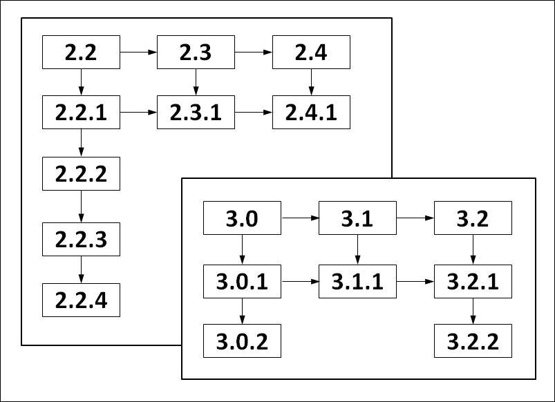
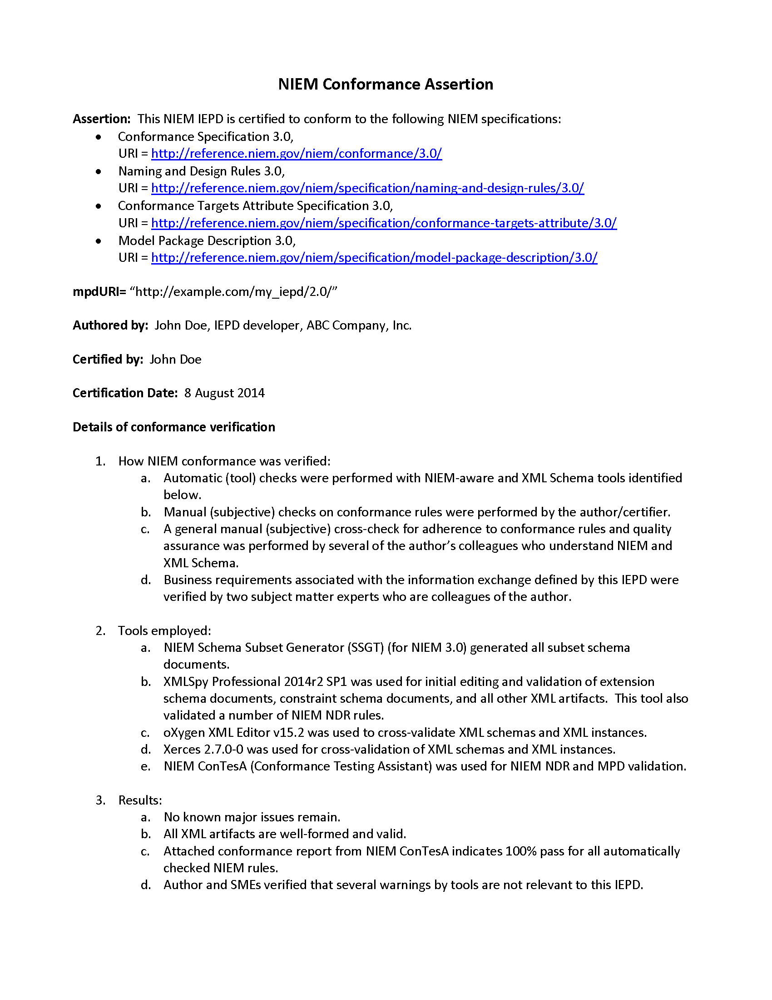

# Message Specifications Project Note 1.0

- Version 1.0
- April 10, 2023
- NIEM Technical Architecture Committee (NTAC)

# Abstract

This document specifies normative rules and non-normative guidance for building a National Information Exchange Model (NIEM) information exchange package documentation (IEPD).

# Status

This document deprecates the Model Package Description (MPD) construct as of NIEM 5.0.

This specification represents the work of the NIEM Technical Architecture Committee (NTAC), the NIEM Business Architecture Committee (NBAC), and their predecessors. It is a product of the NIEM Management Office (NMO).

Email comments on this specification to information@niem.gov or submit them via the [GitHub issue tracker](https://github.com/NIEM/MPD-Spec/issues).

# Contents

- [1. Introduction](#introduction)

	- [1.1. Background](#background)
	- [1.2. Purpose](#purpose)
	- [1.3. Scope](#scope)
	- [1.4. Audience](#audience)

- [2. Basic Concepts and Terminology](#basic-concepts-and-terminology)

	- [2.1. IETF Best Current Practice 14 terminology](#ietf-best-current-practice-14-terminology)
	- [2.2. Character Case Sensitivity](#character-case-sensitivity)
	- [2.3. Artifacts](#artifacts)
	- [2.4. Schema Document and Namespace Correspondence in NIEM](#schema-document-and-namespace-correspondence-in-niem)
	- [2.5. Namespaces Used in this Specification](#namespaces-used-in-this-specification)
	- [2.6. XML Validation](#xml-validation)
	- [2.7. Reference Schema Documents](#reference-schema-documents)
	- [2.8. Rules](#rules)

- [3. Conformance Targets](#conformance-targets)

	- [3.1. Conformance Target Terminology](#conformance-target-terminology)
	- [3.2. IEPD Conformance Targets](#iepd-conformance-targets)

		- [3.2.1. Information Exchange Package Documentation](#information-exchange-package-documentation)

			- [3.2.1.1. Well-Formed IEPD](#well-formed-iepd)

		- [3.2.2. IEP Conformance Targets](#iep-conformance-targets)
		- [3.2.3. Artifact Conformance Targets](#artifact-conformance-targets)

	- [3.3. Rule Applicability Codes for Conformance Targets](#rule-applicability-codes-for-conformance-targets)

- [4. IEPD XML Schema Document Artifacts](#iepd-xml-schema-document-artifacts)

	- [4.1. Reference Schema Documents](#reference-schema-documents)
	- [4.2. Subset Document Schemas](#subset-document-schemas)

		- [4.2.1. Basic Subset Concepts](#basic-subset-concepts)
		- [4.2.2. Constructing a Schema Document Subset](#constructing-a-schema-document-subset)

	- [4.3. Extension Schema Documents](#extension-schema-documents)
	- [4.4. External Schema Documents](#external-schema-documents)
	- [4.5. Constraint Schema Document Sets](#constraint-schema-document-sets)

- [5. IEPD Documentation Artifacts](#iepd-documentation-artifacts)

	- [5.1. NIEM IEPD Catalog](#niem-iepd-catalog)

		- [5.1.1. IEPD Catalog as a Table of Contents](#iepd-catalog-as-a-table-of-contents)
		- [5.1.2. Extending an IEPD Catalog](#extending-an-iepd-catalog)

	- [5.2. Metadata Concepts](#metadata-concepts)

		- [5.2.1. IEPD Name Syntax (`c:iepdName`)](#iepd-name-syntax-(c:iepdname))
		- [5.2.2. IEPD Conformance Target Identifier (`c:iepdConformanceTargetIdentifierURIList`)](#iepd-conformance-target-identifier-(c:iepdconformancetargetidentifierurilist))
		- [5.2.3. IEPD Version Numbering Scheme (`c:iepdVersionID`)](#iepd-version-numbering-scheme-(c:iepdversionid))
		- [5.2.4. URI Schemes](#uri-schemes)

			- [5.2.4.1. IEPD URI Scheme (`c:iepdURI`)](#iepd-uri-scheme-(c:iepduri))
			- [5.2.4.2. URI Scheme for IEPD Artifacts (`c:externalURI`)](#uri-scheme-for-iepd-artifacts-(c:externaluri))
			- [5.2.4.3. URI Scheme for Local IEPD Artifacts (`c:pathURI`)](#uri-scheme-for-local-iepd-artifacts-(c:pathuri))
			- [5.2.4.4. IEPD Relationships and Lineage (`c:resourceURI`)](#iepd-relationships-and-lineage-(c:resourceuri))
			- [5.2.4.5. Resolving an IEPD URI with a Fragment](#resolving-an-iepd-uri-with-a-fragment)
			- [5.2.4.6. URI Resolution Involving Reference Elements](#uri-resolution-involving-reference-elements)
			- [5.2.4.7. XML Catalog URI](#xml-catalog-uri)
			- [5.2.4.8. Summary of IEPD URIs](#summary-of-iepd-uris)

	- [5.3. Change Log](#change-log)
	- [5.4. ReadMe Artifact](#readme-artifact)

		- [5.4.1. Readme Content](#readme-content)

	- [5.5. XML Catalogs](#xml-catalogs)
	- [5.6. Defining Information Exchange Packages](#defining-information-exchange-packages)

		- [5.6.1. Validity Context and Constraints](#validity-context-and-constraints)
		- [5.6.2. Declaring Validity Constraints](#declaring-validity-constraints)

			- [5.6.2.1. c:ValidityConstraintWithContext](#c:validityconstraintwithcontext)
			- [5.6.2.2. c:ValidityConstraint](#c:validityconstraint)
			- [5.6.2.3. c:ValidityContext](#c:validitycontext)
			- [5.6.2.4. c:HasDocumentElement](#c:hasdocumentelement)
			- [5.6.2.5. c:ValidToXPath](#c:validtoxpath)
			- [5.6.2.6. c:XMLSchemaValid](#c:xmlschemavalid)
			- [5.6.2.7. c:SchematronValid](#c:schematronvalid)
			- [5.6.2.8. c:RelaxNGValid](#c:relaxngvalid)
			- [5.6.2.9. c:ConformsToConformanceTarget](#c:conformstoconformancetarget)
			- [5.6.2.10. c:ConformsToRule](#c:conformstorule)

		- [5.6.3. IEP Sample Instance XML Documents](#iep-sample-instance-xml-documents)

	- [5.7. Conformance Assertion](#conformance-assertion)

- [6. Optional IEPD Artifacts](#optional-iepd-artifacts)

	- [6.1. NIEM Wantlist](#niem-wantlist)
	- [6.2. Business Rules](#business-rules)

- [7. Organization, Packaging, and Other Criteria](#organization-packaging-and-other-criteria)

	- [7.1. Artifact Sets](#artifact-sets)

		- [7.1.1. Constraint on Elements of Type `c:SchemaDocumentSetType`](#constraint-on-elements-of-type-c:schemadocumentsettype)

	- [7.2. IEPD File Name Syntax](#iepd-file-name-syntax)
	- [7.3. Artifact Links to Other Resources](#artifact-links-to-other-resources)
	- [7.4. IEPD Completeness](#iepd-completeness)
	- [7.5. Duplication of Artifacts](#duplication-of-artifacts)

- [Appendix A. IEPD Catalog XML Schema Document](#appendix-a-iepd-catalog-xml-schema-document)
- [Appendix B. Example IEPD Catalog Document for Cursor on Target](#appendix-b-example-iepd-catalog-document-for-cursor-on-target)
- [Appendix C. Common IEPD Artifacts](#appendix-c-common-iepd-artifacts)
- [Appendix D. Conformance Assertion Example](#appendix-d-conformance-assertion-example)
- [Appendix E. Guidance for IEPD Directories (non-normative)](#appendix-e-guidance-for-iepd-directories-(non-normative))
- [Appendix F. Acronyms and Abbreviations](#appendix-f-acronyms-and-abbreviations)
- [Appendix G. References](#appendix-g-references)
- [Appendix H. Index of Definitions](#appendix-h-index-of-definitions)
- [Appendix I. Index of Rules](#appendix-i-index-of-rules)

# Introduction

This specification defines rules and practices for constructing and packaging a National Information Exchange Model (NIEM)_information exchange package documentation_ (IEPD). To the NIEM program, the _IEPD_ is considered the point of interoperability.

This specification assumes familiarity with NIEM, its basic concepts, architecture, processes, design rules, and general conformance rules. NIEM training and reference materials are located on the [NIEM TechHub](#Appendix-A-References). In addition to those materials, readers of this specification may wish to be familiar with the current versions of the following:

- [NIEM Conformance Specification](#Appendix-A-References)
- [NIEM Conformance Targets Attribute Specification](#Appendix-A-References)
- [NIEM Naming and Design Rules](#Appendix-A-References)
- [NIEM Code List Specification](#Appendix-A-References)
- [NIEM High-Level Version Architecture](#Appendix-A-References)

This specification uses and is a peer to the [NIEM Naming and Design Rules](#Appendix-A-References).

## Background

An _IEPD_ is a normative specification for XML _data components_ in the format of the World Wide Web Consortium (W3C) XML Schema Definition Language [W3C XML Schema Part 2 Datatypes](#Appendix-A-References), [W3C XML Schema Part 1 Structures](#Appendix-A-References). _IEPD_ schema documents define implementable NIEM exchange instance XML documents in W3C Extensible Markup Language (XML) [W3C XML 1.0](#Appendix-A-References).

An _IEPD_ is ready to publish and use when it conforms to NIEM specifications, and has been properly packaged with the schemas, documentation, and supplemental files needed to implement or reuse it. _IEPD_ content design, development, and assembly may be difficult and time-consuming, especially if done manually. Developers will often prefer to build and modify an IEPD with the help of software tools, which can significantly reduce the complexity of designing, constructing, changing, and managing IEPDs. In order to reduce ambiguity and to facilitate interoperable and effective tool support, this baseline specification imposes some degree of consistency on the terminology, syntax, semantics, and composition of IEPDs.

## Purpose

This document is a normative specification for NIEM _information exchange package documentation_ (IEPD). The rules and guidance herein are designed to encourage and facilitate NIEM use and tools by balancing consistency, simplicity, and flexibility. Consistency and simplicity make IEPDs easy to design correctly, build rapidly, and find easily (for reuse or adaptation). Consistency also facilitates tool support. Flexibility enables more latitude to design and tailor IEPDs for complex data exchange requirements. As such, this document does not necessarily prescribe mandates or rules for all possible situations or organizational needs. If an organization desires to impose additional requirements or constraints on its IEPDs beyond those specified in this document (for example, mandate that an _IEPD_ contain a normative set of business requirements or a domain model), then it is free to do so, as long as no conflicts exist with this specification or the [NIEM Naming and Design Rules](#Appendix-A-References).

This document defines terminology; identifies required and optional (but common) artifacts; defines metadata; specifies normative constraints, schemes, syntax, and processes as rules; provides non-normative guidance; and as needed, refers to other related NIEM specifications for more detail.

## Scope

This specification applies to all NIEM _information exchange package documentation_ (IEPD), and in particular it focuses on the normative rules for IEPDs.

NIEM is a data layer for an information architecture. Files in an _IEPD_ generally define XML Schema types and declare XML elements and attributes to use in payloads for information exchanges. While an _IEPD_ may also contain files from layers beyond the data layer, this specification is not intended to define details of other architectural layers. Such files are generally present only to provide additional context, understanding, or assistance for implementing the exchange of payloads.

This specification defines several incremental stages of conformance to support iterative _IEPD_ development, with conformance testing possible at each step instead of delayed to the end. Tool vendors should be able to build, adapt, and integrate software tools to assist in _IEPD_ development and assembly, from raw parts to finished product.

This specification provides a standard version numbering scheme [Section 5.2.3, _IEPD Version Numbering Scheme (`c:iepdVersionID`)_, below](#iepd-version-numbering-scheme-(c:iepdversionid)). However, it does not provide guidance for managing or processing _IEPD_ versions or their associated _information exchange packages_ (_IEPs_). Creation and management of _IEPDs_ is the responsibility of stakeholders and developers. As such, _IEPDs_ have their own versioning processes, and are managed independently of the NIEM core and domains. The NIEM Management Office defines _IEPD_ conformance, but _IEPD_ development and management fall outside its scope. Nonetheless, the NIEM Management Office has developed guidance (through the NTAC) for managing _IEPDs_, versioning _IEPDs_, and processing their associated _IEPs_. This reference material can be found at <a class="url" target="_blank" href="https://niem.github.io/reference/artifacts/messages/iepd/">https://niem.github.io/reference/artifacts/messages/iepd/</a>.

An _IEPD_ defines one or more data exchanges, each occurring in the form of an _IEP_. This specification supports a variety of data exchange use cases, in which the _IEP_ may be:

- An XML document with a NIEM-defined XML document element.
- An XML document with a NIEM-defined payload element wrapped inside a non-NIEM envelope element (for example, SOAP, [Logical Entity Exchange Specifications](#Appendix-A-References) (LEXS), Trusted Data Format (TDF), or an OGC Web Service document element).
- Multiple NIEM-defined payloads packaged together in a single document.

IEPD developers are not required to revise IEPDs that existed before this specification becomes effective. However, they are always encouraged to consider revising an IEPD to meet this specification, especially when making other significant changes.

## Audience

The following groups should review and be familiar with this specification:

- NIEM _IEPD_ developers, reviewers, individuals or groups responsible for approving IEPDs, and implementers.
- NIEM-aware tool developers.

# Basic Concepts and Terminology

The section defines and discusses baseline terms and concepts that will be used throughout this document. Presentation in this section is sequenced for understanding. Each subsection builds upon previous ones.

## IETF Best Current Practice 14 terminology

The key words MUST, MUST NOT, SHALL, SHALL NOT, SHOULD, SHOULD NOT, MAY, RECOMMENDED, REQUIRED, and OPTIONAL in this document are to be interpreted as described in [BCP 14](#Appendix-A-References) [RFC 2119](#Appendix-A-References) [RFC 8174](#Appendix-A-References).

## Character Case Sensitivity

This specification imposes many constraints on the syntax for identifiers, names, labels, strings, etc. In all cases, unless otherwise explicitly noted, syntax is case sensitive. In particular, XML files in appendices that define particular artifacts, transformations, and examples are case sensitive.

Also, note that as a general principle, lower case characters are used whenever such will not conflict with the [NIEM Naming and Design Rules](#Appendix-A-References).

## Artifacts

IEPDs are generally composed of files and file sets grouped for a particular purpose. Each file is referred to as an _artifact_, and each logical set of such files is called an _artifact set_.

> **[Definition: artifact]**
> A single file with a defined purpose.

> **[Definition: artifact set]**
> A collection of artifacts logically grouped for a defined purpose.

An _IEPD_ is itself an _artifact set_, the purpose for which is to define and document the intended use of the _IEPD_. While the key _IEPD_ artifacts are its _XML schema document_ artifacts, there are also other kinds of _IEPD_ artifacts. These may include (but are not limited to) HTML, XSLT, text, or graphic files used for human-readable documentation. An _IEPD_ may also have artifacts intended to help assist in or accelerate the use and implementation of the _IEPD_. For example, these may be XML, UML, or binary files that are inputs to or outputs from software tools used to build, generate, or edit the _IEPD_ or its schema document artifacts. [Appendix C, _Common IEPD Artifacts_, below,](#appendix-c-common-iepd-artifacts) contains a listing of mandatory and common optional artifacts for IEPDs. Common types of artifacts are described in more detail in subsequent sections. [Section 7.1, _Artifact Sets_, below,](#artifact-sets) discusses the different methods for grouping _IEPD_ artifacts into sets.

## Schema Document and Namespace Correspondence in NIEM

To simplify automatic schema processing and reduce the potential for confusion and error, [NIEM Naming and Design Rules](#Appendix-A-References) principles state that each NIEM-conformant namespace SHOULD be defined by exactly one reference or extension schema document. To support this concept, the [NIEM Naming and Design Rules](#Appendix-A-References) disallows the use of `xs:include`, and mandates the use of the `xs:schema/@targetNamespace` attribute in NIEM-conformant schema documents.

So, (1) each NIEM namespace is defined by a single NIEM-conformant schema document, and (2) each NIEM-conformant schema document declares a target namespace. NIEM does not permit schema documents without target namespaces, unless they are from sources outside of NIEM (e.g., an _external schema document_).

## Namespaces Used in this Specification

The following namespaces are referenced and used in this specification:

## Figure 2-1: Namespaces Used

> ```
> c           http://reference.niem.gov/niem/resource/iepd/catalog/5.0/
> er          urn:oasis:names:tc:entity:xmlns:xml:catalog
> nc          http://release.niem.gov/niem/niem-core/5.0/
> structures  http://release.niem.gov/niem/structures/5.0/
> xs          http://www.w3.org/2001/XMLSchema
> ```

## XML Validation

A discussion of XML validation requires an understanding of basic XML terminology. The following definitions are necessary.

> **[Definition: XML document]**
> A document in XML format.
> 
> (as defined by [W3C XML 1.0](#Appendix-A-References), [ §2, "Documents"](http://www.w3.org/TR/2008/REC-xml-20081126/#dt-xml-doc))

> **[Definition: schema component]**
> The generic term for the building blocks that comprise the abstract data model of a schema.
> 
> (as defined by [W3C XML Schema Part 1 Structures](#Appendix-A-References), [ §2.2, "XML Schema Abstract Data Model"](http://www.w3.org/TR/2004/REC-xmlschema-1-20041028/#key-schema))

> **[Definition: XML Schema]**
> A set of schema components.
> 
> (as defined by [W3C XML Schema Part 1 Structures](#Appendix-A-References), [ §2.2, "XML Schema Abstract Data Model"](http://www.w3.org/TR/2004/REC-xmlschema-1-20041028/#key-schema))

> **[Definition: XML schema validation]**
> The process of checking an _XML document_ to confirm that it is both _well-formed_ (as defined by [W3C XML 1.0](#Appendix-A-References), [ §2.1, "Well-Formed XML Documents"](http://www.w3.org/TR/2008/REC-xml-20081126/#sec-well-formed)) and _valid_ (as defined by [W3C XML Schema Part 1 Structures](#Appendix-A-References), [ §2.3, "Constraints and Validation Rules"](http://www.w3.org/TR/2004/REC-xmlschema-1-20041028/#concepts-schemaConstraints)), in that it follows the structure defined by an associated _XML Schema_. A well-formed document follows the syntactic rules of XML, which are the same for all XML documents.

> **[Definition: XML schema document]**
> A physical (file) representation of part or all of an _XML Schema_. One or more _XML schema documents_ are used to assemble _schema components_ into an _XML Schema_.

> **[Definition: XML schema assembly]**
> A process that uses _XML schema documents_ to identify the constituent _schema components_ for an _XML Schema_, and correctly sequences and structures these components to construct a single entity, the _XML Schema_.

In other words, an _XML Schema_ is the result of _XML schema assembly_, i.e., processing a set of one or more _XML schema documents_ into a single conceptual entity. That entity is most commonly substantiated as an electronic image in the memory of a computer.

This specification often refers to the process of _XML schema validation_, that is, validation of an instance XML document to confirm it adheres to the structure defined by a particular _XML Schema_. Generally, this should occur periodically during and after design time to ensure the conformance and quality of an information exchange definition (i.e., _XML schema documents_) and associated instance XML documents. However, local architecture or policy may dictate the need to validate more often, and in some cases may even require runtime validation. To be clear, NIEM conformance does not require that instance documents be validated at runtime.

XML schema document sets that define a NIEM information exchange must be authoritative. Application developers may use other schemas (e.g., constraint or Schematron schema documents) for various purposes, but for the purposes of determining NIEM conformance, the authoritative reference schema documents (NIEM releases) are relevant. This does not mean that XML validation must be performed on all instance XML documents as they are served or consumed; only that the instance XML documents validate if and when XML validation is performed. Therefore, even when validation is not performed, instance XML documents must be valid against the XML schema that is assembled from XML schema document sets that specify these instance XML documents.

## Reference Schema Documents

> **[Definition: reference schema document]**
> 
> As defined by [NIEM Naming and Design Rules](#Appendix-A-References):
> 
>> An _XML schema document_ that is intended to provide the authoritative definitions of broadly reusable _schema components_.

A NIEM _reference schema document_ is an _XML schema document_ that is intended to be the authoritative definition schema for a namespace. Examples include NIEM Core and NIEM domains. A reference schema document meets all of the following criteria:

- It is a NIEM conformant schema document.
- It is explicitly designated as a reference schema document by its own conformance targets attribute. This can be declared by an _IEPD catalog document_ or by a tool-specific mechanism outside the schema document.
- It provides the broadest, most fundamental definitions of _data components_ in its namespace.
- It provides the authoritative definition of business semantics for _data components_ in its namespace.
- It is intended to serve as a basis for components in _IEPD_ schema documents, including _schema document subsets_, _constraint schema document sets_, and _extension schema documents_.

> **[Definition: reference schema document set]**
> A set of related _reference schema documents_, such as a NIEM release.

The [NIEM Naming and Design Rules](#Appendix-A-References) conformance rules for reference schema documents are generally stricter than those for other classes of NIEM-conformant schema documents. For example, _reference schema documents_ are not allowed to employ particular XML Schema model groups such as `xs:choice` or `xs:any` that other schema documents may contain.

NIEM reference schemas are very uniform in their structure. As they are the primary definitions for _data components_, they do not need to restrict other data definitions, and so they are not allowed to use XML Schema’s complex type restriction mechanisms.

> **[Definition: data component]**
> An XML Schema type or attribute group definition; or an XML Schema element or attribute declaration.

## Rules

Rules define specific constraints on artifacts or on the interpretation of artifacts. The classes of artifacts are identified by _conformance targets_ that are enumerated by this document in [Section 3, _Conformance Targets_, below](#conformance-targets). Rules are normative.

> **[Rule &lt;section&gt;-&lt;number&gt;] (&lt;applicability&gt;) (&lt;class&gt;)**
> An enforceable rule for NIEM.

Each rule has a classification, which is either _Constraint_ or _Interpretation_. These terms are defined below:

> **[Definition: constraint rule]**
> A rule that sets a requirement on an artifact with respect to its conformance to a _conformance target_.

> **[Definition: interpretation rule]**
> A rule that sets the methodology, pattern, or procedure for understanding or using some aspect of an instance of a conformance target.

Each rule may apply to one or more _conformance targets_. Each rule lists its applicable _conformance target(s)_ encoded per _Table 3-1, _Rule Applicability Codes_, below_. The conformance targets for this specification are detailed in [Section 3, _Conformance Targets_, below](#conformance-targets).

Rules are numbered according to the section in which they appear and the order in which they appear within that section. For example, Rule 4-1 is the first rule in Section 4.

# Conformance Targets

This section introduces _conformance targets_, a concept fundamental to understanding the normative rules defined in this specification. This section also defines and explains _conformance targets_ used in this specification.

There are several purposes for defining conformance targets in NIEM specifications. A _conformance target_ establishes and identifies a class of artifact associated with a set of rules. Based on these rules, tools and operations may be developed to process or use these artifacts consistently.

Conformance targets also satisfy a need to ensure developers do not conform to NIEM in name only. Once committed to using NIEM, developers and organizations need well-defined conformance targets and rules to know exactly how to conform. Funding agencies require conformance targets that correspond to interoperability goals. An agency that is funding development of a set of systems will need to ensure it funds the development of NIEM-conformant IEPDs that support the exchange of NIEM-conformant IEPs. Tools and system developers need conformance targets that identify real world requirements corresponding to their use cases and tool capabilities. Many of these tools have not yet been developed. Therefore, this specification attempts to cover a broad range of general use cases.

## Conformance Target Terminology

[NIEM Conformance Targets Attribute Specification](#Appendix-A-References) defines two terms used normatively and often within this specification.

> **[Definition: conformance target]**
> 
> As defined by [NIEM Conformance Targets Attribute Specification](#Appendix-A-References):
> 
>> A class of artifact, such as an interface, protocol, document, platform, process or service, that is the subject of conformance clauses and normative statements. There may be several conformance targets defined within a specification, and these targets may be diverse so as to reflect different aspects of a specification. For example, a protocol message and a protocol engine may be different conformance targets.

> **[Definition: conformance target identifier]**
> 
> As defined by [NIEM Conformance Targets Attribute Specification](#Appendix-A-References):
> 
>> An internationalized resource identifier [RFC 3987 IRI](#Appendix-A-References) that uniquely identifies a conformance target.

It will also be useful to define _IEPD conformance target identifier_.

> **[Definition: IEPD conformance target identifier]**
> A _conformance target identifier_ to which a given _IEPD_ claims to conform.

## IEPD Conformance Targets

This specification establishes three primary _IEPD_      _conformance targets_: _information exchange package documentation_, _information exchange package_ and _artifact_.

### Information Exchange Package Documentation

> **[Definition: information exchange package documentation]**
> An _information exchange package documentation_ is a set of _artifacts_ (possibly in a ZIP file) that:
> 
> - includes a set of logically cohesive W3C XML Schema documents and other supporting files, that represent one or more reusable or implementable XML information models, and
> - has an IEPD _conformance target identifier_          `http://reference.niem.gov/niem/specification/iepd/5.0/#IEPD`, and
> - conforms to all the rules in this specification for the conformance target _information exchange package documentation_ (i.e., applicability code "IEPD"), and
> - is well-formed (conforms to all the rules with applicability code "WF-IEPD").
> 
> This term may be abbreviated "IEPD". Rules specifying this conformance target use the applicability code "IEPD".

An _IEPD_ has one or more `c:IEPConformanceTarget` elements within its _IEPD catalog document_, each defining a class of _information exchange packages_ (IEP), in which each _IEP_ is an _instance XML document_.

> **[Definition: instance XML document]**
> An _instance XML document_ is an _XML document_ that is valid against an _XML Schema_. An _instance XML document_ is said to be an instance of the schema to which it validates.

An IEPD also defines one or more data exchanges, one per _conformance target_. Each data exchange occurs at runtime in the form of an _instance XML document_, which is an _IEP_ that conforms to the rules defined in the `c:IEPConformanceTarget` element.

An _IEPD_ contains a NIEM-conformant XML schema document set that may include portions of a NIEM core schema document (and supplements), portions of NIEM Domain schema documents (and updates), and enterprise-specific or IEPD-specific _extension schema documents_. The _XML schema documents_ contained in an _IEPD_ work together to define one or more classes of _instance XML documents_ that consistently encapsulate data for meaningful information exchanges. Any _instance XML document_ that is valid for the _XML schema document_ set and that satisfies the conditions of the _IEP conformance target_ is a member of that _IEP conformance target_ class (or IEP Class).

_XML schema documents_ in an _IEPD_ conform to the [NIEM Naming and Design Rules](#Appendix-A-References) and may use or extend data component definitions drawn from NIEM. An _IEPD_ may also incorporate and use XML schema documents from other standards that do not conform to NIEM. (See the current [NIEM Naming and Design Rules](#Appendix-A-References) for details.) An _IEPD_ consists of a set of artifacts (XML schema documents, documentation, sample instance XML documents, etc.) that together define and describe one or more implementable data exchanges. An _IEPD_ should contain all materials necessary to:

- Understand information exchange context, content, semantics, and structure.
- Create and validate XML documents defined by the _IEPD_, and used for information exchanges.
- Identify the lineage of the _IEPD_ itself and optionally its artifacts.

(The terms _information exchange package_ (IEP) and _information exchange package documentation_ (IEPD) first appeared in [FEA Data Reference Model 1.0](#Appendix-A-References) and [GJXDM IEPD Guidelines 1.1](#Appendix-A-References), respectively.)

The following rule applies to all IEPDs:

#### Rule 3-1. IEPD conformance target identifier

> **[Rule 3-1] (<a href="#conformance_target_IEPD">IEPD</a>) (Constraint)**
> An _IEPD_ MUST have an _IEPD conformance target identifier_ of `http://reference.niem.gov/niem/specification/iepd/5.0/#IEPD` as a value of its `c:iepdConformanceTargetIdentifierURIList` attribute.

How to declare validity constraints for one or more IEP classes within an _IEPD_ will be covered in more depth in [Section 5.6, _Defining Information Exchange Packages_, below](#defining-information-exchange-packages).

Note that NIEM conformance does not require that an IEP be native XML on the transmission medium. A NIEM-conformant IEP may be encrypted, compressed (e.g., using [PKZIP](#Appendix-A-References), [EXI Format 1.0](#Appendix-A-References), etc.), or wrapped within an envelope mechanism, as long as its original native XML form can be retrieved by the receiver.

Common to _IEPDs_:

- Requires a `readme` artifact.
- Its _XML schema document_ set defines data exchanges (_information exchange packages_ or IEPs).
- Can contain subset, extension, external, or constraint schema documents.
- Must declare at least one or more _IEP conformance targets_.
- Contains sample instance XML documents that validate to each XML schema document set.

#### Well-Formed IEPD

An _IEPD_ may be constructed manually, but it is far more efficient to generate an IEPD entirely or in part using NIEM-aware software tools. The existence of an _information exchange package documentation_        _conformance target_ has several advantages:

- Facilitates the existence of many incremental states from start to finish that are checkpoints for well-formedness.
- Enables multiple paths to completion; no single pre-determined sequence of rule applications is required.
- Provides tool developers with the flexibility to construct an _IEPD_ incrementally in many different sequences.
- Avoids a need to build a complete _IEPD_ before automated correctness checks can be applied (since well-formedness can be checked at many stages of development).
- Facilitates the interoperability and use of multiple tools that can export/import an _information exchange package documentation_.

Because an IEPD is always a directory tree, for the purpose of transporting, up/downloading, and archiving for long term storage, an IEPD is packaged as a _ZIP file_.

> **[Definition: ZIP file]**
> 
> As defined by [PKZIP](#Appendix-A-References), which states that it defines:
> 
>> ... a cross-platform, interoperable file storage and transfer format ... used to aggregate, compress, and encrypt files into a single interoperable container.

All IEPDs share several commonalities; each IEPD:

- Is a set of _artifacts_, whose principal content is _XML schema documents_ (XSD), the purpose for which is to define the exchanges themselves.
- Requires a self-documenting `iepd-catalog.xml` artifact containing metadata and a listing of its key artifacts. This artifact establishes identification metadata, _conformance targets_, purpose, general content, lineage, and other metadata.
- Requires the following metadata:
	- Uniform Resource Identifier (URI) (See [Section 5.2.4.1, _IEPD URI Scheme (`c:iepdURI`)_, below](#iepd-uri-scheme-(c:iepduri)))
	- Name (See [Section 5.2.1, _IEPD Name Syntax (`c:iepdName`)_, below](#iepd-name-syntax-(c:iepdname)))
	- Version number (See [Section 5.2.3, _IEPD Version Numbering Scheme (`c:iepdVersionID`)_, below](#iepd-version-numbering-scheme-(c:iepdversionid)))
	- The _conformance target identifier_           `http://reference.niem.gov/niem/specification/iepd/5.0/#IEPD` (See [Section 5.2.2, _IEPD Conformance Target Identifier (`c:iepdConformanceTargetIdentifierURIList`)_, below](#iepd-conformance-target-identifier-(c:iepdconformancetargetidentifierurilist)))
- Contains a copy of (not just URLs or references to) all schema documents needed to validate any _instance XML document_ class it defines.
- May contain optional alternate representations in addition to XML Schema (e.g., generic diagram, UML/XMI, database format, spreadsheet, etc.).
- May contain miscellaneous other documentation or file artifacts for assisting with usage or implementation.

> **[Definition: well-formed IEPD]**
> 
> A _well-formed IEPD_ is an _IEPD_ that:
> 
> - has an _IEPD conformance target identifier_ of `http://reference.niem.gov/niem/specification/iepd/5.0/#WF-IEPD`, and
> - adheres to all the rules within this specification for the _well-formed IEPD_  _conformance target_ (i.e., applicability code "WF-IEPD").
> 
> This term may be abbreviated "WF-IEPD". Rules specifying this conformance target use the applicability code "WF-IEPD".

A _well-formed IEPD_ satisfies the need for a set of _artifacts_ (or a _ZIP file_) with an _IEPD catalog document_ that validates to the IEPD catalog schema, and contains no broken links to local artifacts it references. This definition enables a developer to build an _IEPD_ by iteratively adding artifacts and expanding the IEPD catalog to reference them.

Most rules in this _IEPD_ specification are applicable to a _well-formed IEPD_ _conformance target_. Rules for this conformance target are less concerned with the correct use of NIEM and completeness, and more concerned with proper format, proper structure (e.g., link integrity), and correct use of artifacts. Adherence to these rules can produce an _IEPD_ that is well-formed (WF-IEPD), but that does not necessarily satisfy all general and specific requirements for an _IEPD_. The following rule ensures that a complete _IEPD_ adheres to all applicable NIEM conformance rules.

##### Rule 3-2. IEPD is well-formed

> **[Rule 3-2] (<a href="#conformance_target_WF-IEPD">WF-IEPD</a>) (Constraint)**
> An _IEPD_ MUST have an _IEPD conformance target identifier_ of `http://reference.niem.gov/niem/specification/iepd/5.0/#WF-IEPD`.

The schemas and other files within an _information exchange package documentation_ are built on other specifications, including:

- [NIEM Naming and Design Rules](#Appendix-A-References)
- [NIEM Conformance Targets Attribute Specification](#Appendix-A-References)
- [NIEM Conformance Specification](#Appendix-A-References)

### IEP Conformance Targets

In NIEM, an information exchange instance is an _information exchange package_ (IEP). An IEP is also a _conformance target_ and in that connotation is defined as follows:

> **[Definition: information exchange package]**
> An _instance XML document_ that conforms to the conformance target defined by a `c:IEPConformanceTarget` element in the _IEPD catalog document_ of an _information exchange package documentation_.
> 
> This term may be abbreviated "IEP". Rules specifying this conformance target use the applicability code "IEP".

The definition of an _information exchange package_ conformance target does not ensure that an _IEP_ uses NIEM-defined elements for its information content. That is the function of the _full NIEM IEP_       _conformance target_, defined as follows:

> **[Definition: full NIEM information exchange package]**
> An _information exchange package_ that satisfies all the validity constraints for its class as defined by an _information exchange package documentation_, and that has an XML document element that is declared in either a NIEM reference or extension schema document.
> 
> This term may be abbreviated "full NIEM IEP". Rules specifying this conformance target use the applicability code "FN-IEP".

### Artifact Conformance Targets

Conformance targets that correspond to artifacts internal to an _IEPD_ include:

- _schema document subset_ (rule applicability code: Schema-subset)
- _IEPD catalog document_ (rule applicability code: IEPD-catalog)
- _XML catalog document_ (rule applicability code: XML-catalog)

## Rule Applicability Codes for Conformance Targets

The table below lists the codes that represent standard _conformance targets_ used in this specification and that appear in the applicability attribute for each rule.

### Table 3-1: Rule Applicability Codes

| Conformance Target                         | Rule Applicability Code |
| ------------------------------------------ | ----------------------- |
| information exchange package documentation | IEPD                    |
| well-formed IEPD                           | WF-IEPD                 |
| information exchange package               | IEP                     |
| full NIEM IEP                              | FN-IEP                  |
| schema document subset                     | Schema-subset           |
| IEPD catalog document                      | IEPD-catalog            |
| XML catalog document                       | XML-catalog             |

# IEPD XML Schema Document Artifacts

_XML schema document_ artifacts are the essential content of IEPDs because they normatively define and declare _data components_. The purpose of an _IEPD_ is determined by the _XML schema document_ or document set(s) it contains; furthermore, each _ XML schema document_ may have a different purpose. The [NIEM Naming and Design Rules](#Appendix-A-References) addresses some schema documents as _conformance targets_ including reference schema documents, extension schema documents, and schema document sets. Each conformance target may adhere to a different (though possibly overlapping) set of conformance rules. Consult the current [NIEM Naming and Design Rules](#Appendix-A-References) for these rules. NIEM also employs a special technique that relies on _constraint schema document sets_ (See [Section 4.5, _Constraint Schema Document Sets_, below](#constraint-schema-document-sets)).

The following subsections define each type of NIEM schema document and document set.

## Reference Schema Documents

Though not common, it is valid to use a _reference schema document_ or document set within an _IEPD_. The _reference schema document_ and _reference schema document set_ were defined earlier in [Section 2.7, _Reference Schema Documents_, above](#reference-schema-documents).

## Subset Document Schemas

### Basic Subset Concepts

A NIEM _schema document subset_ is a set of XML schema documents that constitutes a reduced set of components derived from a NIEM reference schema document or document set associated with a given numbered release or domain update.

> **[Definition: schema document subset]**
> An XML schema document set based on a reference schema document set for which any _instance XML document_ valid to the schema document subset is also valid to the reference schema document set.

The primary purpose for a schema document subset is to reduce and constrain the scope and size of a full NIEM reference schema document set for use within an _IEPD_. A schema document subset is derived from a reference schema document set (such as a NIEM release) by applying subset operations (See [Section 4.2.2, _Constructing a Schema Document Subset_, below](#constructing-a-schema-document-subset)). Also, note that employing a subset of a reference schema document set within an _IEPD_ is optional; it is completely valid to reuse NIEM reference schema documents as-is within IEPDs.

The fundamental rule for a valid NIEM schema document subset is formally stated follows:

#### Rule 4-1. Fundamental NIEM Subset Rule

> **[Rule 4-1] (<a href="#conformance_target_Schema-subset">Schema-subset</a>) (Constraint)**
> A schema document subset (`$SUBSET`) for a given reference schema document set (`$REFERENCE`) MUST be defined such that for all instance XML documents (`$XML`), where `$XML` is valid to `$SUBSET`, `$XML` is valid to `$REFERENCE`.

A _schema document subset_ is composed of _XML schema documents_. A _schema document subset_ can essentially be a _reference schema document set_ (i.e., a NIEM release) that has been modified by applying subset operations to support business requirements represented in an _IEPD_. A subset derived from a reference schema document set may differ from that reference such that its content has been reduced and/or constrained.

> **[Definition: subset schema document]**
> An XML schema document that meets all of the following criteria:
> 
> - It is built from a reference schema document set where one or more reference schema documents have been substituted by corresponding subset schema documents.
> - It is built from a reference schema document by applying subset operations to the XML schema statements in a reference schema document.
> - It is explicitly designated as a subset schema document. This is accomplished by declaration in the relevant IEPD catalog or by a tool-specific mechanism outside the subset schema document.
> - It has a target namespace previously defined by a reference schema document. That is, it does not provide original definitions and declarations for schema components, but instead provides an alternate schema representation of components that are defined by a reference schema document.
> - It does not alter the business semantics of components in its namespace. The reference schema document defines these business semantics.
> - It is intended to express the limited vocabulary necessary for an _IEPD_ and to support XML Schema validation for an _IEPD_.

### Constructing a Schema Document Subset

This section is non-normative. Use the subset operations in this section with caution.

NIEM subset operations are essentially reduction operations that remove or constrain portions of a reference schema document set, thereby building a profile of the set. They do not expand the scope (i.e., relax constraints) or change the semantics of reference schema document set content.

Because NIEM adopts an optional and over-inclusive data representation strategy, most elements in a NIEM reference schema have zero to unbounded cardinality. So, elements with cardinality `minOccurs="0"` are optional and may be omitted from a subset schema document if not needed for business reasons. It is also valid to constrain element cardinality within a subset schema document, as long as doing so does not break the subset relationship with the reference schema document set. For example, a reference schema document element with cardinality (`minOccurs="0"`, `maxOccurs="unbounded"`) may be constrained to (`0`,`1`) or (`1`,`1`) in a subset schema document. However, if a reference schema document element’s cardinality is (`1`,`unbounded`), it may not be constrained to (`0`,`1`) since this breaks the subset relationship. The interval (`0`,`1`) is not contained within, and instead, overlaps the interval (`1`,`unbounded`).

The following list describes valid subset operations that are considered non-normative and informative only. In most cases, they can be applied to a schema document set and result in a corresponding _schema document subset_. However, it is possible to apply them in combinations that will break the subset relationship, or even result in invalid schemas. Apply these operations carefully and thoughtfully!

1. Remove an XML comment.
1. Remove an `xs:annotation` and its children `xs:documentation` and `xs:appinfo`.
1. Increase the value of an `xs:element/@minOccurs` as long as it remains less than or equal to its corresponding `@maxOccurs` value).
1. Decrease the value of an `xs:element/@maxOccurs` as long as it remains greater than or equal to its corresponding `@minOccurs` value.
1. Remove an `xs:element` if its `@minOccurs="0"`.
1. Remove an `xs:complexType` or `xs:simpleType` if not supporting an `xs:element` or `xs:attribute` declaration, or another `xs:complexType` or `xs:simpleType` definition.
1. Remove an `xs:attribute` with `@use="optional"` from an `xs:complexType`.
1. Change an `xs:attribute/@use="optional"` to `@use="prohibited"`.
1. Change an `xs:attribute/@use="optional"` to `@use="required"`.
1. Remove an `xs:element` declaration if it is not supporting an element use.
1. Remove an `xs:enumeration` from an `xs:simpleType` as long as it is not the only remaining `xs:enumeration`.
1. Remove an element with representation term `AugmentationPoint` if it is not being used for element substitution.
1. Add or apply a constraining facet to an `xs:simpleType`.
1. Remove an `xs:import` and its associated schema document if the schema document is not used within the document set.
1. Change a concrete `xs:element` declaration to `@abstract="true"`.
1. Change an `xs:element/@nillable="true"` to `@nillable="false"`.
1. Substitute an `xs:element/@substitutionGroup` member for its associated substitution group head.
1. Substitute a composition of `xs:element/@substitutionGroup` members for their associated substitution head (subject to cardinality and unique particle attribution (UPA) constraints [W3C XML Schema Part 1 Structures](#Appendix-A-References), [ § "Schema Component Constraint: Unique Particle Attribution"](http://www.w3.org/TR/2004/REC-xmlschema-1-20041028/#cos-nonambig)). The composition is an ordered sequence of the `@substitutionGroup` member elements. Each substitute element may bound its cardinality such that the total cardinality sum is within the bounds of the `@substitutionGroup` head cardinality. Order and cardinality of the replacement sequence must conform to XML Schema UPA constraints.
1. Replace a wildcard (subject to cardinality, UPA, and namespace constraints) with a composition, i.e., an ordered sequence of elements. Each element may further bound cardinality within the bounds of the wildcard. Order and cardinality of replacement sequence must conform to XML Schema UPA constraints. The namespace of each element must conform with namespace constraints specified by the wildcard (if any).

## Extension Schema Documents

> **[Definition: extension schema document]**
> As defined by [NIEM Naming and Design Rules](#Appendix-A-References):
> 
>> An _XML schema document_ that is intended to provide definitions of _schema components_ that are intended for reuse within a more narrow scope than those defined by a _reference schema document_.

In general, an _extension schema document_ contains components that use or are derived from the components in reference schema documents. It is intended to express additional vocabulary above and beyond the vocabulary available from reference schema documents.

A developer who determines that NIEM is missing elements required for a given information exchange has several options for providing the missing elements. Using rules and techniques defined in the [NIEM Naming and Design Rules](#Appendix-A-References):

- Extend an existing NIEM _data component_ (if possible).
- Augment an existing NIEM data type (through NIEM Type Augmentation).
- Build a new NIEM-conformant data component.
- Employ NIEM adapter types for components from an external standard that does not conform to NIEM.

A NIEM extension schema document may contain _data components_ built from any of the options above. Employment of extension schema documents in an _IEPD_ is entirely optional.

Multiple extension schema documents are allowed in a single _IEPD_. Developers will likely want to reuse many of their extension schema documents in other IEPDs. Therefore, the best practice for extension is to group all _data components_ designed to be reused into one extension schema document or document set, and group IEPD-specific _data components_ into another. Then the reusable extension components can be more easily redeployed in other IEPDs as needed.

Extension schema documents generally contain new _data component_ declarations that may (though not necessarily) be derived from or reference existing NIEM _data components_. This being the case, reference schema documents do not exist for new _data components_ found within extension schema documents. Therefore, extension schema documents must satisfy the more rigorous documentation requirements of reference schema documents. Per the [NIEM Naming and Design Rules](#Appendix-A-References), the definition or declaration of each new _data component_ in an extension schema document must include an `xs:annotation` element that provides its semantics and NIEM-specific relationships.

## External Schema Documents

> **[Definition: external schema document]**
> As defined by [NIEM Naming and Design Rules](#Appendix-A-References):
>
>> Any _XML schema document_ that is not one of:
>> 
>> - a _reference schema document_,
>> - an _extension schema document_, or
>> - an _XML schema document_ that has the `structures` namespace as its target namespace.

An _IEPD_ may contain _external schema documents_ that do not conform to NIEM. Data components declared and defined in external schema documents require NIEM _external adapter types_ to identify the fact they do not conform to NIEM.

> **[Definition: external adapter type]**
> As defined by [NIEM Naming and Design Rules](#Appendix-A-References):
> 
>> A NIEM-conformant type that adapts external components for use within NIEM. An external adapter type creates a new class of object that embodies a single concept composed of external components. External adapter types are defined in NIEM-conformant schemas.

Refer to the current [NIEM Naming and Design Rules](#Appendix-A-References) for details about external schema documents, external adapter types, and the rules defining their use.

## Constraint Schema Document Sets

> **[Definition: constraint schema document set]**
> A set of related constraint schema documents that work together; for example, a constraint schema document set could be built by adding constraints to a schema document subset.

A _constraint schema document set_ is an _XML schema document_ set that is used to express business rules for a class of _instance XML documents_; it is not intended to provide definitions for the semantics of the individual components it contains. Instead, a constraint schema document set uses the XML Schema Definition Language to add constraints to components defined or declared by other schema documents, usually a _schema document subset_; but they can be applied to _extension schema documents_ as well.

A _constraint schema document set_ validates additional constraints imposed on an _instance XML document_ only after it is known to be NIEM-conformant (i.e., has been validated with a _reference schema document set_, or _schema document subset_, and applicable _extension schema documents_).

To use a _constraint schema document set_ to tighten constraints on an IEP, a two-pass validation technique is employed. In the first pass, an IEP is validated against the schema document subset and extension schema documents. This pass ensures that IEP semantics and structure conform to the NIEM model and [NIEM Naming and Design Rules](#Appendix-A-References). In the second pass, an IEP is checked against a constraint schema document set, which may contain constrained versions of the _subset schema documents_ and _extension schema documents_. This pass ensures that the IEP also satisfies the additional constraints (i.e., business rules that the first pass was unable to validate). A constraint schema document set need not validate constraints that are applied by other schema documents.

Constraint schema document sets are generally useful when it is necessary to impose restrictions that are more complex than cardinality. If only cardinality restrictions are needed, then it is easier and more efficient to set these directly in the subset schema documents and avoid the use of a constraint schema document set. Otherwise, a constraint schema document set may be necessary.

Use of a constraint schema document set is one option for tightening constraints on NIEM IEPs beyond what NIEM itself provides. This particular technique uses the XML Schema Definition Language [W3C XML Schema Part 2 Datatypes](#Appendix-A-References), [W3C XML Schema Part 1 Structures](#Appendix-A-References). NIEM also allows other methods that do not use XML Schema. For example, the use of [ISO Schematron](#Appendix-A-References) is the preferred method for applying business rules. However, other constraint or business rule methods are also acceptable. That said, at this time there are no normative rules for how these business rule techniques should be employed in NIEM IEPDs. Therefore, if other techniques are used, it is a developer responsibility to incorporate appropriate artifacts and clear documentation.

Note that one disadvantage to use of constraint schema document sets is that they do not provide clear visibility or explanation of the constraints they enforce; nor do they provide clear validation failure messages. On the other hand, a standard business rule language such as [ISO Schematron](#Appendix-A-References) provides facilities for better understanding of the business rules, their intent, and error handling of failures.

A common practice for creating an _IEPD_ constraint schema document set is to start with a valid NIEM schema document subset and modify it to further restrict the class of instance XML documents (IEPs) that will validate with this constraint schema set. However, an extension schema document can also be used to derive a constraint schema document. Using this technique, the namespace of that schema document would reuse the target namespace of the schema document from which it is derived.

There is no restriction on the number of constraint schema document sets (and validation passes) that an _IEPD_ can employ. As in other advanced situations, developers must clearly document their intentions for and use of multiple constraint schema document sets.

In general, constraint schema documents in a _constraint schema document set_ have far fewer requirements than other classes of NIEM schema documents. Since they work in tandem with NIEM normative schema documents, these schema documents are allowed to use the XML Schema Definition language in any way necessary to express business rules. This means that to constrain instance XML documents, these schema document can employ XML Schema constructs that are not allowed in NIEM conformant schema documents.

# IEPD Documentation Artifacts

XML schema documents (and the schemas that result from them) are the essence of a NIEM _IEPD_. However, a variety of documentation files may be incorporated into a NIEM _IEPD_. One particular documentation file is required in every IEPD: `iepd-catalog.xml`, the IEPD catalog document. This file contains basic metadata, relationship and lineage data, _conformance target_ specifications, and validation information.

A _readme artifact_ (formerly known as a _master document_) is mandatory for IEPDs. IEPDs are often built by different developers, and may be registered into a repository for reuse by many other users, developers, and implementers; therefore, a minimal form of documentation is absolutely necessary. An _IEPD_ readme file is the primary source and starting point for human readable documentation, and should reference (and describe) any other separate documentation artifacts. This requirement ensures that baseline documentation is consistently rooted in a clearly visible artifact within each _IEPD_.

The following subsections address these documentation artifacts and the concepts, metadata, and content each supports.

## NIEM IEPD Catalog

> **[Definition: IEPD catalog document]**
> 
> An _instance XML document_ that:
> 
> - conforms to all the rules in this specification for the conformance target _IEPD catalog document_ (i.e., applicability code "IEPD-catalog"), and
> - contains metadata describing:
> 	- IEPD unique identification
> 	- _Conformance targets_
> 	- Basic characteristics and properties
> 	- Key artifacts and directory structure
> 	- Relationships to other IEPDs and their artifacts
> 
> This term may be abbreviated "IEPD-catalog". Rules specifying this conformance target use the applicability code "IEPD-catalog".

Each _IEPD_ may have somewhat different catalog requirements. The catalog metadata are formally defined by the XML Schema document in [Appendix A, _IEPD Catalog XML Schema Document_, below](#appendix-a-iepd-catalog-xml-schema-document). IEPD catalog metadata are designed to be the minimal needed to facilitate human understanding, tool support, and machine processing. The metadata can support a number of _IEPD_ uses and functions including (but not limited to):

- Identification of key artifacts
- Generation of a hyperlinked content display using XSLT
- Browsing and understanding of artifacts and their content
- Automatic registration into a registry/repository
- Search, discovery, retrieval of IEPDs (through metadata and relationships)
- Reuse of IEPDs and their artifacts
- Tracing and analysis of IEPD lineage
- General conformance and validation of the _IEPD_ itself
- Definition, identification, and validation of IEP conformance targets

### Rule 5-1. IEPD Has an `iepd-catalog.xml` in its Root Directory

> **[Rule 5-1] (<a href="#conformance_target_WF-IEPD">WF-IEPD</a>) (Constraint)**
> Within its _root directory_, an _IEPD_ MUST contain an _IEPD catalog document_ artifact with name `iepd-catalog.xml`.

### Rule 5-2. IEPD Catalog Document Valid to `iepd-catalog.xsd`

> **[Rule 5-2] (<a href="#conformance_target_IEPD-catalog">IEPD-catalog</a>) (Constraint)**
> An _IEPD catalog document_ MUST be valid to `iepd-catalog.xsd` as provided by [Appendix A, _IEPD Catalog XML Schema Document_, below](#appendix-a-iepd-catalog-xml-schema-document).

This rule requires validation with `iepd-catalog.xsd`, which also imports a NIEM schema subset. So, validation of the _IEPD catalog document_ must be done in the context of the catalog schema document, its associated NIEM subset, and `iepd-catalog.xml`. This does not require the _IEPD_ to contain copies of the catalog schema document or the schema subset (since these are standard for all IEPDs). However, a validation tool must have access to all three XML documents.

The XML schema documents required to validate an _IEPD catalog document_ are available on the [NIEM Template IEPD repository](#Appendix-A-References). Note that validators often require references to schemas and their imports. This may be done through a command line instruction or by adding a `schemaLocation` attribute to `xs:import` statements. A sample _IEPD catalog document_, [Appendix B, _Example IEPD Catalog Document for Cursor on Target_, below,](#appendix-b-example-iepd-catalog-document-for-cursor-on-target) is included in this specification.

### IEPD Catalog as a Table of Contents

One function of the IEPD catalog is to serve as a table of contents that identifies, locates, and classifies key artifacts and artifact sets. For that purpose, [Appendix A, _IEPD Catalog XML Schema Document_, below,](#appendix-a-iepd-catalog-xml-schema-document) provides a number of classifier elements for most common artifacts and artifact sets in IEPDs. For other less common or generic artifacts two general classifiers exist: `c:Documentation` and `c:ApplicationInfo`. These elements loosely correspond to the meaning of the XML Schema `xs:annotation` child elements, `xs:documentation` and `xs:appinfo`. General visual, audio, and textual explanatory documentation should be classified as `c:Documentation`, while tool-specific artifacts (such as imports, exports, executables, etc.) should be classified as `c:ApplicationInfo`.

The classifier elements are designed to identify, categorize, and describe any artifacts and artifact sets (including its _path name_, dependencies, and lineage). Employing XSLT, `iepd-catalog.xml` can be transformed into an `index.html` artifact that displays a hyperlinked IEPD table of contents and metadata summary in a browser.

A best practice is to use the `readme` artifact (i.e., the _readme artifact_ required in the _IEPD root directory_) to reference `c:Documentation` and `c:ApplicationInfo` artifacts whether or not they have been classified in the IEPD catalog.

An IEPD catalog is not required to record all IEPD artifacts. The _IEPD_ author decides which artifacts (both files and sets) are important enough to explicitly include in the IEPD catalog. The author may choose to classify all, some, or none in the catalog.

The IEPD catalog provides a supplement or an alternative to organizing _IEPD_ artifacts and sets with a standard file directory. An author can use it to identify, classify, and describe particular artifacts or sets, instead of having to do so with only file names and directory structure. An author can also employ the guidance in [Appendix E, _Guidance for IEPD Directories (non-normative)_, below](#appendix-e-guidance-for-iepd-directories-(non-normative)).

### Extending an IEPD Catalog

An IEPD catalog may be extended to accommodate new or additional metadata, artifact classifiers, or validity constraints that are not already defined in [Appendix A, _IEPD Catalog XML Schema Document_, below](#appendix-a-iepd-catalog-xml-schema-document).

To extend the IEPD catalog, an _IEPD_ author must provide both an XML catalog extension document (XML) and one or more IEPD extension schema documents (XSD). The XML catalog extension identifies that one or more IEPD catalog extensions are present, and resolves their namespaces to local URIs. The IEPD catalog extension is a schema that defines and declares the new _data components_ for metadata, classifiers, and/or constraints. Both general [NIEM Conformance Specification](#Appendix-A-References) and specific [NIEM Naming and Design Rules](#Appendix-A-References) conformance rules apply to these components. The XML catalog extension document must reside in the _IEPD root directory_. The IEPD extension schema documents may bear any file name and reside anywhere in the _IEPD_. This is because the XML catalog is expected to _resolve_ all local URIs. IEPD processing tools are expected to look for and recognize the XML catalog (that identifies IEPD catalog extensions exist) by its file name.

The following rules specify the requirements for an IEPD catalog extension XML catalog document:

#### Rule 5-3. IEPD Catalog Extension XML Catalog Document in Root Directory

> **[Rule 5-3] (<a href="#conformance_target_IEPD-catalog">IEPD-catalog</a>) (Constraint)**
> An IEPD catalog extension XML catalog document MUST reside in the same relative directory as the `iepd-catalog.xml` artifact (normally in the _IEPD root directory_)

#### Rule 5-4. IEPD Catalog Extension XML Catalog Document Name Is `iepd-catalog-extension-xml-catalog.xml`

> **[Rule 5-4] (<a href="#conformance_target_IEPD-catalog">IEPD-catalog</a>) (Constraint)**
> An IEPD catalog extension XML catalog document MUST bear the file name (and type) `iepd-catalog-extension-xml-catalog.xml`.

#### Rule 5-5. IEPD Catalog Extension XML Catalog Document Resolves Namespaces to URIs

> **[Rule 5-5] (<a href="#conformance_target_IEPD-catalog">IEPD-catalog</a>) (Constraint)**
> An IEPD catalog extension XML catalog document MUST _resolve_ all IEPD catalog schema extension document namespaces to the correct corresponding local URIs in the IEPD.

So, when a processor identifies a file named `iepd-catalog-extension-xml-catalog.xml` in the _IEPD root directory_, it can assume that it contains references to one or more IEPD catalog extension schema documents that adhere to the following rules:

#### Rule 5-6. IEPD Catalog Extension Schema Document Conforms to NDR Extension Schema Document Rules

> **[Rule 5-6] (<a href="#conformance_target_IEPD-catalog">IEPD-catalog</a>) (Constraint)**
> An IEPD catalog extension schema document MUST conform to the [NIEM Naming and Design Rules](#Appendix-A-References) extension schema document conformance target rules.

#### Rule 5-7. IEPD Catalog Schema and Its Extensions Conform to NDR Schema Set Rules

> **[Rule 5-7] (<a href="#conformance_target_IEPD-catalog">IEPD-catalog</a>) (Constraint)**
> Within an IEPD, the schema set formed by `iepd-catalog.xsd` and all IEPD catalog extension schema documents MUST conform to the [NIEM Naming and Design Rules](#Appendix-A-References) schema set conformance target rules.

Whether extending an IEPD catalog with new metadata elements, artifact classifier elements, or validity constraint elements, [Appendix A, _IEPD Catalog XML Schema Document_, below,](#appendix-a-iepd-catalog-xml-schema-document) provides an abstract element as a substitution group head in each case. The user simply derives a new type (through extension or restriction), or reuses an existing type, then declares a new element (of that type), and identifies it with the appropriate substitution group. Whenever possible, the user should reuse types, elements, and attributes that are already defined/declared within the [Appendix A, _IEPD Catalog XML Schema Document_, below](#appendix-a-iepd-catalog-xml-schema-document).

If an IEPD catalog schema document extension uses NIEM _data components_ that are not already contained in the NIEM Core subset provided on the [NIEM Template IEPD repository](#Appendix-A-References), then the additional components must be additive. In other words:

#### Rule 5-8. IEPD Schema Document Extension Support Schemas Are Supersets of Spec Subsets

> **[Rule 5-8] (<a href="#conformance_target_IEPD-catalog">IEPD-catalog</a>) (Constraint)**
> Subset schema documents provided to support an IEPD schema document extension MUST be a superset of the subset schema documents provided with this specification to support the IEPD catalog schema document.

## Metadata Concepts

The IEPD catalog also contains both required and optional metadata for the _IEPD_ and its artifacts and artifact sets. The following subsections specify the syntax, formats, and semantics for that metadata.

### IEPD Name Syntax (`c:iepdName`)

An IEPD’s official name is the value of the `c:iepdName` attribute owned by the `c:IEPD` element in the IEPD’s catalog document. This value is constrained by the regular expression pattern on `c:iepdName` within the IEPD catalog schema [Appendix A, _IEPD Catalog XML Schema Document_, below](#appendix-a-iepd-catalog-xml-schema-document):

> `[A-Za-z]([-_ ]?[A-Za-z0-9]+)*`       

The regular expression above indicates that an IEPD name:

- Begins with an alpha character (upper or lower case).
- Ends with an alphanumeric character (upper or lower case).
- May contain alphanumeric characters.
- May contain single spaces, single dashes, and single underscores as separators.

_IEPD_ author’s often reuse the official _IEPD_ name in metadata within the file name. Note that `c:iepdName` is of `xs:token` type and allows single spaces and upper case alpha characters. That said, be sure to consider differences in operating system or file system treatment of spaces and character case within file and directory names. (See [Rule 7-5, _IEPD ZIP file Name Syntax_ (IEPD), below](#rule-7-5-iepd-zip-file-name-syntax).

`c:iepdName` is not the same thing as the name of the file containing the IEPD, described in [Section 7.2, _IEPD File Name Syntax_, below](#iepd-file-name-syntax).

### IEPD Conformance Target Identifier (`c:iepdConformanceTargetIdentifierURIList`)

An _IEPD conformance target identifier_ is a _conformance target identifier_ to which the given _IEPD_ claims to conform. The IEPD catalog `c:iepdConformanceTargetIdentifierURIList` attribute declares a list of _conformance target identifiers_, identifying the _conformance targets_ to which the IEPD claims to conform.

The `c:iepdConformanceTargetIdentifierURIList` attribute is an XML list type that may declare that an IEPD conforms to multiple conformance targets. An IEPD developer can establish a new IEPD _conformance target_ identifier in addition to those provided by this and other NIEM specifications. The identifier represents the new conformance target which should be associated with one or more rules or constraints to which an IEPD must conform if it is assigned that identifier.

An _IEPD_ authoring organization might use another classification system for its IEPDs. For example, the organization _ABC_ might establish the _conformance target identifier_       `http://example.org/niem-iepd/1.0/#abc-org` to indicate its IEPDs also conform to its own stricter set of _IEPD_ conformance rules. Thus, an IEPD catalog document for its published IEPDs would contain the `c:iepdConformanceTargetIdentifierURIList` component shown in _Figure 5-1, _IEPD catalog `c:iepdConformanceTargetIdentifierURIList` attribute for organization ABC._, below,_ indicating conformance to three _conformance targets_.

### Figure 5-1: IEPD catalog `c:iepdConformanceTargetIdentifierURIList` attribute for organization ABC.

```
c:iepdConformanceTargetIdentifierURIList=
"http://reference.niem.gov/niem/specification/iepd/5.0/#IEPD
 http://example.org/niem-iepd/1.0/#abc-org"
```

### IEPD Version Numbering Scheme (`c:iepdVersionID`)

Published IEPDs may be periodically revised and updated; therefore, versioning is required to clearly indicate changes have occurred. In order to maintain some consistency while allowing reasonable flexibility to authors, this specification establishes a simple version numbering scheme that is consistent with most common practices. This is the same version numbering scheme that is used for NIEM releases.

An IEPD version number is the value of the `c:iepdVersionID` attribute owned by the `c:IEPD` element within its _IEPD catalog document_. A consistent version number syntax is enforced by the IEPD catalog schema in [Appendix A, _IEPD Catalog XML Schema Document_, below](#appendix-a-iepd-catalog-xml-schema-document). The syntax rule is as follows:

#### Rule 5-9. IEPD Version Number Syntax

> **[Rule 5-9] (<a href="#conformance_target_WF-IEPD">WF-IEPD</a>) (Constraint)**
> An IEPD MUST be assigned a version number that adheres to the regular expression:
> 
> ```
> 	version ::= digit+ ('.' digit+)* (status digit+)?
> 	Where:	
> 		digit   ::= [0-9]
> 		status  ::= 'alpha' | 'beta' | 'rc' | 'rev'
> ```
> The meaning of the `status` values are as follows:
> 
> - `alpha` indicates early development; changing significantly.
> - `beta` indicates late development; but changing or incomplete.
> - `rc` indicates release candidate; complete but not approved as operational.
> - `rev` indicates very minor revision that does not impact schema validation.

The regular expression notation used above is from [W3C XML 1.0](#Appendix-A-References)       <a class="url" target="_blank" href="http://www.w3.org/TR/2008/REC-xml-20081126/#sec-notation">Notation</a>.

Note that the absence of a `status` string in the version number indicates that the version has been baselined and published.

The following examples are valid IEPD version numbers:

- `1`
- `1.2`
- `1.3.1.0`
- `1.2alpha13`
- `199.88.15rev6`

There are two implications in [Rule 5-9, _IEPD Version Number Syntax_ (WF-IEPD), above](#rule-5-9-iepd-version-number-syntax). The first is that in some cases this version scheme implies and confirms a chronology of releases. For example, a given product labeled version 2.3 must have been released before the same product labeled 2.3.1. Therefore, version 2.3.1 is more current than version 2.3.

However, this is a multi-series version scheme, and chronological relationships exist only within a given series. So, for example, nothing can be said about a chronological relationship between versions 2.2.4 and 2.3. This is because version 2.2.4 is in a different series (i.e., 2.2) and could actually have been released after 2.3. _Figure 5-2, _Example versioning system_, below,_ illustrates a system of versions that uses the numbering scheme of [Rule 5-9, IEPD Version Number Syntax (WF-IEPD), above](#rule-5-9-iepd-version-number-syntax).

### Figure 5-2: Example versioning system



_Figure 5-2, _Example versioning system_, above,_ illustrates eight different version series. Within this illustration these are the only sequences that have chronological relationships that can be identified through version numbers.

- Series 2 is {2.2, 2.3, 2.4}
- Series 3 is {3.0, 3.1, 3.2}
- Series 2.2 is {2.2, 2.2.1, 2.2.2, 2.2.3, 2.2.4}
- Series 2.3 is {2.3, 2.3.1}
- Series 2.4 is {2.4, 2.4.1}
- Series 3.0 is {3.0, 3.0.1, 3.0.2}
- Series 3.1 is {3.1, 3.1.1}
- Series 3.2 is {3.2, 3.2.1, 3.2.2}

The second implication of [Rule 5-9, _IEPD Version Number Syntax_ (WF-IEPD), above,](#rule-5-9-iepd-version-number-syntax) is that pre-releases are easily identified by the strings `alpha`, `beta`, and `rc`. These strings are simple visible indicators of IEPD status or stage of development.

This specification places no further restrictions or meaning (implied or otherwise) on a version number. Authors have the option to use integers between dots to indicate degree of compatibility or other relationships between versions as needed. For example, for a given _IEPD_, the author may declare that if an instance validates to version 4.2.3, then it will also validate to version 4.2. Such a claim is acceptable. However, this specification does not imply any such relationships. Any meaning assigned to version sequence by an authoritative source should be unambiguously documented within the _IEPD_.

IEPD version numbers within a version series do NOT imply compatibility between versions. Compatibility between or among IEPD versions MUST be explicitly stated in documentation.

Note that an author who updates an existing _IEPD_ to a new version may choose the version number based on its previous version number or not, as long as it follows the version number syntax. 

Version number syntax applies to IEPDs only; there is no requirement to apply this syntax to artifact versioning.

### URI Schemes

All IEPDs use Uniform Resource Identifiers (URIs) to identify artifacts and other resources. Several kinds of URIs are employed by IEPDs to reference other IEPDs, IEPD artifacts (internally and externally), conformance targets, documents, and other resources. For each type of URI used in an IEPD catalog document, this section describes its purpose, options, and syntax based on [RFC 3986 URI](#Appendix-A-References).

The following definitions will be useful to understanding IEPD rules defined in later subsections that involve various kinds of URIs.

> **[Definition: path name]**
> A general form of the name of a file or directory that specifies a unique location in a file system. A path name points to a file system location by following the directory tree hierarchy expressed in a string of characters in which path components, separated by a delimiting character, represent each subdirectory. If a path name terminates in a file name, then it specifies the location of that file.

> **[Definition: resolve URI]**
> A function (or action) that takes a URI string of the form `xs:anyURI` and returns the resource it identifies. If the URI is local (i.e., within an _IEPD_) and the resource does not exist, then this function fails. If a URI is remote or of unknown location (e.g., a URN), then this function (or action) may require human assistance to determine if a resource associated with the URI exists (pass) or not (fail).

#### IEPD URI Scheme (`c:iepdURI`)

To facilitate IEPD sharing and reuse, the assignment of a URI (Uniform Resource Identifier) to an IEPD is essential. This is enforced by the IEPD catalog schema document [Appendix A, _IEPD Catalog XML Schema Document_, below](#appendix-a-iepd-catalog-xml-schema-document). It is also important to ensure that an IEPD URI is absolute.

##### Rule 5-10. IEPD URI Is Absolute

> **[Rule 5-10] (<a href="#conformance_target_WF-IEPD">WF-IEPD</a>) (Constraint)**
> In an IEPD catalog document, the value of a `c:iepdURI` attribute of type `xs:anyURI` MUST match the production &lt;absolute-URI&gt; as defined by [RFC 3986 URI](#Appendix-A-References), [ §4.3, "Absolute URI"](http://tools.ietf.org/html/rfc3986#section-4.3).

This rule implies that a URI assigned to an _IEPD_ must be valid. Furthermore, the entity (person or organization) assigning the IEPD URI either (1) _is_ the registrant of the domain name or namespace identifier, or (2) _has_ authority from the registrant to assign this URI.

Examples of valid IEPD URIs:

- `http://gbi.georgia.gov/gcic/niem/sort-entry/1.1/`
- `http://www.acq.osd.mil/ncbdp/nm/pseag/seiwg-niem/1.0/`
- `http://ncsc.org/niem/icwa/1.0`
- `http://cb.acf.hhs.gov/neice/1.0/exchange/`

This specification does not mandate that basic IEPD catalog metadata be designed into an IEPD URI. However, including such can obviously provide convenient visual recognition. That said, an author should ensure any metadata embedded in the URI accurately reflect the IEPD catalog metadata (in particular, the values of `c:iepdURI`, `c:iepdName`, `c:iepdVersionID`, and `c:iepdConformanceTargetIdentifierURIList` defined in the IEPD catalog document).

#### URI Scheme for IEPD Artifacts (`c:externalURI`)

Artifacts in other IEPDs can be referenced from within an _IEPD_ to identify equivalence (signify reuse, one aspect of lineage). To support this concept, the following IEPD URI rules are necessary:

##### Rule 5-11. IEPD URI Supports Fragment

> **[Rule 5-11] (<a href="#conformance_target_WF-IEPD">WF-IEPD</a>) (Constraint)**
> A valid IEPD URI MUST support the inclusion of a _fragment identifier_ (as a suffix) [RFC 3986 URI](#Appendix-A-References).

This rule ensures that an _IEPD_ can always uniquely identify and refer to each artifact within another IEPD. This IEPD specification follows [RFC 3986 URI](#Appendix-A-References) which forbids a URI to contain more than a single fragment identifier. To construct an IEPD artifact URI, add a fragment (that locally identifies the artifact) to an IEPD URI, and therefore, an IEPD URI cannot already contain a fragment.

##### Rule 5-12. IEPD URI Has No Fragment

> **[Rule 5-12] (<a href="#conformance_target_WF-IEPD">WF-IEPD</a>) (Constraint)**
> A valid IEPD URI MUST NOT contain a _fragment identifier_          [RFC 3986 URI](#Appendix-A-References).

Rationale: If a URI for an _IEPD_ (do NOT confuse this with a URI for an IEPD artifact) already contains a fragment identifier, then that URI cannot be employed as an IEPD artifact URI, because [RFC 3986 URI](#Appendix-A-References) only allows a single fragment identifier.

By the following rule, each file artifact or artifact set is uniquely identified by its _path name_ relative to the _IEPD root directory_.

##### Rule 5-13. IEPD Artifact URI Syntax

> **[Rule 5-13] (<a href="#conformance_target_WF-IEPD">WF-IEPD</a>) (Interpretation)**
> 
> Within an _IEPD_ a URI reference to an artifact in another external IEPD (i.e., an IEPD artifact URI) is the concatenation of:
> 
> - The URI of the _IEPD_ that contains the artifact.
> - A pound-sign character ("#" — also known as a hashtag character).
> - An identifier that is the artifact’s locally unique _path name_ relative to the _IEPD root directory_.

An artifact set has a locally unique _path name_. An artifact has a path name that terminates with its file name which is unique to the directory it resides in.

The following are examples of valid IEPD artifact URIs:

- `http://example.gov/niem-iepd/pmix/3.0/#subset/niem-core.xsd` (a file artifact)
- `http://example.gov/niem-iepd/pmix/3.0beta2/#extension/ext-1.1.xsd` (a file artifact)
- `http://example.gov/niem-iepd/pmix/3.0/#application-info` (a set artifact)
- `http://example.gov/niem-iepd/pmix/3.0/#iep-sample/query` (a set artifact)

Artifact URIs are used as values for the `c:externalURI` attribute in the IEPD catalog XML document to declare equivalence relationships between artifacts (See [Appendix A, _IEPD Catalog XML Schema Document_, below](#appendix-a-iepd-catalog-xml-schema-document)). A simple scenario follows. Consider two different IEPDs with the following URIs:

1. `http://example.gov/niem-iepd/pmix/3.0/`
1. `http://www.abc.org/niem-iepd/order/2.1.2rev3/`

The author of _IEPD_ (2) has decided to reuse the `base-xsd/extension/req1.xsd` artifact in _IEPD_ (1) as-is. They can optionally create an IEPD catalog `c:ExtensionSchemaDocument` entry for this artifact (assuming it is an extension schema document), and add the attribute:

>          `c:externalURI="http://example.org/niem-iepd/pmix/3.0/#base-xsd/extension/req1.xsd"`        

Additional `c:externalURI` attributes may be added to this entry if the author knows of other uses of this same artifact in other IEPDs and wishes to acknowledge them.

A URI does not have the same meaning as namespace. NIEM namespaces cannot be used as IEPD artifact URIs. Recall that the target namespace used in a subset schema document derived from a NIEM release schema document is identical to the target namespace of that release schema document. Furthermore, an _IEPD_ may contain multiple subsets. NIEM namespaces are not necessarily unique to an artifact within an _IEPD_. Later, [Section 5.5, _XML Catalogs_, below,](#xml-catalogs) will describe the use of [XML Catalogs 1.1](#Appendix-A-References) to correlate namespaces to local URIs in order to _resolve_ them to local resources.

The value of `c:externalURI` is an identifier for a remote resource that is not necessarily accessible online. For this reason, even though such URIs should be correct (i.e. a resource with that URI should exist), their verification is not within the scope of this specification.

#### URI Scheme for Local IEPD Artifacts (`c:pathURI`)

An IEPD uses the file directory system of path names and file names to identify local artifacts and artifact sets. All local URIs are relative to the location of the _IEPD catalog document_, and therefore, they are also relative to the _IEPD root directory_ since the IEPD catalog document resides in the IEPD root directory.

In general, every value of attribute `c:pathURI` in an IEPD catalog document will be a relative _path name_ to a directory (i.e., an artifact set), or to a file (i.e., an artifact). The following are typical examples of each:

> Artifact Set: `c:pathURI="base-xsd/niem/niem-core/3.0"`

> Artifact: `c:pathURI="base-xsd/niem/niem-core/3.0/niem-core.xsd"`

Note that per _Table 5-1, _Summary of<a class="url" target="_blank" href="http://tools.ietf.org/html/rfc3986">"RFC 3986 URI: Generic Syntax", below,</a> and _Table 5-2, _Summary of IEPD URI attributes_, below,_ a local URI may contain an optional fragment. Although `c:pathURI` has no use for a URI with a fragment, IEPD documentation artifacts could reference a subpart within a local artifact by using a relative URI with a fragment.

Despite its simplicity, `c:pathURI` comes with over a dozen rules that help to define an _information exchange package documentation_. These rules ensure that every `c:pathURI` attribute value in a well-formed _IEPD_ resolves to a correct local resource:

##### Rule 5-14. `c:pathURI` Resolves to a Resource

> **[Rule 5-14] (<a href="#conformance_target_WF-IEPD">WF-IEPD</a>) (Constraint)**
> Within an _IEPD catalog document_, the value of a `c:pathURI` attribute MUST _resolve_ to a resource.

##### Rule 5-15. `c:pathURI` for `c:XMLCatalog`

> **[Rule 5-15] (<a href="#conformance_target_WF-IEPD">WF-IEPD</a>) (Constraint)**
> Within an _IEPD catalog document_, the value of a `c:pathURI` attribute owned by a `c:XMLCatalog` element MUST _resolve_ to an _XML catalog document_.

##### Rule 5-16. `c:pathURI` for `c:IEPDChangeLog`

> **[Rule 5-16] (<a href="#conformance_target_WF-IEPD">WF-IEPD</a>) (Constraint)**
> Within an _IEPD catalog document_, the value of a `c:pathURI` attribute owned by a `c:IEPDChangeLog` element MUST _resolve_ to a _change log_.

##### Rule 5-17. `c:pathURI` for `c:ReadMe`

> **[Rule 5-17] (<a href="#conformance_target_WF-IEPD">WF-IEPD</a>) (Constraint)**
> Within an _IEPD catalog document_, the value of a `c:pathURI` attribute owned by a `c:ReadMe` element MUST _resolve_ to a _readme artifact_.

##### Rule 5-18. `c:pathURI` for `c:IEPSampleXMLDocument`

> **[Rule 5-18] (<a href="#conformance_target_WF-IEPD">WF-IEPD</a>) (Constraint)**
> Within an _IEPD catalog document_, the value of a `c:pathURI` attribute owned by a `c:IEPSampleXMLDocument` element MUST _resolve_ to an _XML document_.

##### Rule 5-19. `c:pathURI` for `c:BusinessRulesArtifact`

> **[Rule 5-19] (<a href="#conformance_target_WF-IEPD">WF-IEPD</a>) (Constraint)**
> Within an _IEPD catalog document_, the value of a `c:pathURI` attribute owned by a `c:BusinessRulesArtifact` element MUST _resolve_ to a _business rule schema_ or _business rules_ artifact.

##### Rule 5-20. `c:pathURI` for `c:XMLSchemaDocument`

> **[Rule 5-20] (<a href="#conformance_target_WF-IEPD">WF-IEPD</a>) (Constraint)**
> Within an _IEPD catalog document_, the value of a `c:pathURI` attribute owned by a `c:XMLSchemaDocument` element MUST _resolve_ to an _XML schema document_.

##### Rule 5-21. `c:pathURI` for `c:ExternalSchemaDocument`

> **[Rule 5-21] (<a href="#conformance_target_WF-IEPD">WF-IEPD</a>) (Constraint)**
> Within an _IEPD catalog document_, the value of a `c:pathURI` attribute owned by a `c:ExternalSchemaDocument` element MUST _resolve_ to an _XML schema document_.

##### Rule 5-22. `c:pathURI` for `c:ReferenceSchemaDocument`

> **[Rule 5-22] (<a href="#conformance_target_WF-IEPD">WF-IEPD</a>) (Constraint)**
> Within an _IEPD catalog document_, the value of a `c:pathURI` attribute owned by a `c:ReferenceSchemaDocument` element MUST _resolve_ to a NIEM _reference schema document_.

##### Rule 5-23. `c:pathURI` for `c:ExtensionSchemaDocument`

> **[Rule 5-23] (<a href="#conformance_target_WF-IEPD">WF-IEPD</a>) (Constraint)**
> Within an _IEPD catalog document_, the value of a `c:pathURI` attribute owned by a `c:ExtensionSchemaDocument` element MUST _resolve_ to a NIEM _extension schema document_.

##### Rule 5-24. `c:pathURI` for `c:SubsetSchemaDocument`

> **[Rule 5-24] (<a href="#conformance_target_WF-IEPD">WF-IEPD</a>) (Constraint)**
> Within an _IEPD catalog document_, the value of a `c:pathURI` attribute owned by a `c:SubsetSchemaDocument` element MUST _resolve_ to a NIEM _subset schema document_.

Note: It is not possible for a Schematron rule to verify that the URI resolves to a NIEM subset schema document, only that it is a schema document.

##### Rule 5-25. `c:pathURI` for `c:Wantlist`

> **[Rule 5-25] (<a href="#conformance_target_WF-IEPD">WF-IEPD</a>) (Constraint)**
> Within an _IEPD catalog document_, the value of a `c:pathURI` attribute owned by a `c:Wantlist` element MUST _resolve_ to a _NIEM wantlist_ XML document.

##### Rule 5-26. `c:pathURI` for `c:SchematronSchema`

> **[Rule 5-26] (<a href="#conformance_target_WF-IEPD">WF-IEPD</a>) (Constraint)**
> Within an _IEPD catalog document_, the value of a `c:pathURI` attribute owned by a `c:SchematronSchema` element MUST _resolve_ to a _Schematron schema_.

##### Rule 5-27. `c:pathURI` for `c:RelaxNGSchema`

> **[Rule 5-27] (<a href="#conformance_target_WF-IEPD">WF-IEPD</a>) (Constraint)**
> Within an _IEPD catalog document_, the value of a `c:pathURI` attribute owned by a `c:RelaxNGSchema` element MUST _resolve_ to a RelaxNG schema.

##### Rule 5-28. `c:pathURI` for `c:SchemaDocumentSet`

> **[Rule 5-28] (<a href="#conformance_target_WF-IEPD">WF-IEPD</a>) (Constraint)**
> Within an _IEPD catalog document_, the value of a `c:pathURI` attribute owned by a `c:SchemaDocumentSet` element MUST _resolve_ to an _XML schema document_ set.

##### Rule 5-29. `c:pathURI` for `c:ConstraintSchemaDocumentSet`

> **[Rule 5-29] (<a href="#conformance_target_WF-IEPD">WF-IEPD</a>) (Constraint)**
> Within an _IEPD catalog document_, the value of a `c:pathURI` attribute owned by a `c:ConstraintSchemaDocumentSet` element MUST _resolve_ to a NIEM _XML schema document_ set.

##### Rule 5-30. Schema document set interpreted as constraint schema document set

> **[Rule 5-30] (<a href="#conformance_target_WF-IEPD">WF-IEPD</a>) (Interpretation)**
> Any _XML schema document_ set whose `c:pathURI` attribute resolves to a _constraint schema document set_ MUST be interpreted to be a _constraint schema document set_.

#### IEPD Relationships and Lineage (`c:resourceURI`)

An important business requirement is transparency of IEPD lineage. Data lineage is also referred to as _data provenance_, how the data was derived and where it came from. There are two basic views of data provenance: (1) as data annotations; and (2) as a graph of data relationships [Principles of Data Integration](#Appendix-A-References), Chapter 14 "Data Provenance".

The IEPD Specification adapts the latter view of data provenance to enable a simple framework for recording IEPD lineage within an IEPD catalog. The URI scheme for IEPDs and their artifacts and sets enables a graph of relationships. An _IEPD_ may internally identify and record relationships to other IEPDs, including families, versions, adaptations, specializations, generalizations, etc.

The next few paragraphs require understanding of URIs for IEPDs and IEPD artifacts. See [Section 5.2.4.1, _IEPD URI Scheme (`c:iepdURI`)_, above,](#iepd-uri-scheme-(c:iepduri)) and [Section 5.2.4.2, _URI Scheme for IEPD Artifacts (`c:externalURI`)_, above](#uri-scheme-for-iepd-artifacts-(c:externaluri)).

The IEPD catalog provides a `c:Relationship` element with two attributes (`c:resourceURI` and `c:relationshipCode`) and an optional element (`nc:DescriptionText`) to identify ancestry and other relationships to other IEPDs. There are many ways that one _IEPD_ may relate to another. This makes it difficult to specify a fixed set of values that can objectively define an exact relationship between a pair of IEPDs. Therefore, the optional `nc:DescriptionText` element is provided to further explain the nature of any of the `c:relationshipCode` values. The set is: {`version_of`, `specializes`, `generalizes`, `deprecates`, `supersedes`, `adapts`, `conforms_to`, `updates`}. In some cases, the value of `c:relationshipCode` may be generic enough to require a more detailed explanation in `nc:DescriptionText` (for example, if its value is `adapts`).

As was described in [Section 5.2.4.2, _URI Scheme for IEPD Artifacts (`c:externalURI`)_, above](#uri-scheme-for-iepd-artifacts-(c:externaluri)), the IEPD catalog also enables an author to record more fine-grained ancestry between IEPDs using the `c:externalURI` attribute. This attribute records an explicit equivalence relationship between artifacts reused across IEPDs.

Note that a `c:resourceURI` attribute is used to identify a remote resource that is only related to the IEPD whose catalog declares it. The resource is not required for validation. Therefore, the _IEPD_ is not required to contain this resource. As in the case of `c:externalURI`, the value of a `c:resourceURI` should be correct (i.e., a resource with that URI should exist). However, in this case, existence verification is considered outside the scope of this specification.

#### Resolving an IEPD URI with a Fragment

##### Rule 5-31. Resolve IEPD URI with Fragment

> **[Rule 5-31] (<a href="#conformance_target_WF-IEPD">WF-IEPD</a>) (Interpretation)**
> Given an absolute IEPD URI [RFC 3986 URI](#Appendix-A-References), [ §4.3, "Absolute URI"](http://tools.ietf.org/html/rfc3986#section-4.3) with a fragment, resolve this URI as follows:
> 
> 1.  Resolve the base URI (per [[RFC 3986 URI]](https://niem.github.io/MPD-Spec/v5.0/niem-iepd-spec.html#RFC3986-URI)) to retrieve the resource IEPD. If the resource IEPD does not exist, then fail (existence error).
> 2.  Apply the fragment (without "#") to the IEPD resource:
>     1.  Locate a `structures:id` attribute value that matches the fragment string. If more than one exist, then fail (ambiguity error). If none exists, then continue.
>     2.  Locate a [path name](https://niem.github.io/MPD-Spec/v5.0/niem-iepd-spec.html#definition_path_name) (for a directory or file) that matches the fragment string. If more than one exist, then fail (ambiguity error). If none exists, then fail (existence error).
> 3.  Return the element, directory, or file found.

In the presence of NIEM reference elements, URI resolution may require an additional step to account for indirect references. Be sure to review [Section 5.2.4.6, _URI Resolution Involving Reference Elements_, below,](#uri-resolution-involving-reference-elements) if this case applies.

#### URI Resolution Involving Reference Elements

A NIEM element can indirectly reference its content rather than carry or encapsulate it. A NIEM element with simple content derived from type `xs:anyURI` may appear in an instance XML document as an element information item that has an attribute `xs:anyURI`, in which case, rather than locally containing a URI as simple content, it will instead refer to another element that contains a URI. Under some circumstances, this might impact URI resolution described in [Rule 5-31, _Resolve IEPD URI with Fragment_ (WF-IEPD), above](#rule-5-31-resolve-iepd-uri-with-fragment).

Thus, the `structures:ref` attribute value refers to another element that carries the content (for both elements) and owns a `structures:id` attribute with a value equal to that of `structures:ref`.

The _IEPD catalog document_ reuses NIEM Core and so it conforms to NIEM. Therefore, one or more NIEM reference elements from various locations may refer to a single content bearing instance of the same element (with a unique `structures:id`). The definition of _resolve URI_ and the URI-related rules in this section assume content bearing elements. If a URI resolution rule applies to an element in reference element form, then URI resolution will be applied at the site of the content-bearing element form it refers to (where the URI will be).

#### XML Catalog URI

An _XML catalog document_ conforms to [XML Catalogs 1.1](#Appendix-A-References). For the purpose of IEPD validation, the following rules ensure that an XML catalog document contains URIs that correctly resolve.

##### Rule 5-32. XML Catalog `uri` Value Resolves to Resource

> **[Rule 5-32] (<a href="#conformance_target_XML-catalog">XML-catalog</a>) (Constraint)**
> Within an _XML catalog document_, the value of a `uri` attribute owned by a `er:uri` element MUST _resolve_ to a resource.

##### Rule 5-33. XML Catalog `uri` Value Resolves to Resource with Correct Target Namespace

> **[Rule 5-33] (<a href="#conformance_target_XML-catalog">XML-catalog</a>) (Constraint)**
> Within an _XML catalog document_, given an _XML schema document_ resolved by the value of a `uri` attribute owned by a `er:uri` element, the _XML schema document_ target namespace MUST equal the value of the `name` (a namespace string) attribute owned by the `er:uri` element.

#### Summary of IEPD URIs

This section summarizes the various URIs used in the IEPD catalog document. It also presents a summary of [RFC 3986 URI](#Appendix-A-References). See that reference for explanation and details of URI syntax.

##### Table 5-1: Summary of [RFC 3986 URI: Generic Syntax](http://tools.ietf.org/html/rfc3986)

| Id  | URI Syntax             | Meaning                                      | Examples                                                  |
| --- | ---------------------- | -------------------------------------------- | --------------------------------------------------------- |
| 1   | \<absolute-URI\>       | absolute URI only (no fragment)              | http://nlets.org/rap/3.1/                                 |
| 2   | \<URI\>                | absolute URI and optional fragment           | http://nlets.org/rap/3.1/#rap-sheet2                      |
| 3   | \<relative-reference\> | optional relative part and optional fragment | /iep-sample/query.xml or \#A3 or /iep-sample/query.xml#A3 |
| 4   | \<URI-reference\>      | \<URI\> or \<relative-reference\>            | "any example in 1, 2, or 3 above"                         |

As the table above indicates, [RFC 3986 URI](#Appendix-A-References) allows a &lt;relative-reference&gt; to contain a fragment or even be a fragment itself. However, a `c:pathURI` is required to resolve to a local resource. Therefore, rules in this specification preclude a `c:pathURI` value from taking the fragment-only form of a &lt;relative-reference&gt;.

##### Table 5-2: Summary of IEPD URI attributes
 
| IEPD Attribute | URI Syntax (refer to table above)                                                         |
| -------------- | ----------------------------------------------------------------------------------------- |
| c:iepdURI      | \<absolute-URI\>                                                                          |
| c:pathURI      | \<relative-reference\>; excluding fragment-only format; relative to IEPD catalog document |
| c:externalURI  | \<URI\>                                                                                   |
| c:resourceURI  | \<URI\>                                                                                   |

## Change Log

A version identifier is a useful and simple visual indicator that an _IEPD_ has changed. However, a _change log_ is needed to understand the volume, complexity, and possible impact of changes.

> **[Definition: change log]**
> An artifact that describes the changes applied to an _IEPD_ since its previous version.

An _IEPD_ change log is not required to conform to any particular XML schema or other format specification. However, a change log is still required for an _IEPD_.

### Rule 5-34. IEPD Has a Change Log

> **[Rule 5-34] (<a href="#conformance_target_IEPD">IEPD</a>) (Constraint)**
> An _IEPD_ MUST contain a _change log_ artifact that is identified by a `c:IEPDChangeLog` element in its _IEPD catalog document_.

The _change log_ for the first version release of an IEPD simply contains its release date.

The format of an _IEPD_ change log is left to the discretion of the author. A flexible _change log_ format encourages and facilitates easier and more rapid development. IEPDs are developed by a variety of NIEM domains, organizations, and users; and they are intended to specify implementable exchanges. As a result, an _IEPD_ may contain both documentation artifacts and machine readable application artifacts in a large variety of formats. As a result, a consistent standard _change log_ would be very difficult to specify.

## ReadMe Artifact

> **[Definition: readme artifact]**
> An informal documentation artifact contained in an _information exchange package documentation_ that serves as the initial general source of human readable descriptive or instructional information. A _readme_ artifact or file (formerly known as a _master document_) may index or reference other more specific documentation or other explanatory materials within the _IEPD_.

### Rule 5-35. Readme Describes Purpose, Scope, Business Value, etc.

> **[Rule 5-35] (<a href="#conformance_target_WF-IEPD">WF-IEPD</a>) (Interpretation)**
> A _readme artifact_ SHOULD (at a minimum) describe the _IEPD_ purpose, scope, business value, exchange information, typical senders/receivers, interactions, and references to other documentation.

### Rule 5-36. IEPD Has a ReadMe Artifact

> **[Rule 5-36] (<a href="#conformance_target_IEPD">IEPD</a>) (Constraint)**
> An IEPD MUST contain a _readme artifact_ that is identified by a `c:ReadMe` element in its _IEPD catalog document_.

The _readme artifact_ may replicate some of the metadata in the IEPD catalog. However, the IEPD catalog is intentionally designed to be efficient, easy to parse, and minimal. It is intended for search, discovery, registration, and Web page generation, and not to support various types of detailed technical prose often required for human understanding.

The primary purposes of the _readme artifact_ include:

- To help facilitate understanding and reuse of IEPDs.
- To ensure that fundamental and detailed business-level information about an _IEPD_ are documented for human understanding.
- To ensure the _IEPD_ author has considered and conveys such fundamental information.
- To provide an initial source within an _IEPD_ for human consumable documentation and/or references to other business or technical documentation needed for understanding.

The _readme artifact_ is not intended to be the only source of written documentation for an IEPD (though it can be). It is expected to be the initial resource that references and coordinates all others whether physically present in the IEPD or linked by reference. Many organizations have their own customized formats and operating procedures for documenting their work and products. This specification does not attempt to standardize readme file name, location, format, or layout; only that it be identified in the _IEPD catalog document_ of an IEPD. The following section will generally describe minimal content that should be in the _readme artifact_. This guidance is non-normative, so adherence is a subjective judgment by the author.

### Readme Content

This section is non-normative.

This section is neither a cookbook nor a normative specification for a _readme artifact_. It simply suggests typical topics that a readme artifact should or might address, and provides some non-normative guidance.

The readme file should help another user or developer to understand the content and use of an _IEPD_, as well as determine potential for reuse or adaptation. It should describe what implementers need to understand and what the author considers is important to understanding an _IEPD_. There is no limit or constraint on its content.

At a minimum, the _readme artifact_ should contain several fundamental elements of information about the IEPD:

- Purpose of this IEPD.
- Scope of its deployment, usage, and information content.
- Business value and rationale for developing it.
- Type of information it is intended to exchange (in business terms).
- Identification of senders and receivers (or the types of senders and receivers).
- Typical interactions between senders, receivers, and systems.
- References to other documentation within the IEPD, and links to external documents that may be needed to understand and implement it.

Many document formats (e.g., HTML, PDF) can display hyperlinks to local files within the IEPD as well as URLs to files on the Internet. Employing such a format is highly recommended but not mandatory.

IEPD documentation types and formats will vary with the methodologies and tools used to develop them. Most of this documentation will likely be typical of that generated for data-oriented software projects. Some documentation may only require sections in the _readme artifact_. Other documentation may be more suitable as separate artifacts that are referenced and explained by a section in the _readme artifact_ (such as diagrams, large tables, data dictionaries, test results/reports, etc.). The following are some common examples of sections in or separate artifacts associated with the _readme artifact_:

- Executive summary (especially for a lengthy readme artifact)
- Use cases
- Business processes
- Business requirements
- Business rules
- Metadata security considerations
- Domain model design specifications and documentation and/or diagrams
- Data dictionary
- Testing and conformance
- Development tools and methodologies used
- Implementation guidance (particularly important for a complex _IEPD_ with multiple subsets or IEP root elements)
- Security considerations
- Privacy considerations (e.g., Personal Identifiable Information)
- Types of implementations
- If an _IEPD_ employs multiple subsets:
	- When, where, and how these are used
	- How these are coordinated in the implementation
	- Caveats regarding duplicate _data components_ (which can occur with multiple subsets)
- If an _IEPD_ employs multiple IEP conformance targets:
	- Purpose of each and when it should be used
	- How these are coordinated during the runtime preparation and transmission of IEPs

## XML Catalogs

> **[Definition: XML catalog document]**
> 
> As defined by [XML Catalogs 1.1](#Appendix-A-References), which states:
> 
>> An entity catalog.
> 
> An _XML catalog document_ MUST conform to all the rules in this specification for the conformance target _XML catalog document_.
> 
> Rules specifying this conformance target use the applicability code "XML-catalog".

An _XML catalog document_ is an _instance XML document_ that describes a mapping between external entity references and locally-cached equivalents. It associates a URI reference with information about an external reference that appears in an XML document. An _XML catalog document_ can be used to locate the replacement text for an external entity, or an alternate URI reference for a resource.

An IEPD can use an _XML catalog document_ to _resolve_ XML schema document target namespaces to local URIs. This is especially useful when assembling an XML schema from an XML schema document set. Some validators (e.g., <a class="url" target="_blank" href="http://xerces.apache.org/xerces2-j/faq-xcatalogs.html">Xerces</a>) and other tools utilize _XML catalog documents_ for this purpose.

_IEPD_ authors are encouraged to employ _XML catalog documents_ within IEPDs to facilitate validation of IEPs.

Note that schema assembly or _XML catalog document_ design from non-conformant _external schema documents_ that may contain `xs:include` statements can be problematic.

In order to support _XML schema assembly_ for the purpose of _XML schema validation_, the namespace of each XML schema document used within an _IEPD_ should _resolve_ to a locally-unique artifact. A correctly constructed _XML catalog document_ can guarantee this.

According to [XML Catalogs 1.1](#Appendix-A-References), `er:nextCatalog` elements may be used within _XML catalog documents_ to connect them and control the parsing sequence. [Section 5.6, _Defining Information Exchange Packages_, below,](#defining-information-exchange-packages) discusses more about using _XML catalog documents_ within IEPDs.

According to [W3C XML Schema Part 1 Structures](#Appendix-A-References), the assembly of a schema document set into a schema is implementation-dependent. In practice, different tools use different methods for selecting the next schema document in the assembly process. This specification recommends the use of _XML catalog documents_ as the preferred method for describing the desired schema assembly (for validation or other purposes).

The IEPD catalog schema document defines a `c:XMLSchemaType` that contains both `c:XMLSchemaDocument` elements and `c:XMLCatalog` elements, which may appear interleaved, or in any order. Occurrences of the `c:XMLSchemaDocument` identify schema documents to be used in schema assembly. `c:XMLCatalog` identifies the _XML catalog documents_ to be used to identify schema documents, each corresponding to an XML namespace, which may be used in schema assembly. Relative order of `c:XMLCatalog` entries is considered significant, with catalogs appearing earlier taking precedence over catalogs appearing later. Note that the schema document assembly process does not specify a document element for an _instance XML document_; this may be specified with other mechanisms provided by the IEPD catalog, such as Schematron, XPath expressions, or by explicitly setting a document element.

This document does not specify the schema assembly process. A deterministic, implementation-independent schema assembly process may be the subject of a later NIEM specification.

## Defining Information Exchange Packages

An IEPD may declare one or more _IEP conformance targets_ within its _IEPD catalog document_.

> **[Definition: IEP conformance target]**
> A _conformance target_ that is a class or category of IEP which has a set of one or more validity constraints and a _conformance target identifier_. Every IEP is an instance of one or more _IEP conformance targets_.

This definition requires that an IEP conformance target be assigned a _conformance target identifier_ that distinguishes it from all other _IEP conformance targets_. Construct a _conformance target identifier_ using a fragment identifier (similar to an IEPD artifact URI) per this rule:

### Rule 5-37. Conformance Target Identifier

> **[Rule 5-37] (<a href="#conformance_target_IEPD-catalog">IEPD-catalog</a>) (Interpretation)**
> A _conformance target identifier_ for an _IEP conformance target_ declared in an IEPD is formed by concatenating in sequence:
> 1.  the IEPD URI, and
> 2.  the pound sign character (#). and
> 3.  a locally unique NCName (i.e., a non-colonized name, as defined by [[W3C XML Schema Part 2 Datatypes]](https://niem.github.io/MPD-Spec/v5.0/niem-iepd-spec.html#W3-XML-Schema-Datatypes), [§3.3.7, NCName](http://www.w3.org/TR/2004/REC-xmlschema-2-20041028/datatypes.html#NCName)).

This rule requires that an _IEP conformance target_ has a URI, i.e., its _conformance target identifier_.

The following rule is required for an _IEPD catalog document_. It supplements the rule above.

### Rule 5-38. IEP Conformance Target Has a `structures:id`

> **[Rule 5-38] (<a href="#conformance_target_IEPD-catalog">IEPD-catalog</a>) (Constraint)**
> A `c:IEPConformanceTarget` element MUST own a `structures:id` attribute.

This rule ensures that a _conformance target_ can be referenced between IEPDs (not just within an IEPD). The value of the `structures:id` attribute is the NCName in [Rule 5-37, _Conformance Target Identifier_ (IEPD-catalog), above](#rule-5-37-conformance-target-identifier).

An _IEPD_ defines IEP conformance targets by explicitly declaring them within its IEPD catalog per the rules above.

### Rule 5-39. IEPD Declares One or More IEP Conformance Targets

> **[Rule 5-39] (<a href="#conformance_target_IEPD">IEPD</a>) (Constraint)**
> The _IEPD catalog document_ of an _IEPD_ MUST contain one or more `c:IEPConformanceTarget` elements.

The following subsections detail the concepts, artifacts, and procedures for declaring and identifying _IEP conformance targets_ in IEPDs.

### Validity Context and Constraints

Explicit declaration of validity constraints is far more flexible and precise than relying on conventions that can easily be misinterpreted. The `c:IEPConformanceTarget` element within the _IEPD catalog document_ can apply several common constraints by explicitly declaring the information required for a given constraint. This information may include the conformance target, context, and type of validation, location of validation artifact(s), and specific tests to perform. It can also identify IEP samples known to satisfy the validity constraints.

[Appendix A, _IEPD Catalog XML Schema Document_, below,](#appendix-a-iepd-catalog-xml-schema-document) provides XML elements for various validity constraints. These constraints are employed by element substitution using two abstract elements, `c:ValidityConstraintWithContext` and `c:ValidityConstraint`. [Appendix A, _IEPD Catalog XML Schema Document_, below,](#appendix-a-iepd-catalog-xml-schema-document) normatively specifies how this works.

Note that there may exist multiple ways to declare the same validity constraint with these elements. This rule only requires that each required validity constraint be declared once in a single form. For example, it may be possible to use either `c:HasDocumentElement` and `c:ValidToXPath` to declare the same XML document elements. However, it is only required that an _IEPD_ author use one or the other.

> **[Definition: validity constraint context]**
> A set of information items that establishes the applicability of certain validity constraints.

Validity constraint context can refer to multiple information items (e.g., XML elements, attributes, etc.) within an IEP. Also, note that _validity constraint context_ can evaluate to no information items (e.g., in XPath, "`()`", for which "`empty-sequence()`" is true). In this cases, the validity constraints (within the in scope validity constraint context) will not fire and the test passes.

The following subsections explain in more detail the purpose and context for validity constraints that can be declared in `c:IEPConformanceTarget`.

### Declaring Validity Constraints

#### c:ValidityConstraintWithContext

`c:ValidityConstraintWithContext` is an abstract element into which various validity constraints will be substituted, depending upon the IEPD author’s intent. In the absence of an explicit context (declared by an `c:xPathText` attribute), _validity constraint context_ defaults to the IEP’s _document information item_ as defined in [W3C XML InfoSet](#Appendix-A-References), [ §2.1, "The Document Information Item"](http://www.w3.org/TR/2004/REC-xml-infoset-20040204/#infoitem.document). In this default case, a specific validity constraint will substitute for `c:ValidityConstraint` which in turn, substitutes for `c:ValidityConstraintWithContext`.

#### c:ValidityConstraint

This is the abstract element for which a specific validity constraint will substitute if no explicit context is used (and therefore, the default _document_ context applies as described in [Section 5.6.2.1, _c:ValidityConstraintWithContext_, above](#c:validityconstraintwithcontext)).

#### c:ValidityContext

_Validity constraint context_ is explicitly declared by an XPath expression that is the value of `c:xPathText`. `c:ValidityContext` can contain any of the specific validity constraints that are substitutable for `c:ValidityConstraint`.

##### Rule 5-40. Validity contraint context is value of `c:xPathText`

> **[Rule 5-40] (<a href="#conformance_target_IEPD-catalog">IEPD-catalog</a>) (Interpretation)**
> Given a `c:xPathText` attribute owned by `c:ValidityContext`, the _validity constraint context_ for the descendant’s validity constraint SHALL be the value of `c:xPathText` evaluated against the IEP’s document information item (See [W3C XML InfoSet](#Appendix-A-References), [ §2.1, "The Document Information Item"](http://www.w3.org/TR/2004/REC-xml-infoset-20040204/#infoitem.document)).

#### c:HasDocumentElement

`c:HasDocumentElement` is a validity constraint that identifies all intended XML document elements for an IEP conformance target, and it is directly substitutable for `c:ValidityConstraintWithContext`. This constraint ensures that an IEP artifact is rooted by one XML document element that is a member of the list of elements in its `c:qualifiedNameList` attribute. This is a common validity constraint employed by simple IEPDs that declare one or more intended XML document elements.

Note that _validity constraint context_ of `c:HasDocumentElement` is always on the IEP’s _document information item_ as defined in [W3C XML InfoSet](#Appendix-A-References), [ §2.1, "The Document Information Item"](http://www.w3.org/TR/2004/REC-xml-infoset-20040204/#infoitem.document). This is because it can only declare XML document elements. So, if an IEP defines a payload that may be included in some XML envelope, then `c:HasDocumentElement` should not be used. Instead, use `c:ValidityContext` with another specific validity constraint and `c:xPathText` to explicitly declare _validity constraint context_.

When employing `c:HasDocumentElement` the following rule applies:

##### Rule 5-41. IEP has Document Element

> **[Rule 5-41] (<a href="#conformance_target_IEP">IEP</a>) (Constraint)**
> Within an IEPD catalog document, if an `c:IEPConformanceTarget` element for an IEP has a `c:HasDocumentElement` child element owning a `c:qualifiedNameList` attribute with a value of `$LIST`, then the document element of the IEP MUST have a _QName_ that is a member of `$LIST`.

#### c:ValidToXPath

`c:ValidToXPath` is a specific validity constraint whose purpose is to ensure that a condition is satisfied within an IEP. The condition is defined by an XPath expression contained in the `c:xPathText` attribute. If the XPath expression applied to a target instance _XML document_ returns a Boolean value of TRUE, then the condition is satisfied by that XML document.

This validity constraint is useful for a variety of purposes. For example, an _IEPD_ author may require that a given `c:IEPConformanceTarget` must contain a particular element with a particular attribute whose value is an integer greater than some required minimum. An XPath expression can validate this.

`c:ValidToXPath` can also employ a simple XPath expression to validate that an IEP is rooted with an intended XML document element. However, other validity constraints can do this as well; the _IEPD_ author may choose the constraint representation.

Note that if `c:ValidToXPath` is used (substituted) within `c:ValidityContext` there will be two XPath expressions — the expression within `c:ValidToXPath` is the condition to validate, the other is the context (where the condition will be validated). For example, the context provided by `c:ValidityContext` might be `//my:speedingTicket`, while the `c:ValidToXPath` might require that a test for `exists(nc:DriverPerson)` be true.

This specific validity constraint as well as those that follow below can either be substituted for the `c:ValidityConstraint` or used within the `c:ValidityContext` element (i.e., substituted for its `c:ValidityConstraint` child).

Note that if `c:ValidToXPath` is substituted for `c:ValidityConstraint` within the `c:ValidityContext` element, then the explicit context, the `c:xPathText` value, can imply that multiple items must be checked and each must return "true" in order for an IEP to pass the `c:ValidToXPath` constraint.

When employing `c:ValidToXPath` the following rule applies:

##### Rule 5-42. Validating an XPath Expression

> **[Rule 5-42] (<a href="#conformance_target_IEP">IEP</a>) (Constraint)**
> Within an _IEPD catalog document_ with a `c:xPathText` attribute owned by a `c:ValidToXPath` element, a candidate IEP is a valid IEP, ONLY IF the value of `c:ValidToXPath` applied to the candidate IEP (an _XML document_) has an effective Boolean value (EBV) equal to `true`. EBV is defined by [W3C XPath 3.1](#Appendix-A-References), [ §2.4.3, "Effective Boolean Value"](http://www.w3.org/TR/2010/REC-xpath20-20101214/#id-ebv).

#### c:XMLSchemaValid

NIEM employs the W3C XML Schema Definition (XSD) Language ([W3C XML Schema Part 1 Structures](#Appendix-A-References) and [W3C XML Schema Part 2 Datatypes](#Appendix-A-References)), one of several XML schema definition languages designed to define an instance XML document and enable its validation. In general, an instance XML document is valid against a particular XML schema if it obeys or conforms to the constraints imposed by that schema ([W3C XML Schema Part 1 Structures](#Appendix-A-References), [ §2.5, "Schema-validity and documents"](http://www.w3.org/TR/xmlschema11-1/#sec-schema-validity-and-docs)).

So, a NIEM _IEPD_ is an IEPD that contains a set of XML schema documents, that are assembled into an XML schema (after processing XML catalogs to _resolve URI_ values in namespace attributes owned by `xs:import` elements and similar XML Schema constructs). In turn, the resulting XML schema can be used to validate one or more _instance XML documents_ for NIEM conformance.

NIEM is based on XML Schema, and so the term "schema validation" usually refers to "XML Schema validation". However, an _IEPD_ author may also choose to include artifacts to validate with other types of schemas or rules, including but not limited to [ISO Schematron](#Appendix-A-References) and [ISO RelaxNG](#Appendix-A-References). _IEPD_ authors may also include artifacts for NIEM constraint schema validation, which, of course, is XML Schema validation (See [Section 4.5, _Constraint Schema Document Sets_, above](#constraint-schema-document-sets).

Because NIEM is XML Schema based, then `c:XMLSchemaValid` (of type `c:XMLSchemaType`) will likely be employed by most IEPDs. This validity constraint ensures that an IEP artifact is schema valid to an XML schema that can be assembled correctly from the schema documents that comprise it. To do this `c:XMLSchemaValid` provides two methods to choose from based on its child elements, `c:XMLCatalog` and `c:XMLSchemaDocument`, both zero to unbounded cardinality. The IEPD author can use (1) `c:XMLCatalog` to identify one or more XML catalog documents that map the correct schema documents; or (2) `c:XMLSchemaDocument` to explicitly identify the one or more XML schema documents to be retrieved. In each case, depending on the nature of the XML schema document set from which the schema documents are coming, it may be possible to identify a single XML catalog document or a single XML schema document. That catalog or schema document will be the starting point or root document and will contain enough information to explicitly identify or cascade to the rest. (See also [Section 5.5, _XML Catalogs_, above](#xml-catalogs))

It is the IEPD author’s responsibility to ensure that the method used (XML catalogs or XML schema document identification) is configured correctly per the appropriate specification ([XML Catalogs 1.1](#Appendix-A-References) or [W3C XML Schema Part 1 Structures](#Appendix-A-References)).

#### c:SchematronValid

`c:SchematronValid` is similar to `c:XMLSchemaValid`, but uses a `c:SchematronSchema` element to identify the Schematron rule file that applies to the IEP.

#### c:RelaxNGValid

`c:RelaxNGValid` is similar to the previous two validity constraints, but uses a `c:RelaxNGSchema` element to identify the RelaxNG schema file to which the IEP must validate.

#### c:ConformsToConformanceTarget

`c:ConformsToConformanceTarget` enables an _IEPD_ author to effectively subclass and relate conformance target classes. For example, using this constraint, a given conformance target class defined by a `c:IEPConformanceTarget`        `structures:id="A2"` can be required to also conform to another class `structures:id="A1"`. This creates an _IS-A_ relationship. We say that `A2`        _IS-AN_        `A1`, or that `A2`        _IS-A_ specialization of `A1`.

Conformance target classes are related through the `c:conformanceTargetURI` attribute owned by `c:ConformsToConformanceTarget`. Recall that per [Rule 5-37, _Conformance Target Identifier_ (IEPD-catalog), above,](#rule-5-37-conformance-target-identifier) a conformance target URI is formed by concatenating the _IEPD_ URI (the value of `c:iepdURI`), the pound character (`"#"`), and the value of the conformance class (`structures:id`) of the _IEP conformance target_.

#### c:ConformsToRule

Sometimes it is not possible to formally declare an executable validity constraint. For example, we can mandate that a _data component_ definition must be present, must be in English, and must follow [ISO 11179-4](#Appendix-A-References). Validating that text is present is easy, and validating that it is in English is more difficult, but validating that it obeys [ISO 11179-4](#Appendix-A-References) is essentially intractable. Thus, `c:ConformsToRule` provides an _IEPD_ author with English text representation as an alternative when it is not possible or not easy to define more formal validation rules or validity constraints.

### IEP Sample Instance XML Documents

This section discusses sample IEPs in the context of an _IEPD_. However, this is not meant to imply that sample IEPs are not useful in other IEPDs.

A sample IEP _instance XML document_ is a representation of an actual or example exchange data instance. Sample instances can be extremely valuable artifacts in an _IEPD_. Sample IEPs:

- Help an _IEPD_ implementer to understand the original intent of the _IEPD_ author.
- Can be used by an implementer as a data point for validation of IEP conformance targets.
- can indicate or imply _IEPD_ quality.

For these reasons, the following rule applies to an _IEPD_:

#### Rule 5-43. IEPD Has an IEP Sample for Each `c:IEPConformanceTarget`

> **[Rule 5-43] (<a href="#conformance_target_IEPD">IEPD</a>) (Constraint)**
> Within the IEPD catalog document of an _IEPD_, a `c:IEPConformanceTarget` element MUST contain a `c:IEPSampleXMLDocument` child element.

The rule above requires that each declared _IEP conformance target_ be covered (exemplified or correctly demonstrated) by at least one IEP sample instance XML document. This does not necessarily mandate a different IEP sample for each _IEP conformance target_. It may be possible, and is therefore acceptable, for a given IEP sample to serve as an example of one or more _IEP conformance targets_.

The purpose of this rule is not to provide a test for all possible IEP permutations given the schema definitions and validity constraint declarations; rather, it is to encourage _IEPD_ authors to test their own designs, and to provide implementers with examples for additional understanding, guidance, and testing. To the extent possible, _IEPD_ authors should strive to include sample IEPs that (1) capture real world business cases of data exchanges, and (2) exercise as many _data components_ and validity constraints as possible. Where it makes sense, an _IEPD_ author should strive to provide enough sample IEPs to exercise all the XML document elements (or payload root elements). If a single IEP cannot provide enough example coverage, an author may include multiple IEPs (but is not required to do so).

Each sample IEP usually illustrates a single view of the data based on a chosen set of conditions. Other views based on different conditions likely exist. An implementer will still need to review the _IEPD_ documentation to ensure understanding of all potential conditions. Therefore, as appropriate, the author should not rely exclusively on sample IEPs to convey implementation understanding, since they will probably not account for all possible permutations.

The following rule relates to validity of an IEP Sample XML Document:

#### Rule 5-44. Validating an IEP Sample XML Document

> **[Rule 5-44] (<a href="#conformance_target_IEP">IEP</a>) (Constraint)**
> Within an _IEPD catalog document_ with a `c:pathURI` attribute owned by a `c:IEPSampleXMLDocument`, the artifact resolved by the value of `c:pathURI` MUST be valid for the validity constraints of the `c:IEPConformanceTarget` parent of `c:IEPSampleXMLDocument`.

## Conformance Assertion

Independent authors build NIEM IEPDs from NIEM _reference schema document sets_. Presently, a formal NIEM conformance certification process for IEPDs does not exist. Therefore, this specification requires that an _IEPD_ contain an artifact that asserts NIEM conformance and provides a small amount of information to support such.

> **[Definition: conformance assertion]**
> An artifact that provides a declaration that an IEPD conforms to relevant NIEM specifications and associated rules, including [NIEM Conformance Specification](#Appendix-A-References), [NIEM Naming and Design Rules](#Appendix-A-References), [NIEM Conformance Targets Attribute Specification](#Appendix-A-References) and this NIEM IEPD Specification.

### Rule 5-45. IEPD Has Conformance Assertion

> **[Rule 5-45] (<a href="#conformance_target_IEPD">IEPD</a>) (Constraint)**
> An _IEPD_ MUST contain a _conformance assertion_ artifact that is identified by a `c:ConformanceAssertion` element in its _IEPD catalog document_.

A _conformance assertion_ provides information to increase the level of confidence that an _IEPD_ was checked for NIEM conformance and quality. It does NOT constitute a guarantee or contract. In fact, a conformance assertion can be self-asserted.

In the absence of a formal NIEM certification process, both weak and strong conformance assertions will exist. _IEPD_ users or implementers (who are not the author) must decide their level of confidence in the assertion. A self-signed artifact that simply claims an _IEPD_ is NIEM-conformant may be considered weak. On the other hand, a stronger self-assertion could provide information that may include (but is not limited to):

- Date of assertion
- URI of the IEPD claiming NIEM conformance
- Assertion of NIEM conformance
- Author (name and/or organization, or sponsoring entity; indication of NIEM and XML background or experience)
- Certifier (may be the author or another person/organization)
- Details of conformance verification:
	- How, what, and/or who? (e.g., automatic checks, manual checks, other reviews?)
	- Tool(s) employed? (e.g., tool, version, how used, on what, etc.)
	- Results? (e.g., issues, pass/fails, warnings, confirmations, etc.)

Inclusion of a _conformance assertion_ made by a reputable, independent, trusted entity (person or organization) would likely increase confidence in conformance. Another strong case can be made by supplementing a conformance assertion with a formal conformance test report or similar artifact. The IEPD catalog schema document provides a `c:ConformanceReport` element to identify a conformance report if one is present. A sample _conformance assertion_, [Appendix D, _Conformance Assertion Example_, below,](#appendix-d-conformance-assertion-example) is included in this specification.

In the future, as NIEM procedures and tools advance, a conformance or quality report and a corresponding certificate may become required artifacts. A tool might check conformance and issue the report and certificate together as a digitally signed and hashed artifact that reports conformance, and proves both author and _IEPD_ identity (i.e., that the _IEPD_ is an unaltered copy of the original). For now, inclusion of an informal _conformance assertion_ artifact in an _IEPD_ is the only requirement.

# Optional IEPD Artifacts

Aside from the required artifacts, IEPD content is relatively flexible. A variety of other optional documentation files may be incorporated into an IEPD. When applicable, these may include (but are not limited to) files that describe or explain:

- Implementation details (hardware, software, configuration, etc.)
- Use of multiple root elements
- Use of multiple subsets or mixed releases
- How to use/reuse an IEPD for various purposes (such as Web Services)
- Rationales and/or business purposes

In addition to documentation artifacts, a variety of other optional files can be added to an IEPD to facilitate tool support and make reuse, adaptation, and/or implementation easier. These are often files that are inputs to or outputs from software tools. Examples include content diagrams, content models in tool-specific formats, and business rules (either formal or informal representations).

An IEPD author may include any files believed to be useful to understand, implement, reuse, and/or adapt an IEPD.

An IEPD of relatively simple content and scope may only need to contain the minimum mandatory artifacts required by this specification in order to understand and implement it. (See [Appendix C, _Common IEPD Artifacts_, below,](#appendix-c-common-iepd-artifacts) for a listing of the mandatory and common optional artifacts for each type of IEPD.)

Files vary widely in format and are often specific to the tools an author uses to parse, consume, or output them. Therefore, if tool-specific files are included in an IEPD, it is also a good practice to include copies of those files in formats that display with standard Web browsers or other cost-free, publicly available viewing tools (e.g., ASCII text, PDF, CSV, HTML, JPG, GIF, PNG). This guidance is intended to encourage and facilitate maximal sharing and distribution of IEPDs; it does not prohibit and is not intended to discourage the inclusion of other file formats.

In particular, this specification does not discourage use of Microsoft file formats for documentation and other optional artifacts. Microsoft Office products are in common use, and free viewers are available for many of them (See <a class="url" target="_blank" href="https://www.microsoft.com/en-us/microsoft-365/microsoft-office">https://www.microsoft.com/en-us/microsoft-365/microsoft-office</a>).

## NIEM Wantlist

A NIEM schema document subset is often associated with a NIEM _wantlist_. A _wantlist_ is an abbreviated XML representation of a NIEM schema document subset, and identifies only the _data components_ a user selected (as requirements) to build a schema document subset. To reconstruct the complete schema document subset there are usually a number of additional _data components_ that the user selections depend upon. These must be computed from the appropriate NIEM reference model and added to reconstruct the complete schema document subset. For example, a user may select `nc:Person` for the subset. In this case, the wantlist will only contain that component, but the associated full subset must contain both `nc:Person` and `nc:PersonType`. A software tool that understands how to process NIEM wantlists and schema document subsets (such as the NIEM Schema Subset Generator Tool [NIEM SSGT](#Appendix-A-References)) can rebuild an accurate schema document subset from a wantlist (and the reverse).

> **[Definition: NIEM wantlist]**
> An XML document that represents a complete NIEM schema document subset.

A NIEM wantlist identifies the _data component_ requirements declared by the subset author; it does not identify the _data component_ dependencies required to reconstitute the complete subset. The complete subset can be computed with the reference schema document set from which the subset was derived.

A wantlist is always associated with a schema document subset. A wantlist may also be associated with a _constraint schema document set_, because constraint schema documents are often built from a _schema document subset_. For a simple _IEPD_, it can sometimes be trivial to identify a single schema document subset. However, this IEPD Specification does not prohibit building complex IEPDs that contain schema document sets supported by multiple schema document subsets and associated wantlists. As with other complex cases, the _IEPD_ author is responsible to clearly document the associations between wantlists and schema document sets. In order to maintain a minimal degree of consistency for placement of a wantlist within an _IEPD_ the following rule applies.

### Rule 6-1. Wantlist Location

> **[Rule 6-1] (<a href="#conformance_target_WF-IEPD">WF-IEPD</a>) (Constraint)**
> If present, a NIEM wantlist MUST reside within the root of the IEPD subdirectory that groups and defines its corresponding subset schema document set (e.g., `niem`).

## Business Rules

For simplicity and consistency, NIEM employs a profile of the XML Schema language [W3C XML Schema Part 1 Structures](#Appendix-A-References), [W3C XML Schema Part 2 Datatypes](#Appendix-A-References). Thus, some constraints on NIEM XML documents cannot be enforced by NIEM. _Constraint schema document sets_ provide a convenient technique for enforcing some additional constraints. However, even the full XML Schema language cannot validate and enforce all possible constraints that may be required of an XML document.

So, NIEM allows (even encourages) the use of formal or informal _business rules_ to help define or constrain IEPDs.

> **[Definition: business rules]**
> Formal or informal statements that describe business policy or procedure, and in doing so define or constrain some aspect of a process or procedure in order to impose control.

_Business rules_ may be represented as informal English statements, or as formally coded machine-readable and process-able statements. For example, an _IEPD_ may use a _Schematron schema_      [ISO Schematron](#Appendix-A-References) or any other formal representation for _business rules_.

> **[Definition: business rule schema]**
> An artifact that contains _business rules_ in a formal representation language with the intent to automatically process them on an XML document to enforce business constraints.

> **[Definition: Schematron schema]**
> A _business rule schema_ that adheres to [ISO Schematron](#Appendix-A-References).

# Organization, Packaging, and Other Criteria

An IEPD is a logical set of electronic files aggregated and organized to fulfill a specific purpose in NIEM. Directory organization and packaging of an IEPD should be designed around major themes in NIEM: reuse, sharing, interoperability, and efficiency.

## Rule 7-1. An IEPD in ZIP File Format Preserves Logical Directory Structure.

> **[Rule 7-1] (<a href="#conformance_target_WF-IEPD">WF-IEPD</a>) (Constraint)**
> An IEPD in _ZIP file_ format represents a sub-tree of a file system. Such an archive MUST preserve and store the logical directory structure intended by its author for respository format.

NIEM XSD and XML _artifacts_ in an IEPD must be valid for both XML Schema and NIEM. This also implies these artifacts must adhere to applicable [NIEM Naming and Design Rules](#Appendix-A-References) conformance target rules.

## Rule 7-2. XSD and XML Documents Conform to Applicable NDR Conformance Targets

> **[Rule 7-2] (<a href="#conformance_target_WF-IEPD">WF-IEPD</a>) (Constraint)**
> Within an IEPD, each XML schema document (XSD) or instance XML document (XML) artifact that uses a conformance targets attribute (as defined by [NIEM Conformance Targets Attribute Specification](#Appendix-A-References)) MUST satisfy the [NIEM Naming and Design Rules](#Appendix-A-References) rules for the conformance targets it declares.

There are many ways to organize _IEPD_ directories that may depend on a number of factors including (not limited to) business purpose and complexity. For this reason, strict rules for _IEPD_ directory structure are difficult to establish. Therefore, _IEPD_ authors may create their own logical directory structures subject to the rules of this section.

> **[Definition: IEPD root directory]**
> The top level file directory relative to all IEPD artifacts and subdirectories.

## Rule 7-3. IEPD Archive Uncompresses to a Single Root Directory

> **[Rule 7-3] (<a href="#conformance_target_WF-IEPD">WF-IEPD</a>) (Constraint)**
> An IEPD in _ZIP file_ format MUST uncompress (unzip) to one and only one _IEPD root directory_.

The foregoing rule ensures that:

- Unpacking an IEPD in _ZIP file_ format will not scatter its contents on a storage device.
- One common starting directory always exists to explore or use any IEPD.
- iepd-catalog and change log artifacts will always be found in the _IEPD root directory_.

## Artifact Sets

Grouping artifacts into sets is generally optional. There may be many reasons for identifying artifacts sets in an IEPD. While directory structure is most often the most convenient method for grouping a set of artifacts, there may multiple logical groupings, and these may spread across multiple directories.

This specification defines other ways to group IEPD artifacts into _sets_. In general, independent of directory organization, sets can be established through one of two methods. An _XML catalog document_ can be used to establish an _XML schema document_ set. The _IEPD catalog document_ can be used to identify all kinds of artifacts sets (including XML schema documents).

[Section 5.5, _XML Catalogs_, above,](#xml-catalogs) describes how NIEM employs an _XML catalog document_ to assemble an _XML Schema_ from _XML schema documents_. This method is applicable to all the various classes of NIEM XML schema documents (reference, subset, extension, constraint, and external).

Another reason for grouping artifacts into sets is a need for humans to review, identify, and navigate the artifacts of an _IEPD_ (particularly, if it is complicated). An _XML catalog document_ has a relatively focused purpose, to identify (by namespace) and assemble a set of XML schema documents into an _XML Schema_. It is not intended to index artifacts in general (other than XML schema documents to assigned target namespaces). So, it does not classify or describe the artifacts it identifies.

On the other hand, the _IEPD catalog document_ is designed to record, index, classify, and describe (as needed) any or all IEPD artifacts (not just schema documents). The IEPD catalog provides a flexible method for grouping all kinds artifacts.

The IEPD catalog schema [Appendix A, _IEPD Catalog XML Schema Document_, below,](#appendix-a-iepd-catalog-xml-schema-document) defines a set of common artifact classifiers and artifact set classifiers. In summary, per [Appendix A, _IEPD Catalog XML Schema Document_, below](#appendix-a-iepd-catalog-xml-schema-document), define sets by substituting the appropriate artifact classifier (of type `c:FileType`) into the abstract element `c:ArtifactOrArtifactSet`, within the appropriate artifact set classifier (of type `c:FileSetType`). Use the most specific classifiers available for your artifacts and artifact sets. Otherwise, as needed, use generic `c:File` and `c:FileSet` classifiers with `nc:DescriptionText`.

Note that the `c:pathURI` value for an artifact is its operating system relative directory _path name_ with file name. The `c:pathURI` value for an artifact set is its operating system relative _path name_.

Artifact sets can be assembled in the IEPD Catalog by using c:FileSet with or without a `c:pathURI` attribute.

If a single directory contains all the artifacts in a set, then the following simple form of `c:FileSet` can be used:

## Figure 7-1: Simple `c:FileSet` form for a directory-associated artifact set.

```xml
	<c:FileSet c:pathURI="samples/">
		<nc:DescriptionText>All IEP samples within this IEPD.</nc:DescriptionText>
	</c:FileSet>
	
```
This simple form of `c:FileSet` associates an operating system directory with a set of artifacts that also includes all artifacts within subdirectories under the directory named in the value of the `c:pathURI` attribute. Note that the interpretation of this XML schema component (as implied by `nc:DescriptionText`) is that all artifacts in the `samples/` directory are sample IEPs, and no other IEP samples exist in other locations within the _IEPD_. The author must construct IEPD catalog entries that are clear and correct. So, in this case, if other artifacts exist within this directory that are not sample IEPs or if sample IEPs exist in other directories, then use of this simple directory association form is not appropriate.

However, multiple artifact sets and artifacts can be nested within a `c:FileSet` element to organize artifacts into a logical group of files in many locations. For example, an author may identify a set of artifacts in several locations using the following more complicated form of `c:FileSet` with the IEPD catalog:

## Figure 7-2: `c:FileSet` form for a more complex artifact set.

```xml
	<c:FileSet>
		<nc:DescriptionText>All IEP samples in this IEPD</nc:DescriptionText>
		<c:FileSet c:pathURI="samples/" />
		<c:FileSet c:pathURI="iep-samples-1/" />
		<c:FileSet c:pathURI="iep-samples-2/" />
		<c:FileSet c:pathURI="iep-samples-supplement/" />
		<c:IEPSampleXMLDocument c:pathURI="iep/test-case1.xml" c:mimeMediaTypeText="text/xml" />
		<c:IEPSampleXMLDocument c:pathURI="test/test-case2.xml" c:mimeMediaTypeText="text/xml" />
	</c:FileSet>
```
Another way the IEPD catalog schema groups artifacts is through the use of the `c:RequiredFile` element. Use this construct to signify there are strong dependencies among artifacts. For example, documentation may be prepared as a set of hyperlinked HTML files. These HTML files may also incorporate separate GIF or JPG images. Regardless of file location within the IEPD, these files depend on one another through hyperlinks. As a result, they tend to operate as a single artifact; removal of a file will cause one or more broken links within the set. This set of artifacts should be grouped using `c:RequiredFile`. If the set does not have a root HTML document (i.e., the set can be entered from any file in the set), then create an index HTML document and use it as the root of the set (i.e., the index is the value of the `c:File` element while all others are values for `c:RequiredFile` child elements).

### Constraint on Elements of Type `c:SchemaDocumentSetType`

In order to accommodate the _information exchange package documentation_ concept, the design of the IEPD catalog schema does not enforce a rule that is required to ensure a `c:SchemaDocumentSet` within an _IEPD catalog document_ is used correctly for an _IEPD_. This rule assumes that within the IEPD’s IEPD catalog any `c:SchemaDocumentSet` element identifies _XML schema documents_ to be assembled into an _XML Schema_.

#### Rule 7-4. Constraint on Elements of Type `c:SchemaDocumentSetType`

> **[Rule 7-4] (<a href="#conformance_target_IEPD-catalog">IEPD-catalog</a>) (Constraint)**
> An element information item with a type definition validly derived from `c:SchemaDocumentSetType` MUST have a child element with an element declaration that is in the substitution group of `c:XMLCatalog` or `c:XMLSchemaDocument`.

This rule ensures that a `c:SchemaDocumentSet` element always has at least one child element that is an _XML catalog document_ (which itself defines an _XML schema document_) set, or an _XML schema document_ (which constitutes a set of at least one schema document). This rule cannot be enforced within the IEPD catalog schema without introducing a UPA error, but it could be enforced by a Schematron rule.

## IEPD File Name Syntax

Additional non-normative for directory naming and organization for IEPDs is in [Appendix E, _Guidance for IEPD Directories (non-normative)_, below](#appendix-e-guidance-for-iepd-directories-(non-normative)).

It is important to understand that this section does not apply to the syntax for the `c:iepdName` attribute in the _IEPD catalog document_. Refer to [Section 5.2.1, _IEPD Name Syntax (`c:iepdName`)_, above,](#iepd-name-syntax-(c:iepdname)) for details regarding the `c:iepdName` metadata attribute.

The IEPD Specification is intended to help facilitate tool support for processing IEPDs. Tools and search mechanisms that can identify basic IEPD information as early as possible is efficient and valuable. So, if an IEPD name, version, and class can be identified from its file name, then a tool would not have to open the _ZIP file_ and parse the IEPD catalog to determine such. Of course, to do anything useful, a tool will eventually have to open the IEPD archive. However, a standard file name syntax allows a tool to search through a set of IEPDs in _ZIP file_ format to find a particular IEPD name, version, or class without having to open each. File name consistency can also make it easier to scan and identify IEPDs in a long list sorted by file name.

### Rule 7-5. IEPD ZIP file Name Syntax

> **[Rule 7-5] (<a href="#conformance_target_IEPD">IEPD</a>) (Constraint)**
> The file name of an _IEPD_        _ZIP file_ (`iepd-filename`) SHOULD adhere to the syntax defined by the regular expression:
> 
> ```
> 
> 	iepd-filename ::= name '-' version '.iepd.zip'
> 	Where: 
> 		name     ::= alphanum ((alphanum | special)* alphanum)?
> 		alphanum ::= [a-z0-9]
> 		special  ::= '.' | '-' | '_'
> 		version  ::= digit+ ('.' digit+)* (status digit+)?
> 		digit    ::= [0-9]
> 		status   ::= 'alpha' | 'beta' | 'rc' | 'rev'
> ```
>
> The `status` values are as defined in [Rule 5-9, _IEPD Version Number Syntax_ (WF-IEPD), above](#rule-5-9-iepd-version-number-syntax).

Regular expression notation in the rule above is from [W3C XML 1.0](#Appendix-A-References)       <a class="url" target="_blank" href="http://www.w3.org/TR/2008/REC-xml-20081126/#sec-notation">#sec-notation</a>.

Alphabetic characters are lower case to reduce complications across various file systems.

An example of an _IEPD_ file name that follows this rule is: `abc-query-2.0beta1.iepd.zip`

File names can easily be changed by a person or process that executes a download on the Internet. Nonetheless, _IEPD_ authors and publishers should ensure that their application of [Rule 7-5, _IEPD ZIP file Name Syntax_ (IEPD), above,](#rule-7-5-iepd-zip-file-name-syntax) is consistent with an IEPD’s catalog. The basic metadata in the _IEPD catalog document_ (e.g., IEPD name, version, class, URI, etc.) should match any such information incorporated into the file name.

## Artifact Links to Other Resources

It is important to understand that the URI scheme defined in [Section 5.2.4.2, _URI Scheme for IEPD Artifacts (`c:externalURI`)_, above,](#uri-scheme-for-iepd-artifacts-(c:externaluri)) can only be used to identify relationships among and provide source links to external schemas being reused. It is not sufficient to allow references or links to such schemas stand in for a physical copy. Thus, all schema artifacts necessary to define, validate, and use an IEPD must be physically present within that IEPD. In accordance with the [NIEM Naming and Design Rules](#Appendix-A-References), if IEPD schemas are moved to an operational environment for implementation, validation, or other purposes, then absolute references may replace relative _path name_ references when needed. The following rule applies when absolute references to Internet resources are required.

### Rule 7-6. IEPD Reference to Resource Uses Common URI Scheme

> **[Rule 7-6] (<a href="#conformance_target_WF-IEPD">WF-IEPD</a>) (Constraint)**
> An absolute reference to an Internet resource MUST use a well-known URI scheme (e.g., http, https, ftp, ftps) and MUST _resolve_. If applicable, documentation SHOULD describe how to _resolve_ with security, account, and/or password information.

## IEPD Completeness

Since an _IEPD_ defines an information exchange and is often implemented by persons other than the original author, it is important to ensure that they are relatively complete and provide all artifacts needed to use the _IEPD_.

### Rule 7-7. IEPD Completeness

> **[Rule 7-7] (<a href="#conformance_target_IEPD">IEPD</a>) (Constraint)**
> An _IEPD_ SHOULD contain all artifacts needed to understand it and facilitate its correct implementation.

The rule above means that an _IEPD_ implementer should not be forced to search for or track down specialized schema documents, documentation, or other artifacts required to validate and implement exchanges defined by an _IEPD_. Specialized artifacts refer to those designed and built by an _IEPD_ author, not artifacts that are standards and publicly available to all implementers. For example, this rule does not imply that an _IEPD_ should contain a schema document that defines the XML schema component vocabulary identified by the namespace name `http://www.w3.org/2001/XMLSchema` (i.e., XS), or `http://www.w3.org/2001/XMLSchema-instance` (i.e., XSI). All schema processors have appropriate declarations for these built in. Likewise, an _IEPD_ is not required to contain `iepd-catalog.xsd` or the standard NIEM subset that supports it.

On the other hand, an _IEPD_ whose author has extended the IEPD catalog schema is clearly required to contain the catalog extension schema document, since this is a specialized customization created by the author. If a different NIEM schema subset is also used, then the _IEPD_ must also contain its superset (i.e., a complete subset that incorporates both the original subset with additional NIEM components used to extend the catalog schema document; see [Rule 5-8, _IEPD Schema Document Extension Support Schemas Are Supersets of Spec Subsets_ (IEPD-catalog), above](#rule-5-8-iepd-schema-document-extension-support-schemas-are-supersets-of-spec-subsets).)

The rationale for "SHOULD" in [Rule 7-7, _IEPD Completeness_ (IEPD), above,](#rule-7-7-iepd-completeness) relates to issues of security. Although NIEM is generally public, some IEPDs may contain XML tags that provide more semantics or structure than a domain is willing to expose. In such cases, it may be necessary to simply refer to schema documents that are required for validation and implementation, instead of circulating them within a public _IEPD_. Implementers would then be expected to know how and where to obtain the required documents.

The [NIEM Naming and Design Rules](#Appendix-A-References) explains how NIEM employs adapter types to encapsulate and use other standards (e.g., geospatial and emergency management standards) in their native forms that are not NIEM-conformant. Other standards may use `xs:import` without requiring `schemaLocation` attributes (instead, relying only on the namespace value). These standards may also use `xs:include`. This XML Schema construct is disallowed by NIEM. When standards external to NIEM are required within IEPDs, the following rule applies:

### Rule 7-8. IEPD External Schema Documents Are Local Resources

> **[Rule 7-8] (<a href="#conformance_target_WF-IEPD">WF-IEPD</a>) (Constraint)**
> Within an IEPD, a non-NIEM-conformant external schema document reference to another schema document and/or namespace MUST _resolve_ to a local resource. `schemaLocation` attributes or XML catalogs can be used to ensure resolution.

For the case of non-NIEM-conformant schemas, this rule ensures that all schemas (or corresponding artifacts and namespaces) from external standards required for definition, validation, and use of the IEPD are present within it.

XML schemas are the heart of IEPDs since they formally specify normative structure and semantics for _data components_. However, in general, an IEPD is a closed set of artifacts. This means that all hyperlink references within artifacts should _resolve_ to the appropriate artifact.

### Rule 7-9. Key IEPD Resources Are Local Resources

> **[Rule 7-9] (<a href="#conformance_target_WF-IEPD">WF-IEPD</a>) (Constraint)**
> Within any artifact of an IEPD, any direct reference to another resource (i.e., another artifact such as an image, schema, stylesheet, etc.) that is required to process or display an artifact SHOULD exist within the IEPD at the location specified by that reference.

This means that IEPD artifacts, including documentation artifacts, should be complete. For example, if an HTML document within an IEPD contains a hyperlink reference (`href`) to an artifact that is part of or used by the IEPD, then the file associated with that hyperlink should be present in the IEPD; likewise for a sourced (`src`) image. Authors should exercise good judgment with this rule. For example, it does not require an IEPD to contain copies of all cited documents from a table of references if it contains hyperlinks to those documents. The key operating words in this rule are: "another resource is required to process or display an artifact SHOULD exist within the IEPD."

In some cases, it may not be possible to include all artifacts, even schemas, in an IEPD without violating laws, regulations, or policies. For example, an _IEPD_ may require use of a schema document that is not publicly accessible; it might be classified or controlled unclassified information (CUI). This is a valid reason for exception to [Rule 7-9, _Key IEPD Resources Are Local Resources_ (WF-IEPD), above](#rule-7-9-key-iepd-resources-are-local-resources). If the _IEPD_ is placed in the public domain, the author should omit the non-public schema document, and if appropriate, document the omission, and explain where and/or how the missing schema document can be obtained.

## Duplication of Artifacts

Within an IEPD, the replication of files or entire file sets should be avoided. However, replication is allowed if a reasonable rationale exists. In some cases, file replication may make it easier to use, validate, implement, or automatically process an IEPD. For example, multiple subsets and/or constraint sets may overlap in many identical schema documents. Yet, allowing this duplication may be easier or necessary to accommodate a validation tool, rather than removing duplicate schema documents, and forcing the tool to search for them. Whenever possible, use XML catalogs to coordinate schema assembly.

# Appendix A. IEPD Catalog XML Schema Document

```xml
<?xml version="1.0" encoding="UTF-8"?>
<xs:schema
 ct:conformanceTargets="http://reference.niem.gov/niem/specification/naming-and-design-rules/5.0/#ReferenceSchemaDocument"
 targetNamespace="http://reference.niem.gov/niem/resource/iepd/catalog/5.0/"
 version="5.0"
 xmlns:appinfo="http://release.niem.gov/niem/appinfo/5.0/"
 xmlns:c="http://reference.niem.gov/niem/resource/iepd/catalog/5.0/"
 xmlns:ct="http://release.niem.gov/niem/conformanceTargets/3.0/"
 xmlns:nc="http://release.niem.gov/niem/niem-core/5.0/"
 xmlns:niem-xs="http://release.niem.gov/niem/proxy/niem-xs/5.0/"
 xmlns:structures="http://release.niem.gov/niem/structures/5.0/"
 xmlns:xs="http://www.w3.org/2001/XMLSchema">
 <xs:annotation>
   <xs:documentation>Information Exchange Package Documentation (IEPD) Catalog schema document.  Defines an iepd-catalog.xml artifact for IEPDs.  The purpose of this schema is to facilitate consistent declaration of IEPD content, conformance targets, metadata, and lineage to process, display, review, register, search, and discover IEPDs efficiently, as well as instructions for validating IEPs to IEPDs.  This XML Schema document is supported by a subset of NIEM 5.0.
   </xs:documentation>
   <xs:appinfo>
     <appinfo:LocalTerm term="EXI" literal="Efficient XML Interchange"/>
     <appinfo:LocalTerm term="IANA" literal="Internet Assigned Numbers Authority"/>
     <appinfo:LocalTerm term="ID" literal="Identifier"/>
     <appinfo:LocalTerm term="IEP" literal="Information Exchange Package" definition="an instance XML document"/>
     <appinfo:LocalTerm term="IEPD" literal="Information Exchange Package                                                 Documentation"/>
     <appinfo:LocalTerm term="MIME" literal="Multipurpose Internet Mail Extension"/>
     <appinfo:LocalTerm term="OASIS" literal="Organization for the Advancement                                                of Structured Information Standards"/>
     <appinfo:LocalTerm term="SSGT" literal="Schema Subset Generation Tool"/>
     <appinfo:LocalTerm term="URI" literal="Uniform Resource Identifier"/>
     <appinfo:LocalTerm term="Wantlist" definition="An XML file that represents a                                                       NIEM schema document subset; used by NIEM Schema Subset Generation                                                       Tool to input/output a schema document subset"/>
   </xs:appinfo>
 </xs:annotation>
 <xs:import namespace="http://release.niem.gov/niem/appinfo/5.0/" schemaLocation="niem/xsd/utility/appinfo.xsd"/>
 <xs:import namespace="http://release.niem.gov/niem/conformanceTargets/3.0/" schemaLocation="niem/xsd/utility/conformanceTargets.xsd"/>
 <xs:import namespace="http://release.niem.gov/niem/niem-core/5.0/" schemaLocation="niem/xsd/niem-core.xsd"/>
 <xs:import namespace="http://release.niem.gov/niem/proxy/niem-xs/5.0/" schemaLocation="niem/xsd/adapters/niem-xs.xsd"/>
 <xs:import namespace="http://release.niem.gov/niem/structures/5.0/" schemaLocation="niem/xsd/utility/structures.xsd"/>
 <xs:element name="IEPDCatalog" type="c:IEPDCatalogType">
   <xs:annotation>
     <xs:documentation>An IEPD catalog that describes IEPD artifacts and metadata.
     </xs:documentation>
   </xs:annotation>
 </xs:element>
 <xs:complexType name="IEPDCatalogType">
   <xs:annotation>
     <xs:documentation>A data type for an IEPD catalog.</xs:documentation>
   </xs:annotation>
   <xs:complexContent>
     <xs:extension base="structures:ObjectType">
       <xs:sequence>
         <xs:element ref="nc:DescriptionText" minOccurs="0"/>
         <xs:element ref="c:IEPDInformation" minOccurs="0"/>
         <xs:element ref="c:IEPConformanceTarget" minOccurs="0" maxOccurs="unbounded"/>
         <xs:element ref="c:ArtifactOrArtifactSet" minOccurs="0" maxOccurs="unbounded"/>
       </xs:sequence>
       <xs:attribute ref="c:iepdURI" use="required"/>
       <xs:attribute ref="c:iepdConformanceTargetIdentifierURIList" use="required"/>
       <xs:attribute ref="c:iepdName" use="required"/>
       <xs:attribute ref="c:iepdVersionID" use="required"/>
     </xs:extension>
   </xs:complexContent>
 </xs:complexType>
 <xs:element name="ArtifactOrArtifactSet" abstract="true">
   <xs:annotation>
     <xs:documentation>
       A data concept for a file or file set in an IEPD.
     </xs:documentation>
   </xs:annotation>
 </xs:element>
 <!-- File artifact classifiers for a table of contents =========================== -->
 <xs:element name="File" type="c:FileType" substitutionGroup="c:ArtifactOrArtifactSet">
   <xs:annotation>
     <xs:documentation>
       A generic electronic file artifact in an IEPD; a file stored on a computer system.
     </xs:documentation>
   </xs:annotation>
 </xs:element>
 <xs:complexType name="FileType">
   <xs:annotation>
     <xs:documentation>A data type for an IEPD file artifact.</xs:documentation>
   </xs:annotation>
   <xs:complexContent>
     <xs:extension base="structures:ObjectType">
       <xs:sequence>
         <xs:element ref="c:RequiredFile" minOccurs="0" maxOccurs="unbounded"/>
         <xs:element ref="nc:DescriptionText" minOccurs="0"/>
       </xs:sequence>
       <xs:attribute ref="c:pathURI" use="required"/>
       <xs:attribute ref="c:mimeMediaTypeText" use="optional"/>
       <xs:attribute ref="c:externalURI" use="optional"/>
     </xs:extension>
   </xs:complexContent>
 </xs:complexType>
 <xs:element name="XMLCatalog" type="c:FileType" substitutionGroup="c:ArtifactOrArtifactSet">
   <xs:annotation>
     <xs:documentation>
       An IEPD artifact that is an OASIS XML catalog.
     </xs:documentation>
   </xs:annotation>
 </xs:element>
 <xs:element name="IEPDChangeLog" type="c:FileType" substitutionGroup="c:ArtifactOrArtifactSet">
   <xs:annotation>
     <xs:documentation>
       An IEPD artifact that contains a record of the IEPD changes.
     </xs:documentation>
   </xs:annotation>
 </xs:element>
 <xs:element name="ReadMe" type="c:FileType" substitutionGroup="c:ArtifactOrArtifactSet">
   <xs:annotation>
     <xs:documentation>An IEPD read-me artifact.</xs:documentation>
   </xs:annotation>
 </xs:element>
 <xs:element name="IEPSampleXMLDocument" type="c:FileType" substitutionGroup="c:ArtifactOrArtifactSet">
   <xs:annotation>
     <xs:documentation>
       An example IEPD instance XML document or IEP artifact.
     </xs:documentation>
   </xs:annotation>
 </xs:element>
 <xs:element name="BusinessRulesArtifact" type="c:FileType" substitutionGroup="c:ArtifactOrArtifactSet">
   <xs:annotation>
     <xs:documentation>
       An IEPD artifact that contains business rules 
       and constraints on exchange content.
     </xs:documentation>
   </xs:annotation>
 </xs:element>
 <xs:element name="XMLSchemaDocument" type="c:FileType" substitutionGroup="c:ArtifactOrArtifactSet">
   <xs:annotation>
     <xs:documentation>
       An IEPD artifact that is an XML schema document (i.e., an XSD that
       is not necessarily a NIEM subset, extension, or reference schema).
     </xs:documentation>
   </xs:annotation>
 </xs:element>
 <xs:element name="ExternalSchemaDocument" type="c:FileType" substitutionGroup="c:XMLSchemaDocument">
   <xs:annotation>
     <xs:documentation>
       An IEPD artifact that is a schema document external to NIEM.
     </xs:documentation>
   </xs:annotation>
 </xs:element>
 <xs:element name="ExtensionSchemaDocument" type="c:FileType" substitutionGroup="c:XMLSchemaDocument">
   <xs:annotation>
     <xs:documentation>An IEPD artifact that is a NIEM extension schema document.
     </xs:documentation>
   </xs:annotation>
 </xs:element>
 <xs:element name="SubsetSchemaDocument" type="c:FileType" substitutionGroup="c:XMLSchemaDocument">
   <xs:annotation>
     <xs:documentation>An IEPD artifact that is a subset schema document.
     </xs:documentation>
   </xs:annotation>
 </xs:element>
 <xs:element name="ReferenceSchemaDocument" type="c:FileType" substitutionGroup="c:XMLSchemaDocument">
   <xs:annotation>
     <xs:documentation>An IEPD artifact that is a reference schema document (from a release, domain update, or core update).
     </xs:documentation>
   </xs:annotation>
 </xs:element>
 <xs:element name="EXIXMLSchema" type="c:XMLSchemaType" substitutionGroup="c:ArtifactOrArtifactSet">
   <xs:annotation>
     <xs:documentation>
       An XML Schema to be used for EXI serialization of an IEP Class.
     </xs:documentation>
   </xs:annotation>
 </xs:element>
 <xs:element name="Wantlist" type="c:FileType" substitutionGroup="c:ArtifactOrArtifactSet">
   <xs:annotation>
     <xs:documentation>An IEPD artifact that represents a NIEM schema subset 
       and is used as an import or export for the NIEM SSGT.</xs:documentation>
   </xs:annotation>
 </xs:element>
 <xs:element name="ConformanceAssertion" type="c:FileType" substitutionGroup="c:ArtifactOrArtifactSet">
   <xs:annotation>
     <xs:documentation>An IEPD artifact that is a signed declaration 
       that a NIEM IEPD is NIEM-conformant.</xs:documentation>
   </xs:annotation>
 </xs:element>
 <xs:element name="ConformanceReport" type="c:FileType" substitutionGroup="c:ArtifactOrArtifactSet">
   <xs:annotation>
     <xs:documentation>
	An IEPD artifact either auto-generated by a NIEM-aware software tool or manually prepared 
	that checks NIEM conformance and/or quality and renders a detailed report of results.
	This report may also be an auto-generated and manually prepared hybrid artifact. 
     </xs:documentation>
   </xs:annotation>
 </xs:element>
 <xs:element name="SchematronSchema" type="c:FileType" substitutionGroup="c:ArtifactOrArtifactSet">
   <xs:annotation>
     <xs:documentation>A Schematron schema document.</xs:documentation>
   </xs:annotation>
 </xs:element>
 <xs:element name="RelaxNGSchema" type="c:FileType" substitutionGroup="c:ArtifactOrArtifactSet">
   <xs:annotation>
     <xs:documentation>A RelaxNG schema.</xs:documentation>
   </xs:annotation>
 </xs:element>
 <xs:element name="Documentation" type="c:FileType" substitutionGroup="c:ArtifactOrArtifactSet">
   <xs:annotation>
     <xs:documentation>
       An IEPD artifact that is a form of explanatory documentation.
     </xs:documentation>
   </xs:annotation>
 </xs:element>
 <xs:element name="ApplicationInfo" type="c:FileType" substitutionGroup="c:ArtifactOrArtifactSet">
   <xs:annotation>
     <xs:documentation>
       An IEPD artifact that is used by a software tool (e.g., import, export, input, output, etc.).
     </xs:documentation>
   </xs:annotation>
 </xs:element>
 <!-- For declaring sets of dependent artifacts =================================== -->
 <xs:element name="RequiredFile" type="c:FileType">
   <xs:annotation>
     <xs:documentation>
       An IEPD file artifact that another artifact depends on and should not be separated from.
     </xs:documentation>
   </xs:annotation>
 </xs:element>
 <!-- Artifact Set Classifiers ==================================================== -->
 <xs:element name="FileSet" type="c:FileSetType" substitutionGroup="c:ArtifactOrArtifactSet">
   <xs:annotation>
     <xs:documentation>
       A generic IEPD artifact set; used to group artifacts that are not accounted for by other set classifiers.
     </xs:documentation>
   </xs:annotation>
 </xs:element>
 <xs:complexType name="FileSetType">
   <xs:annotation>
     <xs:documentation>A data type for a set of IEPD file artifacts.</xs:documentation>
   </xs:annotation>
   <xs:complexContent>
     <xs:extension base="structures:ObjectType">
       <xs:sequence>
         <xs:element ref="nc:DescriptionText" minOccurs="0"/>
         <xs:element ref="c:ArtifactOrArtifactSet" minOccurs="0" maxOccurs="unbounded"/>
       </xs:sequence>
       <xs:attribute ref="c:pathURI" use="optional"/>
       <xs:attribute ref="c:externalURI" use="optional"/>
     </xs:extension>
   </xs:complexContent>
 </xs:complexType>
 <xs:element name="SchemaDocumentSet" type="c:SchemaDocumentSetType" substitutionGroup="c:ArtifactOrArtifactSet">
   <xs:annotation>
     <xs:documentation>
       An IEPD artifact set that may include subset schema documents, extension and external schema documents, and other supporting artifacts.
     </xs:documentation>
   </xs:annotation>
 </xs:element>
 <xs:element name="ConstraintSchemaDocumentSet" type="c:SchemaDocumentSetType" substitutionGroup="c:ArtifactOrArtifactSet">
   <xs:annotation>
     <xs:documentation>
       An IEPD artifact set of constraint schema documents and other supporting artifacts.
     </xs:documentation>
   </xs:annotation>
 </xs:element>
 <xs:complexType name="SchemaDocumentSetType">
   <xs:annotation>
     <xs:documentation>
       A data type for an IEPD artifact set that may include subset schema documents, extension schema documents, and external schema documents or constraint schema documents.
     </xs:documentation>
   </xs:annotation>
   <xs:complexContent>
     <xs:extension base="c:FileSetType"/>
   </xs:complexContent>
 </xs:complexType>
 <!-- Primitives ================================================================== -->
 <xs:attribute name="iepdURI" type="xs:anyURI">
   <xs:annotation>
     <xs:documentation>
       A globally unique identifier (URI) for an IEPD.
     </xs:documentation>
   </xs:annotation>
 </xs:attribute>
 <xs:attribute name="iepdName" type="c:IEPDNameSimpleType">
   <xs:annotation>
     <xs:documentation>A descriptive label or title for an IEPD.</xs:documentation>
   </xs:annotation>
 </xs:attribute>
 <xs:simpleType name="IEPDNameSimpleType">
   <xs:annotation>
     <xs:documentation>
       A data type for an IEPD name, label, or title.
     </xs:documentation>
   </xs:annotation>
   <xs:restriction base="xs:token">
     <xs:pattern value="[A-Za-z]([-_ ]?[A-Za-z0-9]+)*"/>
   </xs:restriction>
 </xs:simpleType>
 <xs:attribute name="iepdVersionID" type="c:IEPDVersionIDSimpleType">
   <xs:annotation>
     <xs:documentation>
       An identifier that distinguishes releases of a given IEPD.
     </xs:documentation>
   </xs:annotation>
 </xs:attribute>
 <xs:simpleType name="IEPDVersionIDSimpleType">
   <xs:annotation>
     <xs:documentation>
       A data type for an identifier that distinguishes releases of a given IEPD.
     </xs:documentation>
   </xs:annotation>
   <xs:restriction base="xs:token">
     <xs:pattern value="[0-9]+(\.[0-9]+)*((alpha|beta|rc|rev)[0-9]+)?"/>
   </xs:restriction>
 </xs:simpleType>
 <!-- =========================================================================== -->
 <xs:attribute name="iepdConformanceTargetIdentifierURIList" type="c:IEPDConformanceTargetIdentifierURIListSimpleType">
   <xs:annotation>
     <xs:documentation>
       A list of one or more URIs that each represents an IEPD class to which the IEPD claims conformance.
     </xs:documentation>
   </xs:annotation>
 </xs:attribute>
 <xs:simpleType name="IEPDConformanceTargetIdentifierURIListSimpleType">
   <xs:annotation>
     <xs:documentation>
       A data type that ensures at least one conformance target is identified as an IEPD conformance target.
     </xs:documentation>
   </xs:annotation>
   <xs:restriction base="c:IEPDConformanceTargetIdentifierListSimpleType">
     <xs:minLength value="1"/>
   </xs:restriction>
 </xs:simpleType>
 <xs:simpleType name="IEPDConformanceTargetIdentifierListSimpleType">
   <xs:annotation>
     <xs:documentation>
       A data type for one or more URIs that are IEPD conformance target classes.
     </xs:documentation>
   </xs:annotation>
   <xs:list itemType="xs:anyURI"/>
 </xs:simpleType>
 <!-- =========================================================================== -->
 <xs:attribute name="pathURI" type="xs:anyURI">
   <xs:annotation>
     <xs:documentation>
       A URI for the pathname of a local artifact relative to the IEPD root directory.
     </xs:documentation>
   </xs:annotation>
 </xs:attribute>
 <xs:attribute name="externalURI" type="xs:anyURI">
   <xs:annotation>
     <xs:documentation>
       A globally unique identifier (URI) for an artifact in another IEPD that is reused by this IEPD.
     </xs:documentation>
   </xs:annotation>
 </xs:attribute>
 <xs:attribute name="mimeMediaTypeText" type="xs:string">
   <xs:annotation>
     <xs:documentation>
       A classification for an IEPD file artifact from the IANA MIME media classes: http://www.iana.org/assignments/media-types.
     </xs:documentation>
   </xs:annotation>
 </xs:attribute>
 <xs:complexType name="RelationshipType">
   <xs:annotation>
     <xs:documentation>
       A data type for a reference to another IEPD related to this IEPD.
     </xs:documentation>
   </xs:annotation>
   <xs:complexContent>
     <xs:extension base="structures:ObjectType">
       <xs:sequence>
         <xs:element ref="nc:DescriptionText" minOccurs="0"/>
       </xs:sequence>
       <xs:attribute ref="c:relationshipCode" use="required"/>
       <xs:attribute ref="c:resourceURI" use="required"/>
     </xs:extension>
   </xs:complexContent>
 </xs:complexType>
 <xs:attribute name="resourceURI" type="xs:anyURI">
   <xs:annotation>
     <xs:documentation>
       A globally unique identifier (URI) for another IEPD or document to which this IEPD relates.
     </xs:documentation>
   </xs:annotation>
 </xs:attribute>
 <xs:attribute name="relationshipCode" type="c:RelationshipCodeSimpleType">
   <xs:annotation>
     <xs:documentation>
       A classification or reason for the connectedness between this IEPD and the resource referenced in resourceURI.
     </xs:documentation>
   </xs:annotation>
 </xs:attribute>
 <xs:simpleType name="RelationshipCodeSimpleType">
   <xs:annotation>
     <xs:documentation>
       A data type for a classification of the relationship between IEPDs.
     </xs:documentation>
   </xs:annotation>
   <xs:restriction base="xs:token">
     <xs:enumeration value="version_of">
       <xs:annotation>
         <xs:documentation>
           A relationshipCode value for indicating that this IEPD is a different version of the IEPD referenced in resourceURI.  This code value is only needed in cases where significant name changes might obscure the relationship to the previous version.  For example, NIEM Justice 4.1 is a version of GJXDM 3.0.3.
         </xs:documentation>
       </xs:annotation>
     </xs:enumeration>
     <xs:enumeration value="specializes">
       <xs:annotation>
         <xs:documentation>
           A relationshipCode value for indicating that this IEPD is a specialization of the IEPD referenced in resourceURI.  This value is the inverse of generalizes.
         </xs:documentation>
       </xs:annotation>
     </xs:enumeration>
     <xs:enumeration value="generalizes">
       <xs:annotation>
         <xs:documentation>
           A relationshipCode value for indicating that this IEPD is a generalization of the IEPD referenced in resourceURI.  This value is the inverse of specializes.
         </xs:documentation>
       </xs:annotation>
     </xs:enumeration>
     <xs:enumeration value="supersedes">
       <xs:annotation>
         <xs:documentation>
           A relationshipCode value for indicating that this IEPD replaces the IEPD referenced in resourceURI.
         </xs:documentation>
       </xs:annotation>
     </xs:enumeration>
     <xs:enumeration value="deprecates">
       <xs:annotation>
         <xs:documentation>
           A relationshipCode value for indicating that content in this IEPD is preferred over content in the IEPD referenced in resourceURI; and at some time in the future will supersede the IEPD referenced in resourceURI.
         </xs:documentation>
       </xs:annotation>
     </xs:enumeration>
     <xs:enumeration value="adapts">
       <xs:annotation>
         <xs:documentation>
           A relationshipCode value for indicating that this IEPD is an adaptation of the IEPD referenced in resourceURI.
         </xs:documentation>
       </xs:annotation>
     </xs:enumeration>
     <xs:enumeration value="updates">
       <xs:annotation>
         <xs:documentation>
           A relationshipCode value for indicating that this IEPD is an incremental update to the resource referenced in resourceURI.
         </xs:documentation>
       </xs:annotation>
     </xs:enumeration>
     <xs:enumeration value="conforms_to">
       <xs:annotation>
         <xs:documentation>
           A relationshipCode value for indicating that this IEPD conforms to the specification or standard referenced in resourceURI.
         </xs:documentation>
       </xs:annotation>
     </xs:enumeration>
     <xs:enumeration value="derives_from">
       <xs:annotation>
         <xs:documentation>
           A relationshipCode value for indicating that this IEPD has been derived from another (may have other uses as well).
         </xs:documentation>
       </xs:annotation>
     </xs:enumeration>
   </xs:restriction>
 </xs:simpleType>
 <!-- IEP Conformance Targets ==================================================== -->
 <xs:element name="IEPConformanceTarget" type="c:IEPConformanceTargetType">
   <xs:annotation>
     <xs:documentation>
       A class or category of IEPs which has a set of validity constraints and a unique identifier. Every IEP is an instance of one or more IEP Conformance Targets.
     </xs:documentation>
   </xs:annotation>
 </xs:element>
 <xs:complexType name="IEPConformanceTargetType">
   <xs:annotation>
     <xs:documentation>
       A data type for a class or category of IEP, which has a set of validity constraints and a unique identifier.
     </xs:documentation>
   </xs:annotation>
   <xs:complexContent>
     <xs:extension base="structures:ObjectType">
       <xs:sequence>
         <xs:element ref="nc:DescriptionText" minOccurs="0"/>
         <xs:element ref="c:ValidityConstraintWithContext" minOccurs="0" maxOccurs="unbounded"/>
         <xs:element ref="c:ArtifactOrArtifactSet" minOccurs="0" maxOccurs="unbounded"/>
       </xs:sequence>
     </xs:extension>
   </xs:complexContent>
 </xs:complexType>
 <xs:element name="ValidityConstraintWithContext" abstract="true">
   <xs:annotation>
     <xs:documentation>
       A data concept for a rule or instructions for validating an IEP candidate (XML document) using some context within that XML document.
     </xs:documentation>
   </xs:annotation>
 </xs:element>
 <xs:element name="ValidityConstraint" abstract="true" substitutionGroup="c:ValidityConstraintWithContext">
   <xs:annotation>
     <xs:documentation>
       A data concept for a rule or instructions for validating an IEP candidate.
     </xs:documentation>
   </xs:annotation>
 </xs:element>
 <xs:element name="ValidityContext" type="c:ValidityContextType" substitutionGroup="c:ValidityConstraintWithContext">
   <xs:annotation>
     <xs:documentation>
       A rule or instructions for validating an IEP candidate within context defined by an XPath expression.
     </xs:documentation>
   </xs:annotation>
 </xs:element>
 <xs:complexType name="ValidityContextType">
   <xs:annotation>
     <xs:documentation>
       A data type for a rule or instructions for validating an IEP candidate within context defined by an XPath expression.
     </xs:documentation>
   </xs:annotation>
   <xs:complexContent>
     <xs:extension base="structures:ObjectType">
       <xs:sequence>
         <xs:element ref="nc:DescriptionText" minOccurs="0"/>
         <xs:element ref="c:ValidityConstraint" maxOccurs="unbounded"/>
       </xs:sequence>
       <xs:attribute ref="c:xPathText" use="required"/>
     </xs:extension>
   </xs:complexContent>
 </xs:complexType>
 <!-- Validity Constraints ======================================================== -->
 <xs:element name="ValidToXPath" type="c:XPathType" substitutionGroup="c:ValidityConstraint">
   <xs:annotation>
     <xs:documentation>
       A validity constraint that has a an XPath expression that MUST have an effective Boolean value of "TRUE" when applied to a valid IEP. 
     </xs:documentation>
   </xs:annotation>
 </xs:element>
 <xs:complexType name="XPathType">
   <xs:annotation>
     <xs:documentation>A data type for an XPath expression.</xs:documentation>
   </xs:annotation>
   <xs:complexContent>
     <xs:extension base="structures:ObjectType">
       <xs:sequence>
         <xs:element ref="nc:DescriptionText" minOccurs="0"/>
       </xs:sequence>
       <xs:attribute ref="c:xPathText" use="required"/>
     </xs:extension>
   </xs:complexContent>
 </xs:complexType>
 <xs:attribute name="xPathText" type="xs:string">
   <xs:annotation>
     <xs:documentation>An XPath expression.</xs:documentation>
   </xs:annotation>
 </xs:attribute>
 <xs:element name="XMLSchemaValid" type="c:XMLSchemaType" substitutionGroup="c:ValidityConstraint">
   <xs:annotation>
     <xs:documentation>
       A validity constraint that indicates that an artifact must be locally XML Schema valid against an XML schema described/asssembled using one or more XML catalog documents or (more explicitly) one or more XML schema documents.
     </xs:documentation>
   </xs:annotation>
 </xs:element>
 <xs:complexType name="XMLSchemaType">
   <xs:annotation>
     <xs:documentation>A data type for a validity constraint that  indicating an XML Schema against which an artifact may be validated, or which can be used for other purposes.  c:XMLSchemaDocument identifies the root or starting XML schema document.
     </xs:documentation>
   </xs:annotation>
   <xs:complexContent>
     <xs:extension base="structures:ObjectType">
       <xs:sequence>
         <xs:element ref="nc:DescriptionText" minOccurs="0"/>
         <xs:element ref="c:XMLCatalog" minOccurs="0" maxOccurs="unbounded"/>
         <xs:element ref="c:XMLSchemaDocument" minOccurs="0" maxOccurs="unbounded"/>
       </xs:sequence>
     </xs:extension>
   </xs:complexContent>
 </xs:complexType>
 <xs:element name="SchematronValid" type="c:SchematronValidationType" substitutionGroup="c:ValidityConstraint">
   <xs:annotation>
     <xs:documentation>A validity constraint that indicates that an artifact must be valid against the rules carried by a Schematron file, starting with the identified validation roots.
     </xs:documentation>
   </xs:annotation>
 </xs:element>
 <xs:complexType name="SchematronValidationType">
   <xs:annotation>
     <xs:documentation>
       A data type for a Schematron validation constraint, indicating a Schematron schema document against which an artifact may be validated as well as a description of the validation roots for assessment of validity.
     </xs:documentation>
   </xs:annotation>
   <xs:complexContent>
     <xs:extension base="structures:ObjectType">
       <xs:sequence>
         <xs:element ref="nc:DescriptionText" minOccurs="0"/>
         <xs:element ref="c:SchematronSchema"/>
       </xs:sequence>
     </xs:extension>
   </xs:complexContent>
 </xs:complexType>
 <xs:element name="RelaxNGValid" type="c:RelaxNGValidationType" substitutionGroup="c:ValidityConstraint">
   <xs:annotation>
     <xs:documentation>
       A validity constraint that indicates that an artifact must be valid against the rules carried by a RelaxNG schema.
     </xs:documentation>
   </xs:annotation>
 </xs:element>
 <xs:complexType name="RelaxNGValidationType">
   <xs:annotation>
     <xs:documentation>
       A data type for a RelaxNG validation constraint, indicating a RelaxNG schema document against which an artifact may be validated, as well as a description of the validation roots for assessment of validity.
     </xs:documentation>
   </xs:annotation>
   <xs:complexContent>
     <xs:extension base="structures:ObjectType">
       <xs:sequence>
         <xs:element ref="nc:DescriptionText" minOccurs="0"/>
         <xs:element ref="c:RelaxNGSchema"/>
       </xs:sequence>
     </xs:extension>
   </xs:complexContent>
 </xs:complexType>
 <xs:element name="HasDocumentElement" type="c:QualifiedNamesType" substitutionGroup="c:ValidityConstraintWithContext">
   <xs:annotation>
     <xs:documentation>
       A validity constraint that indicates that an artifact has a document element with a name that is one of the given qualified names.
     </xs:documentation>
   </xs:annotation>
 </xs:element>
 <xs:complexType name="QualifiedNamesType">
   <xs:annotation>
     <xs:documentation>A data type for a set of qualified names.</xs:documentation>
   </xs:annotation>
   <xs:complexContent>
     <xs:extension base="structures:ObjectType">
       <xs:sequence>
         <xs:element ref="nc:DescriptionText" minOccurs="0"/>
       </xs:sequence>
       <xs:attribute ref="c:qualifiedNameList" use="required"/>
     </xs:extension>
   </xs:complexContent>
 </xs:complexType>
 <xs:attribute name="qualifiedNameList" type="c:QualifiedNameListSimpleType">
   <xs:annotation>
     <xs:documentation>A list of qualified names.</xs:documentation>
   </xs:annotation>
 </xs:attribute>
 <xs:simpleType name="QualifiedNameListSimpleType">
   <xs:annotation>
     <xs:documentation>A data type for a list of qualified names.</xs:documentation>
   </xs:annotation>
   <xs:list itemType="xs:QName"/>
 </xs:simpleType>
 <xs:element name="ConformsToConformanceTarget" type="c:ConformanceTargetType" substitutionGroup="c:ValidityConstraint">
   <xs:annotation>
     <xs:documentation>
       A validity constraint that indicates that an artifact must conform to the given conformance target.
     </xs:documentation>
   </xs:annotation>
 </xs:element>
 <xs:complexType name="ConformanceTargetType">
   <xs:annotation>
     <xs:documentation>
       A data type for identifying and describing a conformance target.
     </xs:documentation>
   </xs:annotation>
   <xs:complexContent>
     <xs:extension base="structures:ObjectType">
       <xs:sequence>
         <xs:element ref="nc:DescriptionText" minOccurs="0"/>
       </xs:sequence>
       <xs:attribute ref="c:conformanceTargetURI" use="required"/>
     </xs:extension>
   </xs:complexContent>
 </xs:complexType>
 <xs:attribute name="conformanceTargetURI" type="xs:anyURI">
   <xs:annotation>
     <xs:documentation>A URI for a conformance target.</xs:documentation>
   </xs:annotation>
 </xs:attribute>
 <xs:element name="ConformsToRule" type="c:TextRuleType" substitutionGroup="c:ValidityConstraint">
   <xs:annotation>
     <xs:documentation>
       A validity constraint that indicates that an artifact must conform to the given text rule, drafted in a human language.
     </xs:documentation>
   </xs:annotation>
 </xs:element>
 <xs:complexType name="TextRuleType">
   <xs:annotation>
     <xs:documentation>
       A data type for a rule drafted in a human language.
     </xs:documentation>
   </xs:annotation>
   <xs:complexContent>
     <xs:extension base="structures:ObjectType">
       <xs:sequence>
         <xs:element ref="nc:DescriptionText" minOccurs="0"/>
         <xs:element ref="c:RuleText"/>
       </xs:sequence>
     </xs:extension>
   </xs:complexContent>
 </xs:complexType>
 <xs:element name="RuleText" type="nc:TextType">
   <xs:annotation>
     <xs:documentation>A rule written in a human language.</xs:documentation>
   </xs:annotation>
 </xs:element>
 <!-- Metadata ==================================================================== -->
 <xs:element name="IEPDInformation" type="c:IEPDInformationType">
   <xs:annotation>
     <xs:documentation>A set of descriptive data about an IEPD.</xs:documentation>
   </xs:annotation>
 </xs:element>
 <xs:complexType name="IEPDInformationType">
   <xs:annotation>
     <xs:documentation>
       A data type for a set of descriptive data about an IEPD.
     </xs:documentation>
   </xs:annotation>
   <xs:complexContent>
     <xs:extension base="structures:ObjectType">
       <xs:sequence>
         <xs:element ref="c:AuthoritativeSource" minOccurs="0"/>
         <xs:element ref="c:CreationDate" minOccurs="0"/>
         <xs:element ref="c:LastRevisionDate" minOccurs="0"/>
         <xs:element ref="c:StatusText" minOccurs="0"/>
         <xs:element ref="c:Relationship" minOccurs="0" maxOccurs="unbounded"/>
         <xs:element ref="c:KeywordText" minOccurs="0" maxOccurs="unbounded"/>
         <xs:element ref="c:DomainText" minOccurs="0" maxOccurs="unbounded"/>
         <xs:element ref="c:PurposeText" minOccurs="0" maxOccurs="unbounded"/>
         <xs:element ref="c:ExchangePatternText" minOccurs="0" maxOccurs="unbounded"/>
         <xs:element ref="c:ExchangePartnerName" minOccurs="0" maxOccurs="unbounded"/>
         <xs:element ref="c:ExtendedInformation" minOccurs="0" maxOccurs="unbounded"/>
       </xs:sequence>
     </xs:extension>
   </xs:complexContent>
 </xs:complexType>
 <xs:element name="ExtendedInformation" abstract="true">
   <xs:annotation>
     <xs:documentation>
       A data concept for a user-defined descriptive data about an IEPD.
     </xs:documentation>
   </xs:annotation>
 </xs:element>
 <xs:element name="AuthoritativeSource" type="nc:EntityType">
   <xs:annotation>
     <xs:documentation>
       An official sponsoring or authoring organization responsible for an IEPD.
     </xs:documentation>
   </xs:annotation>
 </xs:element>
 <xs:element name="CreationDate" type="niem-xs:date">
   <xs:annotation>
     <xs:documentation>A date this IEPD was published.</xs:documentation>
   </xs:annotation>
 </xs:element>
 <xs:element name="LastRevisionDate" type="niem-xs:date">
   <xs:annotation>
     <xs:documentation>
       A date the latest changes to an IEPD were published (i.e., CreationDate of previous version).
     </xs:documentation>
   </xs:annotation>
 </xs:element>
 <xs:element name="StatusText" type="niem-xs:string">
   <xs:annotation>
     <xs:documentation>
       A description of the current state of this IEPD in development; may also project future plans for the IEPD.
     </xs:documentation>
   </xs:annotation>
 </xs:element>
 <xs:element name="Relationship" type="c:RelationshipType">
   <xs:annotation>
     <xs:documentation>A reference to another IEPD related to this IEPD.</xs:documentation>
   </xs:annotation>
 </xs:element>
 <xs:element name="KeywordText" type="niem-xs:string">
   <xs:annotation>
     <xs:documentation>
       A common alias, term, or phrase that would help to facilitate search and discovery of this IEPD.
     </xs:documentation>
   </xs:annotation>
 </xs:element>
 <xs:element name="DomainText" type="niem-xs:string">
   <xs:annotation>
     <xs:documentation>
       A description of the environment or NIEM Domain in which this IEPD is applicable or used.
     </xs:documentation>
   </xs:annotation>
 </xs:element>
 <xs:element name="PurposeText" type="niem-xs:string">
   <xs:annotation>
     <xs:documentation>
       A description of the intended usage and reason for which an IEPD exists.
     </xs:documentation>
   </xs:annotation>
 </xs:element>
 <xs:element name="ExchangePatternText" type="niem-xs:string">
   <xs:annotation>
     <xs:documentation>
       A description of a transactional or design pattern used for this IEPD.
     </xs:documentation>
   </xs:annotation>
 </xs:element>
 <xs:element name="ExchangePartnerName" type="niem-xs:string">
   <xs:annotation>
     <xs:documentation>
       A name of an entity or organization that uses this IEPD.
     </xs:documentation>
   </xs:annotation>
 </xs:element>
</xs:schema>

```
 

# Appendix B. Example IEPD Catalog Document for Cursor on Target

Below is a simple example of an IEPD catalog document for a _Cursor on Target_     _IEPD_. The entire _IEPD_ and other example IEPDs and supporting artifacts are available on the [NIEM Template IEPD repository](#Appendix-A-References).

```xml
<?xml version="1.0" encoding="UTF-8"?>
<c:IEPDCatalog xmlns:xsi="http://www.w3.org/2001/XMLSchema-instance"
   xsi:schemaLocation="http://reference.niem.gov/niem/resource/iepd/catalog/5.0/ iepd-catalog.xsd"
   xmlns:c="http://reference.niem.gov/niem/resource/iepd/catalog/5.0/"
   xmlns:nc="http://release.niem.gov/niem/niem-core/5.0/"
   xmlns:structures="http://release.niem.gov/niem/structures/5.0/"
   xmlns:cot="http://example.com/cot-niem/0.9/" c:iepdURI="http://example.com/cot-iepd/0.9rc2/"
   c:iepdConformanceTargetIdentifierURIList="http://reference.niem.gov/niem/specification/model-package-description/4.0/#IEPD"
   c:iepdName="cot-iepd" c:iepdVersionID="0.9rc1">
   <c:IEPDInformation>
       <c:AuthoritativeSource>
           <nc:EntityOrganization>
               <nc:OrganizationName>CoT Program Office</nc:OrganizationName>
               <nc:OrganizationPrimaryContactInformation>
                   <nc:ContactWebsiteURI> https://partners.mitre.org/sites/CoTUserGroup/
                   </nc:ContactWebsiteURI>
               </nc:OrganizationPrimaryContactInformation>
           </nc:EntityOrganization>
       </c:AuthoritativeSource>
       <c:CreationDate>2014-08-04</c:CreationDate>
       <c:StatusText>Release Candidate</c:StatusText>
   </c:IEPDInformation>
   <c:IEPConformanceTarget structures:id="CoT-NIEM-IEP">
       <nc:DescriptionText>
               An IEP class equivalent to Cursor-on-Target 2.0 messages
           </nc:DescriptionText>
       <c:HasDocumentElement c:qualifiedNameList="cot:Event"/>
       <c:XMLSchemaValid>
           <c:XMLCatalog c:pathURI="base-xsd/xml-catalog.xml"/>
       </c:XMLSchemaValid>
       <c:SchematronValid>
           <c:SchematronSchema c:pathURI="schematron/business-rules.sch"/>
       </c:SchematronValid>
       <c:EXIXMLSchema>
           <c:XMLCatalog c:pathURI="exi-xsd/exi-xml-catalog.xml"/>
           <c:XMLSchemaDocument c:pathURI="extension/cot-niem.xsd"/>
       </c:EXIXMLSchema>
       <c:IEPSampleXMLDocument c:pathURI="iep-samples/iep1.xml"/>
   </c:IEPConformanceTarget>
   <c:ReadMe c:pathURI="00-README.txt"/>
   <c:IEPDChangeLog c:pathURI="01-changelog.txt"/>
   <c:ConformanceAssertion c:pathURI="02-conformance.txt"/>
   <c:Wantlist c:pathURI="base-xsd/niem/wantlist.xml"/>
   <c:ExtensionSchemaDocument c:pathURI="base-xsd/extension/cot-niem.xsd"/>
   <c:ExtensionSchemaDocument c:pathURI="base-xsd/extension/cot-niem-codes.xsd"/>
   <c:ReferenceSchemaDocument c:pathURI="base-xsd/extension/milops-future-ref.xsd"/>
</c:IEPDCatalog>

```
 

# Appendix C. Common IEPD Artifacts

Notes:

- (IEPD) in artifact name indicates a required artifact for an _IEPD_.
- (ref) indicates name is hyperlinked to a defined term in the specification.
- \* in filename syntax indicates wildcard.

| Artifact name                               | Filename syntax                        | Definition                                                                                                                                               |
| ------------------------------------------- | -------------------------------------- | -------------------------------------------------------------------------------------------------------------------------------------------------------- |
| (IEPD) IEPD catalog document                | iepd-catalog.xml                       | (ref)                                                                                                                                                    |
| (IEPD) change log                           | \*.\*                                  | (ref)                                                                                                                                                    |
| (IEPD) readme artifact                      | \*.\*                                  | (ref)                                                                                                                                                    |
| (IEPD) conformance assertion                | \*.\*                                  | (ref)                                                                                                                                                    |
| XML catalog document                        | \*.xml                                 | (ref)                                                                                                                                                    |
| conformance report                          | \*.\*                                  | a formal detailed report on conformance generated by a NIEM-aware tool or manually prepared (or both)                                                    |
| IEPD catalog extension XML catalog document | iepd-catalog-extension-xml-catalog.xml | an XML catalog that identifies an IEPD catalog extension schema document (ref)                                                                           |
| IEPD catalog extension schema document      | \*.xsd                                 | a XML schema document that extends an IEPD catalog schema (ref)                                                                                          |
| subset schema document                      | \*.xsd                                 | (ref)                                                                                                                                                    |
| NIEM wantlist                               | \*.xml                                 | (ref)                                                                                                                                                    |
| extension schema document                   | \*.xsd                                 | (ref)                                                                                                                                                    |
| external schema document                    | \*.xsd                                 | (ref)                                                                                                                                                    |
| reference schema document                   | \*.xsd                                 | (ref)                                                                                                                                                    |
| IEP sample XML document                     | \*.xml                                 | an XML document instance that exemplifies an IEP conformance target defined by a c:IEPConformanceTarget (ref)                                            |
| Schematron schema document                  | \*.sch                                 | a business rule schema in [ISO Schematron] format                                                                                                        |
| RelaxNG schema document                     | \*.rng                                 | a business rule schema in [ISO RelaxNG] format                                                                                                           |
| documentation                               | \*.\*                                  | "a textual or graphic artifact containing notes, instructions, guidance, etc."                                                                           |
| application information                     | \*.\*                                  | "a tool-specific artifact used, generated, exported, imported, etc. by a specific tool; includes models, databases, configuration files, graphics, etc." |

# Appendix D. Conformance Assertion Example

A NIEM conformance assertion is a required artifact for an _IEPD_. The following is a simple example of a conformance assertion (in this case, a self assertion by the author, but with assistance from colleagues. The concept is to provide implementers with some information that indicates how well an _IEPD_ has been checked for quality and conformance with respect to XML Schema and NIEM. The assertion can be as simple as the _assertion_ clause. However, clearly the more detail that is provided, the stronger the case for conformance and quality will be.



# Appendix E. Guidance for IEPD Directories (non-normative)

NIEM releases (and their associated core supplements) and domain updates generally follow a consistent directory organization. When employing a release, its supplements, and updates within IEPDs whether as-is or as subsets, developers are encouraged to maintain their original directory structures. However, aside from applicable rules previously stated in the preceding sections, there are no normative rules for organizing directories within IEPDs.

Guidance for directory structuring may be useful to authors, especially in the case of a relatively simple _IEPD_ with a single schema document subset, and a few extension and external schema documents. The following are common non-normative practices for _IEPD_ directories:

1. Create a root directory for the _IEPD_ from the name and version identifier of the _IEPD_. For example `my_iepd-3.2rev4`. ([Rule 7-3, _IEPD Archive Uncompresses to a Single Root Directory_ (WF-IEPD), above](#rule-7-3-iepd-archive-uncompresses-to-a-single-root-directory))
1. For every IEPD, an `iepd-catalog.xml` artifact ([Rule 5-1, _IEPD Has an `iepd-catalog.xml` in its Root Directory_ (WF-IEPD), above](#rule-5-1-iepd-has-an-iepd-catalogxml-in-its-root-directory)) is required to be in the _IEPD root directory_
1. If extending the _IEPD catalog document_, then per [Rule 5-3, _IEPD Catalog Extension XML Catalog Document in Root Directory_ (IEPD-catalog), above](#rule-5-3-iepd-catalog-extension-xml-catalog-document-in-root-directory)       `iepd-catalog-extension-xml-catalog.xml` must reside in the same relative directory as the `iepd-catalog.xml` it supports (normally, the _IEPD root directory_). `iepd-catalog-extension.xsd` can be located anywhere in the IEPD because `iepd-catalog-extension-xml-catalog.xml` correlates its namespace to its URI. However, this specification recommends both artifacts be co-located in the _IEPD root directory_ for visibility:
	- `iepd-catalog-extension-xml-catalog.xml` ([Rule 5-3, _IEPD Catalog Extension XML Catalog Document in Root Directory_ (IEPD-catalog), above](#rule-5-3-iepd-catalog-extension-xml-catalog-document-in-root-directory))
	- `iepd-catalog-extension.xsd`
1. Include the following artifacts and ensure each is identified (tagged) appropriately within the _IEPD catalog document_:
	- readme artifact
	- change log artifact
	- conformance-assertion artifact
	- conformance-report artifact (if present)
	Recommend these artifacts be located in the _IEPD root directory_.
1. Create the following directories within the _IEPD root directory_:
	- `base-xsd` — will contain the NIEM subset and its associated extension, external, and custom NIEM schema documents. These are the NIEM XML schema documents used to validate conformance of an instance XML document. Subdirectories under `base-xsd` may include:
		- `niem` — a NIEM schema subset organized as the Schema Subset Generation Tool (SSGT) generates it (including `wantlist.xml` and `xml-catalog.xml` artifacts).
		- `extension` — for NIEM extension schema documents.
		- `external` — for non-NIEM standards used by the _IEPD_.
		- `niem-custom` — for NIEM schema documents that may be customized (extended or restricted) such as `structures.xsd`.
	- `constraint-xsd` — will contain constraint schema documents organized as necessary. Usually this schema document set will be organized similarly to schema documents in `base-xsd` because it is customary to start with the base schema set and constrain it as necessary.
1. If using Schematron, create a `schematron` subdirectory for any Schematron schemas (or create the appropriate subdirectory name for any other kinds of business rule artifacts).
1. If using specialized _XML schema documents_ for optimized EXI serialization, create an `exi-xsd` subdirectory for them.
1. Create an `iep-sample` subdirectory for sample IEPs ([Rule 5-43, _IEPD Has an IEP Sample for Each `c:IEPConformanceTarget`_ (IEPD), above](#rule-5-43-iepd-has-an-iep-sample-for-each-c:iepconformancetarget)).
1. If more documentation artifacts (e.g., text, graphics, media) are necessary, create a `documentation` subdirectory for miscellaneous explanatory documentation. As needed, create additional subdirectories within this one to organize documentation artifacts. The readme artifact in the _IEPD root directory_ should refer to or index documentation in this subdirectory.
1. If necessary, create an `application-info` subdirectory for tool-specific artifacts (inputs, outputs, imports, exports, models, etc.). Again, as needed, use additional subdirectories to organize artifacts of this nature. The readme artifact can and should also refer to or index artifacts in this subdirectory.
1. Maintain a _NIEM wantlist_ within the same subdirectory as the subset it generates ([Rule 6-1, _Wantlist Location_ (WF-IEPD), above](#rule-6-1-wantlist-location)).
1. Maintain an `xml-catalog.xml` closest to the XML schema document set it relates to. Use `er:nextCatalog` elements as needed to help maintain this proximity).
1. Finally, if it becomes necessary to maintain multiple `constraint-xsd` or `extension` subdirectories (or any other subdirectories) together in the same directory, then simply suffix each directory name with a distinct character string (for example, `extension1`, `extension2`, etc.; or `extension-abc`, `extension-zyx`, etc.)

Obviously, there are many other ways to organize for more complex business requirements in which a single _IEPD_ employs multiple releases, core supplements, subsets, constraint sets, and domain updates. Regardless of directory organization and file naming, an _IEPD_ author must always configure all IEP conformance targets using the IEPD catalog `c:IEPConformanceTarget` element and the appropriate validation artifacts (such as XML catalogs, Schematron schemas, RelaxNG schemas, etc.).

The guidance above results in the _IEPD_ directory structure and naming that appears below. Notes are in parentheses. Filenames within the `extension`, `external`, `schematron`, and `iep-sample` subdirectories are non-normative examples. Authors are free to assign names for such files according to their own requirements (if they do not violate rules in this specification).

```
/my_iepd-3.2rev4			(root directory of IEPD)

	iepd-catalog.xml				(normative artifact name)
	iepd-catalog-extension.xsd
	iepd-catalog-extension-xml-catalog.xml	(normative artifact name)
	changelog.*
	conformance-assertion.*
	readme.*

	/base-xsd

		/niem			(subset)
			/xsd
				/adapters
				/auxiliary
				/codes
					/genc
				/domains
				/external
					/have
					/ogc
				/utility
					appinfo.xsd
					code-lists-instance.xsd
					code-lists-schema-appinfo.xsd
					conformanceTargets.xsd
					structures.xsd
				niem-core.xsd
				wantlist.xml
				xml-catalog.xml

		/niem-custom		(extension/restriction of structures)
			structures.xsd

		/extension
			query.xsd
			response.xsd
			extension1.xsd
			extension2.xsd
			...
			xml-catalog.xml

		/external
			/stix
			/ic-ism
			...
			xml-catalog.xml

	/constraint-xsd			(constraint schema document sets)

		/niem			(constraints on subset)
			/adapters
			/appinfo
			/codes
			/conformanceTargets
			...
			wantlist.xml
			xml-catalog.xml

		/extension		(constraints on extensions)
			query.xsd
			extension1.xsd
			xml-catalog.xml

	/exi-xsd
		gml.xsd
		xs.xsd
		...

	/schematron
		business-rules1.sch
		business-rules2.sch
		...
		
	/iep-sample
		query.xml
		request.xml
		...

	/application-info
		... (tool inputs, outputs, etc.)

	/documentation
		... (human readable documentation)

```
 

# Appendix F. Acronyms and Abbreviations

| Acronym / Abbreviation | Literal or Definition                                                 |
| ---------------------- | --------------------------------------------------------------------- |
| ASCII                  | American Standard Code for Information Interchange                    |
| CSV                    | Comma Separated Value (file format)                                   |
| CUI                    | Controlled Unclassified Information                                   |
| EBV                    | Effective Boolean Value                                               |
| GIF                    | Graphic Interchange Format                                            |
| GML                    | Geospatial Markup Language                                            |
| HTML                   | Hyper Text Markup Language                                            |
| IEP                    | information exchange package                                          |
| IEPD                   | information exchange package documentation                            |
| IRI                    | Internationalized Resource Identifier                                 |
| JPG                    | Joint Photographic (Experts) Group                                    |
| LEXS                   | Logical Entity Exchange Specifications                                |
| NCName                 | Non-colonized Name (in XML Schema: unprefixed and no colon character) |
| NDR                    | Naming and Design Rules                                               |
| NIEM                   | National Information Exchange Model                                   |
| NTAC                   | NIEM Technical Architecture Committee                                 |
| OGC                    | Open Geospatial Consortium                                            |
| PDF                    | Portable Document Format                                              |
| PNG                    | Portable Network Graphic                                              |
| QName                  | Qualified Name (in XML Schema: a name qualified by a namespace)       |
| RFC                    | Request for Comment                                                   |
| SSGT                   | Schema Subset Generation Tool                                         |
| TDF                    | Trusted Data Format                                                   |
| UML                    | Unified Modeling Language                                             |
| UPA                    | Unique Particle Attribution                                           |
| URI                    | Uniform Resource Identifier                                           |
| URL                    | Uniform Resource Locator                                              |
| URN                    | Uniform Resource Name                                                 |
| W3C                    | World Wide Web Consortium                                             |
| XMI                    | XML Metadata Interchange                                              |
| XML                    | Extensible Markup Language                                            |
| XS                     | XML Schema (namespace prefix)                                         |
| XSD                    | XML Schema Definition                                                 |
| XSI                    | XML Schema Instance (namespace prefix)                                |
| XSLT                   | Extensible Stylesheet Language Transformation                         |

# Appendix G. References

<p class="hang">[BCP 14]: "Internet Engineering Task Force Best Current Practice 14." Available from <a class="url" target="_blank" href="https://www.ietf.org/rfc/bcp/bcp14.txt">https://www.ietf.org/rfc/bcp/bcp14.txt</a>. BCP 14 is composed of:

> [RFC 2119]: Bradner, S., Key words for use in RFCs to Indicate Requirement Levels, BCP 14, RFC 2119, March 1997. Available from [http://www.ietf.org/rfc/rfc2119.txt](http://www.ietf.org/rfc/rfc2119.txt).
> 
> [RFC 8174]: Leiba, B., Ambiguity of Uppercase vs Lowercase in RFC 2119 Key Words, BCP 14, RFC 8174, May 2017. Available from [https://www.ietf.org/rfc/rfc8174.txt](https://www.ietf.org/rfc/rfc8174.txt).

<p class="hang">[FEA Data Reference Model 1.0]: "The Federal Enterprise Architecture Data Reference Model," Version 1.0, September 2004. The version 1.0 document is longer publicly available. A more recent DRM Version 2.0, 17 November 2005 is available from <a class="url" target="_blank" href="https://obamawhitehouse.archives.gov/sites/default/files/omb/assets/egov_docs/DRM_2_0_Final.pdf">https://obamawhitehouse.archives.gov/sites/default/files/omb/assets/egov_docs/DRM_2_0_Final.pdf</a>

<p class="hang">[GJXDM IEPD Guidelines 1.1]: "GJXDM Information Exchange Package Documentation Guidelines," Version 1.1, Global XML Structure Task Force (GXSTF), 2 March 2005. Available from <a class="url" target="_blank" href="http://it.ojp.gov/documents/global_jxdm_IEPD_guidelines_v1_1.pdf">http://it.ojp.gov/documents/global_jxdm_IEPD_guidelines_v1_1.pdf</a>

<p class="hang">[ISO 11179-4]: "ISO/IEC 11179-4 Information Technology — Metadata Registries (MDR) — Part 4: Formulation of Data Definitions Second Edition," 15 July 2004. Available from <a class="url" target="_blank" href="http://standards.iso.org/ittf/PubliclyAvailableStandards/c035346_ISO_IEC_11179-4_2004(E).zip">http://standards.iso.org/ittf/PubliclyAvailableStandards/c035346_ISO_IEC_11179-4_2004(E).zip</a>.

<p class="hang">[ISO RelaxNG]: "Document Schema Definition Language (DSDL) — Part 2: Regular-grammar-based validation — RELAX NG," ISO/IEC 19757-2:2008, Second Edition, 15 December 2008. Available from <a class="url" target="_blank" href="http://standards.iso.org/ittf/PubliclyAvailableStandards/c052348_ISO_IEC_19757-2_2008(E).zip">http://standards.iso.org/ittf/PubliclyAvailableStandards/c052348_ISO_IEC_19757-2_2008(E).zip</a>. See also <a class="url" target="_blank" href="http://relaxng.org">http://relaxng.org</a>.

<p class="hang">[ISO Schematron]: "Document Schema Definition Languages (DSDL) — Part 3: Rule-based validation using Schematron," ISO/IEC 19757-3:2020, Third Edition, 2020-06. Available from <a class="url" target="_blank" href="https://www.iso.org/standard/74515.html">https://www.iso.org/standard/74515.html</a>.

<p class="hang">[Logical Entity Exchange Specifications]: "Logical Entity Exchange Specifications," Version 5.0, 12 October 2016. Available from <a class="url" target="_blank" href="https://it.ojp.gov/NISS/iepd/457">https://it.ojp.gov/NISS/iepd/457</a>.

<p class="hang">[NIEM Code List Specification]: Webb Roberts, ed. "National Information Exchange Model Code Lists Specification," Version 4.0, NIEM Technical Architecture Committee (NTAC). Available from <a class="url" target="_blank" href="https://reference.niem.gov/niem/specification/code-lists/4.0/">https://reference.niem.gov/niem/specification/code-lists/4.0/</a>.

<p class="hang">[NIEM Conformance Specification]: "National Information Exchange Model Conformance Specification," Version 5.0, NIEM Technical Architecture Committee (NTAC). Available from <a class="url" target="_blank" href="https://reference.niem.gov/niem/specification/conformance/5.0/">https://reference.niem.gov/niem/specification/conformance/5.0/</a>.

<p class="hang">[NIEM Conformance Targets Attribute Specification]: "NIEM Conformance Targets Attribute Specification," Version 3.0, NIEM Technical Architecture Committee (NTAC). Available from <a class="url" target="_blank" href="https://reference.niem.gov/niem/specification/conformance-targets-attribute/3.0/">https://reference.niem.gov/niem/specification/conformance-targets-attribute/3.0/</a>.

<p class="hang">[NIEM High-Level Version Architecture]: "NIEM High Level Version Architecture (HLVA)," Version 3.0, NIEM Technical Architecture Committee. Available from <a class="url" target="_blank" href="https://reference.niem.gov/niem/specification/high-level-version-architecture/3.0/">https://reference.niem.gov/niem/specification/high-level-version-architecture/3.0/</a>.

<p class="hang">[NIEM Naming and Design Rules]: Webb Roberts. "National Information Exchange Model Naming and Design Rules," Version 5.0, NIEM Technical Architecture Committee (NTAC). <a class="url" target="_blank" href="https://reference.niem.gov/niem/specification/naming-and-design-rules/5.0/">https://reference.niem.gov/niem/specification/naming-and-design-rules/5.0/</a>.

<p class="hang">[NIEM SSGT]: "NIEM Schema Subset Generation Tool (SSGT)." Available from <a class="url" target="_blank" href="http://tools.niem.gov/niemtools/ssgt/index.iepd">http://tools.niem.gov/niemtools/ssgt/index.iepd</a>.

<p class="hang">[NIEM TechHub]: NIEM's TechHub provides the developer community with resources and training that will help them use NIEM. Available from <a class="url" target="_blank" href="https://niem.github.io/">https://niem.github.io/</a>.

<p class="hang">[NIEM Template IEPD repository]: The NIEM Template IEPD can be used as a starting point or a reference for developing a new IEPD. Available from <a class="url" target="_blank" href="https://github.com/NIEM/Template-IEPD/">https://github.com/NIEM/Template-IEPD/</a>.

<p class="hang">[XML Catalogs 1.1]: "XML Catalogs," Organization for the Advancement of Structured Information Standards (OASIS) Standard v1.1, 7 October 2005. Available from <a class="url" target="_blank" href="https://www.oasis-open.org/committees/download.php/14809/std-entity-xml-catalogs-1.1.html">https://www.oasis-open.org/committees/download.php/14809/std-entity-xml-catalogs-1.1.html</a>.

<p class="hang">[PKZIP]: "APPNOTE.TXT - .ZIP File Format Specification," Version: 6.3.2, Revised: 28 September 2007, Copyright (c) 1989 - 2007 PKWare Inc. Available from <a class="url" target="_blank" href="http://www.pkware.com/documents/casestudies/APPNOTE.TXT">http://www.pkware.com/documents/casestudies/APPNOTE.TXT</a>.

<p class="hang">[Principles of Data Integration]: Doan, A., Halevy, A., and Ives, X. (2012), "Principles of Data Integration," New York, NY: Morgan Kaufmann.

<p class="hang">[RFC 3986 URI]: Berners-Lee, T., et al., "Uniform Resource Identifier (URI): Generic Syntax," Request for Comment 3986, Network Working Group, January 2005. Available from <a class="url" target="_blank" href="http://tools.ietf.org/html/rfc3986">http://tools.ietf.org/html/rfc3986</a>.

<p class="hang">[RFC 3987 IRI]: Duerst, M., and Suignard, M., "Internationalized Resource Identifiers (IRIs)," Request For Comment 3987, January 2005. Avalailable from <a class="url" target="_blank" href="http://tools.ietf.org/html/rfc3987">http://tools.ietf.org/html/rfc3987</a>.

<p class="hang">[EXI Format 1.0]: "Efficient XML Interchange (EXI) Format," Version 1.0 (Second Edition), W3C Recommendation, 11 February 2014. Available from <a class="url" target="_blank" href="http://www.w3.org/TR/2014/REC-exi-20140211/">http://www.w3.org/TR/2014/REC-exi-20140211/</a>.

<p class="hang">[W3C XML 1.0]: "Extensible Markup Language (XML)," Version 1.0, Fifth Edition, W3C Recommendation 26 November 2008. Available from <a class="url" target="_blank" href="http://www.w3.org/TR/2008/REC-xml-20081126/">http://www.w3.org/TR/2008/REC-xml-20081126/</a>.

<p class="hang">[W3C XML InfoSet]: "XML Information Set," Second Edition, W3C Recommendation 4 February 2004. Available from <a class="url" target="_blank" href="http://www.w3.org/TR/2004/REC-xml-infoset-20040204/">http://www.w3.org/TR/2004/REC-xml-infoset-20040204/</a>.

<p class="hang">[W3C XML Namespaces]: "Namespaces in XML 1.0," Third Edition, World Wide Web Consortium 8 December 2009. Available from <a class="url" target="_blank" href="https://www.w3.org/TR/2009/REC-xml-names-20091208/">https://www.w3.org/TR/2009/REC-xml-names-20091208/</a>.

<p class="hang">[W3C XML Schema Part 2 Datatypes]: "XML Schema Part 2: Datatypes," Second Edition, W3C Recommendation 28 October 2004. Available from <a class="url" target="_blank" href="http://www.w3.org/TR/2004/REC-xmlschema-2-20041028/">http://www.w3.org/TR/2004/REC-xmlschema-2-20041028/</a>.

<p class="hang">[W3C XML Schema Part 1 Structures]: "XML Schema Part 1: Structures," Second Edition, W3C Recommendation 28 October 2004. Available from <a class="url" target="_blank" href="http://www.w3.org/TR/2004/REC-xmlschema-1-20041028/">http://www.w3.org/TR/2004/REC-xmlschema-1-20041028/</a>.

<p class="hang">[W3C XPath 3.1]: "XML Path Language (XPath) 3.1," W3C Recommendation 21 March 2017. Available from <a class="url" target="_blank" href="https://www.w3.org/TR/2017/REC-xpath-31-20170321/">https://www.w3.org/TR/2017/REC-xpath-31-20170321/</a>.

<p class="hang">[XSLT 1.0]: "XSL Transformations (XSLT)," Version 1.0, W3C Recommendation 16 November 1999. Available from <a class="url" target="_blank" href="http://www.w3.org/TR/1999/REC-xslt-19991116">http://www.w3.org/TR/1999/REC-xslt-19991116</a>.

<p class="hang">[XSLT 2.0]: "XSL Transformations (XSLT)," Version 2.0, Second Edition, W3C Recommendation 21 April 2009. Available from <a class="url" target="_blank" href="https://www.w3.org/TR/2009/PER-xslt20-20090421/">https://www.w3.org/TR/2009/PER-xslt20-20090421/</a>.

<p class="hang">[XSLT 3.0]: "XSL Transformations (XSLT)," Version 3.0, W3C Recommendation 8 June 2017. Available from <a class="url" target="_blank" href="https://www.w3.org/TR/2017/REC-xslt-30-20170608/">https://www.w3.org/TR/2017/REC-xslt-30-20170608/</a>.

# Appendix H. Index of Definitions

- _artifact_: [Section 2.3, _Artifacts_](#artifacts)
- _artifact set_: [Section 2.3, _Artifacts_](#artifacts)
- _business rule schema_: [Section 6.2, _Business Rules_](#business-rules)
- _business rules_: [Section 6.2, _Business Rules_](#business-rules)
- _change log_: [Section 5.3, _Change Log_](#change-log)
- _conformance assertion_: [Section 5.7, _Conformance Assertion_](#conformance-assertion)
- _conformance target_: [Section 3.1, _Conformance Target Terminology_](#conformance-target-terminology)
- _conformance target identifier_: [Section 3.1, _Conformance Target Terminology_](#conformance-target-terminology)
- _constraint rule_: [Section 2.8, _Rules_](#rules)
- _constraint schema document set_: [Section 4.5, _Constraint Schema Document Sets_](#constraint-schema-document-sets)
- _data component_: [Section 2.7, _Reference Schema Documents_](#reference-schema-documents)
- _extension schema document_: [Section 4.3, _Extension Schema Documents_](#extension-schema-documents)
- _external adapter type_: [Section 4.4, _External Schema Documents_](#external-schema-documents)
- _external schema document_: [Section 4.4, _External Schema Documents_](#external-schema-documents)
- _full NIEM information exchange package_: [Section 3.2.2, _IEP Conformance Targets_](#iep-conformance-targets)
- _IEP conformance target_: [Section 5.6, _Defining Information Exchange Packages_](#defining-information-exchange-packages)
- _IEPD catalog document_: [Section 5.1, _NIEM IEPD Catalog_](#niem-iepd-catalog)
- _IEPD conformance target identifier_: [Section 3.1, _Conformance Target Terminology_](#conformance-target-terminology)
- _IEPD root directory_: [Section 7, _Organization, Packaging, and Other Criteria_](#organization-packaging-and-other-criteria)
- _information exchange package_: [Section 3.2.2, _IEP Conformance Targets_](#iep-conformance-targets)
- _information exchange package documentation_: [Section 3.2.1, _Information Exchange Package Documentation_](#information-exchange-package-documentation)
- _instance XML document_: [Section 3.2.1, _Information Exchange Package Documentation_](#information-exchange-package-documentation)
- _interpretation rule_: [Section 2.8, _Rules_](#rules)
- _NIEM wantlist_: [Section 6.1, _NIEM Wantlist_](#niem-wantlist)
- _path name_: [Section 5.2.4, _URI Schemes_](#uri-schemes)
- _readme artifact_: [Section 5.4, _ReadMe Artifact_](#readme-artifact)
- _reference schema document_: [Section 2.7, _Reference Schema Documents_](#reference-schema-documents)
- _reference schema document set_: [Section 2.7, _Reference Schema Documents_](#reference-schema-documents)
- _resolve URI_: [Section 5.2.4, _URI Schemes_](#uri-schemes)
- _schema component_: [Section 2.6, _XML Validation_](#xml-validation)
- _schema document subset_: [Section 4.2.1, _Basic Subset Concepts_](#basic-subset-concepts)
- _Schematron schema_: [Section 6.2, _Business Rules_](#business-rules)
- _subset schema document_: [Section 4.2.1, _Basic Subset Concepts_](#basic-subset-concepts)
- _validity constraint context_: [Section 5.6.1, _Validity Context and Constraints_](#validity-context-and-constraints)
- _well-formed IEPD_: [Section 3.2.1.1, _Well-Formed IEPD_](#well-formed-iepd)
- _XML catalog document_: [Section 5.5, _XML Catalogs_](#xml-catalogs)
- _XML document_: [Section 2.6, _XML Validation_](#xml-validation)
- _XML Schema_: [Section 2.6, _XML Validation_](#xml-validation)
- _XML schema assembly_: [Section 2.6, _XML Validation_](#xml-validation)
- _XML schema document_: [Section 2.6, _XML Validation_](#xml-validation)
- _XML schema validation_: [Section 2.6, _XML Validation_](#xml-validation)
- _ZIP file_: [Section 3.2.1.1, _Well-Formed IEPD_](#well-formed-iepd)

# Appendix I. Index of Rules

- [Rule 3-1, _IEPD conformance target identifier_ (IEPD)](#rule-3-1-iepd-conformance-target-identifier): [Section 3.2.1, _Information Exchange Package Documentation_](#information-exchange-package-documentation)
- [Rule 3-2, _IEPD is well-formed_ (WF-IEPD)](#rule-3-2-iepd-is-well-formed): [Section 3.2.1.1, _Well-Formed IEPD_](#well-formed-iepd)
- [Rule 4-1, _Fundamental NIEM Subset Rule_ (Schema-subset)](#rule-4-1-fundamental-niem-subset-rule): [Section 4.2.1, _Basic Subset Concepts_](#basic-subset-concepts)
- [Rule 5-1, _IEPD Has an `iepd-catalog.xml` in its Root Directory_ (WF-IEPD)](#rule-5-1-iepd-has-an-iepd-catalogxml-in-its-root-directory): [Section 5.1, _NIEM IEPD Catalog_](#niem-iepd-catalog)
- [Rule 5-2, _IEPD Catalog Document Valid to `iepd-catalog.xsd`_ (IEPD-catalog)](#rule-5-2-iepd-catalog-document-valid-to-iepd-catalogxsd): [Section 5.1, _NIEM IEPD Catalog_](#niem-iepd-catalog)
- [Rule 5-3, _IEPD Catalog Extension XML Catalog Document in Root Directory_ (IEPD-catalog)](#rule-5-3-iepd-catalog-extension-xml-catalog-document-in-root-directory): [Section 5.1.2, _Extending an IEPD Catalog_](#extending-an-iepd-catalog)
- [Rule 5-4, _IEPD Catalog Extension XML Catalog Document Name Is `iepd-catalog-extension-xml-catalog.xml`_ (IEPD-catalog)](#rule-5-4-iepd-catalog-extension-xml-catalog-document-name-is-iepd-catalog-extension-xml-catalogxml): [Section 5.1.2, _Extending an IEPD Catalog_](#extending-an-iepd-catalog)
- [Rule 5-5, _IEPD Catalog Extension XML Catalog Document Resolves Namespaces to URIs_ (IEPD-catalog)](#rule-5-5-iepd-catalog-extension-xml-catalog-document-resolves-namespaces-to-uris): [Section 5.1.2, _Extending an IEPD Catalog_](#extending-an-iepd-catalog)
- [Rule 5-6, _IEPD Catalog Extension Schema Document Conforms to NDR Extension Schema Document Rules_ (IEPD-catalog)](#rule-5-6-iepd-catalog-extension-schema-document-conforms-to-ndr-extension-schema-document-rules): [Section 5.1.2, _Extending an IEPD Catalog_](#extending-an-iepd-catalog)
- [Rule 5-7, _IEPD Catalog Schema and Its Extensions Conform to NDR Schema Set Rules_ (IEPD-catalog)](#rule-5-7-iepd-catalog-schema-and-its-extensions-conform-to-ndr-schema-set-rules): [Section 5.1.2, _Extending an IEPD Catalog_](#extending-an-iepd-catalog)
- [Rule 5-8, _IEPD Schema Document Extension Support Schemas Are Supersets of Spec Subsets_ (IEPD-catalog)](#rule-5-8-iepd-schema-document-extension-support-schemas-are-supersets-of-spec-subsets): [Section 5.1.2, _Extending an IEPD Catalog_](#extending-an-iepd-catalog)
- [Rule 5-9, _IEPD Version Number Syntax_ (WF-IEPD)](#rule-5-9-iepd-version-number-syntax): [Section 5.2.3, _IEPD Version Numbering Scheme (`c:iepdVersionID`)_](#iepd-version-numbering-scheme-(c:iepdversionid))
- [Rule 5-10, _IEPD URI Is Absolute_ (WF-IEPD)](#rule-5-10-iepd-uri-is-absolute): [Section 5.2.4.1, _IEPD URI Scheme (`c:iepdURI`)_](#iepd-uri-scheme-(c:iepduri))
- [Rule 5-11, _IEPD URI Supports Fragment_ (WF-IEPD)](#rule-5-11-iepd-uri-supports-fragment): [Section 5.2.4.2, _URI Scheme for IEPD Artifacts (`c:externalURI`)_](#uri-scheme-for-iepd-artifacts-(c:externaluri))
- [Rule 5-12, _IEPD URI Has No Fragment_ (WF-IEPD)](#rule-5-12-iepd-uri-has-no-fragment): [Section 5.2.4.2, _URI Scheme for IEPD Artifacts (`c:externalURI`)_](#uri-scheme-for-iepd-artifacts-(c:externaluri))
- [Rule 5-13, _IEPD Artifact URI Syntax_ (WF-IEPD)](#rule-5-13-iepd-artifact-uri-syntax): [Section 5.2.4.2, _URI Scheme for IEPD Artifacts (`c:externalURI`)_](#uri-scheme-for-iepd-artifacts-(c:externaluri))
- [Rule 5-14, _`c:pathURI` Resolves to a Resource_ (WF-IEPD)](#rule-5-14-c:pathuri-resolves-to-a-resource): [Section 5.2.4.3, _URI Scheme for Local IEPD Artifacts (`c:pathURI`)_](#uri-scheme-for-local-iepd-artifacts-(c:pathuri))
- [Rule 5-15, _`c:pathURI` for `c:XMLCatalog`_ (WF-IEPD)](#rule-5-15-c:pathuri-for-c:xmlcatalog): [Section 5.2.4.3, _URI Scheme for Local IEPD Artifacts (`c:pathURI`)_](#uri-scheme-for-local-iepd-artifacts-(c:pathuri))
- [Rule 5-16, _`c:pathURI` for `c:IEPDChangeLog`_ (WF-IEPD)](#rule-5-16-c:pathuri-for-c:iepdchangelog): [Section 5.2.4.3, _URI Scheme for Local IEPD Artifacts (`c:pathURI`)_](#uri-scheme-for-local-iepd-artifacts-(c:pathuri))
- [Rule 5-17, _`c:pathURI` for `c:ReadMe`_ (WF-IEPD)](#rule-5-17-c:pathuri-for-c:readme): [Section 5.2.4.3, _URI Scheme for Local IEPD Artifacts (`c:pathURI`)_](#uri-scheme-for-local-iepd-artifacts-(c:pathuri))
- [Rule 5-18, _`c:pathURI` for `c:IEPSampleXMLDocument`_ (WF-IEPD)](#rule-5-18-c:pathuri-for-c:iepsamplexmldocument): [Section 5.2.4.3, _URI Scheme for Local IEPD Artifacts (`c:pathURI`)_](#uri-scheme-for-local-iepd-artifacts-(c:pathuri))
- [Rule 5-19, _`c:pathURI` for `c:BusinessRulesArtifact`_ (WF-IEPD)](#rule-5-19-c:pathuri-for-c:businessrulesartifact): [Section 5.2.4.3, _URI Scheme for Local IEPD Artifacts (`c:pathURI`)_](#uri-scheme-for-local-iepd-artifacts-(c:pathuri))
- [Rule 5-20, _`c:pathURI` for `c:XMLSchemaDocument`_ (WF-IEPD)](#rule-5-20-c:pathuri-for-c:xmlschemadocument): [Section 5.2.4.3, _URI Scheme for Local IEPD Artifacts (`c:pathURI`)_](#uri-scheme-for-local-iepd-artifacts-(c:pathuri))
- [Rule 5-21, _`c:pathURI` for `c:ExternalSchemaDocument`_ (WF-IEPD)](#rule-5-21-c:pathuri-for-c:externalschemadocument): [Section 5.2.4.3, _URI Scheme for Local IEPD Artifacts (`c:pathURI`)_](#uri-scheme-for-local-iepd-artifacts-(c:pathuri))
- [Rule 5-22, _`c:pathURI` for `c:ReferenceSchemaDocument`_ (WF-IEPD)](#rule-5-22-c:pathuri-for-c:referenceschemadocument): [Section 5.2.4.3, _URI Scheme for Local IEPD Artifacts (`c:pathURI`)_](#uri-scheme-for-local-iepd-artifacts-(c:pathuri))
- [Rule 5-23, _`c:pathURI` for `c:ExtensionSchemaDocument`_ (WF-IEPD)](#rule-5-23-c:pathuri-for-c:extensionschemadocument): [Section 5.2.4.3, _URI Scheme for Local IEPD Artifacts (`c:pathURI`)_](#uri-scheme-for-local-iepd-artifacts-(c:pathuri))
- [Rule 5-24, _`c:pathURI` for `c:SubsetSchemaDocument`_ (WF-IEPD)](#rule-5-24-c:pathuri-for-c:subsetschemadocument): [Section 5.2.4.3, _URI Scheme for Local IEPD Artifacts (`c:pathURI`)_](#uri-scheme-for-local-iepd-artifacts-(c:pathuri))
- [Rule 5-25, _`c:pathURI` for `c:Wantlist`_ (WF-IEPD)](#rule-5-25-c:pathuri-for-c:wantlist): [Section 5.2.4.3, _URI Scheme for Local IEPD Artifacts (`c:pathURI`)_](#uri-scheme-for-local-iepd-artifacts-(c:pathuri))
- [Rule 5-26, _`c:pathURI` for `c:SchematronSchema`_ (WF-IEPD)](#rule-5-26-c:pathuri-for-c:schematronschema): [Section 5.2.4.3, _URI Scheme for Local IEPD Artifacts (`c:pathURI`)_](#uri-scheme-for-local-iepd-artifacts-(c:pathuri))
- [Rule 5-27, _`c:pathURI` for `c:RelaxNGSchema`_ (WF-IEPD)](#rule-5-27-c:pathuri-for-c:relaxngschema): [Section 5.2.4.3, _URI Scheme for Local IEPD Artifacts (`c:pathURI`)_](#uri-scheme-for-local-iepd-artifacts-(c:pathuri))
- [Rule 5-28, _`c:pathURI` for `c:SchemaDocumentSet`_ (WF-IEPD)](#rule-5-28-c:pathuri-for-c:schemadocumentset): [Section 5.2.4.3, _URI Scheme for Local IEPD Artifacts (`c:pathURI`)_](#uri-scheme-for-local-iepd-artifacts-(c:pathuri))
- [Rule 5-29, _`c:pathURI` for `c:ConstraintSchemaDocumentSet`_ (WF-IEPD)](#rule-5-29-c:pathuri-for-c:constraintschemadocumentset): [Section 5.2.4.3, _URI Scheme for Local IEPD Artifacts (`c:pathURI`)_](#uri-scheme-for-local-iepd-artifacts-(c:pathuri))
- [Rule 5-30, _Schema document set interpreted as constraint schema document set_ (WF-IEPD)](#rule-5-30-schema-document-set-interpreted-as-constraint-schema-document-set): [Section 5.2.4.3, _URI Scheme for Local IEPD Artifacts (`c:pathURI`)_](#uri-scheme-for-local-iepd-artifacts-(c:pathuri))
- [Rule 5-31, _Resolve IEPD URI with Fragment_ (WF-IEPD)](#rule-5-31-resolve-iepd-uri-with-fragment): [Section 5.2.4.5, _Resolving an IEPD URI with a Fragment_](#resolving-an-iepd-uri-with-a-fragment)
- [Rule 5-32, _XML Catalog `uri` Value Resolves to Resource_ (XML-catalog)](#rule-5-32-xml-catalog-uri-value-resolves-to-resource): [Section 5.2.4.7, _XML Catalog URI_](#xml-catalog-uri)
- [Rule 5-33, _XML Catalog `uri` Value Resolves to Resource with Correct Target Namespace_ (XML-catalog)](#rule-5-33-xml-catalog-uri-value-resolves-to-resource-with-correct-target-namespace): [Section 5.2.4.7, _XML Catalog URI_](#xml-catalog-uri)
- [Rule 5-34, _IEPD Has a Change Log_ (IEPD)](#rule-5-34-iepd-has-a-change-log): [Section 5.3, _Change Log_](#change-log)
- [Rule 5-35, _Readme Describes Purpose, Scope, Business Value, etc._ (WF-IEPD)](#rule-5-35-readme-describes-purpose-scope-business-value-etc): [Section 5.4, _ReadMe Artifact_](#readme-artifact)
- [Rule 5-36, _IEPD Has a ReadMe Artifact_ (IEPD)](#rule-5-36-iepd-has-a-readme-artifact): [Section 5.4, _ReadMe Artifact_](#readme-artifact)
- [Rule 5-37, _Conformance Target Identifier_ (IEPD-catalog)](#rule-5-37-conformance-target-identifier): [Section 5.6, _Defining Information Exchange Packages_](#defining-information-exchange-packages)
- [Rule 5-38, _IEP Conformance Target Has a `structures:id`_ (IEPD-catalog)](#rule-5-38-iep-conformance-target-has-a-structures:id): [Section 5.6, _Defining Information Exchange Packages_](#defining-information-exchange-packages)
- [Rule 5-39, _<a href="#definition_information_exchange_package_documentation">IEPD](#rule-5-39-iepd-declares-one-or-more-iep-conformance-targets) Declares One or More IEP Conformance Targets_ (IEPD)</a>: [Section 5.6, _Defining Information Exchange Packages_](#defining-information-exchange-packages)
- [Rule 5-40, _Validity contraint context is value of `c:xPathText`_ (IEPD-catalog)](#rule-5-40-validity-contraint-context-is-value-of-c:xpathtext): [Section 5.6.2.3, _c:ValidityContext_](#c:validitycontext)
- [Rule 5-41, _IEP has Document Element_ (IEP)](#rule-5-41-iep-has-document-element): [Section 5.6.2.4, _c:HasDocumentElement_](#c:hasdocumentelement)
- [Rule 5-42, _Validating an XPath Expression_ (IEP)](#rule-5-42-validating-an-xpath-expression): [Section 5.6.2.5, _c:ValidToXPath_](#c:validtoxpath)
- [Rule 5-43, _IEPD Has an IEP Sample for Each `c:IEPConformanceTarget`_ (IEPD)](#rule-5-43-iepd-has-an-iep-sample-for-each-c:iepconformancetarget): [Section 5.6.3, _IEP Sample Instance XML Documents_](#iep-sample-instance-xml-documents)
- [Rule 5-44, _Validating an IEP Sample XML Document_ (IEP)](#rule-5-44-validating-an-iep-sample-xml-document): [Section 5.6.3, _IEP Sample Instance XML Documents_](#iep-sample-instance-xml-documents)
- [Rule 5-45, _IEPD Has Conformance Assertion_ (IEPD)](#rule-5-45-iepd-has-conformance-assertion): [Section 5.7, _Conformance Assertion_](#conformance-assertion)
- [Rule 6-1, _Wantlist Location_ (WF-IEPD)](#rule-6-1-wantlist-location): [Section 6.1, _NIEM Wantlist_](#niem-wantlist)
- [Rule 7-1, _An IEPD in ZIP File Format Preserves Logical Directory Structure._ (WF-IEPD)](#rule-7-1-an-iepd-in-zip-file-format-preserves-logical-directory-structure): [Section 7, _Organization, Packaging, and Other Criteria_](#organization-packaging-and-other-criteria)
- [Rule 7-2, _XSD and XML Documents Conform to Applicable NDR Conformance Targets_ (WF-IEPD)](#rule-7-2-xsd-and-xml-documents-conform-to-applicable-ndr-conformance-targets): [Section 7, _Organization, Packaging, and Other Criteria_](#organization-packaging-and-other-criteria)
- [Rule 7-3, _IEPD Archive Uncompresses to a Single Root Directory_ (WF-IEPD)](#rule-7-3-iepd-archive-uncompresses-to-a-single-root-directory): [Section 7, _Organization, Packaging, and Other Criteria_](#organization-packaging-and-other-criteria)
- [Rule 7-4, _Constraint on Elements of Type `c:SchemaDocumentSetType`_ (IEPD-catalog)](#rule-7-4-constraint-on-elements-of-type-c:schemadocumentsettype): [Section 7.1.1, _Constraint on Elements of Type `c:SchemaDocumentSetType`_](#constraint-on-elements-of-type-c:schemadocumentsettype)
- [Rule 7-5, _IEPD ZIP file Name Syntax_ (IEPD)](#rule-7-5-iepd-zip-file-name-syntax): [Section 7.2, _IEPD File Name Syntax_](#iepd-file-name-syntax)
- [Rule 7-6, _IEPD Reference to Resource Uses Common URI Scheme_ (WF-IEPD)](#rule-7-6-iepd-reference-to-resource-uses-common-uri-scheme): [Section 7.3, _Artifact Links to Other Resources_](#artifact-links-to-other-resources)
- [Rule 7-7, _IEPD Completeness_ (IEPD)](#rule-7-7-iepd-completeness): [Section 7.4, _IEPD Completeness_](#iepd-completeness)
- [Rule 7-8, _IEPD External Schema Documents Are Local Resources_ (WF-IEPD)](#rule-7-8-iepd-external-schema-documents-are-local-resources): [Section 7.4, _IEPD Completeness_](#iepd-completeness)
- [Rule 7-9, _Key IEPD Resources Are Local Resources_ (WF-IEPD)](#rule-7-9-key-iepd-resources-are-local-resources): [Section 7.4, _IEPD Completeness_](#iepd-completeness)
