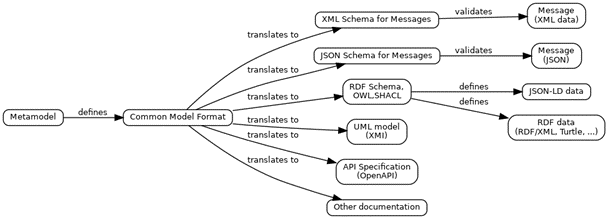

## OASIS Project Note
-------

# NIEM 6.0 Architectural Changes Version 1.0

## Project Note 01

## 05 June 2023

&nbsp;

#### This stage:
https://docs.oasis-open.org/niem/niem-6.0-arch-changes/v1.0/pn01/niem-6.0-arch-changes-v1.0-pn01.md (Authoritative) \
https://docs.oasis-open.org/niem/niem-6.0-arch-changes/v1.0/pn01/niem-6.0-arch-changes-v1.0-pn01.html \
https://docs.oasis-open.org/niem/niem-6.0-arch-changes/v1.0/pn01/niem-6.0-arch-changes-v1.0-pn01.pdf

#### Previous stage:
N/A

#### Latest stage:
https://docs.oasis-open.org/niem/niem-6.0-arch-changes/v1.0/niem-6.0-arch-changes-v1.0.md (Authoritative) \
https://docs.oasis-open.org/niem/niem-6.0-arch-changes/v1.0/niem-6.0-arch-changes-v1.0.html \
https://docs.oasis-open.org/niem/niem-6.0-arch-changes/v1.0/niem-6.0-arch-changes-v1.0.pdf

#### Open Project:
[NIEM Technical Architecture Committee (NTAC) of the OASIS NIEMOpen OP](http://www.niemopen.org/)

#### Project Chair:
Katherine Escobar (katherine.b.escobar.civ@mail.mil), [Joint Staff J6](https://www.jcs.mil/Directorates/J6-C4-Cyber/)

#### NTAC Committee Chairs:
Jim Cabral (jim.cabral@infotrack.com), [InfoTrack](https://www.infotrack.com/) \
Scott Renner (sar@mitre.org), [MITRE](https://www.mitre.org/)

#### Editors:
Thomas Carlson (thomas.carlson@gtri.gatech.edu), [GTRI](https://gtri.gatech.edu/) \
Christina Medlin (christina.medlin@gtri.gatech.edu), [GTRI](https://gtri.gatech.edu/) \
Scott Renner (sar@mitre.org), [MITRE](https://www.mitre.org/)

#### Related work:
This document is related to:
* Related specifications (include hyperlink, preferably to HTML format) \
`(remove "Related work" section if no entries)`
<!-- TODO: Remove related work?  NDR not yet an OASIS product. -->

#### Abstract:
This document describes the major architectural changes planned for the NIEM Naming and Design Rules specification for version 6.0.

#### Status:
This is a Non-Standards Track Work Product. The patent provisions of the OASIS IPR Policy do not apply.

This document was last revised or approved by the Project Governing Board of the OASIS NIEMOpen OP on the above date. The level of approval is also listed above. Check the "Latest stage" location noted above for possible later revisions of this document. Any other numbered Versions and other technical work produced by the Open Project (OP) are listed at http://www.niemopen.org/.

Comments on this work can be provided by opening issues in the project repository or by sending email to the project's public comment list: niemopen-comment@lists.oasis-open-projects.org. List information is available at https://lists.oasis-open-projects.org/g/niemopen-comment.

#### Citation format:
When referencing this document the following citation format should be used:

**[NIEM-6-Arch-Changes-v1.0]**

*NIEM 6.0 Architectural Changes Version 1.0*. Edited by Thomas Carlson, Christina Medlin, and Scott Renner. 05 June 2023. OASIS Project Note 01. https://docs.oasis-open.org/niem/niem-6.0-arch-changes/v1.0/pn01/niem-6.0-arch-changes-v1.0-pn01.html. Latest stage: https://docs.oasis-open.org/niem/niem-6.0-arch-changes/v1.0/niem-6.0-arch-changes-v1.0.html.

#### Notices
Copyright &copy; OASIS Open 2023. All Rights Reserved.

Distributed under the terms of the OASIS [IPR Policy](https://www.oasis-open.org/policies-guidelines/ipr/).

For complete copyright information please see the full Notices section in an Appendix below.

-------

# Table of Contents
[[TOC will be inserted here]]

-------

<!-- Insert a "line rule" (three or more hyphens alone on a new line, following a blank line) before each major section. This is used to generate a page break in the PDF format. -->

# 1 Introduction

This document describes the major architectural changes planned for the NIEM Naming and Design Rules specification for version 6.0.  It is a working document, and may change several times before the NIEM 6 publication is complete.  The document contains phrases such as "NIEM 6 will… " and "NIEM 6 does not…", but in this draft these describe current intentions, not final decisions.  Comments, criticism, and questions are welcome.

## 1.2 Glossary

### 1.2.1 Definitions of terms

| Term | Description |
|:---- |:----------- |
| Class | A type that contains properties
| Object property | A property that has a class type (contains properties)
| Datatype | A type that contains attribute properties and carries a value (e.g., a string, number, boolean, etc.)
| Data property | A property that has a datatype (contains a value, plus optional attribute properties).

### 1.2.2 Acronyms and abbreviations

| Term | Description |
|:---- |:----------- |
| CMF | Common Model Format |
| EXT | NDR conformance target for Extension Schema Document |
| IC-ISM | Intelligence Community Information Security Markings |
| IC-NTK | Intelligence Community Need-to-Know |
| NBAC | NIEM Business Architecture Committee Technical Steering Committee |
| NTAC | NIEM Technical Architecture Committee Technical Steering Committee |
| NDR | Naming and Design Rules |
| REF | NDR conformance target for Reference Schema Document (stricter rule set for reusable reference schemas) |

-------

# 2. Overview of major changes

The following architecture changes are briefly described here; details appear in later sections of this project note as needed.

1. Relaxed conformance rules for message schemas
2. Common Model Format (CMF) and the NIEM metamodel
3. Object properties and data properties
4. No identifiers for data properties
5. Optional identifiers for object properties
6. Augmentation enhancements
7. No wildcards for IC ISM and NTK
8. New base types in NIEM Core
9. No metadata types or attributes in structures namespace
10. No `sequenceID` attribute in structures namespace
11. No `roleOf` properties in models
12. Additional RDF entailments
13. Relationship properties and RDF-star

## 2.1 Relaxed conformance rules for message schemas

There are two kinds of data model in NIEM:  *reference models* and *message models*.  These models are represented in XSD as *reference schemas* and *message schemas*.

The NIEM core and domain models are reference models.  These models express semantics, providing names and definitions for concepts, and relationships among concepts.  They are characterized by "optionality and over-inclusiveness". That is, they define more concepts than needed for any particular data exchange specification, without cardinality constraints, so it is easy to select the concepts that are needed and omit the rest.

The data model in a message specification (or IEPD) is a message model.  These models include cardinality constraints and datatype restrictions to define the mandatory and optional content of a particular message format in a data exchange. They are formed by assembling subsets of the reference schema documents that define the NIEM model, plus one or more extension schema documents that contain any exchange-specific definitions.

NIEM 6 introduces a new conformance target for *message schema documents* that omits many of the conformance rules for *reference schema documents* and *extension schema documents*.  For example, a message schema may use `xs:choice` instead of element substitution.  In NIEM 6, a message schema is focused on validation and code binding, and need not follow all the rules that promote reuse and impose semantics on XSD constructs.  As a result, software which produces and consumes NIEM data will be easier to implement.  (Semantics and reuse are still available and supported through the reference model.)

The *subset schema rule* continues to apply in NIEM 6.  Any XML that is valid when assessed against a message schema must also be valid against the reference schema.

## 2.2 Common Model Format (CMF) and the NIEM metamodel

NIEM 6 introduces the *Common Model Format*, a technology-neutral data modeling formalism equivalent to NIEM XSD,  CMF and NIEM XSD are both fully supported in NIEM 6.

CMF is a NIEM-conforming message specification (or IEPD) for the information in a NIEM data model.  A CMF document is a message (or IEP) representing one particular data model, and is equivalent to the XSD schema document set for that model.

CMF was designed in the same way as any other NIEM message specification.  The first step was to describe the information requirements.  What are the facts that make up a NIEM data model?  The result is the NIEM *metamodel*, an abstract model for NIEM data models, depicted below as a UML diagram.


The [CMF specification](https://github.com/niemopen/common-model-format) instantiates that abstract model for models as a message schema in NIEM XSD.  It may be examined at its NIEMOpen github repo.  A more [detailed description of CMF and the metamodel](https://www.niem.gov/strategic-initiatives/niem-metamodel-and-common-model-format) is available at the niem.gov site.

A CMF model may be transformed into developer artifacts for many technologies.  For example, NIEMOpen provides free and open-source software to transform CMF into JSON Schema, suitable for validating NIEM JSON data.  (Transforming CMF is *much* easier than transforming the equivalent NIEM XSD.)  Many other transformations are possible; some are imagined in the diagram below.



The NIEMOpen project includes [CMFTool](https://github.com/niemopen/cmftool), which is free and open-source software capable of translating a CMF model to the equivalent NIEM XSD schema, and vice versa.  Developers can therefore work with either formalism and still take advantage of the tooling for both.

## 2.3 Object properties and data properties

NIEM XML elements with simple content and attributes are not easily represented in NIEM JSON.  NIEM 6 resolves this difficulty by creating new data properties in CMF models.  The change is invisible in NIEM XSD and XML, but apparent in CMF and in any serialization that does not have XML's distinction between elements and attributes – which is probably all of them.

In NIEM 6, an XML element of complex content is an object property and has a class.  Here is an example of the `PersonName` object property in NIEM XML and NIEM JSON:

```text
<nc:PersonName>                                      | "nc:PersonName": {
  <nc:PersonGivenName>Tommy</nc:PersonGivenName>     |   "nc:PersonGivenName": "Tommy",
  <nc:PersonSurName>Atkins</nc:PersonSurName>        |   "nc:PersonSurName": "Atkins"
</nc:PersonName>                                     | }
```

A simple content element with no attributes is a data property and has a datatype.

```text
<nc:PersonGivenName>Tommy</nc:PersonGivenName>       | "nc:PersonGivenName": "Tommy"
```

But what to do for a simple content element with attributes?   There is no good JSON key for the simple content value.

```text
<nc:PersonMiddleName @nc:partialIndicator="true">    | "nc:PersonMiddleName": {
  Bartholomew                                        |   "nc:partialIndicator": true,
</nc:PersonMiddleName>                               |   ????? : "Bartholmew"
                                                     | }
```

In NIEM 6, a simple content element with attributes is an object property.  When translating from XSD to CMF, a new data property is created for the CMF model – `nc:PersonMiddleNameLiteral` – which appears in the JSON serialization, like this:

```text
<nc:PersonMiddleName @nc:partialIndicator="true">    | "nc:PersonMiddleName": {
  Bartholomew                                        |   "nc:partialIndicator": true,
</nc:PersonMiddleName>                               |   "nc:PersonMiddleNameLiteral" : "Bartholmew"
                                                     | }
```

Most simple content elements do not have attributes from the NIEM model or extension schemas.  Other sections of this project note explain why none of the attributes in the structures namespace routinely appear on simple content elements.  Almost all simple content elements will therefore be data properties.  If a simple content element does have attributes, that will be a choice made by a data modeler, and it will be an object property.

## 2.4 No identifiers for data properties

NIEM has always defined semantics in terms of RDF equivalents.  This means an element that can have a referencing attribute (`id`, `ref`,  or `uri` in the structures namespace) must be an object property, because literal values do not have identifiers in RDF.

Referencing simple content is rare in NIEM XML  It is unusual to see something like

```xml
<nc:PersonName s:id="link">Tommy</nc:PersonName>
<nc:PersonName s:ref="link"/>
```

NIEM 6 therefore assumes that an element declaration of simple content without attributes is a data property and cannot have any of the referencing attributes.  This keeps the common case simple.  NIEM 6 provides new appinfo for the unusual case.  For an XML message to include something like

```xml
<my:SimpleContent s:id="link">FOO</my:SimpleContent>
```

the corresponding model in XSD must include that appinfo, like this:

```xml
<xs:element name="SimpleContent" type="xs:token" appinfo:isObjectProperty="true" ...
```

An element of simple content with attributes is always an object property and does not require this appinfo in the schema.

## 2.5 Optional identifiers for object properties

Sometimes a message designer wants to avoid the complexity of references to an element that will always appear inline.  At present, NIEM 5 allows the designer to remove the referencing attributes from *every* element declaration.  NIEM 6 introduces a way to remove the reference properties from *particular* element declarations, while leaving them on others.

## 2.6 Augmentation enhancements

Augmentation allows a data modeler to add elements to a type with complex content in a namespace that belongs to another.  For example, the NIEM Justice domain uses augmentation to add `j:PersonHasChildrenIndicator` (and 97 other elements) to `nc:PersonType`.

In NIEM 6, augmentation is enhanced in two ways:  The component that is added can be an attribute as well as an element, and the component being augmented can be a type with simple content as well as complex content.

## 2.7 No wildcards for ISM and NTK

NIEM 3 added support for the US Intelligence Community's *Information Security Marking* and *Need To Know* standards, by adding `xs:anyAttribute` elements to several types in the structures namespace.  That was a hack, but it satisfied a large user community and,  since a message specification could always remove the attribute wildcards, didn't offend anyone very much.  We can achieve the same result in NIEM 6 with attribute augmentations, so we have removed the hack.

## 2.8 New base types in NIEM Core

In order to apply an augmentation to every element in a model (for instance, to support ISM and NTK), the model must have a base type from which all types are derived.  In NIEM 5 those base types are defined in the structures namespace.  In NIEM 6, the structures namespace applies only to NIEM XML – it has nothing to do with models in CMF, or messages in JSON – and so it is not properly part of any NIEM model.  The base types for a NIEM model belong in the NIEM Core, and so NIEM 6 adds `nc:ObjectType` and `nc:AssociationType` to the core, and derives all other types from those base types.  NIEMOpen has FOSS tools to assist migration by modifying existing NIEM XSD to use these new base types.

## 2.9 No metadata types or attributes in structures namespace

The metadata mechanism in NIEM allows a message designer to add elements to any simple or complex content in a message.  (Those added elements may or may not represent "data about data".)  Message designers can accomplish the same thing with the enhanced augmentation in NIEM 6.  The metadata mechanism is therefore no longer required, and is removed from NIEM 6 for simplicity.

## 2.10 No `sequenceID` attribute in structures namespace

By default there is no meaning ascribed to the order of a repeated element in NIEM XSD.  In NIEM 5 a message could use `structures:sequenceID` to indicate a meaningful order.  For example, a Track comprised of a sequence of Positions might look like this:

```xml
<my:Track>
  <my:Position structures:sequenceID="01"> ...
  <my:Position structures:sequenceID="02"> ...
</my:Track>
```

In NIEM 6, meaningful order is asserted in the model, not the message.  NIEM 6 removes `sequenceID` from the structures namespace, and adds a new `appinfo:orderedPropertyIndicator` for use in NIEM XSD.  The message model for the example above would look like

```xml
<xs:complexType name="TrackType">
  <xs:complexContent>
    <xs:extension base="nc:ObjectType">
      <xs:sequence>
        <xs:element ref="my:Position" maxOccurs="unbounded" appinfo:orderedPropertyIndicator="true"/>
```

## 2.11 No `RoleOf` properties in models

Existing versions of NIEM include a number of *role properties* and *role types*.

> Role types were introduced into NIEM after XML Schema extension proved to be insufficient in certain situations. An object may have multiple functions in the same instance document, each with associated data. For example, a person might be both a j:CrashDriver and a j:ArrestSubject. Without roles, information about the person would be duplicated in extensions, or would be left ambiguously blank in some places. [NDR 10.2.2](https://reference.niem.gov/niem/specification/naming-and-design-rules/5.0/niem-ndr-5.0.html#section_10.2.2)

For example, a NIEM 5 message might look like this:

```xml
 1 <my:Message>
 2   <j:Crash>
 3     <j:CrashVehicle>
 4       <j:CrashDriver>
 5         <nc:RoleOfPerson structures:id="P01">
 6           <nc:PersonFullName>Peter Wimsey</nc:PersonFullName>
 7         </nc:RoleOfPerson>
 8         <j:DriverLicense>
 9           <j:DriverLicenseCardIdentification>
10             <nc:IdentificationID>A1234567</nc:IdentificationID>
11           </j:DriverLicenseCardIdentification>
12         </j:DriverLicense>
13       </j:CrashDriver>
14     </j:CrashVehicle>
15     <j:CrashPerson>
16       <nc:RoleOfPerson structures:ref="P01" xsi:nil="true"/>
17       <j:CrashPersonInjury>
18         <nc:InjuryDescriptionText>Broken Arm</nc:InjuryDescriptionText>
19       </j:CrashPersonInjury>
20     </j:CrashPerson>
21   </j:Crash>
22 </my:Message>
```

In this example the `CrashDriver` element on line 4 and the `CrashPerson` element on line 15 are describing the same real-world entity:  one person, named Peter Wimsey, with license A1234567 and a broken arm.  Role properties allow different elements to describe the same entity without duplicating data in the message.  We can simplify NIEM 6 by removing role properties and using the `structures:uri` attribute instead, like this:

```xml
 1 <my:Message>
 2   <j:Crash>
 3     <j:CrashVehicle>
 4       <j:CrashDriver structures:uri="P01">
 5         <nc:PersonFullName>Peter Wimsey</nc:PersonFullName>
 6         <j:DriverLicense>
 7           <j:DriverLicenseCardIdentification>
 8             <nc:IdentificationID>A1234567</nc:IdentificationID>
 9           </j:DriverLicenseCardIdentification>
10         </j:DriverLicense>
11       </j:CrashDriver>
12     </j:CrashVehicle>
13     <j:CrashPerson structures:uri="P01">
14       <j:CrashPersonInjury>
15         <nc:InjuryDescriptionText>Broken Arm</nc:InjuryDescriptionText>
16       </j:CrashPersonInjury>
17     </j:CrashPerson>
18   </j:Crash>
19 </my:Message>
```

## 2.12 Additional RDF entailments

NIEM has always defined the semantics of NIEM in terms of the RDF conceptual model.  In NIEM 4 and NIEM 5 that definition was enhanced by defining the RDF triples that are entailed by NIEM XSD and XML.  NIEM 6 improves its formal semantics with additional RDF entailments, making use of OWL, SHACL, and other ontology vocabularies.  It may then be possible to represent all aspects of a NIEM model in RDF.  It will be possible to convert NIEM data to RDF, for use as a a knowledge graph.

## 2.13 Relationship properties and RDF-star

Sometimes a NIEM XML element needs to modify the relationship expressed by its parent instead of the parent object itself.  For example:

```xml
<nc:Person>
  <nc:PersonName>
    <nc:PersonFullName>Clark Kent</nc:PersonFullName>
  </nc:PersonName>
  <nc:PersonName>
    <nc:PersonFullName>Superman</nc:PersonFullName>
    <my:PersonNameAugmentation>
      <my:Classification>Secret</my:Classification>
    </my:PersonNameAugmentation>
  </nc:PersonName>
</nc:Person>
```

The author of this message does not mean to say that the name `Superman` is itself a secret.  Everybody knows that name.  The author is saying that the *relationship* between the `nc:Person` object and that name is a secret.  The `my:Classification` element modifies that relationship; it is a *relationship property.*

NIEM 6 uses RDF-star, an extension of RDF, to represent relationship properties.  For example, the NIEM XML above is equivalent to this RDF:

```text
_:n0 a nc:PersonType .
_:n0 nc:PersonName _:n1 .
_:n0 nc:PersonName _:n2 {| my:Classification "Secret" |} .
_:n1 a nc:PersonNameType .
_:n1 nc:PersonFullName "Clark Kent" .
_:n2 a nc:PersonNameType .
_:n2 nc:PersonFullName "Superman" .
```

NIEM 6 has new appinfo to mark relationship properties in NIEM XSD.  The message schema for the above message would include

```xml
<xs:element name="Classification" appinfo:relationshipPropertyIndicator="true" ...
```

-------

# 3 General changes

## 3.1 Common Model Format (CMF)

NIEM is in the process of introducing a platform- and technology-independent representation for NIEM data models via the new Common Model Format (CMF).  This is a format that will represent NIEM concepts and data generically so that they can then be transformed into specific languages, such as XML Schema and JSON Schema.  Transformations will typically be done via automated tooling.

The NDR will be reorganized so concepts and rules that apply to all languages are expressed in terms of CMF.  Language-specific features will be moved to supplemental representations of the NDR, such as the "NIEM Naming and Design Rules: XML Representation" (NDR-XML).  These changes will make it easier for developers to focus on only the parts of the NDR that apply to their needs.  They also enable NIEM to better support multiple representations without having to first go through the NIEM XML representation for tool support.

In addition to being used by the NDR for NIEM 6.0 to describe concepts and rules, CMF will also be used alongside XML Schema as the official canonical representations of the NIEM data model.

More information about CMF is available at https://github.com/niemopen/common-model-format.

## 3.2 Assign NIEM subset schemas a new conformance target

[niemopen/niem-naming-design-rules#10](https://github.com/niemopen/niem-naming-design-rules/issues/10)

The NTAC proposess to use a new NDR conformance target for subset schemas instead of the original ReferenceSchemaDocument (REF) target.

### 3.2.1 Background

Subset schemas from the NIEM data model can contain conformance errors because subsets are not required to follow all of the rules required for reference schema documents.

The following issues are known to be incorrectly raised from NDR conformance tests on subset schemas:

- Missing augmentation points on types
- Missing definitions

### 3.2.2 Proposal

The NTAC proposes to generate NIEM subset schemas from NIEM-supported tooling with a new conformance target (TBD).
The NDR rules for this new conformance target will resemble the rules for the REF conformance target with exceptions for the above rules known to be incorrectly raised during conformance testing.

-------

# 4 Property changes

## 4.1 Do not allow elements and attributes with the same uncased name

[niemopen/niem-naming-design-rules#21](https://github.com/niemopen/niem-naming-design-rules/issues/11)

Do not allow elements and attributes in the same namespace to share the same name with the only difference being the capitalization.

### 4.1.1 Background

NDR rules require element names to be upper camel case (e.g., UpperCamelCase) and attribute names to be lower camel case (e.g., lowerCamelCase). In some prior versions of NIEM, elements and attributes shared the same name in the same namespace with the only difference being the capitalization of the first letter.  For example, NIEM Core 4.0 contained both element `nc:ConfidencePercent` and attribute `nc:confidencePercent`.  This can present issues in case-insensitive environments.

### 4.1.2 Impact

The impact of this change should be low.  The model does not currently have any properties with overlapping names.  Properties in IEPDs / message specifications may be affected.  This would however require that semantically-equivalent elements and attributes be given unique names.

## 4.2 Disallow direct use of structures typing for property types

[niemopen/niem-naming-design-rules#29](https://github.com/niemopen/niem-naming-design-rules/issues/29)

Prohibit properties in content namespaces (e.g., Core, domains, code sets, etc.) from having types from the `structures` namespace.

### 4.2.1 Background

Types in the `structures` namespace provide NIEM infrastructure support but do not define actual content.  These types:

- typically define attributes supporting ids and referencing, linked data, metadata, and security markup.
- typically define generic augmentation points

### 4.2.2 Proposal

The NTAC proposes a new rule to prohibit NIEM-conformant properties from having a type from the `structures` namespace.  This is meant to ensure that NIEM properties are capable of carrying data content.

### 4.2.3 Impact

[niemopen/niem-model#24](https://github.com/niemopen/niem-model/issues/24)

The impact of this change should be low.  Within the data model, properties `cbrn:CaseMetadata` and `cbrn:DataFileMetadata` are currently of type `structures:MetadataType`.  These two properties would need to be removed or updated, perhaps to be of type `nc:MetadataType`.

-------

# 5 Type changes

## 5.1 Allow facets on EXT complex value types

[niemopen/niem-naming-design-rules#9](https://github.com/niemopen/niem-naming-design-rules/issues/9)

Support the declaration of facets on EXT complex value types to prevent the need for message designers to define two corresponding types (one complex, one simple) for each code set.

An [example schema](./examples/complex-code-types/example.xsd) demonstrating the proposal is available under the [examples/complex-code-types](./examples/complex-code-types/) subdirectory.

<!-- TODO: What's the right name to use for complex value types? -->

### 5.1.1 Background

NIEM requires that enumerations must be defined on simple types in REF schemas.  As all NIEM property elements are required to have complex types, this means that code sets and types with other kinds of facets are typically defined in pairs - a simple code type with enumerations, and a corresponding complex code type that extends the simple code type and adds the NIEM-required `structures:SimpleObjectAttributeGroup`.

#### 5.1.1.1 Example: XML Schema simple and complex code types

The example below shows how code sets are typically defined in NIEM.

Notes:

- The simple code type declares the enumerations.
- The complex code type extends the simple code type and adds attributes to supports ids, referencing, linked data, metadata, and security markup via `structures:SimpleObjectAttributeGroup`.

```xml
<xs:simpleType name="AddressCategoryCodeSimpleType">
  <xs:annotation>
    <xs:documentation>A data type for a kind of address.</xs:documentation>
  </xs:annotation>
  <xs:restriction base="xs:token">
    <xs:enumeration value="business">
      <xs:annotation>
        <xs:documentation>business</xs:documentation>
      </xs:annotation>
    </xs:enumeration>
    <xs:enumeration value="registered office">
      <xs:annotation>
        <xs:documentation>registered office</xs:documentation>
      </xs:annotation>
    </xs:enumeration>
    <xs:enumeration value="residential">
      <xs:annotation>
        <xs:documentation>residential</xs:documentation>
      </xs:annotation>
    </xs:enumeration>
    <xs:enumeration value="residential or business">
      <xs:annotation>
        <xs:documentation>residential or business</xs:documentation>
      </xs:annotation>
    </xs:enumeration>
    <xs:enumeration value="unspecified">
      <xs:annotation>
        <xs:documentation>unspecified</xs:documentation>
      </xs:annotation>
    </xs:enumeration>
  </xs:restriction>
</xs:simpleType>

<xs:complexType name="AddressCategoryCodeType">
  <xs:annotation>
    <xs:documentation>A data type for a kind of address.</xs:documentation>
  </xs:annotation>
  <xs:simpleContent>
    <xs:extension base="nc:AddressCategoryCodeSimpleType">
      <xs:attributeGroup ref="structures:SimpleObjectAttributeGroup"/>
    </xs:extension>
  </xs:simpleContent>
</xs:complexType>
```

#### 5.1.1.2 Benefits of the current approach

These requirements provide three benefits:

1. All conformant object, association, and data property elements in NIEM provide the ability to support ids and referencing, linked data, metadata, and security markup.
2. Facets on simple types allow those types to be used as attribute types (XML Schema does not permit attributes with complex types).
3. XML Schema supports unions of simple types, which allow a new simple type to be created as a composite of its member simple types.  This allows NIEM domains and message designers to create unions from existing code sets, or to "extend" a NIEM code set by creating a union from a NIEM simple type and an extension simple type that only contains additions to the code set.  This eliminates the need to duplicate existing codes in order to add additional values.

#### 5.1.1.3 Drawbacks of the current approach

1. The major drawback to this approach is the additional complexity it requires.  It can be cumbersome to create and maintain two types for each code set instead of a single type.

### 5.1.2 Proposal

For message designers who do not need to create attributes or unions off of their code sets, the NTAC proposes to explicitly support the declaration of facets directly on complex value types in message schemas with an EXT conformance target.

This still supports reusability in reference schemas (REF), while making message extension schemas (EXT) easier to build and maintain.

#### 5.1.2.1 Example: XML Schema single complex code type

Notes:

- In the example below, the complex type restricts `niem-xs:token`, which already contains `structure:SimpleObjectAttributeGroup`.  Other types from the `niem-xs` namespace could be used if needed to support numeric or other types.

```xml
  <xs:complexType name='AddressCategoryCodeType'>
    <xs:annotation>
      <xs:documentation>A data type for a kind of address.</xs:documentation>
    </xs:annotation>
    <xs:simpleContent>
      <xs:restriction base='niem-xs:token'>
        <xs:enumeration value="business">
          <xs:annotation>
            <xs:documentation>business</xs:documentation>
          </xs:annotation>
        </xs:enumeration>
        <xs:enumeration value="registered office">
          <xs:annotation>
            <xs:documentation>registered office</xs:documentation>
          </xs:annotation>
        </xs:enumeration>
        <xs:enumeration value="residential">
          <xs:annotation>
            <xs:documentation>residential</xs:documentation>
          </xs:annotation>
        </xs:enumeration>
        <xs:enumeration value="residential or business">
          <xs:annotation>
            <xs:documentation>residential or business</xs:documentation>
          </xs:annotation>
        </xs:enumeration>
        <xs:enumeration value="unspecified">
          <xs:annotation>
            <xs:documentation>unspecified</xs:documentation>
          </xs:annotation>
        </xs:enumeration>
      </xs:restriction>
    </xs:simpleContent>
  </xs:complexType>
```

### 5.1.3 Impact

This is currently supported by the NDR and requires no changes, but has never been explicitly covered as an available option in NIEM IEPD developer resources or training.  This scenario should be covered in NDR tests to ensure it remains valid for EXT schemas.

## 5.2 Require unique enumerations

[niemopen/niem-naming-design-rules#30](https://github.com/niemopen/niem-naming-design-rules/issues/30)

There are some code types in NIEM that repeat the same enumeration with different definitions.  A new rule is being proposed to require that enumerations are unique within a type.  For code sources outside of NIEM where duplication cannot be resolved, definitions of overlapping codes will be concatenated.

### 5.2.1 NIEM 5.2 Example

| Type                            | FacetValue | Definition |
|---------------------------------|------------|------------|
| usps:StreetSuffixCodeSimpleType | OVAL       | OVAL       |
| usps:StreetSuffixCodeSimpleType | PARK       | PARK       |
| usps:StreetSuffixCodeSimpleType | PARK       | PARKS      |
| usps:StreetSuffixCodeSimpleType | PASS       | PASS       |

### 5.2.2 NIEM 6.0 Proposal

| Type                            | FacetValue | Definition  |
|---------------------------------|------------|-------------|
| usps:StreetSuffixCodeSimpleType | OVAL       | OVAL        |
| usps:StreetSuffixCodeSimpleType | PARK       | PARK; PARKS |
| usps:StreetSuffixCodeSimpleType | PASS       | PASS        |

### 5.2.3 Impact

There are 16 types in NIEM 5.2 that do not have unique enumerations:

- can:StreetDirectionCodeSimpleType
- cbrncl:FacilityUsageCodeSimpleType
- cyber:BreachClassificationCategoryCodeSimpleType
- dea:DrugCodeSimpleType
- em:BarcodeCodeSimpleType
- em:NotificationFunctionCategoryCodeSimpleType
- fips:USCounty3DigitCodeSimpleType
- hazmat:HazmatCodeSimpleType
- mmucc:DriverLicenseClassCodeSimpleType
- mo:FrequencyUnitTemporalCodeSimpleType
- mo:RegisteredServiceNameCodeSimpleType
- usmtf:AngleUnitCodeSimpleType
- usmtf:NauticalMileUnitCodeSimpleType
- usmtf:RadioactiveHalfLifeCodeSimpleType
- usmtf:RFPowerUnitDecibelsCodeSimpleType
- usps:StreetSuffixCodeSimpleType

Canada Post and United States Postal Service street codes, DEA drug codes, FIPS county codes, and hazmat codes cannot be modified at the source and will either need to have concatenated definitions or other workarounds.  The other codes may be able to be adjusted to remove the overlapping code definitions directly.

See comments on the GitHub issue (link above) for more details on the affected types and codes.

### 5.2.4 Special considerations

Canada Post street direction codes provide two definitions per enumerations: one definition in English and one definition in French.

## 5.3 Require definitions for patterns

[niemopen/niem-naming-design-rules#12](https://github.com/niemopen/niem-naming-design-rules/issues/12)

The NTAC proposes to make definitions required for all pattern facets.

### 5.3.1 Background

NIEM currently requires definitions for enumeration facets only.  Definitions for pattern facets should provide extra human-readable documentation to make the regular expressions easier to interpret.

### 5.3.2 Impact

The impact to the data model would be low.  There are 438 patterns in NIEM 5.2:

- 433 patterns have definitions
- 5 patterns do not have definitions

Type | Pattern
---- | -------
ag_codes:TaxIdentificationIDSimpleType | `[0-9]{9}`
ag_codes:CropYearSimpleType | `^([1][9]\d\d\|[2]\d\d\d)$`
biom:LipPatternSimpleType | `<>`
mo:MILSTD2525-C-SIDC-SimpleType | `[A-Z0-9\-]{15}`
mo:MILSTD2525-B-SIDC-SimpleType | `[A-Z0-9\-]{15}`

## 5.4 nc:ObjectType

https://github.com/niemopen/ntac-admin/discussions/58

<!-- TODO: Determine nc:ObjectType recommendation -->

CMF either needs to be aware of some parts of the `structures` namespace, or we need a `nc:ObjectType` in the model because domains and messages should be allowed to augment the root-level `ObjectType`.

Notes:

- NIEM 1.0 had a similar `u:SuperType`.
- `nc:CodeType` contains three attributes from the code-lists-instance utility namespace
- A new rule is being proposed to prevent properties with types from the `structures` namespace
  - https://github.com/niemopen/niem-naming-design-rules/issues/29
- If CMF was aware of `structures`, then we could say that `nc:PersonType` or `j:PersonEyeColorCode` contains `structures:metadata`.
- If CMF is updated to support customized profiles of objects and was `structures`-aware, we could say:
  - `nc:Person` contains `structures:id` and `hs:Caregiver` contains `structures:ref`.
  - `nc:PersonType` contains `structures:uri` as required and not have `structures:uri` appear elsewhere.

-------

# 6 Adapter changes

## 6.1 Add representation term "Adapter"

[niemopen/niem-naming-design-rules#5](https://github.com/niemopen/niem-naming-design-rules/issues/5)

The NTAC proposes to require that the representation term "Adapter" appear at the end of all adapter property and type names.

### 6.1.1 Background

NIEM already has representation terms for associations, augmentations, and metadata.  Adding representation term "Adapter" for properties and types would make it clear which components contain non-conformant content from external standards.  A few properties and types currently in NIEM already follow this convention.

### 6.1.2 Impact

The following is a list of adapter properties and types from NIEM 5.2.  These names, unless otherwise noted, would be updated.  Property names would end in "Adapter"; type names would end in "AdapterType".

| Property                           | Type   | Notes |
|:-----------------------------------|:------ |:----- |
| ag:LocationLineStringCoordinates   | geo:LineStringType |
| ag:LocationMultiSurfaceCoordinates | geo:MultiSurfaceType |
| ag:LocationPointCoordinates        | geo:PointType |
| ag:LocationPolygonCoordinates      | geo:PolygonType |
| cbrn:SpecialEventSecurityArea      | geo:PolygonType |
| edxl-cap:AlertAdapter              | edxl-cap:AlertAdapterType | No change
| edxl-de:DistributionElementAdapter | edxl-de:DistributionElementAdapterType | No change
| edxl-have:HaveAdapter              | edxl-have:HaveAdapterType | No change
| geo:AreaCurve                      | geo:CurveType |
| geo:AreaEnvelope                   | geo:EnvelopeType |
| geo:AreaPoint                      | geo:PointType |
| geo:AreaPolygon                    | geo:PolygonType |
| geo:AreaRegionGeometry             | geo:GeometryType |
| geo:Ellipse                        | geo:EllipseType |
| geo:Feature                        | geo:FeatureType |
| geo:Geometry                       | geo:GeometryType |
| geo:LocationFeature                | geo:FeatureType |
| geo:LocationGeometry               | geo:GeometryType |
| geo:LocationGeospatialPoint        | geo:PointType |
| mo:WaypointPoint                   | geo:PointType |
| mo:WGS84LocationEllipse            | mo:WGS84EllipseType |
| mo:WGS84LocationExternalPolygon    | mo:WGS84ExternalPolygonType |
| mo:WGS84LocationLineString         | mo:WGS84LineStringType |
| mo:WGS84LocationPoint              | mo:WGS84LocationPointType |

## 6.2 Create new type `structures:AdapterType`

[niemopen/niem-naming-design-rules#4](https://github.com/niemopen/niem-naming-design-rules/issues/4)

The NTAC proposes to create new type `AdapterType` in the `structures` namespace to serve as the parent type for all adapter types in NIEM.

### 6.2.1 Background

Types in the structures namespace can typically bew used to identify what basic kind of type something is (an object type, an association type, a metadata type, etc.).  Adapter types do not follow the same pattern.  They require the use of a special attribute to identify themselves as adapters.

The basic category of NIEM classes can currently be identified as described in the table below:

| Type               | Rule                                              |
|:-------------------|:--------------------------------------------------|
| association types  | Extend structures:AssociationType or a derivative |
| augmentation types | Extend structures:AugmentationType                |
| metadata types     | Extend structures:MetadataType                    |
| object types       | Extend structures:ObjectType or a derivative      |
| adapter types      | Extend **structures:ObjectType** and use **appinfo:externalAdapterTypeIndicator="true"** |

### 6.2.2 Proposal

- Add a new `structures:AdapterType` to serve as the parent type for all adapter types defined in NIEM.
- Remove attribute `appinfo:externalAdapterTypeIndicator` from the appinfo utility namespace.

#### 6.2.2.1 Example declaration of an adapter type

```diff
- <xs:complexType name="GeometryType" appinfo:externalAdapterTypeIndicator="true">
+ <xs:complexType name="GeometryType">
   <xs:complexContent>
-    <xs:extension base="structures:ObjectType">
+    <xs:extension base="structures:AdapterType">
       <xs:sequence>
         <xs:element ref="gml:AbstractGeometry" minOccurs="1" maxOccurs="1"/>
       </xs:sequence>
     </xs:extension>
   </xs:complexContent>
 </xs:complexType>
```

### 6.2.3 Impact

Low.  The declaration of 20 types currently in NIEM would need to be adjusted, which would be handled by model maintainers.

-------

# 7 Augmentation Changes

## 7.1 Do not allow multiple augmentations from the same namespace on the same object

[niemopen/niem-naming-design-rules#35](https://github.com/niemopen/niem-naming-design-rules/issues/35)

The NTAC is proposing to prohibit multiple augmentations from the same namespace on the same object in message instances.

### 7.1.1 Background

An augmentation is a container that lets us plug additional properties into existing types from other namespaces - types that we cannot modify ourselves. These containers on their own have no meaning, and they do not appear in the NIEM RDF or NIEM JSON-LD representations.

### 7.1.2 Proposal

Because augmentation containers have no meaning on their own and because it would not be possible to reconstruct multiple containers correctly when transforming from NIEM RDF or NIEM JSON to NIEM XML, the NTAC proposes to prohibit multiple augmentations from the same namespace on the same object.

#### 7.1.2.1 Valid example

Notes:

- In the example below, nc:Person contains augmentations from Justice and Human Services.
- The Justice person augmentation contains two instances of `j:DriverLicense` (valid)
- The Human Services person augmentation contains two instance of `hs:HealthInsurance` (valid)

```xml
<ext:Message>
  <nc:Person>
    <nc:PersonFullName>Alice Smith</nc:PersonFullName>
  </nc:PersonName>
  <j:PersonAugmentation>
    <j:DriverLicense>
      <!-- ... -->
    </j:DriverLicense>
    <j:DriverLicense>
      <!-- ... -->
    </j:DriverLicense>
  </j:PersonAugmentation>
  <hs:PersonAugmentation>
    <hc:HealthInsurance>
      <!-- ... -->
    </hc:HealthInsurance>
    <hc:HealthInsurance>
      <!-- ... -->
    </hc:HealthInsurance>
  </hs:PersonAugmentation>
</ext:Message>
```

#### 7.1.2.2 Invalid example

Notes:

- In the example below, nc:Person contains two augmentations from Justice (invalid) and an augmentation from Human Services (valid).

```xml
<ext:Message>
  <nc:Person>
    <nc:PersonFullName>Alice Smith</nc:PersonFullName>
  </nc:PersonName>
  <j:PersonAugmentation>
    <j:DriverLicense>
      <!-- ... -->
    </j:DriverLicense>
  </j:PersonAugmentation>
  <j:PersonAugmentation>   <!-- Invalid: j:PersonAugmentation should not appear twice -->
    <j:DriverLicense>
      <!-- ... -->
    </j:DriverLicense>
  </j:PersonAugmentation>
  <hs:PersonAugmentation>
    <hc:HealthInsurance>
      <!-- ... -->
    </hc:HealthInsurance>
  </hs:PersonAugmentation>
</ext:Message>
```

To correct this example, the second `j:DriverLicense` object should be moved under the first `j:PersonAugmentation` container and the second `j:PersonAugmentation` container should be removed.

### 7.1.3 Impact

This change is expected to have low impact.  It does not affect the data model, and it is not expected to be a meaningful or frequently-used feature in instance messages.  Augmentations can contain multiple instances of properties, so they can be consolidated if needed.

-------

# 8 Metadata Changes

## 8.1 Simplify metadata

[niem-open/niem-naming-design-rules#8](https://github.com/niemopen/niem-naming-design-rules/issues/8)

NIEM currently requires the use of ids and special metadata reference attributes to link metadata and the objects to which they apply.  While this will continue to be necessary to link metadata consisting of elements to NIEM data properties (elements that carry attributes and a value), it is not necessary for object properties, which can contain the metadata directly or via augmentation.

The NTAC proposes to allow metadata contained in an object to be applicable to that object without the need for references.  The NTAC also proposes to support metadata specialization and augmentation, treating metadata types more like regular object types.

### 8.1.1 Background

NIEM currently requires that object properties and data properties use the `structures:metadata` or `structures:relationshipMetadata` attributes in order to create a relationship between those properties and their applicable metadata.

According to the NDR, adding metadata directly to a type creates no special meaning or relationship to the metadata.  For example, adding `nc:Metadata` to `nc:PersonType` does not mean that the metadata actually applies to the person that contains it; only the use of one of the `structures` metadata attributes would make that metadata applicable to that person.

Metadata types are also required to extend `structures:MetadataType`.  This prevent specialization and does not allow one metadata type to build off of another via derivation.  Metadata types are also prohibited from creating augmentation points.  Brand new metadata types must be created even if there are no special semantics required.

#### 8.1.1.1 Current metadata example

Notes:

1. The Justice domain has additional data requirements for generic metadata.  NIEM requires that it be captured via its own separate metadata type vs an extension or augmentation of `nc:MetadataType`.
2. To apply the Core and Justice metadata objects to the `nc:Person` property in the message, `nc:Person` is required to use the `structures:metadata` attribute (or the `structures:relationshipMetadata` attribute) and reference the ids of any applicable metadata objects in the message.

```xml
<ext:Message>
  <nc:Person structures:metadata="m1 m2">
    <nc:PersonBirthDate>
      <nc:Date>1945-12-01</nc:Date>
    </nc:PersonBirthDate>
    <nc:PersonName>
      <nc:PersonFullName>John Doe</nc:PersonFullName>
    </nc:PersonName>
  </nc:Person>

  <nc:Metadata structures:id="m1">
    <nc:SourceText>Adam Barber</nc:SourceText>
    <nc:ReportedDate>
      <nc:Date>2005-04-26</nc:Date>
    </nc:ReportedDate>
  </nc:Metadata>

  <j:Metadata structures:id="m2">
    <j:CriminalInformationIndicator>true</j:CriminalInformationIndicator>
  </j:Metadata>
</ext:Message>
```

### 8.1.2 Proposal

The NTAC proposes the following changes to simplify the use of metadata in messages:

1. Allow metadata contained by an object or augmentation of that object to apply to that object, without the need for references via the `structures:metadata` attribute.
2. Allow metadata types to extend other metadata types
3. Allow metadata augmentations
4. Remove the `appinfo:appliesToProperties` and `appinfo:appliesToTypes` attributes on metadata, as these are rarely use and applicability can be provided by adding metadata to the types.
5. Continue supporting the `structures:relationshipMetadata` attribute on object properties.
6. Continue supporting the `structures:metadata` and `structures:relationshipMetadata` attributes on data properties.
7. Create an applicability exception for objects that contain a metadata property that carries attribute `structures:id`.  The root of a message may need to carry metadata objects that are linked to via ids / references but are not applicable to the message itself.

<!-- TODO: Metadata applicability exception -->

Under the new proposal, metadata can be added directly to types just like other kinds of properties.  To add metadata to a type in another namespace, extension or augmentation may be used.

#### 8.1.2.1 Inline metadata

The following example shows metadata attached to a person via augmentation.

Notes:

1. The Justice domain augments `nc:MetadataType` rather than creating its own independent `j:MetadataType`.
2. The message designer created an augmentation for `nc:PersonType` to add `nc:Metadata`.  This metadata now applies to the person object in which it is contained without the need for ids or references.

```xml
<ext:Message>
  <nc:Person>
    <nc:PersonBirthDate>
      <nc:Date>1945-12-01</nc:Date>
    </nc:PersonBirthDate>
    <nc:PersonName>
      <nc:PersonFullName>John Doe</nc:PersonFullName>
    </nc:PersonName>
    <ext:PersonAugmentation>
      <nc:Metadata>
        <nc:SourceText>Adam Barber</nc:SourceText>
        <nc:ReportedDate>
          <nc:Date>2005-04-26</nc:Date>
        </nc:ReportedDate>
        <j:MetadataAugmentation>
          <j:CriminalInformationIndicator>true</j:CriminalInformationIndicator>
        </j:MetadataAugmentation>
      </nc:Metadata>
    </ext:PersonAugmentation>
  </nc:Person>
</ext:Message>
```

#### 8.1.2.2 Reference metadata

The proposal updates metadata in NIEM so that they are treated much more similarly to regular objects.  Referencing via `structures:id` and `structures:ref` is supported for objects and would now also be supported for metadata.

The following example adds a second person to the message.  In order to have the same metadata apply to both people without duplicating information, a reference to the metadata object can be added to each person:

Notes:

- `nc:Metadata` is placed under the message root and contains attribute `structures:id`
- The two person objects in the message still use augmentation to attach the metadata object, but they now use the `structures:ref` attribute instead of the `structures:metadata` attribute to link to the applicable metadata.
- Because `nc:Metadata` contains `structures:id` (indicates that it is being used via references), it is not applicable to the root of the message.

```xml
<ext:Message>
  <nc:Person>
    <nc:PersonBirthDate>
      <nc:Date>1945-12-01</nc:Date>
    </nc:PersonBirthDate>
    <nc:PersonName>
      <nc:PersonFullName>John Doe</nc:PersonFullName>
    </nc:PersonName>
    <ext:PersonAugmentation>
      <j:Metadata structures:ref="m3">
    </ext:PersonAugmentation>
  </nc:Person>
  <nc:Person>
    <nc:PersonName>
      <nc:PersonFullName>Alice Smith</nc:PersonFullName>
    </nc:PersonName>
    <ext:PersonAugmentation>
      <j:Metadata structures:ref="m3">
    </ext:PersonAugmentation>
  </nc:Person>
  <nc:Metadata structures:id="m3">
    <nc:SourceText>Adam Barber</nc:SourceText>
    <nc:ReportedDate>
      <nc:Date>2005-04-26</nc:Date>
    </nc:ReportedDate>
    <j:MetadataAugmentation>
      <j:CriminalInformationIndicator>true</j:CriminalInformationIndicator>
    </j:MetadataAugmentation>
  </nc:Metadata>
</ext:Message>
```

#### 8.1.2.3 Data property metadata

While metadata objects can be added to class types (types that contain properties), the same is not true for datatypes (types that contain a value and attributes).  While the [Attribute Wildcards](#91-attribute-wildcards) proposal in this document enables adding new attributes to existing object and data properties, attaching metadata consisting of object properties (elements) still requires special handling.  NIEM datatypes will continue to carry the `structures:metadata` and `structures:relationshipMetadata` attributes so that data properties can link to applicable metadata.

The example below shows how to use references to apply metadata to a mix of object and data properties.

Notes:

- Object properties link to the metadata via typical NIEM mechanisms (augmentation and `structures:ref`)
- Data property `nc:PersonFullName` continues to use attribute `structures:metadata` to link to the metadata.
- Metadata object `nc:Metadata` does not apply to the root of the message since it contains attribute `structures:id` (indicates it is being included there for the purposes of referencing)

```xml
<ext:Message>
  <nc:Person>
    <nc:PersonBirthDate>
      <nc:Date>1945-12-01</nc:Date>
    </nc:PersonBirthDate>
    <nc:PersonName>
      <nc:PersonFullName structures:metadata="m3">John Doe</nc:PersonFullName>
    </nc:PersonName>
    <ext:PersonAugmentation>
      <j:Metadata structures:ref="m3">
    </ext:PersonAugmentation>
  </nc:Person>
  <nc:Person>
    <nc:PersonName>
      <nc:PersonFullName>Alice Smith</nc:PersonFullName>
    </nc:PersonName>
    <ext:PersonAugmentation>
      <j:Metadata structures:ref="m3">
    </ext:PersonAugmentation>
  </nc:Person>
  <nc:Metadata structures:id="m3">
    <nc:SourceText>Adam Barber</nc:SourceText>
    <nc:ReportedDate>
      <nc:Date>2005-04-26</nc:Date>
    </nc:ReportedDate>
    <j:MetadataAugmentation>
      <j:CriminalInformationIndicator>true</j:CriminalInformationIndicator>
    </j:MetadataAugmentation>
  </nc:Metadata>
</ext:Message>
```

#### 8.1.2.4 Benefits

- Drops the learning curve for new users.  Message designers can treat metadata like regular objects.
- Simple use cases require no special syntax or constructs.  Metadata can be treated like regular data.
- Advanced use cases are still possible.  References can be used to avoid duplication of data and to link metadata objects to data properties.

#### 8.1.2.5 Drawbacks

- Introduces changes to the way metadata is defined and processed.
- Requires special handling to specify that the metadata does not apply to its container in the case where references are being used.

### 8.1.3 Impact

NIEM currently contains 11 metadata types which would need to reviewed and potentially refactored.

The NBAC may want to add `nc:Metadata` to certain common objects like `nc:PersonType` and `nc:ActivityType`.

Message designers would need to treat metadata differently in messages starting with 6.0  These changes would make metadata handling much more similar to other kinds of data, but that would be a change from previous requirements.

## 8.2 Represent relationshipMetadata via RDF-star and JSON-LD-star

[niem-open/niem-naming-design-rules#21](https://github.com/niemopen/niem-naming-design-rules/issues/21)

The NTAC proposes to leverage the [RDF-star](#rdf-star) and [JSON-LD-star](#json-ld-star) specifications in order to simplify the representation of relationship metadata in NIEM RDF and NIEM JSON.

### 8.2.1 Background

RDF triples consist of statements with a subject, predicate, and object.

- Subjects and objects in NIEM RDF messages are specific instances of a type.
- Predicates in NIEM RDF messages are NIEM properties, which provide the semantics that relate the subject to the object.
- Subjects are nodes.
- Objects may be nodes or literals.

Example:

```text
@prefix nc: <http://release.niem.gov/niem/niem-core/5.0> .
@prefix xs: <http://www.w3.org/2001/XMLSchema> .

# Person node 0 has a birth date, with value Date node 0.
_:P0 nc:PersonBirthDate _:D0 .

# Person node 0 also has a name, with value Name node 0.
_:P0 nc:PersonName      _:N0 .

# Date node 0 has a date with literal value "1950-01-01".
_:D0 nc:Date            "1950-01-01"^^xs:date .

# Name node 0 has a given name, with literal value "Alice".
_:N0 nc:PersonGivenName "Alice" .

# Name node 0 also has a surname, with literal value "Smith".
_:N0 nc:PersonSurName  "Smith" .
```

The example above may be shortened as follows, with semicolons used to concatenate statements with the same subject:

```text
@prefix nc: <http://release.niem.gov/niem/niem-core/5.0> ;
        xs: <http://www.w3.org/2001/XMLSchema> .

# Person node 0 has a birth date (with value Date node 0) and a name (with value Name node 0).
_:P0 nc:PersonBirthDate _:D0 ;
     nc:PersonName      _:N0 .

# Date node 0 has a date with literal value "1950-01-01".
_:D0 nc:Date            "1950-01-01"^^xs:date .

# Name node 0 has a given name (with literal value "Alice") and a surname (with literal value "Smith").
_:N0 nc:PersonGivenName "Alice" ;
     nc:PersonSurName   "Smith" .
```

Triples work to represent most NIEM data but cannot by themselves represent relationship metadata. The NDR currently uses the N-Quads notation (N-Triples plus graphs) to represent relationship metadata.  N-Quads allow one or more triples to be named together as a graph.  The graph (consisting of multiple tripes) may then serve as a subject of another triple.

```text
@prefix nc: <http://release.niem.gov/niem/niem-core/5.0> .
@prefix xs: <http://www.w3.org/2001/XMLSchema> .

# These two statements about Person Node 0 have collectively been given the graph name "G0".
_:P0 nc:PersonBirthDate _:D0 ;
     nc:PersonName      _:N0 G0.

_:D0 nc:Date            "1950-01-01"^^xs:date .

_:N0 nc:PersonGivenName "Alice" ;
     nc:PersonSurName   "Smith" .

# Reported date (with value "2023-06-01") is metadata that applies to the triples defined by graph G0.
_:G0 nc:ReportedDate    "2023-06-01"^^xs:date .
```

### 8.2.2 Proposal

The NTAC proposes to leverage RDF-star (and its JSON-LD-star counterpart) to support applying metadata to statements directly, without the need to create named graphs to identify one or more sets of statements.  This can be used on statements with node objects and with literal objects, so it works in NIEM for both object properties and data properties.

RDF-star introduces the following concepts:

- **quoted triple**: A triple used as the subject or object of another triple.
- **asserted triple**:  Any element in the set of triples that make up an RDF graph (the triple may be a standard subject-predicate-object triple or may contain one more quoted triples).

A quoted triple wraps a triple in double angle brackets:

```text
<<_:P0 nc:PersonBirthDate _:D0 >> nc:ReportedDate "2023-06-01"^^xs:date .
```

This statement contains the following triples:

- quoted triple: `_:P0 nc:PersonBirthDate _:D0`
- asserted triple: `<<_:P0 nc:PersonBirthDate _:D0 >> nc:ReportedDate "2023-06-01"^^xs:date .`

Note that the RDF does not assert that the birth date of the person represented by node P0 is the value represented by node D0.  The RDF only asserts that the information was reported on 2023-06-01.  In order to assert that this (1) is the birth date of the person and (2) that the information ws reported on 2023-06-01, it is necessary to explicitly represent #1 as its own triple:

```text
_:P0 nc:PersonBirthDate _:D0  .
<<_:P0 nc:PersonBirthDate _:D0 >> nc:ReportedDate "2023-06-01"^^xs:date .
```

This updated statement contains the following triples:

- asserted triple: `_:P0 nc:PersonBirthDate _:D0` (from line 1)
- quoted triple: `_:P0 nc:PersonBirthDate _:D0` (from line 2)
- asserted triple: `<<_:P0 nc:PersonBirthDate _:D0 >> nc:ReportedDate "2023-06-01"^^xs:date .` (from line 2)

RDF-star provides **annotation syntax** as a shorthand to eliminate the need to duplicate statement information so that the original statement and the metadata about the statement may be asserted.

The following asserts both the birth date of the person and the reported date of the birth date of the person:

```text
_:P0 nc:PersonBirthDate _:D0 {| nc:ReportedDate "2023-06-01"^^xs:date |} .
```

In NIEM JSON-LD, annotation metadata would be represented via a new `@annotation` property:

```json
{
  "nc:PersonBirthDate": {
    "nc:Date": "1950-01-01"
  },
  "nc:PersonName": {
    "nc:PersonGivenName": "Alice",
    "nc:PersonSurName": "Smith"
  },
  "@annotation": {
    "nc:ReportedDate": "2023-06-01"
  }
}
```

### 8.2.3 Impact

The impact is expected to be low.  This does not affect content within the data model, only how relationship metadata is to be represented in NIEM RDF and NIEM JSON.  Tool support for RDF-star includes Apache Jena and Eclipse RDF4J.

-------

# 9 Role changes

## 9.1 Simplified Roles

[niemopen/niem-naming-design-rules#6](https://github.com/niemopen/niem-naming-design-rules/issues/6)

The NTAC is considering a proposal to simplify roles within NIEM.  The proposal will remove the special syntax and rules related to roles.  Rather than requiring special `RoleOf` properties to be contained within role types, roles would be implemented via specialization and the use of the existing `structures:uri` attribute to link related objects to the same entity.

### 9.1.1 Background

Roles are used in NIEM to represent a non-exclusive function or part played by an object. An object may have one or more roles.  For example, victim, witness, and officer can all be roles of a person.  One person may end up playing each of these roles within the same message.

Roles differ from specialization in NIEM, which is reserved for typically-exclusive special functions of an object.  For example, a vehicle (e.g., a car) and an aircraft are specializations of a conveyance, which is a specialization of an item.

Exclusivity is the key difference between roles and specialization.  One person might end up participating in multiple roles within the same message (e.g., victim, witness, and officer), while a vehicle is a specialization because it is typically not also a plane, train, firearm, or cellphone at the same time.

There is some special syntax in NIEM used for roles that allow us to link related occurrences together in messages so that it is clear they each represent the same entity.

The following are the main techniques in NIEM for creating new classes based on existing classes.

Technique | Use case | Schema mechanism
--------- | -------- | ----------------
Roles | Non-exclusive function of an object. <br/><br/> Example: Victim, witness, officer, teacher, parent, child are all roles of a person object. | Extend `structures:ObjectType` and add one or more `RoleOf` properties
Augmentation | Mechanism used to "drop in" additional content into an existing type from another namespace without actually making changes to the original. <br/><br/> Example: Justice, Emergency Management, Biometrics, and other NIEM domains each define their own augmentation for nc:PersonType with common person-related properties within their subject area. | Substitution groups
Specialization | Exclusive special function of an object. <br/><br/> Example: A vehicle (car) is a  specialization of conveyance, which is a specialization of item. | Type extension

#### 9.1.1.1 Requirements

The rules and syntax for the current role mechanism fulfills two requirements:

1. Support explicitly identifying occurrences in a message where multiple properties refer back to the same entity.
2. Support referencing to avoid the need to duplicate data in messages.  For example, a person name and birthday could be defined once in a message and referenced multiple times.

### 9.1.2 Proposal

- Eliminate roles as a special technique.
- Use specialization for both exclusive and non-exclusive special functions of an object.
- Use the existing `structures:uri` attribute to link related roles back to the same object.

The syntax for roles was developed as part of NIEM 1.0.  The `structures:uri` attribute was not added until NIEM 4.0.  This attribute can be leveraged to meet the same requirements without the special role rules or syntax.

#### 9.1.2.1 Updated role schema example

This example is based on the Crash Driver IEPD using in NIEM training.  Role types are modified to extend `nc:PersonType` and to remove the `nc:RoleOfPerson` property.

Notes:

- The parent type of `CrashDriverType` changes from `structures:ObjectType` to `nc:PersonType`.
- The `nc:RoleOfProperty` is no longer needed.
- The `structures:uri` attribute is inherited by `CrashDriverType` and by any other type that extends from `structures:ObjectType` (which is the parent of `nc:PersonType`).

```diff
  <xs:complexType name="CrashDriverType">
    <xs:annotation>
      <xs:documentation>A data type for a motor vehicle driver involved ...</xs:documentation>
    </xs:annotation>
    <xs:complexContent>
-     <xs:extension base="structures:ObjectType">
+     <xs:extension base="nc:PersonType">
        <xs:sequence>
-         <xs:element ref="nc:RoleOfPerson" minOccurs="0" maxOccurs="unbounded"/>
          <xs:element ref="j:DriverLicense" minOccurs="0" maxOccurs="unbounded"/>
          <!-- ... -->
        </xs:sequence>
      </xs:extension>
    </xs:complexContent>
  </xs:complexType>
```

#### 9.1.2.2 Updated role message example 1, without repeating data

Notes:

- The use of `structures:id` and `structures:ref` is replaced by the use of `structures:uri`.
- The `nc:RoleOfPerson` properties are removed.

```diff
<exch:CrashDriverInfo>
- <nc:Person structures:id="P01">
+ <nc:Person structures:uri="P01">
    <nc:PersonBirthDate>
      <nc:Date>1890-05-04</nc:Date>
    </nc:PersonBirthDate>
    <nc:PersonName nc:personNameCommentText="copied">
      <nc:PersonGivenName>Peter</nc:PersonGivenName>
      <nc:PersonMiddleName>Death</nc:PersonMiddleName>
      <nc:PersonMiddleName>Bredon</nc:PersonMiddleName>
      <nc:PersonSurName>Wimsey</nc:PersonSurName>
    </nc:PersonName>
  </nc:Person>
  <j:Crash>
    <j:CrashVehicle>
-     <j:CrashDriver>
-       <nc:RoleOfPerson structures:ref="P01" xsi:nil="true"/>
+     <j:CrashDriver structures:uri="P01">
        <j:DriverLicense>
          <j:DriverLicenseCardIdentification>
            <nc:IdentificationID>A1234567</nc:IdentificationID>
          </j:DriverLicenseCardIdentification>
        </j:DriverLicense>
      </j:CrashDriver>
    </j:CrashVehicle>
-   <j:CrashPerson>
-     <nc:RoleOfPerson structures:ref="P01" xsi:nil="true"/>
+   <j:CrashPerson structures:uri="P01">
      <j:CrashPersonInjury>
        <nc:InjuryDescriptionText>Broken Arm</nc:InjuryDescriptionText>
      </j:CrashPersonInjury>
    </j:CrashPerson>
  </j:Crash>
  <j:Charge structures:id="CH01">
    <j:ChargeDescriptionText>Furious Driving</j:ChargeDescriptionText>
    <j:ChargeFelonyIndicator>false</j:ChargeFelonyIndicator>
  </j:Charge>
  <j:PersonChargeAssociation>
-   <nc:Person structures:ref="P01" xsi:nil="true"/>
+   <nc:Person structures:uri="P01" xsi:nil="true"/>
    <j:Charge structures:ref="CH01" xsi:nil="true"/>
  </j:PersonChargeAssociation>
</exch:CrashDriverInfo>
```

#### 9.1.2.3 Updated role message example 2, with duplicated data

Notes:

- `structures:uri` has been available since NIEM 4.0 and can already be used to link multiple properties to the same entity.
- Data is repeated in the message below, which makes the message longer but can make it easier to process.  This option is already available with the current role technique.  This proposal would simply eliminate the extra `nc:RoleOfPerson` properties from the message.

```diff
<exch:CrashDriverInfo>
  <j:Crash>
    <j:CrashVehicle>
      <j:CrashDriver structures:uri="P01">
-       <nc:RoleOfPerson>
          <nc:PersonBirthDate>
            <nc:Date>1890-05-04</nc:Date>
          </nc:PersonBirthDate>
          <nc:PersonName nc:personNameCommentText="copied">
            <nc:PersonGivenName>Peter</nc:PersonGivenName>
            <nc:PersonMiddleName>Death</nc:PersonMiddleName>
            <nc:PersonMiddleName>Bredon</nc:PersonMiddleName>
            <nc:PersonSurName>Wimsey</nc:PersonSurName>
          </nc:PersonName>
-       </nc:RoleOfPerson>
        <j:DriverLicense>
          <j:DriverLicenseCardIdentification>
            <nc:IdentificationID>A1234567</nc:IdentificationID>
          </j:DriverLicenseCardIdentification>
        </j:DriverLicense>
      </j:CrashDriver>
    </j:CrashVehicle>
    <j:CrashPerson structures:uri="P01">
-     <nc:RoleOfPerson>
        <nc:PersonBirthDate>
          <nc:Date>1890-05-04</nc:Date>
        </nc:PersonBirthDate>
        <nc:PersonName nc:personNameCommentText="copied">
          <nc:PersonGivenName>Peter</nc:PersonGivenName>
          <nc:PersonMiddleName>Death</nc:PersonMiddleName>
          <nc:PersonMiddleName>Bredon</nc:PersonMiddleName>
          <nc:PersonSurName>Wimsey</nc:PersonSurName>
        </nc:PersonName>
-     </nc:RoleOfPerson>
      <j:CrashPersonInjury>
        <nc:InjuryDescriptionText>Broken Arm</nc:InjuryDescriptionText>
      </j:CrashPersonInjury>
    </j:CrashPerson>
  </j:Crash>
  <j:Charge structures:id="CH01">
    <j:ChargeDescriptionText>Furious Driving</j:ChargeDescriptionText>
    <j:ChargeFelonyIndicator>false</j:ChargeFelonyIndicator>
  </j:Charge>
  <j:PersonChargeAssociation>
    <nc:Person structures:uri="P01">
      <nc:PersonBirthDate>
        <nc:Date>1890-05-04</nc:Date>
      </nc:PersonBirthDate>
      <nc:PersonName nc:personNameCommentText="copied">
        <nc:PersonGivenName>Peter</nc:PersonGivenName>
        <nc:PersonMiddleName>Death</nc:PersonMiddleName>
        <nc:PersonMiddleName>Bredon</nc:PersonMiddleName>
        <nc:PersonSurName>Wimsey</nc:PersonSurName>
      </nc:PersonName>
    </nc:Person>
    <j:Charge structures:ref="CH01" xsi:nil="true"/>
  </j:PersonChargeAssociation>
</exch:CrashDriverInfo>
```

#### 9.1.2.4 Benefits

1. Roles are part of the learning curve for new users.  They require special instruction not only when new users are building their own schemas, but also when they are just browsing the content of NIEM.  Users can look at roles like witness or student and not know that person properties are already available.

2. Roles are also easy to forget to model correctly for more experienced users.  QA checks catch a lot of cases where specialization is used in place of roles.

3. The more-complicated special role syntax is always required, no matter whether or not messages will leverage the referencing capabilities to link related properties together.  There is no way to opt out of the syntax if it is not needed.

4. The current NIEM role technique results in inconsistencies..  `RoleOf` properties are only available when custom role types must be created.

    For example, the Human Services domain had special student-related properties, so they created `hs:StudentType` as a role of `nc:PersonType`.  Student properties will contain `nc:RoleOfPerson`.  However, there were no special properties required for caregiver, so property `hs:Caregiver` is directly of type `nc:PersonType`.

    This makes the representation of people within the model inconsistent.  You have to look at the declaration of the type to determine if an entity is-a person, or has-a role-of-person.  This can make it more difficult to process and query data:

    - `hs:Student` -> `nc:RoleOfPerson` -> `nc:PersonName`
    - `hs:Caregiver` -> `nc:PersonName`

    Without looking at the schema or memorizing the model, it's almost impossible to know if `j:Counselor` is defined as a person or as a role of a person.

5. The custom role rules and syntax may no longer provide enough benefit to justify the complexities now that the `structures:uri` attribute is available.  This attribute can be leveraged already to link related properties together, whether or not the role syntax remains in place.

#### 9.1.2.5 Drawbacks

1. Almost 100 types in NIEM 5.2 contain a RoleOf property and would need to be adjusted.  This would likely affect many migrated message schemas and their instances.

2. RoleOf properties allow the validation of additional cardinality constraints through XML Schema.  Because `structure:id` and `structures:ref` can be used with `RoleOf` properties, properties on the object of a role type can be marked as required, but do not have to appear when `structures:ref` is used.

    From the first instance example, `nc:PersonName` and `nc:PersonBirthDate` could be set as required (`minOccurs="1"`) under `nc:PersonType`, but wouldn't have to appear under `j:CrashDriver` or `j:CrashPerson` because these two properties use `structures:ref` to point to where their data is contained.

    Removing these special `RoleOf` properties would mean that `nc:PersonName` and `nc:PersonBirthDate` would need to be set as optional (`minOccurs="0"`) if they are supposed to appear under `nc:Person` but not appear under `j:CrashDriver` or `j:CrashPerson`.  This would be similar to other business rules that cannot be implemented via XML Schema and rely on validation through Schematron or other application validation.

    It may also be possible in the future to generated customized message schemas that hardcode exactly which properties can appear by replacing the object-oriented nature of the reusable NIEM reference data model with flattened types for improved validation.

-------

# 10 Utility schema changes

## 10.1 Attribute wildcards

[niemopen/niem-naming-design-rules#20](https://github.com/niemopen/niem-naming-design-rules/issues/20)

The NTAC proposes to expand the use of attribute wildcards, currently used in NIEM to support security markup (IC-ISM and IC-NTK), to all NIEM-conformant and external attributes.  This would allow any schema-resolvable attribute to be attached to almost any NIEM element property in messages.  Message designers would have the ability to subset the wildcards down to only attributes within specific namespaces, or to remove the wildcard entirely if they wish to prevent the use of attributes in messages that are not declared in the message schemas.

While attributes can be added to existing types via augmentation or extension, attribute wildcards provide an easy means to extend existing data properties and datatypes with new attributes, which is otherwise not easy to do.

See the [examples/attribute-wildcards](examples/attribute-wildcards/) subfolder for the wildcard example extension schema, the modified structures schema (`structures-modified.xsd`), the NIEM subset schemas updated to refer to the modified structures schema, and a valid and an invalid sample message.

### 10.1.1 Background

NIEM supports extensibility for objects via type extension, [augmentation](https://niem.github.io/reference/concepts/augmentation/), and [adapters](https://niem.github.io/reference/concepts/adapter/).  None of these solutions, however, work very well to support attaching additional NIEM-conformant or external attributes to existing NIEM data properties (properties that carry a value, like a string or a number or a boolean).

The NIEM [metadata](https://niem.github.io/reference/concepts/metadata/) mechanism can be used to link NIEM data properties to metadata objects that contain new attributes, but this can be a very cumbersome approach in message instances as it could require a metadata property counterpart for each NIEM data property that needs to carry custom attribute information.

#### 10.1.1.1 Message example using metadata

```xml
<ext:Message
  xmlns:ext="http://www.example.com/wildcard-attributes/extension"
  xmlns:nc='http://release.niem.gov/niem/niem-core/5.0/'
  xmlns:xsi="http://www.w3.org/2001/XMLSchema-instance"
  xsi:schemaLocation="http://www.example.com/wildcard-attributes/extension ./example.xsd">
  <nc:Person>
    <nc:PersonName>
      <nc:PersonGivenName structures:metadata="M1">...</nc:PersonGivenName>
      <nc:PersonSurName structures:metadata="M2">...</nc:PersonSurName>
    </nc:PersonName>
  </nc:Person>
  <nc:Address>
    <nc:AddressFullText structures:metadata="M3">...</nc:AddressFullText>
    <nc:AddressCityName structures:metadata="M4">...</nc:AddressCityName>
  </nc:Address>

  <nc:Metadata structures:id="M1" ext:transliterationText="..."/>
  <nc:Metadata structures:id="M2" ext:transliterationText="..."/>
  <nc:Metadata structures:id="M3" ext:transliterationText="..."/>
  <nc:Metadata structures:id="M4" ext:transliterationText="..."/>
</ext:Message>
```

#### 10.1.1.2 Current NIEM attribute wildcards for security markup

NIEM currently leverages attribute wildcards from XML Schema to support the use of Intelligence Community Information Security Marking (ISM) and Need-to-Know (NTK) metadata attributes on any NIEM-conformant element.  These wildcards take the form of the `xs:anyAttribute` element on the following types and attribute group in `structures.xsd`:

- `structures:ObjectType`
- `structures:AssociationType`
- `structures:MetadataType`
- `structures:AugmentationType`
- `structures:SimpleObjectAttributeGroup`

##### 10.1.1.3 Schema example: Attribute wildcards via xs:anyAttribute

The following is an extract from `structures.xsd`, showing the declaration of attribute wildcards on `structures:SimpleObjectAttributeGroup` and `structures:ObjectType`:

```xml
<xs:attributeGroup name="SimpleObjectAttributeGroup">
  <xs:annotation>
    <xs:documentation>A group of attributes that are applicable to objects, to be used when defining a complex type that is an extension of a simple type.</xs:documentation>
  </xs:annotation>
  <xs:attribute ref="structures:id"/>
  <xs:attribute ref="structures:ref"/>
  <xs:attribute ref="structures:uri"/>
  <xs:attribute ref="structures:metadata"/>
  <xs:attribute ref="structures:relationshipMetadata"/>
  <xs:attribute ref="structures:sequenceID"/>
  <xs:anyAttribute namespace="urn:us:gov:ic:ism urn:us:gov:ic:ntk" processContents="lax"/>
</xs:attributeGroup>

<xs:complexType name="ObjectType" abstract="true">
  <xs:annotation>
    <xs:documentation>A data type for a thing with its own lifespan that has some existence.</xs:documentation>
  </xs:annotation>
  <xs:sequence>
    <xs:element ref="structures:ObjectAugmentationPoint" minOccurs="0" maxOccurs="unbounded"/>
  </xs:sequence>
  <xs:attribute ref="structures:id"/>
  <xs:attribute ref="structures:ref"/>
  <xs:attribute ref="structures:uri"/>
  <xs:attribute ref="structures:metadata"/>
  <xs:attribute ref="structures:relationshipMetadata"/>
  <xs:attribute ref="structures:sequenceID"/>
  <xs:anyAttribute namespace="urn:us:gov:ic:ism urn:us:gov:ic:ntk" processContents="lax"/>
</xs:complexType>
```

### 10.1.2 Proposal

The NTAC proposes to expand the use of attribute wildcards to any defined schema source.  The value of the `processContents` attribute will be required to be "strict", meaning that a schema definition for the attributes must be resolvable and the attributes in messages must validate against the schema.

```xml
  <xs:complexType name="ObjectType" abstract="true">
    <xs:sequence>
      <xs:element ref="structures:ObjectAugmentationPoint" minOccurs="0" maxOccurs="unbounded"/>
    </xs:sequence>
    <xs:attribute ref="structures:id"/>
    <xs:attribute ref="structures:ref"/>
    <xs:attribute ref="structures:uri"/>
    <xs:attribute ref="structures:metadata"/>
    <xs:attribute ref="structures:relationshipMetadata"/>
    <xs:attribute ref="structures:sequenceID"/>
    <xs:anyAttribute namespace="##other" processContents="strict"/>
  </xs:complexType>
```

Notes:

- The value of the `namespace="##other"` attribute on `xs:anyAttribute` means that any attribute is allowed from any other namespace than the current one, in this case `structures.xsd`.
- The value of the `processContents="strict"` attribute on `xs:anyAttribute` means that the XML processor must be able to resolve the schema identified by the namespace URI and the attributes must be valid against that schema.

#### 10.1.2.1 Updated message example with attribute wildcards

```xml
<ext:Message
  xmlns:ext="http://www.example.com/wildcard-attributes/extension"
  xmlns:attr='http://www.example.com/wildcard-attributes/attributes'
  xmlns:nc='http://release.niem.gov/niem/niem-core/5.0/'
  xmlns:xsi="http://www.w3.org/2001/XMLSchema-instance"
  xsi:schemaLocation="
    http://www.example.com/wildcard-attributes/extension ./example.xsd
    http://www.example.com/wildcard-attributes/attributes ./attributes.xsd">
  <nc:Person>
    <nc:PersonName>
    </nc:PersonName>
  </nc:Person>
  <nc:Address>
    <nc:AddressFullText attr:transliterationText="...">...</nc:AddressFullText>
    <nc:AddressCityName attr:transliterationText="...">...</nc:AddressCityName>
  </nc:Address>
</ext:Message>
```

Notes:

Attribute `attr:transliterationText` is allowed to appear in the message because:

1. It's namespace prefix is declared in the schema header (`xmlns:attr`)
2. The location of the attribute schema is provided via `xsi:schemaLocation`, which accepts one or more pairs of schema target namespace URIs and relative or absolute schema paths, each value and pair separated by whitespace.
3. The `transliterationText` attribute actual exists at the provided schema location.

This updated example is shown again below, with the differences highlighted from the current approach of using NIEM metadata:

```diff
<ext:Message
  xmlns:ext="http://www.example.com/wildcard-attributes/extension"
  xmlns:nc='http://release.niem.gov/niem/niem-core/5.0/'
  xmlns:xsi="http://www.w3.org/2001/XMLSchema-instance"
  xsi:schemaLocation="http://www.example.com/wildcard-attributes/extension ./example.xsd">
  <nc:Person>
    <nc:PersonName>
-     <nc:PersonGivenName structures:metadata="M1">...</nc:PersonGivenName>
-     <nc:PersonSurName structures:metadata="M2">...</nc:PersonSurName>
+     <nc:PersonGivenName attr:transliterationText="...">...</nc:PersonGivenName>
+     <nc:PersonSurName attr:transliterationText="...">...</nc:PersonSurName>
    </nc:PersonName>
  </nc:Person>
  <nc:Address>
-   <nc:AddressFullText structures:metadata="M3">...</nc:AddressFullText>
-   <nc:AddressCityName structures:metadata="M4">...</nc:AddressCityName>
+   <nc:AddressFullText attr:transliterationText="...">...</nc:AddressFullText>
+   <nc:AddressCityName attr:transliterationText="...">...</nc:AddressCityName>
  </nc:Address>

- <nc:Metadata structures:id="M1" ext:transliterationText="..."/>
- <nc:Metadata structures:id="M2" ext:transliterationText="..."/>
- <nc:Metadata structures:id="M3" ext:transliterationText="..."/>
- <nc:Metadata structures:id="M4" ext:transliterationText="..."/>
</ext:Message>
```

#### 10.1.2.2 Preventing unexpected or unwanted attributes in messages

The proposal with the attribute wildcard permits any attribute from any namespace other than structures to appear on any NIEM-conformant element.  Message designers may want to restrict the set of attributes that appear, or prevent them entirely.  This can be done by modifying the value of the `namespace` attribute on the `xs:anyAttribute` element in `structures.xsd` from "##other" to one or more space-delimited namespace URIs, or removing the `xs:anyAttribute` element entirely.

## 10.2 Drop attributes from structures:SimpleObjectAttributeGroup

[niemopen/niem-naming-design-rules#33](https://github.com/niemopen/niem-naming-design-rules/issues/33)

The NTAC has proposed to drop the `structures:relationshipMetadata` from `structure:SimpleObjectAttributeGroup`.

## 10.3 Drop attributes from structures:AugmentationType

[niemopen/niem-naming-design-rules#34](https://github.com/niemopen/niem-naming-design-rules/issues/34)

The NTAC has proposed to drop the following attributes from `structures:AugmentationType`, as these attributes are meant to apply to objects, not to containers of additional properties to apply to an object:

- `structures:id`
- `structures:ref`
- `structures:uri`
- IC-ISM and NTK security markup

### 10.3.1 Background

Augmentations in NIEM are used to attach additional properties to types defined in another namespace that cannot be modified.  Augmentations are used when the semantics of the object are sufficient, but the additional data requirements are needed. For example, augmentations are used by multiple NIEM domains and by IEPD developers to attach additional domain-specific properties to the generic nc:PersonType.

### 10.3.2 Proposal

As augmentations are fairly meaningless containers on their own and must be used to attach extra properties to existing types defined in other namespaces, NIEM does not consider them to be independent objects.  IDs and references, linked data, and security markup do not apply to these containers; they should be used directly on the base objects themselves.

### 10.3.3 Impact

The impact of this change should be low.  It affects the declaration of `AugmentationType` in the `structures` namespace.  It is not expected to affect many, if any, IEPDs in practice.

## 10.4 Remove structures:sequenceID

[niemopen/niem-naming-design-rules#19](https://github.com/niemopen/niem-naming-design-rules/issues/19)

<!-- TODO: structures:sequenceID -->

- Replace with indicator that order matters
- new `appinfo:orderedPropertyIndicator` (or perhaps `appinfo:isOrdered`?)
- Appears in schemas?  In messages?

-------

# TODO

Integrate the following notes into the document:

## XSD Conformance Targets

<!-- TODO: Conformance targets -->

- ReferenceSchema - has open content (attribute wildcards in structures, for augmentations)
- SubsetSchema - like ReferenceSchema but augmentation points and definitions can be missing.
- ExtensionSchema - like ReferenceSchema but `xs:any` is OK
- MessageSchema - for validation & binding, not for model semantics
	- Closed content (no attribute wildcards)
	- `xs:choice` OK
	- local type definitions OK
	- local element and attribute declarations OK

## Utility Namespace Changes

<!-- TODO: Utility changes -->

- `appinfo.xsd`
	- Additions:
		- new `appinfo:orderedPropertyIndicator` (or perhaps `appinfo:isOrdered`?)
		- new `appinfo:relationshipPropertyIndicator` (or perhaps `appinfo:isRelationshipProperty`?)
		- new `appinfo:referenceableIndicator` (or perhaps `isReferenceable`?)
		- new `appinfo:referenceAttributeIndicator` (or perhaps `isReference`?)

- `structures.xsd`
	- Additions:
		- new attribute `@structures:onlyRef` (True for an XML element that does not apply to its parent.)
		- new attribute `@structures:qname` (like URI)

## Other

<!-- TODO: Other -->

- Relative URIs are blank nodes in messages with no base URI.

- `@xml:lang` only applies to elements with a string-valued CSC that includes `@xml:lang`
  - Doesn't apply to attribute values at all.

-------

# Appendix A. Informative References

This appendix contains the informative references that are used in this document.

While any hyperlinks included in this appendix were valid at the time of publication, OASIS cannot guarantee their long-term validity.

###### [JSON-LD-star]

*JSON-LD-star, 12 April 2023*. Edited by Gregg Kellogg and Pierre-Antoine Champin.  Latest editor's draft: https://json-ld.github.io/json-ld-star/.  Latest published version: https://json-ld.github.io/json-ld-star/publications/2021-02-18.html

###### [RDF-star]

*RDF-star and SPARQL-star*.  Dörthe Arndt, Jeen Broekstra, Bob DuCharme, Ora Lassila, Peter F. Patel-Schneider, Eric Prud'hommeaux, Ted Thibodeau, Jr., and Bryan Thompson (Amazon), Authors.  Olaf Hartig, Pierre-Antoine Champin, Gregg Kellogg, and Andy Seaborne, Editors.  Draft Community GroupReport, 08 December 2022, Latest editor's draft available at https://w3c.github.io/rdf-star/cg-spec/editors_draft.html.

-------

# Appendix B. Acknowledgments

## B.1 Participants

The following individuals have participated in the creation of this document and are gratefully acknowledged:

| First Name | Last Name | Company |
| :--- | :--- | :--- |
| Aubrey       | Beach        | Joint Staff J6            |
| Jim          | Cabral       | InfoTrack US              |
| Tom          | Carlson      | GTRI                      |
| Mike         | Douklias     | Joint Staff J6            |
| Katherine    | Escobar      | Joint Staff J6            |
| Mike         | Hulme        | Unisys                    |
| Eric         | Jahn         | Alexandria Consulting     |
| Dave         | Kemp         | NSA                       |
| Vamsikrishna | Kondannagari | DHS                       |
| Peter        | Madruga      | GTRI                      |
| Christina    | Medlin       | GTRI                      |
| Joe          | Mierwa       | Mission Critical Partners |
| Scott        | Renner       | MITRE                     |
| Duncan       | Sparrell     | sFractal Consulting       |
| Jennifer     | Stathakis    | FBI                       |
| Stephen      | Sullivan     | BAH                       |

-------

# Appendix C. Revision History
| Revision | Date | Editor | Changes Made |
| :--- | :--- | :--- | :--- |
| niem-6.0-arch-changes-v1.0-pn01.md | 2023-06-12 | Carlson, Medlin, Dr. Renner | Initial working draft |

-------

# Appendix D. Notices

Copyright &copy; OASIS Open 2023. All Rights Reserved.

All capitalized terms in the following text have the meanings assigned to them in the OASIS Intellectual Property Rights Policy (the "OASIS IPR Policy"). The full [Policy](https://www.oasis-open.org/policies-guidelines/ipr/) may be found at the OASIS website.

This document is published under [Attribution 4.0 International (CC BY 4.0)](https://creativecommons.org/licenses/by/4.0/legalcode).

All contributions made to this project have been made under the [OASIS Contributor License Agreement (CLA)](https://www.oasis-open.org/policies-guidelines/open-projects-process/#individual-cla-exhibit).

This document and translations of it may be copied and furnished to others, and derivative works that comment on or otherwise explain it or assist in its implementation may be prepared, copied, published, and distributed, in whole or in part, without restriction of any kind, provided that the above copyright notice and this section are included on all such copies and derivative works. However, this document itself may not be modified in any way, including by removing the copyright notice or references to OASIS, except as needed for the purpose of developing any document or deliverable produced by an OASIS Technical Committee (in which case the rules applicable to copyrights, as set forth in the OASIS IPR Policy, must be followed) or as required to translate it into languages other than English.

The limited permissions granted above are perpetual and will not be revoked by OASIS or its successors or assigns.

This document and the information contained herein is provided on an "AS IS" basis and OASIS DISCLAIMS ALL WARRANTIES, EXPRESS OR IMPLIED, INCLUDING BUT NOT LIMITED TO ANY WARRANTY THAT THE USE OF THE INFORMATION HEREIN WILL NOT INFRINGE ANY OWNERSHIP RIGHTS OR ANY IMPLIED WARRANTIES OF MERCHANTABILITY OR FITNESS FOR A PARTICULAR PURPOSE.

The name "OASIS" is a trademark of [OASIS](https://www.oasis-open.org/), the owner and developer of this specification, and should be used only to refer to the organization and its official outputs. OASIS welcomes reference to, and implementation and use of, specifications, while reserving the right to enforce its marks against misleading uses. Please see https://www.oasis-open.org/policies-guidelines/trademark/ for above guidance.
