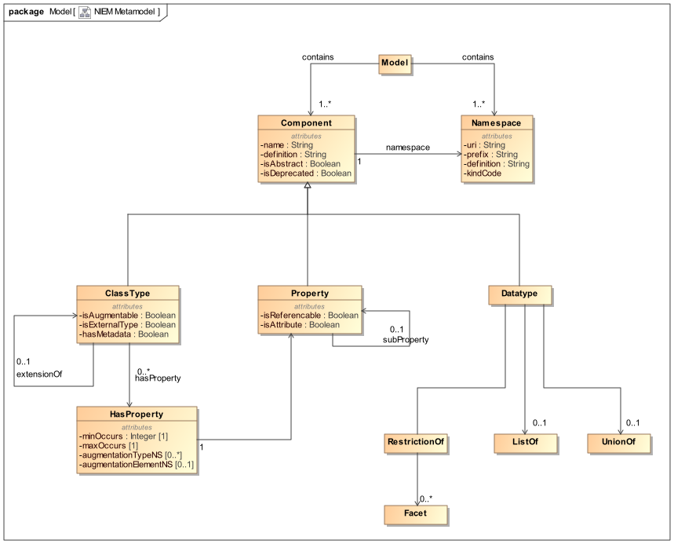
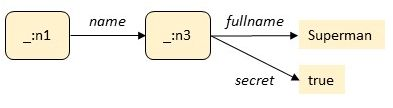

### OASIS Project Note
-------

# Understanding the NIEM Technical Architecture

## Project Note 02

## 20 February 2023

&nbsp;

#### This stage:

[links]()

#### Previous stage:
N/A

#### Latest stage:
[links]()

#### Open Project:
[NIEM Technical Architecture Committee (NTAC) of the OASIS NIEMOpen OP](http://www.niemopen.org/)

#### Project Chair:
Katherine Escobar (katherine.b.escobar.civ@mail.mil), [Joint Staff J6](https://www.jcs.mil/Directorates/J6-C4-Cyber/)

#### NTAC Committee Chairs:
Jim Cabral (jim.cabral@infotrack.com), [InfoTrack US](https://www.infotrack.com/) 
Scott Renner (sar@mitre.org), [MITRE](https://www.mitre.org/)

#### Editors:
Scott Renner (sar@mitre.org), [MITRE](https://www.mitre.org/)

#### Related work:

*Is there any??*

#### Abstract:
This document explains the objectives and assumptions of the technical architecture in NIEM 5, and describes the NTAC's progress through the end of 2022.  It is intended to express the consensus of the NTAC on past decisions and future direction.

#### Status:
This is a Non-Standards Track Work Product. The patent provisions of the OASIS IPR Policy do not apply.

This document is a working draft.  It has not been approved by the Project Governing Board of the OASIS NIEMOpen OP.

Comments on this work can be provided by opening issues in the project repository or by sending email to the project's public comment list: niemopen@lists.oasis-open-projects.org. List information is available at https://lists.oasis-open-projects.org/g/niemopen.

#### Citation format:
When referencing this document the following citation format should be used:

**[Understanding-NIEM-TechArch-v1.0]**

_Understanding the NIEM Technical Architecture_.  Edited by Scott Renner, 20 February 2023. OASIS Project Note 02. [links]()

#### Notices
Copyright &copy; OASIS Open 2023. All Rights Reserved.

Distributed under the terms of the OASIS [IPR Policy](https://www.oasis-open.org/policies-guidelines/ipr/).

For complete copyright information please see the full Notices section in an Appendix below.

-------

# Table of Contents
[[TOC will be inserted here]]

-------

# 1 Introduction

The first section of this paper explains the objectives and assumptions of the technical architecture in NIEM 5.  The second section describes the NTAC's progress through the end of 2022.

## 1.1 Glossary

### 1.1.1 Definitions of terms

- **NIEMOpen** (or **NIEM**) refers to the NIEM Open Project
- **NIEM** followed by a version number (e.g., NIEM 6.0) refers tp a reference data model and related specifications.
- The NIEM **Core** refers to the content of the reference data model that is not associated with a specific Domain.
- A NIEM **Domain** refers to content of the reference data model that is associated with a specific segment of government or industry.

### 1.2.2 Acronyms and abbreviations

- **CMF**: Common Model Format
- **CTAS**: Conformance Target Attribute Specification
- **NMO**: NIEM Management Office TSC
- **NBAC**: NIEM Business Architecture Committee TSC
- **NTAC**: NIEM Technical Architecture Committee TSC
- **PGB**: Project Governing Board
- **TSC**: Technical Steering Committee

Note: NIEM is not a acronym

-----

# 2 NIEM technical architecture through version 5

These are the assumptions and goals of the NIEM technical architecture through NIEM 5.0.

## 2.1 Contract-based machine-to-machine data interoperability

NIEM provides a framework for designing data exchange specifications.  These specifications – which are built *using* NIEM and in *conformance* to NIEM, but are not themselves a *part* of NIEM – are a contract between the developers of producing and consuming systems.  This contract provides a data model that specifies the mandatory and optional content of the exchanged data and defines the meaning of that content.  The primary purpose is to establish a common understanding among developers, who write software that must correctly handle the exchanged data, hence "machine-to-machine".  

A NIEM-based data exchange specification is known as a *message specification*, and NIEM data (that is, data which conforms to a NIEM-based data exchange specification) exchanged at runtime is known as a *message*.  Use of NIEM is not, however, restricted to an enterprise service bus or other message-passing architecture.  NIEM can also be used to define the content of an information resource retrieved from the web (and in that context, *resource* is a synonym for *message*), the content passed through an API, etc.

   > A NIEM message was originally known as an *information exchange package (IEP)*, a term derived from the Federal Enterprise Architecture (2005).  A message specification was originally known as an *information exchange package documentation (IEPD).*  These terms are still in widespread use within the NIEM community today, and will not go away soon (if ever).  

The content of a NIEM message may also be directly presented to human consumers, but this is not the main purpose of NIEM.

## 2.2 Reuse of definitions from community-agreed data models

NIEM also provides a framework for communities to create data models for concepts that are useful in many data exchange specifications. These community models are typically not *complete* for any exchange.  Instead, they reflect the community's judgement on which defintions are *worth the trouble of agreement*.  The NIEM core model contains definitions found useful by the NIEM community as a whole.  NIEM domain models reuse the core, extending it with defintions found useful by the domain community.  The core model plus the domain models comprise the "NIEM model".  Data exchange designers reuse definitions from the core and domain models, adding such definitions as are required for their exchanges but not (so far!) found worthy of inclusion in the NIEM model.  

Additional communities (subdomains?) between NIEM domains and data exchange specifications are possible.  These are not presently part of NIEM governance, and indeed could form and publish community models without participating in NIEM governance.

NIEM conformance rules state that no domain may needlessly replicate a definition found in the core, and no data exchange designer may needlessly replicate a definition found in the NIEM model.  If it's in the model and satisfies your business need, you must use it, instead of inventing your own component with your own name.

## 2.3 XSD as a data model formalism

XML Schema is the modeling formalism for all existing versions of NIEM.  The NIEM Naming and Design Rules (NDR) amplify and constrain this use of XSD, for three reasons:

   1. For reuse:  To permit XML schema documents created by independent communities to be composed into a single data exchange specification, and to forbid schema constructs that needlessly limit such reuse. 
   2. For semantics:  To impose meaning on the definitions and declarations in a NIEM XML schema document, and on the elements and attributes in a NIEM XML message.  NIEM has always defined the meaning of XSD and XML in terms of the RDF conceptual model.  The most recent versions of the NDR also specify the RDF entailed by NIEM XSD and XML in a way that enables machine conversion to RDF (see #10 below).
   3. For developer convenience:  To forbid, where consistent with #1 and #2, constructs in XSD that cause difficulties with COTS XML tooling.

## 2.4 One modeling formalism, two kinds of data model

All existing NIEM models have a normative form that is represented in XSD.  Each model is formed by assembling a set of XML schema documents into a schema.  There are two kinds of model, with important differences.

   1. The NIEM core and domain data models are *reference models*.  They are formed by assembling a *reference schema document set* into a *reference schema*.  Reference models provide names and definitions for concepts, and relations among them.  They are characterized by "optionality and over-inclusiveness".  That is, they define more concepts than needed for any particular data exchange specification, without cardinalty constraints, so it is easy to select the concepts that are needed and omit the rest.  For example, here is the XSD for `PersonType` in the NIEM core.  (In all examples, closing tags are sometimes truncated or omitted for clarity.)

      ```
      <xs:complexType name="PersonType">
        <xs:annotation>
          <xs:documentation>A data type for a human being.</xs:documentation>
        </xs:annotation>
        <xs:complexContent>
          <xs:extension base="structures:ObjectType">
            <xs:sequence>
              <xs:element ref="nc:PersonAccentText" minOccurs="0" maxOccurs="unbounded"/>
              <xs:element ref="nc:PersonAgeDescriptionText" minOccurs="0" maxOccurs="unbounded"/>
              <xs:element ref="nc:PersonAgeMeasure" minOccurs="0" maxOccurs="unbounded"/>
              <xs:element ref="nc:PersonBirthDate" minOccurs="0" maxOccurs="unbounded"/>
              <!-- 78 properties omitted -- explore them at https://niem.github.io/model/5.0/nc/PersonType/ -->
              <xs:element ref="nc:PersonHomeContactInformation" minOccurs="0" maxOccurs="unbounded"/>
      ```

      Reference models also omit unnecessary range or length constraints on property datatypes. For example, longitude in degrees is restricted to the range (-180,180], but many other properties are unconstrained decimals, strings, etc. 

      A reference model provides concept definitions in some domain of discourse.  In this way it fulfils some of the roles of an ontology.  It has an equivalent representation in RDF using owl:Class, owl:DataProperty, owl:ObjectProperty, rdfs:Datatype, rdfs:comment, rdfs:range, rdfs:subClassOf, and rdfs:subPropertyOf.  (See #10, below.)  At present, reference models are not derived from upper ontologies (such as BFO), and do not include axioms with properties like owl:inverseOf, but such things are possible and there is work proposed in that direction (NSF Open Knowledge Network).

   2. The data model in a data exchange specification is a *message model.*  These models include cardinality constraints and datatype restrictions to define the content of a particular data exchange.  They are formed by assembling *subsets* of the reference schema documents that define the NIEM model, plus one or more *extension schema documents* that contain any exchange-specific definitions.   For example, the XSD for `PersonType` in a message model might look like this:

      ```
      <xs:complexType name="PersonType">
        <xs:annotation>
          <xs:documentation>A data type for a human being.</xs:documentation>
        </xs:annotation>
        <xs:complexContent>
          <xs:extension base="structures:ObjectType">
            <xs:sequence>
              <xs:element ref="nc:PersonAgeMeasure" minOccurs="1" maxOccurs="1"/>
              <xs:element ref="nc:PersonName" minOccurs="1" maxOccurs="1"/>
      ```

      By creating this subset of the reference schema, the designer of the message model omitted 81 of the 83 properties for PersonType, and specified that the two selected properties must each appear exactly once.

## 2.5 Automated validation of NIEM XSD and XML

Many of the rules in the NDR are expressed in Schematron.  This supports partial automated conformance validation of the schema documents used in NIEM reference and message models.  (Evaluation of other rules, such as the *no-replication* rule mentioned in #2 above, require human judgement.)

The schema documents comprising a message model can be used to assess the validity of a NIEM XML message during testing or at runtime.  The *schema subset rule* – any XML that is valid against a subset schema must also be valid against the complete reference schema – assures congruence between message and reference models.

## 2.6 NIEM data is self-describing

Every element and attribute in NIEM XML data can be interpreted as a URI for the XSD definition of that component.  For example, given a NIEM message like this:

   ```
   <my:Message
     xmlns:my="http://example.com/MyMessageType/"
     xmlns:nc="http://release.niem.gov/niem/niem-core/5.0/">
     <nc:Person>
       <nc:PersonName>
         <nc:PersonFullName>John Doe</nc:PersonFullName>
   ```

the URI for `nc:PersonName` is composed of the namespace URI plus the element QName:  `http://release.niem.gov/niem/niem-core/5.0/#PersonName`.  That resource is available via HTTP GET, and the specified fragment in the resource returned is:

   ```
   <xs:element name="PersonName" type="nc:PersonNameType" nillable="true">
     <xs:annotation>
       <xs:documentation>A combination of names and/or titles by which a person is known.</xs:documentation>
     </xs:annotation>
   </xs:element>
   ```

Extension schema documents (which are not part of the NIEM model) are often not directly available via HTTP GET.  However, data exchange designers are encouraged to publish these schema documents in a [public repository](https://www.niem.gov/about-niem/message-exchange-package-mep-registry-repository) or an access-controlled repository of message specifications (also known as IEPDs).  In addition, the namespace identifier of a schema document offers a starting point for finding its author (when the rules of URI ownership are followed).  As a result, anyone in possession of a NIEM message can always retrieve defintions for part of the content (that defined by the NIEM model), and can usually at least discover a point of contact to ask for the remaining definitions.

## 2.7 Developers have the data exchange specification

While NIEM data is self-describing, the developers of producing and consuming applications are still presumed to have the entire data exchange specification, including all schema documents for the message model.  Consuming applications may ignore data they don't care about, but should not need to ignore data they don't understand.

## 2.8 Compact serialization is supported

NIEM XML is fully compatible with the W3C's *Efficient Extensible Interchange (EXI)* recommendtion.  EXI exploits the message schema (known by producers and consumers in advance) to produce bitstreams very near the information-theoretic minimum for the information content.  Other compact serializations may be supported through a two-way transform between a particular message in the new format and in the canonical, self-describing NIEM XML format.  Through this approach we may in the future see a NIEM Protobuf, NIEM CBOR, etc.

## 2.9 Version architecture supports independent change

The schema documents comprising a reference or message model, once published, may not be changed.  Any revision becomes a new schema document with a distinct namespace identifier.  As a result, a model change by one group never forces a change by any other group.  

## 2.10 NIEM XSD and XML has an RDF expression

NIEM provides a mappng from NIEM XSD to RDF.  For example, the above schema fragment for `nc:PersonName` maps to the following RDF:
```
@prefix nc <http://release.niem.gov/niem/niem-core/5.0/> .
nc:PersonName
    a owl:ObjectProperty ;
    rdfs:range nc:PersonNameType ;
    rdfs:comment "A combination of names and/or titles by which a person is known." .
```
NIEM also provides a mapping from NIEM XML to RDF.  For example, the above message fragment beginning with `<my:Message>` maps to the following RDF:
```
@prefix my <http://example.com/MyMessageType/> .
@prefix nc <http://release.niem.gov/niem/niem-core/5.0/> .
_:n0 a my:MessageType .
_:n0 nc:Person _:n1 .
_:n1 a nc:PersonType .
_:n1 nc:PersonName :_n2 .
_:n2 a nc:PersonNameType .
_:n2 nc:PersonFullName "John Doe" .
```
The RDF for the model and the RDF for the message together form the *knowledge graph representation* of NIEM data, which can be depicted like this:


## 2.11 NIEM JSON also has an RDF expression

NIEM 5 includes a specification for NIEM JSON.  NIEM JSON data is also self-describing, has an RDF expression, and can be converted to and from the equivalent NIEM XML.  NIEM 5 uses the JSON-LD specification to accomplish those goals.  The message fragment beginning with `<my:Message>`, expressed as NIEM JSON, looks like
```
{
 "@context": {
  "my": "http://example.com/MyMessageType/#",
  "nc": "http://release.niem.gov/niem/niem-core/5.0/#"
 },
 "my:Message": {
  "nc:Person": {
   "nc:PersonName": {
    "nc:PersonFullName": "John Doe"
   }
  }
 }
}
```
The `@context` object can be replaced with a URI.  The `@context` pair may also be omitted entirely if it is known through the communications channel (for instance, via a HTTP link header).

NIEM 5 uses message models in XSD to specify the meaning of NIEM JSON data.  For example, the compact IRI `nc:PersonName`expands to `http://release.niem.gov/niem/niem-core/5.0/#PersonName`, which as we have seen is the identifier for the XSD or RDF fragment defining that component.  NIEM 5 also uses message models in XSD to validate NIEM JSON data.  A NIEM JSON message is valid if the equivalent NIEM XML message is valid when assessed against the message schema.

Like all JSON-LD data, NIEM JSON messages may be processed as plain JSON.  An important goal is to avoid constructs that would appear alien to a "plain JSON" developer.

-----

# 3 **NTAC progress after NIEM 5**

The next section describes the work of the NTAC after the publication of NIEM 5 and before the formation of the OASIS NIEMOpen project.

## 3.1 Metamodel and Common Model Format (CMF)


The existing NIEM community is accustomed to working with NIEM models in XSD.  They will need XSD modeling in NIEM 6.  However, XSD is not a natural modeling formalism for developers who are not working in XML.  To support those developers, the NTAC set out to design an additional, technology-neutral modeling formalism equivalent to NIEM XSD.  

The first step was to create an abstract model of the information captured in NIEM XSD.  This model of NIEM models is the *NIEM metamodel*, depicted below as a UML diagram



The second step was to design a NIEM data exchange specification for the metamodel.  The result is the *Common Model Format*, a NIEM message specification for NIEM models.  A model in CMF is a NIEM message.  It has an exact equivalent in NIEM XSD, and can be serialized as NIEM XML or NIEM JSON.  For example, the XSD schema fragment for `nc:PersonName` above looks like this in CMF XML
```
<Property s:id="nc.PersonName">
  <Name>PersonName</Name>
  <Namespace s:ref="nc" xsi:nil="true"/>
  <DefinitionText>A combination of names and/or titles by which a person is known.</DefinitionText>
  <Class s:ref="nc.PersonNameType" xsi:nil="true"/>
</Property>
```
There is a [more detailed description of CMF and the metamodel](https://www.niem.gov/strategic-initiatives/niem-metamodel-and-common-model-format) at the niem.gov site.

## 3.2 Simplified property names

Component names in NIEM data models SHOULD follow the example of ISO 11179-5, Annex A, and all of the names in the NIEM model do so.  Names such as `PersonFullName` and `AircraftFuselageColorCode` are suitable when forming a shared understanding within a large community.  However, software developers working on a particular project will often prefer simpler names, such as `pname` or `ACcolor`.  NIEM 6 may permit a message specification designer to provide a mapping between simple and canonical property names, and with this mapping, to specify a simple message format having the same RDF interpretation as the equivalent canonical message format.  NIEM tools would then generate translation software from the mapping plus the CMF message model, with no bespoke programming required.  In this way NIEM may satsify developer desires for simpler messages while still satisfying the goals of self-describing data and RDF equivalence.

Something like this is already possible (after a fashion) with NIEM 5 JSON.  By supplying mappings in the `@context` element, the following simple and canonical NIEM JSON messages have the same RDF interpretation.  (Remember, the `@context` object does not have to be part of the message at runtime, and usually isn't.)

   ```
   {                                              | {                                 
    "@context": {                                 |  "@context": {          
     "nc": "http://release.niem.gov/niem/...",    |   "nc": "http://release.niem.gov/niem/..."
     "person": "nc:Person",                       |  },
     "pname":  "nc:PersonName",                   |  "nc:Person": {           
     "pfname": "nc:PersonFullName"                |   "nc:PersonName": {
    },                                            |    "nc:PersonFullName": "John Doe"         
    "person": {                                   |   }                                        
     "pname": {                                   |  }                                        
      "pfname": "John Doe"                        | }                                           
     }                                            |                                            
    }                                             |                                             
   }                                              |                                                 
   ```

More work is required for NIEM XML and any other supported message serialization.

## 3.3. RDF-star for relationship metadata

NIEM supports metadata in messages, both as ordinary properties and through a special metadata mechanism.  This metadata sometimes applies not to an object, but rather to the relationship between objects.  For example:

   ```
   <my:NewspaperEmployees>
    <nc:Person>
     <nc:PersonName>
      <nc:PersonFullName>Clark Kent
     </nc:PersonName>
     <nc:PersonName my:secret="true">
      <nc:PersonFullName>Superman
     </nc:PersonName>
    </nc:Person>
   </my:NewspaperEmployees>
   ```

The RDF interpretation of the attribute `my:secret` attribute as an ordinary property would look like:

   ```
   _:n1 a nc:PersonType .
   _:n1 nc:PersonName _:n2 .
   _:n1 nc:PersonName _:n3 .
   _:n2 a nc:PersonNameType .
   _:n2 nc:PersonFullName "Clark Kent" .
   _:n3 a nc:PersonNameType .
   _:n3 nc:PersonFullName "Superman" .
   _:n3 my:secret "true" .
   ```

But that's wrong.  We don't want to say that the *name* "Superman" is secret.  The secret is the *relationship* between the name "Superman" and the person who is also named "Clark Kent".  So we want to make a statement about a statement; we need a RDF triple about a triple.  As a diagram, we want

   

   instead of 

   

[RDF-star]([RDF-star and SPARQL-star (w3.org)](https://www.w3.org/2021/12/rdf-star.html)) (or RDF*) is a specification published by the W3C's *RDF-DEV Community Group* that provides better support for *reification;* that is, RDF triples about triples.  NIEM 6 uses RDF-star to represent relationship properties. In NIEM 6, the RDF-star interpretation of the NIEM XML above looks like:

   ```
   _:n1 a nc:PersonType .
   _:n1 nc:PersonName _:n2 .
   _:n1 nc:PersonName _:n3 {| my:secret "true" |} .
   _:n2 a nc:PersonNameType .
   _:n2 nc:PersonFullName "Clark Kent" .
   _:n3 a nc:PersonNameType .
   _:n3 nc:PersonFullName "Superman" .
   ```
-----

# Appendix A. Informative References

<!-- Required section -->

This appendix contains the informative references that are used in this document.

While any hyperlinks included in this appendix were valid at the time of publication, OASIS cannot guarantee their long-term validity.

(Reference sources:
For references to IETF RFCs, use the approved citation formats at: \
https://docs.oasis-open.org/templates/ietf-rfc-list/ietf-rfc-list.html. \
For references to W3C Recommendations, use the approved citation formats at: \
https://docs.oasis-open.org/templates/w3c-recommendations-list/w3c-recommendations-list.html. \
Remove this note before submitting for publication.)

-------

# Appendix B. Acknowledgments

(Note: A Work Product approved by the TSC must include a list of people who participated in the development of the Work Product. This is generally done by collecting the list of names in this appendix. This list shall be initially compiled by the Chair, and any Member of the TC may add or remove their names from the list by request.  
Remove this note before submitting for publication.)

## B.1 Special Thanks

<!-- This is an optional subsection to call out contributions from TSC members. If a TSC wants to thank non-TSC members then they should avoid using the term "contribution" and instead thank them for their "expertise" or "assistance". -->

Substantial contributions to this document from the following individuals are gratefully acknowledged:

Participant Name, Affiliation or "Individual Member"

## B.2 Participants

<!-- A TSC can determine who they list here, however, TSC Observers must not be listed. It is common practice for TCs to list everyone that was part of the TC during the creation of the document, but this is ultimately a TC decision on who they want to list and not list, and in what order. -->

The following individuals have participated in the creation of this document and are gratefully acknowledged:

**NIEM Technical Architecture Committee (NTAC) TSC Members:**

| First Name | Last Name | Company |
| :--- | :--- | :--- |
Aubrey | Beach | Joint Staff J6
Jim | Cabral | InfoTrack US
Tom | Carlson | GTRI
Mike | Douklias | Joint Saff J6
Katherine | Escobar | Joint Staff J6
Mike | Hulme | Unisys
Eric | Jahn | Alexandria Consulting
Ptere | Madruga | GTRI
Christina | Medlin | GTRI
Scott | Renner | MITRE
Duncan | Sparrell | sFractal Consulting
Jennifer | Stathakis | FBI
Stephen | Sullivan | BAH

Update with the full TSC roster before publishing

-------

# Appendix C. Revision History
| Revision | Date | Editor | Changes Made |
| :--- | :--- | :--- | :--- |
| tech-arch-v1.0-pn02 | 2023-02-20 | Scott Renner | Initial working draft |

------

# Appendix D. Notices

Copyright &copy; OASIS Open 2023. All Rights Reserved.

All capitalized terms in the following text have the meanings assigned to them in the OASIS Intellectual Property Rights Policy (the "OASIS IPR Policy"). The full [Policy](https://www.oasis-open.org/policies-guidelines/ipr/) may be found at the OASIS website.

This document and translations of it may be copied and furnished to others, and derivative works that comment on or otherwise explain it or assist in its implementation may be prepared, copied, published, and distributed, in whole or in part, without restriction of any kind, provided that the above copyright notice and this section are included on all such copies and derivative works. However, this document itself may not be modified in any way, including by removing the copyright notice or references to OASIS, except as needed for the purpose of developing any document or deliverable produced by an OASIS Technical Committee (in which case the rules applicable to copyrights, as set forth in the OASIS IPR Policy, must be followed) or as required to translate it into languages other than English.

The limited permissions granted above are perpetual and will not be revoked by OASIS or its successors or assigns.

This document and the information contained herein is provided on an "AS IS" basis and OASIS DISCLAIMS ALL WARRANTIES, EXPRESS OR IMPLIED, INCLUDING BUT NOT LIMITED TO ANY WARRANTY THAT THE USE OF THE INFORMATION HEREIN WILL NOT INFRINGE ANY OWNERSHIP RIGHTS OR ANY IMPLIED WARRANTIES OF MERCHANTABILITY OR FITNESS FOR A PARTICULAR PURPOSE.

The name "OASIS" is a trademark of [OASIS](https://www.oasis-open.org/), the owner and developer of this specification, and should be used only to refer to the organization and its official outputs. OASIS welcomes reference to, and implementation and use of, specifications, while reserving the right to enforce its marks against misleading uses. Please see https://www.oasis-open.org/policies-guidelines/trademark/ for above guidance.
